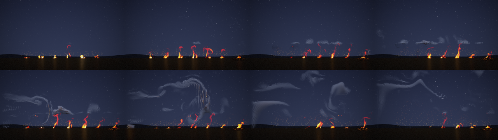
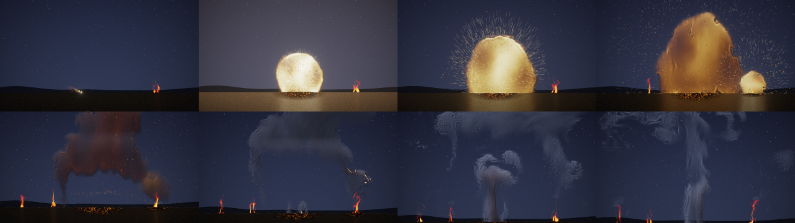
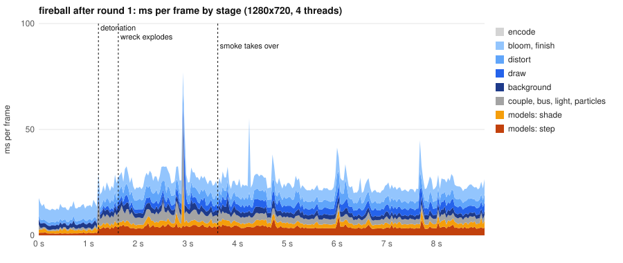
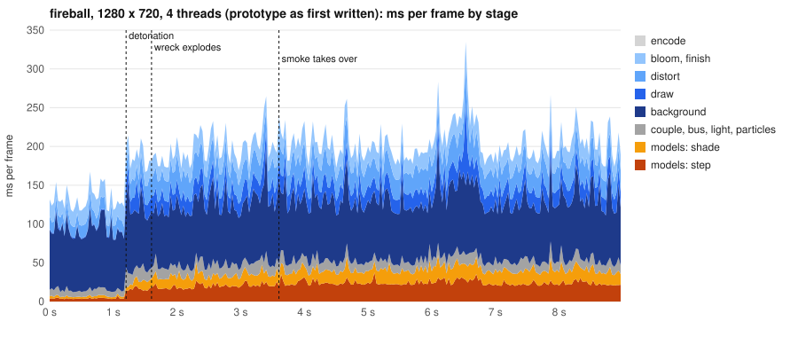
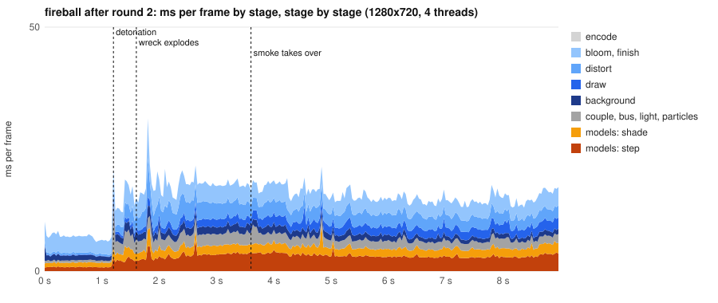

# Composed effects: modules on modules

Status: **future feature, with a working prototype** (10 October 2026). Audience: dev, research, artists. The prototype
lives in `src/compose` (a library over the runtime's internals, with a script format and its runner) and two tools:
`nvfx_fireball` (the fireball scene, written in C++) and `nvfx_scene_script` (plays scene scripts, §4). It is not part
of the C API yet. Section 8 sketches what would make it a product feature.

## 1. The idea

The goal is effects that run on one another. Each effect is a module, and the modules read and write each other's
fields: velocity, heat and soot. A script wires them together and changes the wiring over time. Examples:
- an explosion's blast bends a nearby fire;
- the explosion's cloud is handed to the smoke model when the fireball dies down;
- a fire's smoke rises into the sky above it;
- embers that land hot light new fires;
- a scripted **force field** (a ceiling, a vortex, a gust of wind) shapes any effect it covers.

This is possible because of how rollout effects work (`include/neuralfx/rollout.hpp`, [REPORT.md](REPORT.md) §6):
- **The state is physical.** It is a coarse grid of velocity, heat and soot. Every effect trained on the project's
  simulator uses the same units, so one effect's velocity can push another effect's material, and one effect's
  state can be handed to another model.
- **Moving and projecting the flow is built into each step.** Advection and the pressure projection are not
  learned. When something outside writes into the state, the next step moves that material with the flow and makes
  the flow consistent again, with no retraining. The learned part (forces, sources, sub-grid closure) then reacts
  to whatever it finds.
- **Each step is a function of the state, the controls and the noise.** A script can change any of the three
  between steps.

Frame models (studies A to C) store frames rather than a state, so they can only be drawn, not coupled. In a
composed scene they can still appear as decoration.

## 2. Modules

| module | what it is | reads | writes |
|---|---|---|---|
| rollout effect (`compose::Module`) | a learned effect in a square tile of the world, stepped with its controls and seed | its own state | its state (velocity, heat, soot; fine fields), published to the bus |
| field bus (`FieldBus`) | every module's velocity, heat and soot resampled into world space, kept per group | all modules | (read by everything else) |
| force field (`ForceField`) | a force the script places in the world: `ceiling`, `vortex`, `wind`, `gust`, `ring`, `attract`, `heat`, `cold` (§5) | the bus position | the velocity (or heat and soot) of the modules it covers, and particles |
| particles (`Particles`) | sparks, embers, debris and soot flakes, carried by the bus flow, cooling, landing | the bus flow | landing events (for triggers) |
| light (`Light`) | light from everything hot on the bus, spread by a pyramid of blurs, plus flashes | the bus heat | the light that lights soot and the ground |
| distortion | shock fronts and heat haze, bending what is seen through hot air | the bus heat, shocks | the picture |
| look | each module's learned renderer, or the field shader (light from heat, soot that absorbs and is lit by the scene and the moon) | the module's fields, light | the picture |

## 3. Couplings

These are applied between steps. Each reads and writes the runners' states through
`rt::RolloutRunner::coarse_mut()` and the related accessors. Nothing allocates.

| coupling | what it does | in the fireball |
|---|---|---|
| `blend_band(a, b, side, cells)` | two tiles of one domain share a band of cells and both take the weighted mean there; their ownership weights sum to 1 everywhere, so drawing and publishing are seamless | six tiles of the explosion model make one domain 2.5 times wider and 1.75 times taller than the model was trained on |
| `hand_over(from, to)` | a module continues from another's physical state and fine fields (memory channels start from rest) | after 2.4 s the smoke model takes the cloud over from the explosion model, tile by tile |
| `push(m, bus, gain)` | the other modules' flow moves this module's material for one step (added before the step, taken out after, so momentum does not build up) | the blast bends the wreck's fire and the new fires |
| `transfer(from, to, fraction, rows, gains)` | material moves from one module into others, conserving the amount (gains can convert one model's thin soot into another's smoke) | the second blast's cloud joins the first; the fires' smoke leaves through their tile tops into the sky |
| `suppress(m, region)` | material is removed from a region | the smoke model's learned source is kept only in the crater's tile |
| `apply(m, ForceField)` | a scripted force: `ceiling` damps rising above a height, `vortex` swirls, `wind` blows; and the field effects of §5 | a ceiling stops the cloud rising so it spreads into a cap and stays in view |
| triggers | rules on the bus, the shocks and the particles: when a condition first holds, an action runs | the wreck explodes when the shock front reaches it; embers that land hot light fires |
| controls from the script | any module's controls, seed, look and opacity, at any time | the crater's smoke fades; new fires grow; the cloud's look turns from fireball to smoke |

## 4. Scripts

A scene is a text file (`.nvfxs`) that an artist edits and `nvfx_scene_script` plays: modules, how they couple, force
fields, particles, light and camera, and rules that change the scene over time. The runner (`src/compose/script.hpp`)
builds every compose object up front, so a frame allocates nothing (`nvfx_alloc_test` plays a scripted scene with
every kind of statement and counts 0 allocations; the tool counts them too). Two scenes are in `examples/scenes`: the
fireball of §6 (`fireball.nvfxs`, which reproduces the hand-written C++ scene to the bit, §4.8) and a wall of fire in a
gale (`firewall.nvfxs`, §5.2), written only as a script.

```sh
nvfx_scene_script --script examples/scenes/firewall.nvfxs --models DIR --out firewall.mp4 [--keyframes DIR] [--sheet sheet.png]
nvfx_scene_script --script FILE --check     # parse and check, without loading any effect
nvfx_scene_script --script FILE --print     # the script in canonical form
nvfx_scene_script --script FILE --models DIR --keyframes DIR --no-video --verify results/experiments/v1_frozen.csv
```

### 4.1 A first look

```text
scene   size 1280 x 720, fps 30, length 9 s, ground 600
effect  fire = "fire.nvfx"                         # a rollout effect (files are read from --models DIR)
let     blow = smooth((t - 0.3) / 2.5)             # a named value; t is the scene's time in seconds

module  wall = fire, tiles 6 x 1, band 8, size 128, width 192, at (640, ground), sink 0.08, start 0, seed 11,
               controls (0.95, 0.5, 0.5), wind 0.5 + 0.2 * blow       # a control that changes over time
module  pyre = fire, size 128, width 192, sink 0.08, start 3, waiting,
               intensity 0.3 + 0.6 * smooth(pyre.age / 1.2)

field   gale = gust, velocity (2.4 * blow, 0), amount 0.7, scale 260, on wall, particles
emit    embers, on wall, pyre, tries 4, chance 0.7, spread 120

when heat(1170, 575) > 0.12 as catch:              # a rule: when it first holds, its actions run (once)
  wake pyre at (1170, ground)
every frame:                                       # couplings, every frame (sky: a smoke domain, as in firewall.nvfxs)
  transfer wall -> sky, top 4, fraction 0.5, heat 0, soot 20
```

The rules of the text:
- One statement per line; `#` starts a comment. A line that ends with a comma, an operator, `and`, `or` or `not`, or
  inside parentheses goes on on the next line.
- A line that ends with `:` opens a block (a rule or `every frame`); the indented lines under it are its actions.
  Actions may also follow the colon on the same line, separated by `;`.
- A statement is a keyword, perhaps `NAME =` and a kind, then properties: a key and its value, separated by commas
  (the commas are optional). Values are numbers or expressions (§4.4), points `(x, y)`, lists `(a, b, c)`, sizes
  `W x H`, names and lists of names `a, b, c`.
- Coordinates are world pixels with y pointing down (the ground is a line of constant y); times are seconds (a trailing
  `s` is allowed); velocities of fields are world pixels per frame (at 30 frames a second).
- Any value may be an expression. Settings that can change over time (a module's controls, opacity, look and place,
  fields, light, frame, camera, scorch glows) are re-evaluated every frame; the others (sizes, tiles, start points,
  seeds, looks, the scene, the bus, keyframes) must be constants, and the checker says so if they are not.
- Names can be used before they are declared. Effects and looks have their own names; values, rules, modules and
  fields share one set. Words of the language (statement and action keywords, functions, `t`, `x`, ...) cannot be
  names; a module also cannot be named after a property that follows a list of modules (`weight`, `on`, `fraction`, ...).

Errors give the line and the column, and the parser stops at the first one. A word within two edits of one known word
gets a suggestion; otherwise the message lists what was expected. From the tests:

```text
t:2:40: 'strenght' is not a property of field (did you mean 'strength'?)
t:3:7: unknown module 'wrek' (did you mean 'wreck'?)
t:1:9: this '(' is not closed
t:3:7: 'm' is not waiting: give it 'start N, waiting' to wake it later
t:2:49: the place of tiles must be a constant: it cannot depend on time, rules, modules or rand
t:2:24: 'heat_power' is not a property of a module nor a control of effect 'e' (its controls: intensity, wind, turbulence)
```

Fed 3000 random mutations of the two example scripts (deleted characters, inserted tokens, duplicated lines), the
checker accepted 817 and rejected 2183, every one with a line and a column, and never crashed. Checking happens in
three steps, each before anything runs: the parser (syntax, keys, the shape of values), the
checker (names, contexts, constants; `--check`), and the build (sizes against the effects' grids, control names, start
points, hand-overs between tiles of the same size).

### 4.2 Statements

| statement | what it sets | keys (defaults) |
|---|---|---|
| `scene` | the picture and the clock | `size W x H` (1280 x 720), `fps` (30), `length` (10 s), `ground` (600: world y of the ground) |
| `bus` | the field bus's rectangle (§2) | `at (x, y)` top-left corner, `size W x H`, `cell` (8 world pixels); default: the screen with an eighth of its width each side and half its height above |
| `effect NAME = "FILE"` | a rollout effect, loaded once | the detail layer's settings: `swirl`, `swirl_scale`, `swirl_rate`, `swirl_ramp`, `contrast`, `grow` |
| `look NAME = shader` or `= like LOOK` | a field-shader look (§2) | `heat_scale`, `emission`, `emission_power`, `soot_density`, `soot_albedo`, `sky`, `shadow`, `scene_light`, `relief`, `tint (r, g, b)`: the fields of `ShaderSpec` |
| `let NAME = EXPR` | a named value, computed where it is used (so it may change over time) | |
| `module NAME = EFFECT` | a module (§4.3) | |
| `field NAME = KIND` | a force field (§5) | per kind, and `on M, ..., particles`, `weight`, `if`, `from`, `until` |
| `emit KIND` | particles every frame (§4.6) | |
| `light` | light from the bus's heat | `gain` (0.14), `flash (r, g, b)` (0) |
| `particles` | the particle pool | `capacity` (4096), `flow` (0.9: how much particles follow the bus's flow) |
| `frame` | the picture | `exposure` (1), `fade` (1), `haze` (1: heat haze), `bloom` (1: strength), `bloom_threshold` (1) |
| `camera` | the screen's top-left corner in the world | `x`, `y` (0) |
| `keyframes T, T, ...` | frames the tool writes as PNG (`--keyframes`) and to the sheet | |
| `at T:` / `when ...:` | a rule (§4.5) | |
| `every frame:` | couplings applied every frame (§4.5) | |

### 4.3 Modules

A module is one rollout effect in a square tile, or a domain of several tiles of one effect that share bands of cells
(`blend_band`, §3), drawn and published as one.

| property | meaning | default |
|---|---|---|
| `= EFFECT` | the effect it runs | (required) |
| `size N` | pixels of its tile (what the model renders at); a multiple of the effect's grid (32 cells) | (required) |
| `width W` | world pixels the tile covers | `size` |
| `tiles C x R`, `band B` | a domain of C x R tiles overlapping by B cells; the band blending runs every frame while the tiles are active | one tile |
| `at (X, Y)` | where it stands: the bottom centre of its tile (or domain). A single module's place may change over time | its tile's top-left corner at (0, 0) |
| `sink F` | how far the tile reaches below Y, as a fraction of its width (a fire's base sits a little under the ground) | 0 |
| `over M` | the same tiles, place and group as M: two models of one domain (the explosion's tiles and the smoke model's that take over) | |
| `feather F` | outer edges fade over F times the tile's size when drawn | 0 |
| `look L`, `look A to B by W`, `look learned` | a field-shader look, a blend of two (W from 0 to 1, may change over time), or the effect's learned renderer | learned |
| `controls (a, b, c)` | the effect's controls at the start | 0.5 each |
| `CONTROL value` | one control by its name (`intensity`, `wind`, `turbulence` for the study D effects); may change over time | |
| `opacity` | how much it is drawn and published (may change over time) | 1 |
| `start N`, `seed S` | started at setup from start point N with seed S (its warm-up runs then, not in a frame); a domain's bottom middle tile starts from it with seed S, the others start empty at its age with seed S + 10 r + c (column c, row r from the bottom) | not started |
| `empty` | with `start`: nothing in it, at start point N's age (a domain that only receives material) | |
| `waiting` | with `start`: started now, but asleep until a rule wakes it | |

A module without its own controls takes the controls of the start point it starts from. Expressions can read a module:
`M.x` (the centre of its tile or domain), `M.y` (the y it stands on), `M.started` (when it was last started, woken or
taken over; infinity before), `M.age` (`t - M.started`) and `M.active` (1 or 0).

### 4.4 Expressions

Arithmetic in single-precision float, one operation at a time, as C++ computes it (`1.2 + 2.4` is a little more than
`3.6`, as `1.2f + 2.4f` is): `+ - * /`, unary `-`, comparisons `< <= > >= == !=` (1 or 0; they do not chain), `and`,
`or`, `not` (which only evaluate their right side when needed), parentheses.

| name | value |
|---|---|
| `t`, `length`, `fps`, `ground` | the scene's time (s), length, frame rate and ground |
| `infinity` | infinity |
| a `let` | its expression |
| a rule's name | when it last fired (infinity before: so `smooth((t - boom) / 1)` is 0 until `boom`) |
| `M.x`, `M.y`, `M.started`, `M.age`, `M.active` | a module (§4.3) |
| `x`, `temp` | in a rule `when ember lands`: where the ember landed and how hot it was |
| `rand` | a random number in [0, 1), from the particles' generator (deterministic: the same script gives the same frames) |
| `smooth(v)` | 0 below 0, 1 above 1, smooth in between (`3v² - 2v³`) |
| `exp`, `sqrt`, `sin`, `cos`, `abs`, `floor`, `pow(a, b)`, `hypot(a, b)`, `min(a, b)`, `max(a, b)`, `clamp(v, lo, hi)`, `lerp(a, b, w)` | as in C++ (`std::exp` of a float, ...) |
| `noise(x, y, z)` | smooth value noise in [-1, 1] |
| `if(c, a, b)` | a when c is not 0, else b (only the side taken is evaluated) |
| `heat(x, y)`, `soot(x, y)` | the bus at a world point (as published in the last frame) |
| `shock(n)` | the radius of the n-th shock front now (0 before it) |
| `near(M, x, d)` | 1 when M is active and its centre is within d of x |

### 4.5 Rules and couplings

A rule runs its actions when its condition holds: **once** by default, **every time** with `repeat` (a time or field
condition: every frame it holds; a landing: every landing), or **at most N times** with `at most N`. `as NAME` names it
(its time is then a value).

| condition | holds when |
|---|---|
| `at T` | `t >= T` |
| `when EXPR` | the expression is not 0 (for example `heat(1170, 575) > 0.12`, `t - boom > 3`) |
| `when shock N reaches (x, y)` or `reaches M` | the N-th shock's radius is at least the distance to the point (or to where M stands) |
| `when ember lands [where EXPR]` (or `debris`) | a hot ember (debris) lands on the ground, and the condition holds for it (`x`, `temp`) |

| action | what it does | keys |
|---|---|---|
| `start M` | start M from a start point (a domain: one tile from it, the others empty at its age) | `from N` (0), `in (c, r)` (the tile with the start point; bottom middle), `seed`, `at (x, y)` (move first), `empty` |
| `wake M1, M2, ...` | wake the first of them that is asleep (`waiting`), where it is or `at (x, y)` | `at` |
| `stop M, ...` | stop them (no longer stepped, drawn or published) | `if` |
| `hand_over A -> B` | B continues from A's physical state, tile by tile (`hand_over`, §3); A stops | `seed` (B's tiles take seed + 10 r + c) |
| `transfer A -> B, C, ...` | move material from A into the active tiles of B, C, ... that cover it (`transfer`, §3) | `fraction` (1), `top N` (only the top N rows), `heat` and `soot` (gains, 1), `if` |
| `push M` | the other modules' flow moves M's material for one step (`push`, §3) | `gain` (1), `if` |
| `suppress M` | remove material in a rectangle of cells (y up), in all tiles or some | `cells (x0, y0) to (x1, y1)`, `tiles (c, r), ...`, `if` |
| `shock` | a shock front: distortion ring, and `when shock N reaches` | `at (x, y)`, `speed` (900), `decay` (0.35), `amp` (6), `width` (26) |
| `scorch` | a glowing mark on the ground | `at`, `radius` (100), `glow` (1; may change over time) |
| `burst` | an explosion's embers and debris | `at`, `radius` (50), `embers` (200), `debris` (0), `speed` (600) |

`every frame:` holds couplings that run every frame, in order: `transfer`, `suppress` and `stop` right after the
modules step, `push` after the bus is published (it reads the bus). `start`, `wake`, `hand_over`, `shock`, `scorch` and
`burst` happen once, so they belong to rules; the checker says so.

### 4.6 Emitters

Three kinds, each a transcription of what the hand-written fireball does (the same formulas and the same order of
random draws), with its constants as defaults:

| emitter | particles | keys (defaults) |
|---|---|---|
| `emit sparks` | a fuse: a point runs from one end to the other between `from` and `until`, throwing sparks | `along (x0, y0) to (x1, y1)`, `from` (0), `until` (the end), `count` per frame (22) |
| `emit embers` | embers from the base of burning modules (each active tile), rising and cooling | `on M, ...`, `tries` per tile and frame (2), `chance` (0.6), `spread` (40 pixels) |
| `emit flakes` | soot flakes falling out of thick smoke on the bus | `in (x, y)`, `size W x H`, `tries` (40), `chance` (0.25), `soot` (0.35: the least soot) |

All take `from`, `until` and `if`.

### 4.7 The order of a frame

Every frame runs in this order (`src/compose/script_run.cpp`):
1. rules on time, shocks and fields, in script order; their actions run at once;
2. emitters, in script order;
3. settings that change over time: modules (controls, opacity, look, place), scorch marks, frame, light, camera;
4. every active module steps (in parallel);
5. tiles of a domain share their bands; the couplings of `every frame` (transfer, suppress, stop), in order;
6. the field bus is cleared and every active module publishes to it;
7. the pushes of `every frame`, then the force fields, in order;
8. light;
9. fields that act on particles, then the particles move; rules on landings;
10. shading, background, modules, particles, distortion, bloom, tone mapping.

A module woken by a landing in step 9 is drawn from the next frame (it has not stepped yet).

With `Options::overlap` (the default of `nvfx_scene_script`; §7.3), step 10 after the shading is drawn on a thread of
its own while steps 1 to 9 of the next frame run: what the picture needs (the light, the bus's heat, the particles, the
shock fronts, the scorch marks, the modules' places and the frame's settings) is copied first, and the next frame's
shading waits until the modules' images have been drawn. The frames are the same to the bit; `render(f)` then returns
with frame f + 1's state already computed.

### 4.8 The fireball as a script, to the bit

`examples/scenes/fireball.nvfxs` is the fireball of §6, rewritten from `tools/nvfx_fireball.cpp`. It gives the same
picture to the bit: the eight keyframes have the SHA-256 recorded in `results/experiments/v1_frozen.csv` (rendered
with `nvfx_fireball --keyframes DIR --no-video`), and all 270 frames have the same SHA-256 of their RGB as the
hand-written scene's (checked by hashing every frame of both). `ctest` runs the keyframe check
(`neuralfx.ScriptedFireballBitExact`, about a minute on 2 threads; skipped when the effects are not in
`NEURALFX_MODELS_D`, by default `$NEURALVFX_DATA/experiments/models/d`). A test without data
(`Script.MatchesTheSameSceneWrittenInCpp`) plays a small scene both as a script and as hand-written C++ in the same
order and compares every frame.

Getting every float the same forced a few things, all visible in the script:
- **Times are written as the C++ computes them.** The hand-over is at `t_det + 2.4`, not `3.6`: in float the sum is
  a little more than 3.6, so the C++ hands over at the frame of 3.63 s, and `at 3.6` would do it one frame early. The
  blast's centre is `684 - 0.32 * 576`, not `499.68`. The expressions run operation by operation in float.
- **A rule's time is infinity until it fires.** The C++ guards the wreck's later behaviour with `if (t_sec >= 0)`;
  the script writes `0.62 + 0.3 * smooth((t - wreck_blast) / 1)`, which is exactly 0.62 until the wreck explodes.
- **The order of random draws is the hand-written scene's.** Particles, the camera's shake and the emitters all draw
  from one generator. The C++ passes several random numbers as arguments of one `spawn()` call, and GCC evaluates such
  arguments right to left; the emitters and `burst` draw in that order, written out step by step. (Built with another
  compiler, the hand-written scene could change; the script would not.)
- **Emitters are fixed kinds** with the fireball's formulas (§4.6), rather than general particle systems.
- **One check of the C++ was dropped:** it compared a landing's x with a time (`|x - lit_at[0]| < 1`), which never
  holds because x is at least 120; the script leaves it out and nothing changes.
- **Live settings are applied from the first frame,** after the setup starts: the fires warm up with their constant
  controls (0.35), as in the C++, although their `intensity` expression would give 0.15 before they are lit.

### 4.9 What scripts cannot do yet

- The order of a frame is fixed (§4.7); a script cannot, say, publish the bus twice.
- Emitters are the three kinds above, with few parameters; there is no general particle system or ember colour.
- The parser stops at the first error; `--print` drops comments (it is for round trips and checks, not for editing).
- Seeds are whole numbers up to 16 777 216 (they pass through a float).
- There is no live reload or viewer yet; `--check` is the quick loop.
- Scripts and the runner are a prototype over the runtime's internals, like the rest of this page, not part of the C
  API.

## 5. Field effects

Force fields are modules too: the script places them in the world and they act on whatever they cover (`on M, ...`),
for one step at a time like a push (velocity added before the step and taken out after) unless the table says
otherwise. Because advection and projection are built into each step, material moves and the flow stays consistent.
Every field takes `weight` (multiplies its effect, 1), `if`, `from` and `until`, and its values may change over time.

| field | what it does | keys | tested by |
|---|---|---|---|
| `ceiling` | damps rising above a height (permanently, not for one step), so a cloud stalls and spreads into a cap | `level` (world y), `soft` (80), `damping` (0.25) | `Compose.CeilingStopsRisingAboveIt` |
| `vortex` | swirls around a point | `at`, `radius` (100), `strength` | used in `Compose.ScenesRenderTheSameOnAnyNumberOfThreads` |
| `wind` | a uniform flow | `velocity (u, v)` | `Fields.WindOnParticlesBlowsThem` |
| `gust` | the wind made gusty: its speed swings by `amount` with smooth noise of `scale` pixels that travels with the wind and changes `rate` times a second, with a crosswind wobble of a third of that | `velocity`, `amount` (0.5), `scale` (80), `rate` (0.5), `seed` | `Fields.GustVariesAroundTheWindAndTravelsWithIt` |
| `ring` | a vortex ring seen from the side: two opposite vortices `radius` either side of a point, blowing along `direction` through it and back around it; animate `at` to make it travel | `at`, `direction (dx, dy)`, `radius`, `core` (80), `strength` | `Fields.VortexRingBlowsThroughItsCentre` |
| `attract` | draws material within about `radius` towards a point by up to `strength` pixels a frame (negative: pushes it away), moving it directly and keeping its amount; `swirl` adds a swirl around the point. An implosion is a short strong pull | `at`, `radius`, `strength`, `swirl` (0) | `Fields.AttractorPullsMaterialInAndKeepsTheAmount` |
| `heat` | a heat source (a burning object from gameplay): adds `strength` heat a frame at a point, falling off over `radius`; the fire models turn heat into flames, and a rule on `heat(x, y)` can light fuel there | `at`, `radius`, `strength` | `Fields.HeatSourceAddsHeatWhereItIs`, `Fields.HeatSourceIgnitesFuelThroughARule` |
| `cold` | an extinguisher: removes a fraction `strength` of the heat a frame at a point (falling off over `radius`) and turns a fraction `steam` of what it removes into soot | `at`, `radius`, `strength`, `steam` (0) | `Fields.ColdPutsOutHeatAndMakesSteam` |

The flows (`wind`, `gust`, `vortex`, `ring`, `attract`) can also act on particles (`on ..., particles`): a particle's
velocity relaxes towards the field's flow with a drag of 1.1 per second, on top of the bus's flow.

Notes from building them:
- **`attract` moves material instead of pushing it.** A radial flow is curl-free, and the pressure projection inside
  each step removes exactly that part: a pushed attractor would hardly move anything (and taking the push out after
  the step would then leave the opposite flow). So the field moves heat and soot (coarse and fine) directly, each cell
  and pixel splatted bilinearly at its new place, which keeps the amount (material that would leave the tile stays at
  its edge). Its swirl is an ordinary push.
- **Strong pushes put a learned fire out.** The fire model was trained without outside forcing. A gust of 0.8 pixels a
  frame on its flames weakens them within three seconds, and a ring at half the strength used on the smoke tears them
  out for good (§5.2 uses this). The wall of §5.2 leans with the model's own `wind` control and feels only a fifth of
  the gale.
- **Too much steam turns a learned fire green.** `cold` with `steam 0.8` fills the fire model's state with soot and
  little heat, which its learned renderer never saw in training: it draws such cells green. `steam 0.15` stays in range.
  The field shader has no such problem.
- **A heat source on a smoke model is carried away fast.** The brand of §5.2 adds 0.06 heat a frame, but the smoke
  model's buoyancy lifts it, so the bus reads only about 0.1 to 0.2 just above the brand; the rule's threshold (0.12)
  was set from that.

Other fields that would fit the same interface: walls and obstacles (velocity into a mask removed, so smoke flows
around a building), pressure waves (a radial impulse from any shock front, felt by every effect nearby), and inversion
layers and wind shear (what the ceiling does, as weather).

### 5.1 How to write them

```text
field gale   = gust, velocity (2.4 * blow, -0.2 * blow), amount 0.7, scale 260, rate 0.6, seed 7, on sky, particles
field punch  = ring, at (-160 + 300 * (t - 3.6), 455), direction (1, -0.25), radius 75, core 42, strength 8,
               on sky, particles, from 3.6, until 7.4
field knot   = attract, at (640, 260), radius 300, strength 5 * pull, swirl 3 * pull, on sky, particles
field brand  = heat, at (1170, 585), radius 26, strength 0.06, on sky, from 1.6, until 3.5
field hose   = cold, at (280, 560), radius 170, strength 0.3 * douse, steam 0.15, on wall
when heat(1170, 575) > 0.12 as catch:              # the heat source lights the fuel when it is hot enough
  wake pyre at (1170, ground)
```

### 5.2 The demonstration: a wall of fire in a gale

`examples/scenes/firewall.nvfxs` (9 s at 1280 x 720 and 30 fps, written only as a script, about 70 lines) uses every
new field. Night. A wall of fire (six tiles of the fire model sharing bands, 910 pixels wide) burns along the ground; a
gusting wind from the left leans its flames, carries its smoke (transferred into eight tiles of the smoke model, started
empty) and drives a storm of embers. A brand by a woodpile heats the air there until a rule lights the pile (1.83 s).
Water puts out the left of the wall (2.4 to 4.8 s). A vortex ring rolls in from the left (3.6 s) and tears the flames
out one by one, curling the smoke; then the smoke is drawn into a knot (6.2 to 8.1 s). The woodpile burns on.



What works: the script reads as the story, the scene plays without an allocation in its frame loop, and each field
does visibly what it says. What does not, yet: the fire model makes one flame per tile, so the "wall" is a row of six
flames rather than a sheet of fire; the smoke model's look on thin, stretched smoke shows banding from the shader's
relief; and smoke that reaches the sky domain's outer wall piles up there (its feather hides most of it). The video is
not in git (data rules); it is written where `--out` says.

## 6. The demonstration: a fireball

`nvfx_fireball --models DIR --out fireball.mp4` renders 9 seconds at 1280 x 720 and 30 fps from the three rollout
effects of study D (fire 82 KB, smoke 146 KB, explosion 274 KB). The same scene as a script,
`nvfx_scene_script --script examples/scenes/fireball.nvfxs --models DIR`, gives the same frames to the bit (§4.8):

| time | what happens | how |
|---|---|---|
| 0 - 1.2 s | night; a wreck burns at the right; a fuse runs along the ground | fire model (learned renderer); sparks |
| 1.2 s | the charge explodes: flash, shock front, embers, debris, camera shake, scorch | explosion model from its strongest start point, in the centre tile of six; the other five start empty and receive the fireball through their bands |
| 1.2 - 3.6 s | the fireball grows and rises; the blast bends the wreck's fire | the six tiles step together (`blend_band`), shaded by the field shader; `push` |
| 1.6 s | the shock front reaches the wreck; the wreck explodes | a trigger on the shock radius starts a second explosion |
| 2.3 s on | the second cloud drifts into the first | `transfer` |
| 2 - 4 s | embers land; two of them light new fires | particle landings trigger fire modules |
| 2 s on | the cloud stops rising and spreads into a cap | a `ceiling` field |
| 3.6 s on | the smoke model takes the cloud over; a smoke column grows from the crater; the fires' smoke joins the sky | `hand_over`; `suppress`; `transfer` |
| 8.4 - 9 s | fade out | |



The video itself is not in git (data rules): it is written where `--out` says.

## 7. Cost

Measured with `nvfx_fireball --profile`, which times every stage of every frame. The machine is the report's
4-core machine, with AVX2 unless the row says otherwise. The figures are medians over the frames after the detonation,
when everything runs. §7.3 has the second optimisation round.

### 7.1 After the first optimisation round

Three passes, each on its own branch and each checked against the picture before it:
- **The runtime's rollout step and renderer** (4.7 times faster step, renderer 2 to 4 times): separable interpolation,
  cheaper flicker noise, vectorised advection, and a row pipeline with small rings instead of full-frame buffers. The
  runtime's parity tests are unchanged (worst difference 0). Keyframes differ from the old ones by float order only
  (82 to 111 dB PSNR).
- **Shading, light, field bus and couplings:** a field shader that skips empty spans and is vectorised, the light
  computed on the thread pool, and a 4-channel bus. Shading CPU time fell about 7 times. The light, the bus and every
  module's state are bit-exact; keyframes are within one level on at most two pixels.
- **The final-picture stages** (background, draw, distortion, bloom, tone mapping), 4.6 times less work and
  **bit-exact**: all 270 frames have the same RGB checksum as before, at 1 and at 4 threads. Work that depends on a
  row or a column alone is computed once, empty spans are skipped (skipping only ever adds exactly zero), and pixels
  use 4-lane vectors with each channel's operations in their original order.

Measured one configuration at a time, before and after on the same machine in the same session (load about 1 at the
start of each batch): the code before the first pass (commit 1d14d4a) was built beside the current code. The machine
was faster in this session than when the prototype was first profiled (§7.2): the old code ran at 143 ms per frame
here against 196 ms then, so the speed-ups below compare like with like and are smaller than 196 / 24 would suggest.

| configuration | before: ms per frame (median) | after: ms per frame (median) | p90 | max | frames per second | speed-up | model step, CPU ms | model shading, CPU ms |
|---|---:|---:|---:|---:|---:|---:|---:|---:|
| 1280 x 720, 4 threads | 143 | **24.1** | 29.9 | 77 | **41.6** | 5.9x | 55 → 13.2 | 35 → 6.7 |
| 1280 x 720, 2 threads | 205 | 38.2 | 43.5 | 57 | 26.2 | 5.4x | 54 → 12.5 | 35 → 6.5 |
| 1280 x 720, 1 thread | 332 | 67.8 | 78.6 | 105 | 14.8 | 4.9x | 53 → 11.9 | 34 → 6.2 |
| 1280 x 720, 4 threads, baseline ISA (SSE2) | 148 | 26.7 | 31.1 | 41 | 37.5 | 5.6x | 71 → 22.3 | 37 → 11.2 |
| 1280 x 720, 4 threads, AVX-512 | 145 | 23.7 | 29.0 | 37 | 42.3 | 6.1x | 56 → 14.3 | 38 → 7.3 |
| 1280 x 720, 4 threads, tiles at half size | 129 | 18.9 | 21.3 | 31 | 52.9 | 6.8x | 21 → 6.4 | 10 → 2.5 |
| 640 x 360, 4 threads | 48 | 9.5 | 10.9 | 17 | 105 | 5.0x | 21 → 6.6 | 10 → 2.5 |
| 1920 x 1080, 4 threads | 318 | 46.5 | 54.2 | 61 | 21.5 | 6.8x | 119 → 24.7 | 81 → 13.4 |

A second run of the first row, interleaved with the old code's runs, gave 22.6 ms (44 frames per second).

Stages at 1280 x 720 (median ms per frame, same session):

| stage | 4 threads, before | 4 threads, after | 1 thread, before | 1 thread, after |
|---|---:|---:|---:|---:|
| step the learned models (up to 10 at once) | 16.3 | 3.7 | 53.1 | 11.9 |
| couplings | 1.6 | 1.1 | 1.7 | 1.1 |
| field bus | 2.1 | 0.7 | 2.0 | 0.7 |
| light | 5.1 | 0.6 | 5.1 | 0.6 |
| particles (update and draw) | 0.4 | 0.4 | 0.4 | 0.4 |
| shade the models | 11.2 | 2.0 | 34.2 | 6.2 |
| background | 57.0 | 2.2 | 56.7 | 7.0 |
| draw the modules | 13.3 | 3.0 | 48.1 | 9.1 |
| distortion | 19.9 | 3.7 | 74.4 | 13.5 |
| bloom | 8.7 | 3.6 | 32.5 | 8.6 |
| tone mapping and grain | 6.1 | 2.3 | 22.7 | 8.1 |



What changed in the picture of the cost:
- **The scene runs at 42 frames per second at 1280 x 720 on 4 threads,** 21 at 1920 x 1080 and 105 at 640 x 360.
  The 77 ms maximum is one frame at 2.9 s whose light and shading stages took 28 and 19 ms (normally 0.6 and 2).
  It does not repeat: no other run's light stage exceeded 3 ms, and the other runs' maxima are 37 to 41 ms at
  1280 x 720. Single-stage stalls like this one (bloom 31 ms in one frame, drawing 23 ms in another) look like a
  worker thread losing its core, which the pool then waits for.
- **The learned models are still the small part:** stepping and shading take 5.7 of 24 ms. The five picture stages
  take 15 ms, about 3 ms each, which is close to the cost of reading and writing a 1280 x 720 float image a few
  times; the next gains there need fewer full-screen passes (bloom's last add folded into tone mapping, light and
  distortion at half resolution) rather than faster arithmetic.
- **SIMD now matters for the frame:** the baseline SSE2 build is 11% slower overall (before: 4%) and its model step
  1.7 times slower. AVX-512 is still no faster than AVX2.
- **Threads:** one to four threads is 2.8 times faster (before: 2.3, same session).
- **Memory:** unchanged in kind. The 16 modules' working memory grew from 115 to 127 MB, mostly the faster runner's
  per-instance buffers (4.0 MB against 3.4 MB for one 128 px instance), and peak resident memory from 231 to 247 MB.
  The frame loop still allocates nothing (0 in 269 frames).
- **perf** (6 s of the scene): distortion 14%, tone mapping 12%, the runtime's detail step 11%, background 10%,
  drawing 9%, bloom 13% over its passes, the runtime's coarse convolution 3%, shading 3%, `sinf` 3% (the haze).

The summaries are in `results/compose/fireball_profile_after1.csv` (before and after, same session) and
`results/compose/fireball_profile_before.csv` (the first profile, §7.2), with that profile's per-frame data in
`results/compose/fireball_frames_before.csv`.

### 7.2 Before: the prototype as first written

The first profile, taken in an earlier session of the machine that ran the same code about 1.4 times slower than the
session of §7.1. Its absolute times are kept as measured; compare across sections with §7.1's same-session rows.

| configuration | ms per frame (median) | p90 | max | frames per second | model step, CPU ms | model shading, CPU ms |
|---|---:|---:|---:|---:|---:|---:|
| 1280 x 720, 4 threads | 196 | 232 | 335 | 5.1 | 78 | 49 |
| 1280 x 720, 2 threads | 276 | 325 | 419 | 3.6 | 75 | 46 |
| 1280 x 720, 1 thread | 456 | 554 | 680 | 2.2 | 73 | 44 |
| 1280 x 720, 4 threads, baseline ISA (SSE2) | 203 | 239 | 295 | 4.9 | 100 | 50 |
| 1280 x 720, 4 threads, AVX-512 | 198 | 240 | 295 | 5.0 | 82 | 52 |
| 1280 x 720, 4 threads, tiles at half size | 164 | 195 | 251 | 6.1 | 25 | 13 |
| 640 x 360, 4 threads | 58 | 70 | 96 | 17.3 | 24 | 12 |

Stages at 1280 x 720 (median ms per frame):

| stage | 4 threads | 1 thread |
|---|---:|---:|
| step the learned models (up to 10 at once) | 22.1 | 73.4 |
| couplings | 2.1 | 2.0 |
| field bus | 2.8 | 2.8 |
| light | 6.2 | 6.2 |
| particles (update and draw) | 0.6 | 0.6 |
| shade the models | 15.1 | 44.3 |
| background (sky, stars, hills, ground) | 74.1 | 74.8 |
| draw the modules | 20.2 | 72.0 |
| distortion (shock fronts, heat haze) | 27.6 | 98.5 |
| bloom | 11.8 | 37.2 |
| tone mapping and grain | 8.9 | 31.3 |



What the profile shows:
- **The learned models are the small part.** Stepping and shading them takes 37 ms of the 196 (19%), or 127 ms of CPU
  time over up to ten models. The hand-written picture stages take the rest. The background alone takes 74 ms
  because it runs on one thread and evaluates the light, a sine and a hash for every pixel.
- **The models scale with threads; the prototype's picture stages scale badly.** One to four threads is 2.3 times
  faster overall: the model step 3.3 times, the background not at all.
- **SIMD matters for the models only.** AVX2 against the baseline SSE2 build: the step takes 22 ms against 28 ms, but
  the frame barely changes, because the compositing is plain code. AVX-512 is no faster than AVX2 (as in the report).
- **Smaller tiles make the models 3 to 4 times cheaper but the frame only 16% faster**, for the same reason.
- **At 640 x 360 the whole scene runs at 17 frames per second** on 4 threads.
- **Memory:** the three effects take 1.4 MB resident. The 16 modules take 115 MB of working memory: 8.7 MB per
  384-pixel tile, created up front so the frame loop allocates nothing (0 allocations in 269 frames). Peak resident
  memory is 231 MB, and setup takes 0.45 s.
- **perf** (6 s of the scene): the runtime's rollout step 13%, the compositor's bilinear helper 18%, tone mapping 8%,
  drawing 8% plus its ownership weights 6%, distortion 7%, background 6% plus `sinf` 5%, bloom 8%, shading 3%.

§7.1 has the same measurements after the first optimisation round, §7.3 after the second.

### 7.3 After the second optimisation round

Measured on a quiet machine (no other jobs; load average 1.0 to 2.9, most of it the runs themselves), old and new
code interleaved run by run in one session. In that session the prototype as first written (commit 1d14d4a) took
132 ms per frame at 1280 x 720 and 280 ms at 1920 x 1080 on 4 threads, so from first version to now the scene is
**10.6 times faster at 1280 x 720 and 10.3 times at 1920 x 1080**.

Six changes, all exact: every one of the 270 frames has the same RGB checksum as the old code's
(`tools/opt2/verify.sh`): at 1280 x 720 on 1, 2, 3 and 4 threads, stage by stage, captured or overlapped, with the
baseline or the AVX2 row kernels; and on 1 and 4 threads with the baseline and AVX-512 runtimes, tiles at half size,
at 640 x 360 and at 1920 x 1080. The scripted fireball gives the hand-written one's frames, all 270 of them (its
keyframes match `v1_frozen.csv`), and the frame loop still allocates nothing.

1. **The picture of a frame is drawn while the next frame's state is computed.** `Frame::capture()` copies what the
   picture needs (the frame's settings, the light, the bus's heat, the particles, the shock fronts, the scorch marks,
   and the modules' places, opacity and groups) and `Frame::render()` draws it. A `PictureThread` runs `render()` on a
   thread of its own (one of the `--threads`) while the main thread computes the next frame's script, step, couplings,
   bus, light and particles, then waits until the modules' images have been drawn before it shades them again (§4.7).
   After the detonation the four threads are idle 4 to 5% of the time, against 14% without the overlap
   (`nvfx_fireball` prints these shares from the kernel's per-thread accounting; the rest of their time was busy,
   70%, or waiting for a core the training jobs had, 25%).
2. **The thread pool takes jobs from several threads at once.** A thread waiting for its own job's last tasks, or for
   the other thread's picture, runs other jobs' tasks instead of sleeping. With two threads the pool has no workers
   and shares its jobs between the main thread and the picture thread.
3. **Fewer full-screen passes.** The background and the modules are drawn in one pass. The distortion computes only
   the pixels that move (30 to 55% of them after the detonation) and leaves the copy back into the screen to bloom's
   bright pass, which reads each screen row anyway. Bloom's last pass (adding mip 0 to the screen) is done by tone
   mapping.
4. **Work per row or run instead of per pixel.** The light in the background and the bus's heat in the haze are
   bilinear lookups in coarse grids: their first half (along x) is now done once per grid row, and each pixel blends
   two such rows, in the same order of operations. The haze is tested per block of 256 pixels instead of per row. The
   sky's stars are found once per run of columns with the same key (about 3) and band of rows, and the ground's
   texture is hashed per run of 2 columns. Drawing a tile row scans for its first and last non-empty pixel from the
   span outside which the shader left the image +0, and skips the four factors of y of the ownership weight where
   they are all 1.
5. **Wider vectors where they pay.** Tone mapping and bloom's passes are row kernels compiled twice: for the baseline
   ISA and for AVX2 without FMA, which gives the same bits (the same IEEE operations on each value, in the same
   order, only more values at once). Tone mapping clamps its level as a float before making it an integer (the same
   level for every value that can arrive, and no integer min and max, which SSE2 lacks), and on AVX2 works on two
   pixels per vector; the bright pass computes luminance four pixels at a time.
6. **The runtime's rollout buffers on 64-byte boundaries** (the cache-aligned allocator of the drift prior, now in
   `src/runtime/rt_aligned.hpp`): no 32-byte load straddles two cache lines. The model step takes 12% less CPU time;
   the runtime's parity tests and the fireball's frames are unchanged.

Tried and not kept:
- **Distortion at half resolution** (the displacement at the centres of 2 x 2 blocks, interpolated; the screen still
  sampled at every pixel): 66.7 to 78.8 dB PSNR on the eight keyframes against the exact frames and 72.1 dB over the
  whole video (worst frame 63.8 dB), but only 1 ms less CPU per frame at 1280 x 720 (8.9 against 9.9 ms): resampling
  the screen at each moved pixel is most of the cost, and it stays at full resolution. Removed.
- **Light at half resolution:** the light's grid already has 8-pixel cells and costs 0.6 ms; the background now
  blends two of its rows per pixel. Nothing left to gain.
- **Bloom's last pass resampled once per row of mip 0** (as the light): it cost bloom more than it saved tone mapping.

Not done: **the modules' working memory** is unchanged (127 MB at 1280 x 720, 294 MB at 1920 x 1080). Of the 127 MB,
102 MB are the rollout runners' rings of padded rows and row records, which hold a lag of up to the whole tile
because the flow's speed is not bounded. Rings shared by the threads that step (one set per thread, 31 MB for four)
would bring the modules to about 56 MB, but the runner would have to take its scratch from outside. Peak resident
memory grew from 247 to 257 MB (the copies the capture takes and the per-row lookups).

Configurations (the least of three runs' medians, frames after the detonation; before: commit d41adff, the code of
§7.1, with its frame time the sum of its stages; after: the time between finished frames, overlapped; the CPU columns
are thread CPU time summed over the modules, after):

| configuration | before: ms per frame | after: ms per frame | p90 | max | frames per second | speed-up | model step, CPU ms | model shading, CPU ms |
|---|---:|---:|---:|---:|---:|---:|---:|---:|
| 1280 x 720, 4 threads | 20.2 | **12.5** | 14.6 | 20 | **79.8** | 1.61x | 10.9 | 5.0 |
| 1280 x 720, 2 threads | 33.1 | 23.7 | 26.4 | 39 | 42.3 | 1.40x | 10.4 | 5.1 |
| 1280 x 720, 1 thread | 61.7 | 50.2 | 56.8 | 76 | 19.9 | 1.23x | 10.9 | 5.7 |
| 1280 x 720, 4 threads, baseline ISA (SSE2) | 22.7 | 15.7 | 17.3 | 21 | 63.7 | 1.45x | 18.1 | 8.4 |
| 1280 x 720, 4 threads, AVX-512 | 19.5 | 12.2 | 13.3 | 20 | 81.9 | 1.60x | 9.6 | 5.0 |
| 1280 x 720, 4 threads, tiles at half size | 15.6 | 10.0 | 11.3 | 13 | 100.1 | 1.56x | 5.1 | 1.6 |
| 640 x 360, 4 threads | 7.2 | 4.5 | 5.5 | 7 | 225 | 1.62x | 5.1 | 1.6 |
| 1920 x 1080, 4 threads | 41.4 | **27.2** | 31.1 | 43 | **36.7** | 1.52x | 20.0 | 11.3 |

The "before" column is faster than §7.1's 24.1 ms for the same code: this session's machine was faster than that
one's (§7.1 compares like with like within its session, as this table does within this one).

Stages, drawn stage by stage (`--stages`) so that each is timed alone (median ms per frame, the best of 3 interleaved
runs at 1280 x 720 and of 2 at 1920 x 1080; before: commit d41adff):

| stage | 720p, 4 threads, before | 720p, 4 threads, after | 720p, 1 thread, before | 720p, 1 thread, after | 1080p, 4 threads, before | 1080p, 4 threads, after |
|---|---:|---:|---:|---:|---:|---:|
| step the learned models (up to 10 at once) | 3.4 | 3.0 | 12.0 | 11.0 | 6.7 | 6.0 |
| couplings | 0.8 | 0.6 | 1.2 | 1.1 | 2.2 | 1.9 |
| field bus | 0.6 | 0.6 | 0.7 | 0.6 | 0.7 | 0.6 |
| light | 0.5 | 0.4 | 0.6 | 0.6 | 0.5 | 0.4 |
| particles (update and draw) | 0.3 | 0.2 | 0.4 | 0.3 | 0.5 | 0.3 |
| shade the models | 1.6 | 1.7 | 5.8 | 5.8 | 3.8 | 3.6 |
| background | 1.9 | 1.2 | 6.2 | 4.1 | 4.2 | 2.7 |
| draw the modules | 2.3 | 1.7 | 8.6 | 7.1 | 5.5 | 4.1 |
| distortion | 3.2 | 2.6 | 12.1 | 9.5 | 7.9 | 6.2 |
| bloom | 2.7 | 1.6 | 8.2 | 5.3 | 6.6 | 3.9 |
| tone mapping and grain | 1.9 | 1.6 | 7.2 | 5.7 | 4.7 | 3.7 |
| **the frame (stages one after another)** | **19.4** | **15.8** | **62.9** | **50.9** | **43.9** | **33.8** |



Overlapped, a frame's picture runs alongside the next frame's state, so the stages' wall times are longer and their
sum is not the frame time; what counts is the time between finished frames: 12.5 ms at 1280 x 720 on 4 threads
against 15.8 ms stage by stage. The scripted fireball (`nvfx_scene_script`, overlapped by default) takes 13.7 to
14.0 ms per frame in three runs (p90 15.7 to 17.0 ms), a little more than the hand-written one.

The picture of the cost now:
- **The fireball runs at 80 frames per second at 1280 x 720 and 37 at 1920 x 1080 on 4 threads,** with every frame
  the same as the first version's to the bit. One thread gives 20 frames per second at 1280 x 720.
- **The learned models are a larger share:** the model step and shading take 17 of 50 ms of CPU (before: 18 of 62).
- **The remaining picture stages are per-pixel arithmetic:** the distortion's resampling of moved pixels (with two
  `sinf` per hot pixel), tone mapping, drawing the tiles and bloom's bright pass. At 1920 x 1080 bloom and tone
  mapping grow faster than the pixel count (reading the 33 MB float screen twice).
- **Stalls:** the waiting threads now run each other's tasks, and a stall in one stream is partly hidden by the other,
  but a worker that loses its core while it holds a task still holds up that task's job. On the quiet machine the
  maxima were 20 ms at 1280 x 720 and 43 ms at 1920 x 1080.

To re-time (from the repository's root, with the old code built beside it, e.g. `git worktree add ../before d41adff`):

```sh
cmake -S . -B build -G Ninja -DCMAKE_BUILD_TYPE=Release && cmake --build build
cmake -S ../before -B ../before/build -G Ninja -DCMAKE_BUILD_TYPE=Release && cmake --build ../before/build --target nvfx_fireball
MODELS=$NEURALVFX_DATA/experiments/models/d tools/opt2/table.sh ../before/build/nvfx_fireball build/nvfx_fireball /tmp/t2 3   # the table above
tools/opt2/time_fireball.sh /tmp/s2 3 "old_t1|../before/build/nvfx_fireball|--threads 1" "new_t1|build/nvfx_fireball|--threads 1 --stages --no-checksums" \
  "old_t4|../before/build/nvfx_fireball|--threads 4" "new_t4|build/nvfx_fireball|--threads 4 --stages --no-checksums" \
  "ov_t4|build/nvfx_fireball|--threads 4 --no-checksums"                                                            # the stages
tools/opt2/verify.sh ../before/build/nvfx_fireball build/nvfx_fireball /tmp/v2                                  # the same frames
```

The summaries come from `tools/opt2/summary.sh` (medians from frame 36 on); `--raw` writes every frame's RGB for PSNR
comparisons.

## 8. Limits and what a product feature needs

- **Couplings were outside the models' training; study I (§9) put them in.** Each v1 model was trained alone, so a
  hand-over or a transfer gives it states it never saw and a push gives it flows it never felt; it copes because the
  physics it relies on is built in. Fine-tuning the stepper with random pushes, forces, ceilings, transfers and
  hand-overs improved the explosion under couplings (+0.4 dB at 8 frames, +0.55 dB at 30) and kept its plain play,
  so the explosion now has a coupled version (v2c). Smoke gained on hand-overs (+0.3 dB) but lost 0.09 dB on the
  first frame of plain tracking, and fire gained nothing at 8 or 30 frames: both keep v1.
- **A model's learned source cannot be switched off**, only removed afterwards (`suppress`), which costs a little
  material that passes through.
- **Tiles solve their pressure separately.** Bands exchange the state, not a global solve. The seams hold in the
  scene, but a strong flow across a band can show one.
- **The look is hand-tuned.** The field shader and its constants were set by eye for this scene. Each learned renderer
  has its own look, so tiles of different models drawn by their renderers would not match. A learned renderer shared
  by all models would fix that.
- **`transfer` puts fine material at the nearest pixel.** Between tiles of different scales some target pixels get two
  source pixels and some one, which shows as a regular pattern when the gains are large (soot 20 in §5.2). Matching
  the scales avoids it; a bilinear deposit would fix it but changes the fireball's frames, so it was left for now.
- **The units are shared because the simulator is shared.** Effects trained on other data (footage, another solver)
  would need a map between their units.
- **Cost:** see §7. After the second optimisation round, which draws each picture while the next frame's state is
  computed, the scene runs at 80 frames per second at 1280 x 720 and 37 at 1920 x 1080 on 4 CPU threads (§7.3). The
  compositing still runs on every pixel at full resolution.

What it needs to become a product feature:
1. A C API: `nvfx_scene_create`, modules placed in it, `nvfx_scene_couple(...)`, `nvfx_scene_field(...)`, one
   `nvfx_scene_step` and `nvfx_scene_render` per frame, and fields readable by the game (for gameplay: is this tile
   on fire?).
2. A viewer to edit scripts live (the format and its runner exist, §4), and scripts reachable from the C API.
3. Training with couplings in the loop: done for the explosion (§9); smoke and fire need another round.
4. A cheaper compositor: the engine's own renderer doing the drawing (the fields can be uploaded as textures). The
   CPU compositor has had its SIMD and fewer passes (§7.3); distortion at half resolution did not pay.

## 9. Couplings in training (study I)

Status: **done** (10 October 2026). The design and the rule (§9.5) were committed before the test (commit 50761a0);
the test was run once (commit 757f6be). **The explosion keeps the coupled model (v2c); fire and smoke keep v1.**
Code: the simulator's hooks
(`sim::Fluid::push`, `add_material`), forced and hand-over runs and the coupled loss (`src/train/rollout_train.cpp`),
and the study's steps (`nvfx_experiment i-data | i-probe | i-train | i-val | i-test`, `tools/experiment_i.cpp`).

### 9.1 The question

Each rollout effect of study D (v1) was trained alone. In a scene a push, a force field, a transfer or a hand-over
gives it states and flows it never saw (§8). Does putting these couplings into training make a model follow the
simulator better when it is coupled, without making it worse when it runs alone?

### 9.2 What the fireball does to each model

`nvfx_fireball` was run once with every coupling measured on the coarse grid, per module and frame (velocities in
cells of the 32-cell grid per frame; heat and soot in the simulator's units):

| module | its own flow (RMS) | push (strongest cell: median / max) | ceiling (velocity change) | material in, per frame | material out, per frame |
|---|---:|---:|---:|---:|---|
| burning wreck (fire) | 0.35-0.48 | 0.18 / 0.49 | - | - | half of the top 4 rows (transfer to the sky) |
| new fires (fire) | 0.39-0.58 | 0.14-0.22 / 0.32 | - | - | half of the top 4 rows |
| explosion tiles | 0.20-0.49 | 0 | up to 0.06 | heat up to 0.056, soot up to 0.047 | - |
| second explosion | 0.15-0.36 | 0.07 / 0.09 | - | - | 5% everywhere (transfer to the cloud) |
| smoke tiles | 0.12-0.46 | 0 | up to 0.10 | soot up to 0.017 | everything over the source in two tiles (suppress) |

So the wreck's fire is pushed by up to its own speed, and the clouds are damped and fed. The smoke model also starts
from the explosion model's state (hand-over at 2.4 s after the detonation).

### 9.3 Design

- **Ground truth for coupled runs is the simulator with the same operations.** `Fluid::push(du, dv)` adds a velocity
  field; `push`, `step_frame()`, `push(-du, -dv)` is what `compose::push` does to a learned effect (the flow moves
  material for one frame and does not build up). `add_material(dT, dD)` adds heat and soot, clamped at zero. Push then
  unpush without a step restores the state up to one float rounding of each sum (exactly where the addition is exact;
  a zero push changes nothing, bit for bit); the tests check this, determinism, and that material moves with a push.
- **Forced runs.** Each run has a random spec (`random_forcing`, seeded): one to four events, each with a random onset,
  duration, place and amplitude, of five kinds: a temporary push (35%: a gust, a vortex or a drifting wave; up to 0.5
  cells per frame on fire, 0.3 on the others; 10 to 120 frames), a lasting force (15%: a kick of 2 to 12 frames that
  stays in the flow), a ceiling (15%: v multiplied by down to 0.7 per frame above a height, 30 to 150 frames),
  material in (15%: up to 0.06 heat and soot per frame in a blob) and material out (20%: 2% to 60% per frame, or all,
  in a disc, over the source, or through the top). The fields are evaluated at the simulator's resolution and
  applied to it; their coarse version is averaged and scaled exactly as `coarse_from_sim` averages the state, and
  stored with the run for the state it produced. The amplitudes cover §9.2 and go somewhat beyond it.
- **Hand-over runs (smoke).** An explosion simulated for 0.8 to 3 s, its state set into a smoke simulation
  (`set_state`) and recorded from there: the smoke model's training then contains explosion states.
- **The coupled loss.** In `window_loss` (and its burn-in) the operations are applied to the model's state before
  each step exactly as compose applies them (material, then the ceiling's v multiplier, then force and push), and the
  push is taken out after the step. The gradient passes through the offsets unchanged, is scaled by the multipliers
  and stops where heat or soot is clamped at zero (the finite-difference test covers it). As in compose, the state
  is clamped to the training range inside the step, before the push is taken out.
- **Fine-tuning from v1, not retraining.** v1 is loaded (frozen: never overwritten), its normalisation kept, and only
  the stepper trained, with the recipe's last stage (windows of 16 frames, half after up to 48 frames of the model's
  own rollout, 32 for explosions; the profile and activity losses) at a lower learning rate, on a mix: a window comes
  from a coupled run (forced or hand-over) with probability `share`, otherwise from a plain run. Renderer, detail
  constants and start points stay v1's, so only the stepper differs. The plain runs are v1's own training runs
  (salt 1, the first 96 of fire and smoke and 144 of the explosion); the forced runs are new salt-1 runs (96 fire, 64
  smoke plus 64 hand-overs, 144 explosion).
- **Choices on validation only.** A 2 x 2 grid (share 0.5 and 0.8, learning rate 1e-4 and 3e-4; v1's last stage
  used 7e-4), 400 iterations of 16 windows each, with a model saved every 100 iterations, is scored on validation:
  salt-3 runs, study G's 10 validation settings, validation seeds and validation forcing seeds, with the measures of
  §9.4. The chosen candidate, **v2c**, has the best coupled tracking (mean PSNR at 8 and 30 frames over the forced
  cases, and for smoke the hand-over cases too) among the candidates that stay within guards against v1 on
  validation: plain tracking (mean over 1, 8, 30 and 60 frames) at most 0.1 dB lower, spectrum distance at most 0.01
  higher, mean |log motion ratio| at most 0.03 higher, coverage distance at most 0.005 higher and mean-frame PSNR at
  most 0.3 dB lower (if none stays within them, the best coupled score is taken anyway, and the test decides). The
  same fine-tuning with share 0 (plain runs only) at v2c's learning rate, stopped at v2c's checkpoint, is the control
  **v2p**: it shows how much of any change comes from the couplings and how much from more training.

### 9.4 Evaluation

- **Forced tracking.** Study B's 10 held-out settings, two new seeds each, random couplings from held-out forcing
  seeds (onsets in the first half second). The truth is the simulator with the couplings; the model starts from the
  true state (coarse and fine, as stored) with the run's noise seed and gets the same couplings, through the
  runtime's runner as compose drives it (the material also enters the fine fields). Active PSNR against the truth at
  1, 8, 30 and 60 frames.
- **Hand-over tracking (smoke).** Explosions of salt 2 handed to the smoke simulation after 0.8 to 3 s, at B's
  settings with new seeds; the smoke model takes the true explosion state over as `compose::hand_over` does.
- **No regression.** Plain tracking as study D's (salt-2 runs from their true states, here 16 runs, D's 8 and 8
  more of the same kind), and the endless statistics exactly as study D's test (B's settings, D's seeds, shards):
  spectrum distance, motion ratio (as |log ratio|), coverage distance and mean-frame PSNR.
- **A diagnostic outside the rule:** the forced cases again without the couplings (same settings, seeds and start
  states), which shows what the couplings cost each model.
- **Intervals:** 95% paired bootstrap (10,000 resamples) over runs or settings, model minus v1.

### 9.5 The rule (written before the test)

v2c is kept for an effect when all of these hold on the test, which is run once:
1. **Coupled tracking is better:** forced tracking is better than v1 at 8 and at 30 frames, both intervals above
   zero. For smoke, either the forced or the hand-over tracking is better at 8 and 30 frames in this sense, and the
   other is not worse at 8 or 30 frames (no interval entirely below zero).
2. **Plain tracking is not worse:** at 1, 8, 30 and 60 frames no interval lies entirely below zero.
3. **The endless statistics are not worse:** for spectrum distance, |log motion ratio|, coverage distance and
   mean-frame PSNR, no interval lies entirely on the worse side.

Otherwise v1 stays. Every effect is reported, nulls with their numbers.

### 9.6 Validation and the choice

| effect | v2c | coupled tracking at 8 and 30 frames (validation mean, v1) | within the guards |
|---|---|---:|---|
| fire | share 0.5, rate 1e-4, 300 iterations | 19.61 dB (19.59) | yes |
| smoke | share 0.8, rate 3e-4, 200 iterations | 18.30 dB (18.02) | yes |
| explosion | share 0.8, rate 3e-4, 200 iterations | 20.99 dB (20.55) | no: none of the 16 was (14 raised the spectrum distance by more than 0.01, 5 lowered plain tracking by more than 0.1 dB); the best coupled score was taken, and its spectrum distance was 0.029 higher than v1's on validation |

On fire every candidate was within 0.06 dB of v1 at 8 and 30 frames; the candidates differed only at 60 frames (up
to +0.6 dB). Each candidate took 10 to 25 minutes on one shared thread (the controls 5 to 12). Files: `results/experiments/i_train.csv`,
`i_val_track.csv`, `i_val_stats.csv`, `i_val_choice.csv`.

### 9.7 Results (the test, run once)

Active PSNR against the simulator, mean over cases (forced: 20 per effect; hand-over: 20; plain: 16), at 1, 8, 30 and
60 frames:

| effect | test | v1 | v2c | v2p (plain control) |
|---|---|---|---|---|
| fire | forced | 27.28 / 20.47 / 17.20 / 16.44 | 27.30 / 20.41 / 17.60 / 16.79 | 27.30 / 20.44 / 17.20 / 16.43 |
| fire | plain | 25.15 / 20.04 / 17.43 / 17.43 | 25.14 / 20.05 / 17.36 / 17.43 | 25.16 / 20.00 / 17.37 / 17.36 |
| smoke | forced | 27.73 / 21.50 / 18.55 / 16.69 | 27.63 / 21.51 / 18.47 / 16.79 | 27.68 / 21.39 / 18.35 / 16.44 |
| smoke | hand-over | 20.44 / 17.89 / 14.64 / 14.47 | 20.45 / 18.18 / 14.95 / 14.72 | 20.43 / 17.83 / 14.39 / 14.24 |
| smoke | plain | 26.98 / 20.78 / 17.26 / 15.59 | 26.89 / 20.81 / 17.26 / 15.49 | 26.95 / 20.69 / 17.10 / 15.54 |
| explosion | forced | 22.30 / 21.15 / 19.62 / 22.98 | 22.30 / 21.54 / 20.17 / 23.27 | 22.35 / 20.82 / 19.18 / 22.76 |
| explosion | plain | 21.42 / 20.78 / 18.75 / 17.85 | 21.41 / 21.16 / 19.23 / 18.16 | 21.55 / 20.63 / 18.40 / 17.63 |

v2c minus v1, paired, with 95% intervals (dB for tracking; endless statistics oriented so that positive is better):

| effect | coupled tracking, 8 frames | 30 frames | plain tracking, worst of 1-60 frames | endless statistics | decision |
|---|---|---|---|---|---|
| fire | forced −0.06 [−0.19, +0.02] (tie) | forced +0.39 [−0.03, +0.96] (tie) | 30 frames: −0.07 [−0.22, +0.11] (tie) | all four tie (mean-frame PSNR −0.28 [−0.67, +0.10]) | **v1 stays** (rule 1 fails) |
| smoke | hand-over +0.29 [+0.18, +0.44]; forced +0.01 [−0.05, +0.07] | hand-over +0.31 [+0.12, +0.53]; forced −0.08 [−0.20, +0.05] | **1 frame: −0.09 [−0.14, −0.05]** | three tie; mean-frame PSNR +0.27 [+0.04, +0.50] | **v1 stays** (rule 2 fails) |
| explosion | forced +0.39 [+0.18, +0.62] | forced +0.55 [+0.34, +0.77] | 1 frame: −0.02 [−0.04, +0.01] (tie); better at 4 to 60 frames (+0.14 to +0.52) | spectrum distance 0.200 → 0.213, −0.014 [−0.029, +0.0003] (a tie, only just); motion ties; coverage +0.0014 [+0.0003, +0.0025]; mean-frame PSNR +0.24 [+0.01, +0.56] | **v2c kept** |

Outside the rule:
- **Fire's gain shows only later.** Forced tracking at 60 frames: +0.35 [+0.05, +0.74]. Without the couplings the
  same runs give +0.02 [−0.09, +0.13], so this part is specific to couplings. Plain tracking at 120 frames is
  −0.21 [−0.36, −0.07] (240 frames: a tie).
- **Smoke's gain is the hand-over**, from 8 frames to 2 s (+0.26 [+0.06, +0.45] at 60 frames). Its loss at 1 frame
  (−0.09 to −0.10 dB) is the same in plain, forced and unforced runs: the fine-tuned stepper's first step from a
  true state is slightly worse.
- **The explosion's gain is mostly general.** Without the couplings its tracking improves by +0.39 at 8 frames and
  +0.30 at 30, against +0.39 and +0.55 with them.
- **The plain controls (v2p) are worse than v1** on smoke and explosions in nearly every tracking measure (smoke
  forced at 30 frames −0.20 [−0.30, −0.10], hand-over −0.25 [−0.34, −0.17]; explosion forced at 30 frames −0.44
  [−0.66, −0.22]), and tie or lose a little on fire. So v2c's gains come from the coupled runs, not from more
  training at a lower rate.
- **The couplings themselves cost v1 little in this measure.** On the same runs with and without the couplings,
  v1's fire loses 0.30 dB at 30 frames and 0.81 dB at 60 frames; smoke and explosion runs with couplings are easier
  to track than without (material removed and whole-cloud flows leave less to get wrong), so this comparison
  cannot isolate what the couplings cost them.
- **Reproduction:** v1's endless statistics equal study D's published ones for fire and explosions (same seeds); for
  smoke four settings differ by at most 0.002 in spectrum distance and 0.007 dB, probably float order from the
  runtime's rewrite after study D's run (§7.1). The tracking path (the runtime's runner as compose drives it) gives
  the same bytes as study D's path through the C API (checked on a validation run, 60 frames, 0 differing bytes).

Files: `results/experiments/i_test_track.csv`, `i_test_stats.csv`, `i_test_compare.csv` (every paired difference),
`i_decisions.csv`.

### 9.8 The fireball with v2c

Only the explosion passed, so the scene was rendered with v2c's explosion and v1's fire and smoke (`nvfx_fireball
--models DIR`, the data root's `i/fireball_v2c.mp4`), and with v1 by the same build (its keyframes have the
checksums of `v1_frozen.csv`). What the explosion model feels in the scene is the ceiling, the second cloud's transfer
and the tile bands, then its state is handed to the smoke model at 3.6 s:
- The keyframe before the detonation (0.9 s) is identical. After it, v2c's keyframes differ from v1's by 47 dB PSNR
  at 1.27 s, 35 dB at 1.5 s and 31 to 33 dB from 2 s to 8.2 s (whole frame).
- By eye the scene is the same: the fireball, the cap under the ceiling, the second cloud and the smoke column have
  the same shapes and sizes; edges and swirls sit in slightly different places, and after the hand-over the cap of
  the smoke column spreads a little differently. No new artefact was seen, and no difference in quality can be
  claimed from the pictures.

The comparison sheets (v1 above or left, v2c below or right) are in the data root's `i/` (`fireball_v1_v2c_sheet.png`,
`fireball_v1_v2c_side.png`, `fireball_v1_v2c_pairs.png`); they are not in git.

### 9.9 What it means

- **Training with couplings helped two models in what was measured**: the smoke model continuing an explosion (+0.3
  dB from 8 frames to 2 s), and the explosion (+0.4 to +0.55 dB under couplings; +0.3 to +0.4 dB without them, so
  the coupled runs made it better in general). Fire tied at 8 and 30 frames and gained only at 2 s. One possible
  reason (not tested) is that what fire meets, pushes and removal through the top, acts mostly through the
  built-in advection and projection, which v1 already has.
- **The gains come from the coupled runs:** the same fine-tuning on plain runs only (v2p) made smoke and explosions
  worse.
- **The rule was strict and two of three effects fail it**: fire on the coupled tracking, smoke on 0.09 dB at the
  first frame of plain tracking. The explosion passes, with its detail spectrum distance a tie by 0.0003.
- **The price is small**: the files have the same size and format (only the stepper's weights change, by 1 to 2.5%
  of their norm), and the cost per frame is unchanged.
- **What might help next** (untested): more windows that contain couplings (about half the 16-frame windows of a
  fire or smoke forced run contain one, three quarters for explosions, so at share 0.5 only a quarter of all
  windows do), and a look at smoke's first step; then a new test with new seeds.

## 10. Study I, round 2

Status: **design and rules committed before any validation or test number** (§10.1 to §10.6; the commit is named in
§10.7). Code: the anchor, aimed windows and `scene_forcing` (`src/train/rollout_train.cpp`), the simulator's
look in the runtime (`src/runtime/rt_handoff.hpp`, `.cpp`, one hook in `src/runtime/nvfx.cpp`,
`nvfx_instance_set_handoff`), and the steps `nvfx_experiment i2-data | i2-probe | i2-train | i2-val | i2-test |
i2-handoff | i2-cost` (`tools/experiment_i.cpp`). Data under the data root's `i2/` (round 1's recorded runs are reused
from `i/`, read only).

### 10.1 The questions

1. Round 1 (§9) left fire tied at 8 and 30 frames and smoke 0.09 dB worse on the first frame of plain tracking. Can a
   second round, with a safeguard for plain play and forcing like the scenes', make fire and smoke follow coupled runs
   better without making their plain play or endless statistics worse? And does the fire then keep burning under strong
   pushes, which put the learned fire out (§5)?
2. The simulator's own renderer draws the explosion's first second about 1 dB closer to the real run than the learned
   renderer (DCM §10.7). Does a simple hand-off, the simulator's look for the first frames and then a crossfade to the
   learned renderer, make the first second better without making the endless statistics worse?

### 10.2 Fire and smoke: what changes in training

Everything else is round 1's (§9.3): fine-tuning from v1's stepper (not from round 1's candidates), v1's normalisation
kept, only the stepper trained, the recipe's last stage (windows of 16 frames, half of them after up to 48 frames of the
model's own rollout; profile and activity losses), batch 16, seed 11, 400 iterations, a model saved every 100.
- **Forcing like the scenes' (`scene_forcing`).** New forced runs, 64 of fire and 48 of smoke (salt 1, runs 600 on,
  forcing seeds 5000 on, 240 frames, events from frame 15 to 180), each with: a **gale** always (a broad push that
  varies slowly across the domain and drifts like gusts, within 20 degrees of sideways, 60 to 150 frames, up to 0.15 to
  0.6 cells of the 32-cell grid per frame on fire and 0.15 to 0.4 on smoke); a **vortex ring** rolling through in 60% of
  the runs (two opposite vortices of core 0.05 to 0.1 of the domain, peak 0.3 to 0.7 cells per frame, crossing the
  domain with the gale at 0.03 to 0.06 of its width per frame, so in 22 to 44 frames, as the firewall's ring crosses a
  tile of the wall); a **blast** in 30% (a broad gust of 5 to 20 frames, up to 0.5 on fire and 0.3 on smoke); and
  **material leaving through the top** for good in 50% of the fire runs and 30% of the smoke runs (20% to 60% per frame
  above 0.75 to 0.88 of the height). For scale (§9.2 and the scripts): the wall of the firewall feels its ring at up to
  0.67 cells per frame and its sky 0.2 +- 70% from the gale and 0.67 from the ring; the fireball pushes the wreck's fire
  by up to 0.49 and takes half of its top rows every frame. They join round 1's forced runs: a coupled window comes from
  any forced or hand-over run. Two first versions were dropped before any model was trained on them: a ring crawling
  through in 40 to 120 frames, and a ring of up to 1.0 cells per frame on fire. In both the simulator's vorticity
  confinement spun the pushed vortices up to flows of 1.5 to 3.8 cells per frame that last after the ring, and 6% (then
  1.2%) of the fire runs' horizontal velocities ended beyond v1's range, which its stepper's clamp cannot follow. As
  used, 0.06% do (fire) and none (smoke) (`i2_data.csv`).
- **A safeguard for plain play (the anchor).** On a window from a plain run that starts at a true state (no burn-in),
  the first step's squared difference from v1's first step on the same input is added to the loss, weighted by `anchor`
  (in the loss's own channel units, as a mean over cells and the four physical channels). It keeps plain one-step
  predictions close to v1's, which is what smoke lost in round 1, and leaves the steps from coupled states and the
  model's own states free. The gradient is checked against finite differences.
- **Windows aimed at couplings.** With `aim`, a window from a forced run is placed so that a coupling acts in one of its
  16 steps (up to 16 tries), so more of the coupled windows contain one (round 1: about half of a fire or smoke forced
  run's windows did).
- **Candidates** (each with checkpoints at 100, 200, 300 and 400 iterations, so validation also chooses how long to
  train, which is early stopping on validation):

| effect | candidate | share of coupled windows | learning rate | anchor | aimed windows | strong runs |
|---|---|---:|---:|---:|---|---|
| fire | fA | 0.5 | 1e-4 | 0 | no | yes |
| fire | fB | 0.5 | 1e-4 | 10 | yes | yes |
| fire | fC | 0.8 | 3e-4 | 10 | yes | yes |
| fire | fD | 0.8 | 3e-4 | 100 | yes | yes |
| smoke | sA | 0.8 | 3e-4 | 0 (see below) | yes | yes |
| smoke | sB | 0.8 | 3e-4 | 10 | yes | yes |
| smoke | sC | 0.8 | 3e-4 | 100 | yes | yes |
| smoke | sD | 0.8 | 1e-4 | 10 | yes | yes |

fA is round 1's fire recipe with the strong runs added; sA is round 1's smoke recipe with the strong runs and aimed
windows; the others add the anchor. Its weight was set from a probe on training-salt runs only (`i2-probe` on runs 900
to 907, `i2_probe.csv`): v1's first step from a true state has a squared error of 0.0088 (fire) and 0.0068 (smoke) in
the loss's units, and round 1's chosen candidates had moved their first step 0.00007 (fire) and 0.00022 (smoke) away
from v1's. At 10, round 1's smoke drift would add 0.0022 to an anchored window's loss of about 0.13; 100 is the strong
version. **A bug, found before any validation:** sA was trained with anchor 10, but the anchor's gradient was added
before the data term's and then overwritten by it, so only its loss value was counted and sA is in effect an anchor-0
candidate (its first step had moved 0.00016 from v1's after 100 iterations and 0.00030 after 400, against round 1's
0.00010 and 0.00025). The finite-difference test of the anchor (`Rollout.GradientsMatchFiniteDifferencesWithTheAnchor`)
failed on it; the fix came before the next anchored candidate was trained. (On training windows round 1's smoke
candidate's first step is a little closer to the truth than v1's, 0.0058 against 0.0060 in the loss's units, though its
first frame on round 1's test was 0.09 dB worse in pixels: what the anchor keeps is the step as v1 makes it, velocity
included, and the velocity moves the fine fields.)

The same probe shows what the strong couplings do to v1's fire: on 8 training-salt runs, over the fourth second it keeps
**28%** of the simulator's light (survival score 1.10; one run 0.07%, one 1.5%); round 1's fire candidate keeps 35%
(0.89). Under round 1's random couplings the same runs keep tracking at 15 to 20 dB at 30 frames, under the strong ones
at 10 to 16 dB. Smoke has no light of its own; its probe is in the table.

### 10.3 Fire and smoke: what is measured

Against the **baseline, v2's file** (fire: v1's stepper with 6-bit start states; smoke: v1). Fire's candidates are
scored in v2's form, v2's fire with the candidate's stepper, so only the stepper differs. As in §9.4, the models run
through the runtime's runner as compose drives it; tracking starts from the true state (coarse and fine; its coarse
state kept at 16 bits for every model).
- **Forced tracking**, 40 cases: the 10 settings, two seeds each with round 1's random couplings (`random_forcing`,
  onsets in the first half second), and two other seeds each with strong couplings (`scene_forcing`: the gale from
  frames 0 to 10, the other events by frame 30). Active PSNR against the simulator with the same couplings at 1, 8, 30
  and 60 frames. The rule pools the 40 cases; each half is reported too.
- **Hand-over tracking (smoke)**, 20 cases, as §9.4, with explosions of other runs (validation: salt-3 runs 500 on;
  test: salt-2 runs 600 on).
- **Plain tracking**, 16 runs of the held-out salt from their true states (validation: salt-3 runs 100 to 115; test:
  salt-2 runs 200 to 215), 60 frames (test: 240, the later horizons as diagnostics).
- **Endless statistics** as §9.4 (one 10 s play per setting against a real run): spectrum distance, |log motion ratio|,
  coverage distance, mean-frame PSNR.
- **Fire: does it keep burning under strong pushes (survival).** The 20 strong cases are tracked for 120 frames (4 s).
  Per frame the light (mean of max(0, rgb - alpha), as `metrics::stats`' emission) and the cover (mean alpha) of the
  model's frame and of the simulator's forced frame; the survival score of a case is the mean over frames 31 to 120 of
  (|ln((light_model + 0.001) / (light_truth + 0.001))| + |ln((cover_model + 0.001) / (cover_truth + 0.001))|) / 2. Lower
  is better; 0 is burning exactly as much as the simulator. Reported with it: the share of the simulator's light the
  model keeps over the last second.
- **Diagnostic (test only, outside the rule):** the random-forcing cases again without their couplings.
- **Intervals:** 95% paired bootstrap (10,000 resamples) over cases or settings, candidate minus baseline.

### 10.4 Seeds (all new; round 1's are spent)

| | validation (G's 10 validation settings, salt 3) | test (B's 10 held-out settings, salt 2) |
|---|---|---|
| forced: run seeds, forcing seeds | 1,430,000, 1,470,000 (+ 10 x setting + k) | 1,960,000, 1,970,000 |
| strong: run seeds, forcing seeds | 1,440,000, 1,480,000 | 1,940,000, 1,950,000 |
| hand-over (smoke): smoke seeds; explosion runs | 1,460,000; salt-3 runs 500 on | 1,980,000; salt-2 runs 600 on |
| plain: runs | salt-3 runs 100 to 115 | salt-2 runs 200 to 215 |
| endless: real run, other real run, model | 1,540,000, -, 1,550,000 (+ setting) | 1,900,000, 1,910,000, 1,920,000 |
| explosion hand-off: tracked runs | 1,620,000 (+ 10 x setting + k) | 1,720,000 |
| explosion hand-off: real run, other real run, model | 1,640,000, -, 1,650,000 | 1,740,000, 1,745,000, 1,750,000 |

### 10.5 The rule for fire and smoke (written before validation and the test)

A candidate is kept for an effect, replacing the stepper of v2's file, when all of these hold on the test, which is run
once:
1. **Coupled tracking is better:** forced tracking (the 40 cases pooled) is better than the baseline at 8 and at 30
   frames, both intervals above zero. For smoke, either the forced or the hand-over tracking is better at 8 and 30
   frames in this sense, and the other is not worse at 8 or 30 frames (no interval entirely below zero).
2. **Plain tracking is not worse:** at 1, 8, 30 and 60 frames no interval lies entirely below zero.
3. **The endless statistics are not worse:** for spectrum distance, |log motion ratio|, coverage distance and mean-frame
   PSNR, no interval lies entirely on the worse side.
4. **Fire only: survival is not worse:** the survival score's interval does not lie entirely on the worse side.

**The choice, on validation:** among the 16 checkpoints of an effect's candidates, those that meet all four parts on
validation; of these, the best coupled score (mean active PSNR at 8 and 30 frames over the coupled cases: fire the 40
forced cases, smoke those and the 20 hand-over cases). If none meets them, the effect stops at validation and is not
tested. Every effect is reported, nulls with their numbers.

### 10.6 The explosion's first second: the hand-off

- **What it draws.** Frame f of an instance's timeline (f = 0 is the start point) is the simulator's renderer
  (`sim::Fluid::render`) drawn from the instance's own fine heat and soot (`rt::draw_sim_look`, to the bit the
  simulator's renderer on those fields), mixed byte by byte with the learned renderer's frame, learned weight w(f) = 0
  for f < N, (f - N + 1) / (M + 1) for N <= f < N + M, and 1 from N + M on. Only the picture changes, not the state. In
  the runtime: `nvfx_instance_set_handoff(instance, N, M)`, off by default; no allocation (the frame buffer of the shard
  crossfade is reused); parity tests (`Handoff.*`) and the allocation test cover it. The model is v2's explosion (the
  coupled stepper of §9), the baseline the same without hand-off.
- **Measured.** Tracking (REPORT §6.4): a real run at a setting warmed one frame, its true state (fine fields at 128
  px) the only start point, the run's seed; active PSNR per frame for 89 frames through the runtime's runner; the
  **first second** is the mean over frames 1 to 30, the rest the mean over frames 31 to 89. Two seeds at each of the
  10 settings (20 cases). The endless statistics of §9.4 for explosions (one 89-frame play from the start points,
  through the C API with the hand-off, against a real run from its first frame; 10 settings).
- **Configurations:** N in {4, 8, 15, 22, 30, 45} frames, M in {0, 8, 15, 30} (24).
- **The choice, on validation:** among configurations whose endless statistics are not worse (no interval entirely on
  the worse side, all four) and whose frames 31 to 89 are not worse (interval not entirely below zero), the largest mean
  first-second gain; among those within 0.05 dB of it, the fewest frames that show the simulator's look (N + M), then
  the smaller N. None: the hand-off stops at validation.
- **Kept if, on the test** (run once, the chosen configuration against none): the first second improves with an interval
  above zero, frames 31 to 89 are not worse, and none of the four endless statistics is worse. The test also checks that
  `nvfx_instance_set_handoff` gives the very bytes that were scored.
- **Cost:** thread CPU time per frame during the first second, with and without the hand-off, through `nvfx_render` at
  64, 128 and 256 px, least of 15 (`i2-cost`); the simulator's look drawn alone.

### 10.7 Fire and smoke: validation and the choice

(Not run yet.) Before the design was committed, the validation step ran once in its quick mode (one seed per setting,
two plain runs, a 3 s endless play) on two checkpoints, as a check of the code: sA after 100 iterations and a round-1
fire candidate. It changed nothing above; those numbers are not used.

### 10.8 The explosion's first second: stopped at validation

The simulator's look draws the first second closer to the real run, as study G's pilot found. On validation (20 tracked
explosions, `i2_handoff_val.csv`) the first second averages 21.40 dB without a hand-off; with one, the gain is +0.41
[+0.37, +0.45] dB (N = 4, no crossfade) to +0.88 [+0.77, +0.98] dB (N = 8, M = 30), and from N = 15 on it stays at
+0.81 to +0.87 dB. Frames 31 to 89 are not worse (+0.00 to +0.03 dB).

But **every configuration makes an endless statistic worse**, so by the rule none is chosen and the hand-off is not
tested:
- **Coverage distance is worse in 23 of the 24**, by 0.0001 to 0.0006 against 0.062 without a hand-off (0.2% to 1%).
  Drawn in the simulator's look, the model's fireball covers a little more of the frame than the learned renderer
  draws it, and the model's fireballs already spread too far (REPORT §6.5).
- **Without a crossfade the switch is a jump** that the motion statistic sees: at N = 4 and N = 8 with M = 0, |log
  motion ratio| is worse by 0.007 [0.001, 0.011]. N = 4, M = 0 is the one configuration whose coverage ties.
- The other two statistics improve or tie: spectrum distance by 0.002 to 0.012, mean-frame PSNR by +0.01 to +0.03 dB.

It is G4a's pattern again (DCM §10.7), much smaller: the first second is closer to the run, one endless statistic is a
little further. The rule counts an interval, not a size, and was written before the numbers.

**Cost** (`i2_handoff_cost.csv`; thread CPU time, least of 15, AVX2, shared machine): while it shows, the simulator's
look costs 0.57 ms per frame at 64 px, 1.99 ms at 128 px and 7.4 ms at 256 px, on top of 0.45, 0.62 and 1.19 ms for the
whole learned frame, so a first-second frame would cost 2.8 to 7 times as much. It runs straight from the runtime's
state (the fine fields at the output size), but as scalar code that repeats the simulator's arithmetic to the bit: 12
bilinear samples of soot towards the light per covered pixel and two exponentials. A vectorised version allowed to
differ in the last bits would be several times cheaper (not measured).

The runtime path stays, off by default (`nvfx_instance_set_handoff`; tests `Handoff.*` and the allocation test),
because the validation ran through it. Nothing in v2 changes.

