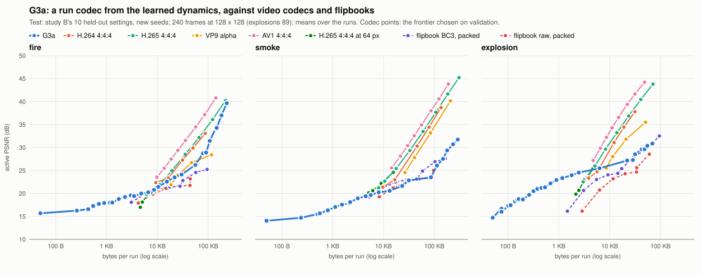
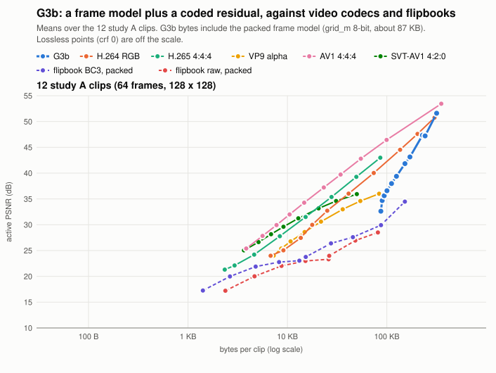

# Study G: diffusion-context mixing for generating effects

Status: **plan** (9 October 2026), with G1 and G1c decided (stage S2, §6); round 2 done (10 October 2026): the G1
retry passes on no effect (§6.10), G2a stops in the nested search (G2.10), G2b is stopped on smoke (G2.11), each with
its rules fixed first. Each section turns into a result when its stage finishes. Audience: owner, research, dev.

## 1. The algorithm and where it comes from

Diffusion-context mixing (DCM) is the owner's algorithm, built in CameraDetector (Phase 12: `cabinlab/src/diffusion`,
`docs/DIFFUSION_MIXER_PLAN.md`) to detect seatbelt violations: "a mixer for the fine features and diffusion for the
macro features. A mixer search, so to speak."

```
fine experts (many cheap, weak predictions) ───────────────────────► mixer INPUTS (log-odds)
macro view ─► small denoiser at high noise ─► PCA ─► k-means ──────► mixer CONTEXTS (+ hand-made contexts)
inputs + contexts ─► PAQ8-style MixerNet: a first-layer mixer without context + up to 3 context-selected ones
                     ─► final mixer ─► adaptive probability map (APM) ─► prediction
mixer search: which inputs, contexts, rates, passes, APM; nested (the held-out part never chooses its own structure)
```

What CameraDetector found: the mixer worked, by a small margin. The diffusion contexts did not. They clustered frames
by camera and light (nuisances a classifier must ignore), and as contexts they lowered the held-out score from 0.792 to
0.770. Its decision was "stop the diffusion part; keep the mixer".

This study adapts DCM from classifying to **generating** effects. It is the owner's request: "use a content mixer,
specifically the one and algorithm I made in CameraDetector ... adapt it to generating SFX ... trial some stuff with
that and then meet both in the middle". The mixer, its frozen inference copy and its search are ported as they are.
The k-means and the denoiser are rewritten without LibTorch, which this project does not use.

## 2. From classifying to generating

DCM's split matches study D's ([REPORT.md](REPORT.md) §6): a 32 x 32 **macro** state stepped by a learned network, and
**fine** heat and soot made by a hand-made detail layer.

| CameraDetector | NeuralVFX |
|---|---|
| fine experts: strap and edge statistics, detector scores (log-odds) | fine experts: cheap per-pixel predictions of the next fine heat or soot (the advected field, the detail layer's own lock, the upsampled coarse value, new material shaped by each noise octave, gradients, the previous frame) |
| macro: denoiser features of the wide crop, clustered, as contexts | macro: a small denoiser on the 32 x 32 coarse state; as contexts, as a prior against long-run drift, and as a source of start points |
| PAQ8 MixerNet with an APM: a probability | the same structure in a value domain (ValueNet: normalised-LMS updates, a Laplace loss, an adaptive value map, a scale net): a distribution per pixel, sampled with the effect's own coherent noise |
| target: one label per crop, 3,058 crops | target: the simulator's true next fine field, dense and unlimited |
| nested leave-one-camera-out search, AUC | nested leave-one-control-bin-out search, held-out bits per pixel; re-ranked by generation statistics |
| frozen mixer, SHA-256 version | the same, recorded in the model file and in every CSV |

A predicted distribution is also a code length. So the same mixer that generates detail can code it, which links
generation to compression (§3, G3).

## 3. Designs and decision rules

| id | design | stage | kept only if |
|---|---|---|---|
| G1 | **DCM-fine:** the mixer replaces the detail layer's lock and new-material rule; it starts exactly as the hand-made rule (weight 1 on it) | S2 | on held-out settings its detail spectrum distance beats the hand-made layer's (interval excluding zero) on at least 2 of 3 effects, no effect is worse, motion and mean-frame PSNR are no worse, and it costs at most +1 ms per 128 x 128 frame. Better bits per pixel alone do not count |
| G1c | cold start: the mixer grows fine detail from a coarse state in a few frames (no warm-up, no stored fine fields) | S2 | its first second's statistics tie or beat the current start |
| G2a | denoiser features as mixer contexts | S5 | they beat the hand-made contexts in the nested search beyond the search's own seed noise; first checked by their mutual information with those contexts |
| G2b | denoiser as a prior against long-run drift (a one-step denoise every few frames) | S5 | one long rollout drifts less than without it on validation settings, within 0.5 ms per frame |
| G2c | denoiser start points (sampled, or a stored start moved to new controls) | S5 | they beat the nearest stored start rolled ahead, within 100 ms per shard |
| G3a | **codec for authored runs:** the stepper predicts, a PAQ coder stores the coarse corrections every few frames, detail is synthesised | S4 | it is a rate-distortion curve: claimed only where it crosses the flipbook and video-codec curves, at a stated quality |
| G3b | frame model plus a coded residual (study A clips) | S4, if time | as G3a |
| G3c | start points quantised, dithered with the seed's own noise and coded; fewer of them | S3 | test statistics tie or beat the current files |
| G4a | one renderer for every model: a mixer over the learned renderers, the field shader and the simulator's renderer | S8 | the explosion's first frames improve, and modules match in look |
| G5a | shard critic: a frozen binary mixer picks the most real-looking of a few rolled-ahead seeds | S8 | endless statistics improve on validation, then on test |
| G5b | a mixer over the stepper's update and a cheap solver's update | S8 | smoke tracks better after a few seconds |
| G6 | one DCM-fine for every effect (the effect is a context) | S8 | as G1 |
| H1 | **computing on compressed data:** feature volumes, weight tables and stored fields kept LZ78- or grammar-compressed (RePair), with products and blends computed on the compressed form (a phrase's partial sum is built from its parent's), so the cost follows the compressed size | S9 | it is faster than the dense SIMD code it replaces at the same result (bit-exact or within the parity tests), on a quiet machine |
| H2 | **run-aware fields:** the mostly empty fine fields kept as runs, so the detail step, the shader and compositing touch only material | S9 | as H1; the fireball's frame time falls |
| H3 | **LZ inside the coder:** a match model and LZ tokens in the context-mixing coder, for faster decoding at a small cost in size, and decoding of single slices without the whole file | S9 | load or decode time falls by more than the size grows |

When a design does not pass, it is reported as a null result with its numbers, as CameraDetector reported its own.

What could repeat CameraDetector's outcome, and how we find out fast:
- **The risk:** the hand-made contexts (heat level, height, flow, controls) may already describe the regimes, so
  clusters of denoiser features only add selection noise, as camera and light did.
- **What is different:** contexts here pick a regime of a physical predictor, not a nuisance. Data is unlimited
  (about 300,000 pixel rows per effect). The objective (bits per pixel over dense targets) is far less noisy than
  per-camera AUC. A denoiser on 32 x 32 costs a fraction of a millisecond, not 6 ms.
- **Fast checks before any denoiser is built:**
  - a pilot of the default mixer against the hand-made layer on fire;
  - contexts from plain coarse statistics (no diffusion) as the floor;
  - the mutual information of any clusters with the hand-made contexts.

## 4. Protocol

- **Splits:**
  - training: study D's runs (salt 1);
  - validation, for every choice, search, calibration and re-ranking: salt-3 runs and 10 validation settings;
  - test, used once per stage: study B's 10 held-out settings with new seeds and the salt-2 tracking runs, exactly
    as study D.
- **Nested search sites:** 5 bins of the training runs' controls.
- **Metrics:**
  - endless runs: detail spectrum distance, motion ratio, coverage and emission distances, mean-frame PSNR;
  - tracking: active PSNR at 1, 8, 30 and 60 frames;
  - one step: bits per active pixel and squared error;
  - frame models: study A's metrics.
- **Bytes**, each reported on its own: disk (file bytes), resident memory, working memory per instance, decode or
  load time, ms per frame.
- **Intervals:** 95% paired bootstrap (10,000 resamples) over settings or runs; an interval covering zero is a tie.
  The search's own seed noise is measured with three seeds on fire.
- **Determinism:** every released mixer and denoiser carries the SHA-256 of its serialisation. 100 repeated steps give
  one hash.
- **Timing:** only on a quiet machine (load below 1.5), one pinned core, 200 frames, median and p90.
- **Data:** under `/root/nvfx-data/{g,f}`, never in git.

## 5. Stages

| stage | what | who | ends with |
|---|---|---|---|
| S0 | port the mixer, its frozen copy and the search; k-means and PCA without LibTorch; the value-domain mixer; tests; this plan | a porting agent and the main agent | `neuralfx_dcm` on main |
| S1 | merge the fireball optimisation branches and the context-mixing coder; re-profile; freeze v1 | main agent | the fireball after round 1, study F in the report |
| S2 | G1 and G1c | an agent, 2 threads | G1 decided |
| S3 | compression past 10x: flipbooks and video codecs (x264, AV1, VP9 with alpha) as baselines, longer training, 4 to 6-bit features, rollout start points (G3c); RAM and disk separate | an agent, 2 threads | ratios with intervals |
| S4 | G3a (and G3b) | an agent | rate-distortion curves |
| S5 | G2a, G2b, G2c with a hand-written denoiser | an agent | G2 decided per use |
| S6 | meet in the middle: v2 rollout effects (every part that passed, in the runtime with parity and zero-allocation tests); the fireball re-rendered with v2 and compared with v1 | main agent | v2, and the fireball v1 against v2 |
| S7 | a second optimisation round; the final 30 fps video | agents | final profile and video |
| S8 | extras on idle cores: G5a, G4a, G6, G5b | agents | one-line decisions |
| S9 | study H, the owner's addition: compute on LZ- and grammar-compressed data (H1-H3), measured against the dense code it would replace | an agent, after S1 | H1-H3 decided |

Study H is honest about where it can win. Small dense products in AVX2 registers are hard to beat, and published
speed-ups from grammar-compressed products are mostly over sparse formats on large, repetitive matrices. The likely
wins here are the large blended feature volumes of the frame models, the mostly empty fine fields (H2) and decoding
(H3).

The core is S1, S2, S3 and S6. If time runs short, the cuts are S8, then S5's extension beyond fire, then G3b, then
S7's speed targets (the final video stays).

**Done so far:** S0, S1, S2 (§6), S3 (study F2, `results/compression/README.md`), S4 (§8), S5 on fire (§7) and S9 (§9); round 2 of study G (10 October 2026): the G1 retry passes on no
effect (§6.10), G2a stops in the nested search (G2.10), G2b is stopped on smoke and skipped for explosions (G2.11). From
study G, only fire's prior against drift (G2b, round 1) goes to stage S6.
- **S1:** the three optimisation branches and the coder are merged. The fireball runs at 24 ms per frame at
  1280 x 720 on 4 threads against 143 ms before, measured in the same session (`docs/COMPOSE.md` §7.1), and study F
  is in `docs/REPORT.md` §3. The report's cost tables were re-measured in one session; the rollout effects take 0.8 to
  0.9 ms per 128 x 128 frame (2.0 to 2.4 ms before the runner was optimised).
- **v1 is frozen:** the three rollout effects of study D as trained, with the SHA-256 of each file and of the
  fireball's eight keyframes rendered by main, in `results/experiments/v1_frozen.csv`. Stage S6 compares v2 against
  these.

## 6. G1 and G1c: DCM-fine (stage S2)

**Result in one line:** the mixer about halves the detail spectrum distance on all three effects at held-out settings,
and a cold start from the coarse state alone ties or beats v1's start (**G1c passes**), but the released smoke generator
moves too little (motion ratio 0.72 against v1's 0.85) and its average picture is 0.05 dB further away, so by the rule
fixed in advance **G1 does not pass** to stage S6. Fire passes every criterion on its own.

Code: `include/neuralfx/dcm/fine.hpp` and `src/dcm/fine.cpp` (the reference), `tools/fine_study.cpp` (the pipeline
behind `nvfx_dcm record | experts | search-fine | train-fine | eval-fine | bench-experts | fine-summary` and
`nvfx_experiment g-fine`), `tests/test_dcm_fine.cpp`. Tables: `results/experiments/g_fine_*.csv`, collected with their
intervals in `results/experiments/g_fine_summary.md`.

### 6.1 What was built

Each frame, the v1 stepper and the MacCormack advection of the detail layer run unchanged. Then, for every fine pixel
and channel (heat, soot), a ValueNet mixes up to 15 experts, all planar and made from buffers the reference already has:

| group | experts |
|---|---|
| adv | A (the MacCormack value), A_sl (the semi-Lagrangian value), A - A_sl |
| lock | L (v1's lock output), r_up A, a_up (new material) |
| noise | a_up phi_1, a_up phi_2, a_up phi_3 (new material shaped by each flicker octave) |
| coarse | C_up (the bilinear coarse value), (C - block mean of A)_up |
| shape | laplacian of A, \|grad A\| A / s_q |
| prev | the previous frame's value |
| bias | 1 |

- **Domain:** inputs and target are divided by C_up + 0.02 s_q (linear) or mapped by sign(v) log1p(\|v\| / s_q) (log);
  s_q is the renderer's input scale of the channel.
- **Contexts:** heat level (C_up in 6 bins, 0 = empty), A / C_up (4 bins), flow (speed in 3 bins x vorticity sign),
  height (4 bands), controls (intensity x turbulence, 3 x 3), age (one-shot effects, 4 bins), channel, and k-means
  clusters (K = 4 and K = 8) of regional coarse statistics (mean heat, soot, speed and \|vorticity\| over 8 x 8 coarse
  cells), the floor without diffusion. Bin edges are quantiles of the training rows. A tenth context, `extra`, is a
  per-cell hook (a callback) for stage S5's denoiser clusters.
- **Network:** a first-layer mixer without context plus up to 3 context-selected ones, the final mixer, the AVM, and
  the scale net log b = U[ctx] (1, z) with z = (\|A - A_sl\|, \|grad A\|, C_up, a_up), normalised.
- **It starts as v1.** With weight 1 on L, 0 elsewhere and the AVM off, the step is v1's detail step
  (`DcmFine.DcmFineWithTheV1WeightsIsV1`: within 1e-6 for one frame and 5e-6 after five whole frames, in both domains
  and with context-selected mixers; the lock output L of `compute_frame` is bit-identical to `rollout::detail_step`). Training
  starts there too: the search gained `SearchProblem::value_rule` (a pure addition) so that a configuration that
  includes L starts as the v1 rule instead of averaging its inputs.
- **Invisible pixels keep v1's value:** where every value a pixel is built from is below 2e-4 s_q (the renderer's gate
  is then at most 2%), the mixer is not run. It runs on 34% of the pixel-channels of a fire frame, 40% for smoke, 27%
  for explosions.
- **Generation:** v = clamp(mu + tau b xi, 0, 2 max(L, A, A_sl, prev, C_up)) in value units, with xi a two-octave
  value-noise fbm of its own seed stream mapped to Laplace quantiles. The upper bound is a local maximum principle with
  slack (it only binds on a runaway sample). Then, optionally, a relock: (1) exact, each block scaled to its coarse
  value; or (2) v1's lock applied to the mixer's output (growth limited by `grow`, the rest arriving as new material
  shaped by the flicker).
- **Codec use:** bits per pixel = -log2 of the Laplace mass of the bin [v - s_q / 512, v + s_q / 512] in value units.
  The search's objective codes every row in one bin width (the median of the rows' normalised widths); every bits
  figure below uses each pixel's own bin.
- **Determinism:** a released mixer is its serialisation with a SHA-256 version (in `g_fine_released.csv`); 100 frames
  of a mixer with grain and each relock give one hash (`DcmFine.HundredStepsGiveOneHash`).

### 6.2 Protocol as run

- **Rows** (`record`): 48 training runs (salt 1) and 16 validation runs (salt 3) per effect at 128 px, simulated on the
  fly. Every frame the v1 stepper takes the true coarse state (its memory channels carried from its own previous
  step); the experts come from the true fine fields of the frame before, and the target is the true fine field. Fire
  and smoke: every second frame from 60 to 240; explosions: frames 1 to 89. Per frame and channel 32 active and 4 empty
  pixels: 311,040 training rows per effect, about 280,000 once the invisible ones are dropped. The training runs also
  give 192 own-rollout windows of 8 frames (true coarse states, true fine targets). Data under
  `/root/nvfx-data/g/fine`, outside git; recording takes about 3 minutes per effect on 2 threads.
- **Validation** for every choice: the salt-3 rows (bits) and 10 validation settings (`std::mt19937_64 rng(2027)`,
  off study B's training grid as B's are, and at least 0.05 from every B test setting); real runs with seeds 800000 + i
  (10 s after 5 s of warm-up; explosions 3 s), single 6 s shards from the nearest start point with seeds 820000 + i
  (explosions 3 s), scored by `calibrate_detail`'s score (spectrum distance + \|log motion ratio\| + log ratios of
  light and cover).
- **Test**, once at the end: study B's 10 held-out settings, real runs with seeds 900000 + i (and 910000 + i, the
  floor), single 6 s shards (explosions 3 s) with seeds 920000 + i, and the 8 salt-2 tracking runs of `d-eval`. v1 and
  DCM-fine both run through the reference with the same stepper and seeds; only the detail layer differs.
- **Search:** `run_search` with `Objective::laplace_bits`, nested and global protocols over 5 sites (k-means, K = 5, of
  the training runs' controls), 200 configurations and 2 refinement rounds, on 100,000 of the training rows (every
  third). Chosen configurations are then trained on every row.
- **Cost** (`bench-experts`): each part of the pass in plain allocation-free float code (scalar, baseline ISA: an upper
  bound for the runtime's SIMD code), timed in thread CPU time (the least of 15 repetitions) on frames of a v1 rollout,
  in ms per 128 x 128 frame. Every configuration pays a base (the mixer's per-pixel overhead, the grain and a relock:
  0.61 ms for explosions to 0.84 ms for smoke); each expert group its experts and its inputs in the mixer without
  context (0.01 to 0.16 ms); each context its own computation and one more mixer over every input (0.08 to 0.21 ms;
  conservative, since a context used only by the AVM or the scale net needs no mixer). Budget: +1 ms.

### 6.3 Pilot: the mixer predicts the next fine field better than v1's lock

The default mixer (every expert, mixers by heat level, A / C ratio and flow, AVM by heat level) against the v1 lock used
as a predictor with a Laplace scale fitted per channel and heat-level bin. Held-out bits per active pixel on the 16
validation runs, paired over runs:

| effect | v1 lock | default mixer, linear domain | default mixer, log domain | linear - v1 | log - linear |
|---|---:|---:|---:|---|---|
| fire | 3.417 | 2.678 | 3.235 | -0.739 [-0.784, -0.692] | +0.556 [+0.528, +0.584] |
| smoke | 4.149 | 3.403 | 3.828 | -0.746 [-0.825, -0.664] | +0.425 [+0.381, +0.466] |
| explosion | 3.808 | 3.082 | 3.632 | -0.726 [-0.802, -0.649] | +0.550 [+0.496, +0.608] |

The fire pilot was the gate (an interval excluding zero): passed, so the study went on; smoke and explosions were run
afterwards for the record. The linear domain wins by about half a bit everywhere and was used from then on. Squared
error ties v1's on fire and explosions and is lower on smoke: the mixer trades a little squared error for a much better
idea of where the value is (bits). Alone, the advected value A codes fire in 3.01 bits, v1's lock in 3.42 (it has the
lower squared error, but its flicker-shaped new material spreads the errors).

### 6.4 Search: under the budget the mixer is small

| effect | seed | nested held-out bits | released configuration (global #0) | its validation bits | cost (model) |
|---|---:|---:|---|---:|---:|
| fire | 0 | 2.626 | A, A_sl, A - A_sl, bias; no context mixer; AVM by channel; scale by height | 2.645 | 0.99 ms |
| fire | 1 | 2.638 | A, A_sl, A - A_sl, prev; scale by height | 2.642 | 0.92 ms |
| fire | 2 | 2.627 | as seed 0 (other rates) | 2.648 | 0.99 ms |
| smoke | 0 | 3.393 | A, A_sl, A - A_sl, L, r_up A, a_up, prev, bias; AVM | 3.395 | 0.95 ms |
| explosion | 0 | 2.725 | A, A_sl, A - A_sl, a_up phi_1..3; mixer by channel; scale by A / C ratio | 2.909 | 0.95 ms |

- **The budget decides the shape.** Every configuration pays 0.6 to 0.8 ms of base cost (the scalar per-pixel
  overhead of the mixer, the grain and a relock), so only a few inputs and at most one or two contexts fit in +1 ms.
  Nothing is lost in bits by it: the small fire mixer codes the validation runs in 2.645 bits against the default
  mixer's 2.678 (15 inputs, 3 context mixers).
- **The search prefers advection to the lock.** One step from the truth, a blend of the MacCormack and semi-Lagrangian
  values predicts best; v1's lock and its flicker-shaped new material add spread. The released fire mixer is
  0.917 A + 0.056 A_sl (and a bias of almost 0): it carries 3% less of the advected detail than v1 and leaves the rest to
  the lock.
- **Seed noise of the search** (fire, seeds 0, 1, 2; nested bits paired over the 48 training runs): 1 - 0
  +0.012 [+0.009, +0.016]; 2 - 0 +0.000 (tie); 2 - 1 -0.012 [-0.014, -0.009]. So about 0.012 bits.
- **Context families** (fire, within the budget, nested bits paired over runs): hand-made - none
  -0.051 [-0.069, -0.033]; hand-made + regional clusters - hand-made -0.016 [-0.019, -0.012]; hand-made + clusters -
  none -0.067 [-0.086, -0.049]. Contexts help well beyond the seed noise, mostly through the cheap AVM and scale-net
  contexts; the regional clusters add 0.016 bits, about the size of the seed noise (0.012).
- **Without the budget** (fire, 60 configurations and one refinement round per family, so a smaller search):
  hand-made - none -0.057 [-0.070, -0.045], but hand-made + clusters - hand-made **+0.029 [+0.019, +0.037]**. Given
  room, the clusters make the held-out score worse, as the diffusion clusters did in CameraDetector: more choices, more
  selection noise. Their normalised mutual information with the hand-made contexts is 0.15 to 0.18 with heat level and
  flow and at most 0.12 with the rest: they partly repeat what heat level and flow already say, the risk the plan named
  (§3). For stage S5 (G2a), this is the floor a denoiser's clusters have to beat.

### 6.5 Generation on validation settings

Each of the global top 10 was trained on every training row, then given the own-rollout pass: its own output fed back
for up to 8 frames from each window's true fine fields (true coarse states), and one more pass of online learning over
those rows mixed with as many one-step rows, at the rates training ended with. (A first version restarted the learning
rates and let the Laplace gradient, sign / b with the small one-step scales, throw the weights far: validation bits went
from 2.7 to between 4 and 16. Continuing from the annealed rates fixed it.) The pass costs 0.03 to 0.08 bits one step
from the truth and changes generation little (the first candidate at the chosen setting: fire 0.772 to 0.766, smoke
0.583 to 0.594, explosion 0.676 to 0.670; scores below). The released mixers are the pass-2 versions.

Tau (0, 0.5, 1) and relock (off, exact, v1's lock) were chosen on the first candidate, then the top 10 re-ranked at that
setting. `calibrate_detail`'s score, mean over the 10 validation settings (lower is better), paired over settings:

| effect | v1 | relock off, tau 0 | exact relock, tau 0 | v1's lock, tau 0 | v1's lock, tau 0.5 | released (re-ranked) | released - v1 |
|---|---:|---:|---:|---:|---:|---:|---|
| fire | 0.815 | 15.24 | 1.276 | 0.766 | 1.101 | 0.720 (candidate 7, v1's lock) | -0.094 [-0.128, -0.059] |
| smoke | 0.581 | 1.030 | 0.597 | 0.594 | 0.774 | 0.567 (candidate 2, v1's lock) | -0.014 [-0.092, +0.049] (tie) |
| explosion | 0.710 | 0.670 | 0.715 | 0.752 | 0.727 | 0.666 (candidate 6, no relock) | -0.044 [-0.135, +0.043] (tie) |

- **The grain never helps.** Every effect chose tau = 0: drawing from the one-step Laplace adds noise of the one-step
  error's size every frame, which piles up as flicker. The released generators are deterministic.
- **The coarse coupling has to come from somewhere.** Without a relock, the lock-free fire mixer drifts away from the
  coarse state (score 15). The exact relock over-brightens peaks (it scales existing structure without bound); v1's own
  lock after the mixer works best for the looping effects. A 3-second explosion has no time to drift.
- **What the released generators are:** fire, 0.917 A + 0.056 A_sl (AVM and scale by height), then v1's lock; smoke,
  0.91 A + 0.02 A_sl + 0.07 prev (AVM), then v1's lock; explosions, a blend of A and A_sl with new material shaped by
  the three flicker octaves, mixers by A / C ratio and channel, no lock. Versions (SHA-256) in
  `g_fine_released.csv`: fire 69faa016..., smoke 4d04479d..., explosion 05ef4ae3....
- A first calibration with only the exact relock gave fire 1.01 against v1's 0.81; the v1-lock relock was then added
  as a third option on validation. Both runs are in the logs; only the second is in `g_fine_val.csv`.

### 6.6 The test (run once)

Study B's 10 held-out settings with new seeds: a single 6 s shard from the nearest start point (explosions: their 3 s)
against a real 10 s run (explosions: 3 s). v1 and DCM-fine through the reference, same stepper and seeds. Means over
settings:

| effect | method | spectrum distance | motion ratio | coverage L1 | mean-frame PSNR |
|---|---|---:|---:|---:|---:|
| fire | real, other seed (floor) | 0.080 | 1.06 | 0.0035 | 36.39 |
| fire | v1 | 0.365 | 0.96 | 0.0044 | 33.59 |
| fire | **DCM-fine** | **0.191** | 0.90 | 0.0044 | **33.72** |
| smoke | real, other seed (floor) | 0.076 | 1.04 | 0.0208 | 29.79 |
| smoke | v1 | 0.254 | 0.85 | 0.0239 | 28.31 |
| smoke | **DCM-fine** | **0.125** | 0.72 | 0.0239 | 28.27 |
| explosion | real, other seed (floor) | 0.116 | 1.07 | 0.0195 | 26.76 |
| explosion | v1 | 0.199 | 0.92 | 0.0305 | 26.16 |
| explosion | **DCM-fine** | **0.102** | 1.05 | 0.0306 | 25.86 |

DCM-fine - v1, paired over the 10 settings:

| effect | spectrum distance | \|log motion ratio\| | coverage L1 | mean-frame PSNR | calibration score |
|---|---|---|---|---|---|
| fire | **-0.174 [-0.186, -0.161]** | +0.009 (tie) | 0.000 (tie) | **+0.13 [+0.07, +0.20]** | **-0.169 [-0.221, -0.119]** |
| smoke | **-0.129 [-0.176, -0.068]** | +0.160 [+0.135, +0.180] (worse) | 0.000 (tie) | -0.05 [-0.07, -0.02] (worse) | +0.032 (tie) |
| explosion | **-0.097 [-0.151, -0.047]** | -0.033 (tie) | 0.000 (tie) | -0.30 (tie) | **-0.121 [-0.234, -0.025]** |

Tracking the 8 held-out runs from their true state (active PSNR, DCM-fine - v1, paired over runs):

| effect | 1 frame | 8 frames | 30 frames | 60 frames |
|---|---|---|---|---|
| fire | +0.10 [+0.07, +0.14] | +0.35 [+0.27, +0.45] | +0.27 [+0.14, +0.42] | +0.47 [+0.28, +0.67] |
| smoke | +0.31 [+0.20, +0.42] | +0.57 [+0.44, +0.69] | +0.53 [+0.43, +0.64] | +0.28 [+0.20, +0.36] |
| explosion | -0.45 [-0.71, -0.20] | -1.77 [-2.89, -0.37] | -1.95 [-2.40, -1.50] | -1.38 [-1.82, -1.00] |

- **Detail spectrum: about halved on all three effects**, every interval below zero. DCM-fine closes 61% (fire), 72%
  (smoke) and more than all (explosions: 0.102 against the floor's 0.116) of v1's gap to two real runs.
- **Fire improves on every measure** and follows a real run 0.1 to 0.5 dB better.
- **Smoke loses motion:** its motion ratio drops from 0.85 to 0.72 (real: 1.04), and its average picture is 0.05 dB
  further away. The released smoke mixer is 0.91 A + 0.02 A_sl + 0.07 prev: it keeps 7% of the previous frame's
  value at the pixel, unadvected, a temporal smoothing that slows change (one step from the truth it lowers the code
  length; over many frames it lowers motion).
- **Explosions** tie on motion and the average picture, but follow a real run 0.5 to 2 dB worse. The released
  explosion mixer (about two thirds MacCormack, one third semi-Lagrangian, plus new material shaped by each flicker
  octave with weights near 0.15) has no lock, so nothing ties its fine fields to the coarse state beyond what the
  experts carry; the burst's shape drifts from the true run's.

### 6.7 G1c: the first second

The first 30 frames against the real run (looping effects: its 10 s statistics; explosions: its own first second).
`usual` is v1's start (fire: a 30-frame warm-up; smoke and explosions: stored 64-pixel fine fields); `cold` starts from
the coarse state alone, with no warm-up and no stored fine fields. Calibration score, mean over the 10 test settings:

| effect | v1 usual | v1 cold | DCM-fine usual | DCM-fine cold | DCM-fine cold - v1 usual (score) | (spectrum) |
|---|---:|---:|---:|---:|---|---|
| fire | 1.693 | 2.185 | 1.552 | 2.018 | +0.33 [-0.16, +0.91] (tie) | -0.18 [-0.34, -0.06] |
| smoke | 1.671 | 1.671 | 1.536 | 1.542 | **-0.13 [-0.20, -0.07]** | **-0.19 [-0.21, -0.17]** |
| explosion | 0.510 | 0.520 | 0.484 | 0.496 | -0.01 (tie) | -0.02 (tie) |

**G1c passes:** a cold DCM-fine start ties v1's current start on fire and explosions and beats it on smoke, so fire
could skip its 30-frame (50 ms) warm-up and smoke and explosions their stored fine fields (64 to 128 KB of each
effect's 146 to 274 KB). The cold start was not trained for: the same released mixers grow the detail within the second.

### 6.8 Cost

Measured by `bench-experts` while the machine was busy (load 2 to 9 from other jobs throughout the session, never below
1.5): thread CPU time, the least of 15 repetitions, so other jobs only add time. These are **provisional upper
bounds**; a quiet-machine measurement was not possible in this session.

| effect | cost model (as searched) | itemised for the released generator |
|---|---:|---:|
| fire | 0.91 ms | about 0.43 ms: tau = 0 needs no grain, and v1's lock moves after the mixer instead of being added |
| smoke | 0.92 ms | about 0.52 ms (as fire) |
| explosion | 0.95 ms | about 0.62 ms: no grain, and no lock at all (v1's lock is saved) |

The released mixers are 2 to 4 KB of text each (spec and weights; a few hundred values).

### 6.9 Decision

By the rule fixed in advance (§3): the spectrum distance beats v1 with an interval excluding zero on 3 of 3 effects (2
needed) and the cost is within +1 ms, but **smoke is worse on two measures**: its motion ratio is further from 1
(\|log ratio\| +0.160 [+0.135, +0.180]) and its mean-frame PSNR is lower (-0.05 dB [-0.07, -0.02]). **G1 does not pass
to stage S6 as released.** Bits per pixel alone would have passed it everywhere (-0.73 to -0.75 bits in the pilot); they
do not count.

**G1c passes** (§6.7): ties on fire and explosions, better on smoke.

What this suggests for S6, without touching the test again: fire's generator passes every criterion on its own and
smoke's fails only on motion, so a per-effect choice (DCM-fine for fire, v1 for smoke; the explosion's tracking loss
deserves a lock) or a smoke mixer selected with motion weighted higher on validation are the obvious next candidates.
Each needs a new validation selection and a new test with new seeds; this stage does not claim them.

### 6.10 G1 retry: only advected experts (round 2)

Status: **done** (10 October 2026). The rules below were fixed and committed before any round-2 search, calibration
or test was run; the results follow them.

**Why G1 failed (§6.6, §6.9).** The released smoke mixer is 0.91 A + 0.02 A_sl + 0.07 prev: 7% of the previous
frame's value at the pixel, *unadvected*. One step from the truth it lowers the code length; over many frames it is a
temporal smoothing, and the motion ratio fell from 0.85 to 0.72 (the mean frame 0.05 dB further away). The motion loss
was already visible on validation (motion ratio 0.755 against v1's 0.899), but the calibration score let the spectrum
gain outweigh it. Explosions had no lock (relock off won on the score), so their burst followed a real run 0.5 to 2 dB
worse.

**The fix.**
1. **Only advected experts.** The `prev` group is removed from the search space; every remaining expert is built from
   the advected field (A, A_sl, A - A_sl, the lock's parts, the shape terms) or from the current coarse state (C_up, the
   block residual, the new material). "The previous field advected by the current flow" is not a new expert: it is A
   (MacCormack) and A_sl (semi-Lagrangian), both already in the `adv` group, so the fix is the drop. (`prev` stays in
   the row files and in the cap of the maximum principle; the mixer can no longer use it.)
2. **Every relock is considered for every effect, explosions included**, and v1's lock is no longer second to the
   score alone: the validation selection now mirrors the test rule and adds a tracking guard (below), so a lock-free
   generator that drifts from its coarse state cannot be chosen for its spectrum.

Everything else is G1's: the same rows, spec, cost model (`g_fine_cost.csv`), search (family hand+macro, seed 0, 200
configurations and 2 refinement rounds on 100,000 rows, budget +1 ms), own-rollout pass and validation settings and
seeds (real runs 800000 + i, shards 820000 + i). Data under `NEURALVFX_DATA/g/round2/fine`; tables
`results/experiments/g_fine2_*.csv`.

**Validation selection (rules fixed before any result).**
- Generators: each of the search's global top 10 (trained on every row, then the own-rollout pass) with each relock
  (off, exact, v1's lock) at tau = 0: 30 per effect. Each is scored on the 10 validation settings and tracked on 8
  validation runs (salt 3, runs 0 to 7) from their true state (frame 100; explosions frame 1) for 30 frames.
- **Admissible** on validation, generator - v1 with the same seeds, 95% paired bootstrap over the 10 settings (tracking:
  over the 8 runs): the detail spectrum distance lower with an interval excluding zero; \|ln motion ratio\|, coverage L1
  and mean-frame PSNR not worse with an interval excluding zero; and the **tracking guard**: active PSNR at 8 and at 30
  frames not lower with an interval excluding zero.
- **Released:** the admissible generator with the lowest mean calibration score; then tau = 0.5 is tried once for it
  and kept only if admissible and lower in score. If no generator is admissible, the effect **fails on validation**,
  keeps v1 and is not tested (the best score is kept in the CSV for the record).

**Test, once, per effect that passed validation (rule fixed in advance).** An effect **passes** if, DCM-fine - v1
paired over B's 10 held-out settings: its spectrum distance is lower with an interval excluding zero; its \|ln motion
ratio\|, coverage L1 and mean-frame PSNR are not worse with an interval excluding zero; and its cost is at most +1 ms per
128 x 128 frame (the search's cost model, as in G1: provisional upper bounds measured on a busy machine; the main agent
re-times). Effects are decided one by one: a pass needs no other effect.
- **Fresh test seeds** (G1's 900000, 910000 and 920000 + i are spent): seed base **6,900,000**: real runs
  6,900,000 + i, the floor (another real run) 6,910,000 + i, shards 6,920,000 + i, at B's 10 held-out settings.
  Tracking: the salt-2 runs **8 to 15** (d-eval and G1 used 0 to 7), from their true state; reported, not in the rule.
- **G1c again**, with the same fresh seeds and the retried generators: the first 30 frames of a cold start (coarse
  state only) against v1's usual start; §3's rule per effect: the calibration score ties or beats it (interval not
  above zero).

Commands (`nvfx_dcm`, 2 threads, `nice 10`): `search-fine --effect E --drop-groups prev --prefix g_fine2
--max-rows 100000 --data DIR`, then `train-fine` and `eval-fine` with the same options plus `--rule-selection
--test-base 6900000 --track-first 8`, then `fine-summary --prefix g_fine2 --rule-selection`.

#### Results of the retry

**Result in one line:** the retry passes on **no effect**. Dropping `prev` removes most of smoke's motion loss, but on
validation every generator that clearly improves the detail spectrum still loses a little motion or tracking, so fire
and explosions find no admissible generator, and smoke's only admissible one (nearly v1 itself) fails its test by
+0.002 in \|ln motion ratio\| and -0.01 dB, both with intervals excluding zero. G1c, re-run on smoke, ties.

Tables: `results/experiments/g_fine2_*.csv`, collected in `g_fine2_summary.md`. The machine was busy throughout (load 6
to 13 from other agents); nothing here depends on time.

**Search** (nested held-out bits per active pixel over the 48 training runs; same seed and settings as G1, without
`prev`):

| effect | G1 | retry | retry's global #0 (cost model) |
|---|---:|---:|---|
| fire | 2.626 | 2.697 | A, A_sl, A - A_sl, the lock's parts, the noise group, bias; no context (0.96 ms) |
| smoke | 3.393 | 3.428 | A, A_sl, A - A_sl, the lock's parts, bias; no context (0.93 ms) |
| explosion | 2.725 | 2.727 | A, A_sl, A - A_sl, C_up, block residual, bias; mixer by channel, AVM by channel, scale by A / C (0.95 ms) |

- Smoke loses 0.035 bits without `prev`, as expected: one step from the truth the unadvected value is a good guess.
- **Fire's search got stuck.** Its top 10 use no context at all, and its nested bits are 0.07 worse than G1's, six times
  G1's measured seed noise (0.012). Under the +1 ms budget a context costs about 0.09 ms, so from a context-free
  configuration at 0.93 to 0.96 ms, adding one is only possible together with dropping an expert group: a two-step move
  the hill climbing cannot make. G1's seeds happened to start in the region with contexts (AVM by channel, scale by
  height). The search's seed noise is therefore larger than G1's three seeds showed; G2.10 measures it again.

**Validation** (generator - v1, paired over the 10 validation settings and the 8 validation runs; 30 generators per
effect at tau = 0, plus tau = 0.5 for smoke's admissible one; `g_fine2_val_rule.csv`):

| effect | admissible | with v1's lock (10 generators) | without a lock (10) | exact relock (10) |
|---|---:|---|---|---|
| fire | 0 | spectrum better on all 10 (-0.06 to -0.07), PSNR and tracking better or tied, but \|ln motion\| worse on all 10 (best score: +0.024 [+0.012, +0.032], about 2% less motion) | the fine fields run away from the coarse state (score 8 to 18) | spectrum worse on all 10 (+0.55 to +0.68) |
| smoke | 1 | spectrum better on all 10; motion worse on 3, tracking at 8 frames worse on 6; **candidate 6 admissible**: spectrum -0.008 [-0.011, -0.005], everything else tied | motion, coverage, PSNR and tracking worse on all 10 | spectrum better on 1, PSNR worse on all |
| explosion | 0 | spectrum never better (+0.017 to +0.035) | spectrum better on 1 (candidate 5: -0.043 [-0.091, -0.001]), but tracking at 30 frames worse on 9 of 10 (candidate 5: -1.42 dB [-1.77, -1.10]) | PSNR and tracking worse on all 10 |

- The trade-off is the same on every effect: the generators that change the detail enough to improve its spectrum
  clearly also smooth it a little (fire, smoke: 1 to 7% less motion) or let it drift from the coarse state
  (explosions without a lock); the generators that keep motion and tracking change the detail hardly at all. Smoke's
  admissible generator is 0.92 A + 0.02 A_sl + 0.04 r_up A before v1's lock, with about a twentieth of G1's smoke
  spectrum gain.
- **The rule is strict at this resolution.** v1 and the generator share the stepper and the seeds, so their
  differences are consistent across settings, and intervals over 10 settings exclude zero for less than 1% of motion
  or 0.01 dB. G1's own released generators, judged on their validation rows by this rule (a scratch recomputation),
  would all have been inadmissible too: fire's \|ln motion\| +0.055 [+0.030, +0.073] (although its test then tied,
  +0.009), smoke's +0.143, and explosions' spectrum a tie.
- The grain (tau = 0.5), tried once for smoke's admissible generator, makes it worse on spectrum (+0.33) and tracking
  (-1.8 dB at 8 frames): inadmissible, as in G1.

**Test, once** (smoke only; B's 10 held-out settings, seeds 6,900,000 + i, 6,910,000 + i, 6,920,000 + i):

| smoke | spectrum distance | motion ratio | coverage L1 | mean-frame PSNR |
|---|---:|---:|---:|---:|
| real, other seed (floor) | 0.058 | 1.07 | 0.0233 | 30.15 |
| v1 | 0.228 | 0.801 | 0.0259 | 27.67 |
| DCM-fine, retry | 0.221 | 0.799 | 0.0260 | 27.65 |
| retry - v1 | **-0.007 [-0.010, -0.005]** | \|ln\| +0.002 [+0.000, +0.003] (worse) | +0.0000 (tie) | -0.01 [-0.02, -0.01] (worse) |

Cost (the search's model): 0.93 ms, within +1 ms. Tracking the fresh salt-2 runs 8 to 15 (reported, not in the rule):
-0.02, -0.04, +0.01 (tie) and -0.01 (tie) dB at 1, 8, 30 and 60 frames. **G1c** with this generator: the cold start's
first second minus v1's usual start, +0.001 [-0.026, +0.030] in score (tie), so G1c's rule holds for it, but the
generator itself did not pass.

**Decision (rule fixed in advance):** fire: fails on validation (motion), not tested; smoke: fails its test (motion and
mean-frame PSNR, by 0.2% and 0.01 dB); explosion: fails on validation (no spectrum gain with a lock; tracking without
one), not tested. **The G1 retry passes on no effect; nothing from DCM-fine goes to stage S6.** The released files,
their versions and the best-scoring inadmissible generators of fire and explosions (kept for the record) are in
`g_fine2_released.csv`.

What this says, without touching the test again:
- The fix worked on what it targeted (smoke's motion loss fell from +0.14 to +0.03 on validation without `prev`), but
  the mixer's one-step objective still favours a slightly smoothed field, and a rule that counts any consistent loss as
  worse will refuse every generator that changes the detail visibly.
- A round 3, if wanted, should fix in advance (before looking at fresh validation seeds): a non-inferiority margin for
  motion, coverage and mean-frame PSNR (a size people would notice, not zero); a source of motion in every candidate's
  grid (the grain at small tau with v1's lock); and several search seeds, keeping the best nested bits, since one seed
  can land in a context-free optimum. It would need fresh validation and test seeds; this round does not claim it.

## 7. G2: diffusion for the macro features (stage S5)

Status: **done for fire** (9 October 2026). The prior against drift (G2b) is kept: it passed validation and its one
test. Diffusion start points (G2c) are stopped. The diffusion contexts (G2a) are not redundant by the first check;
their decision waits for stage S2's nested search, which is not on main yet. Smoke and explosion are not started: that
is a later decision. Rules in G2.3 were fixed before any result; results are in G2.4 to G2.9. **Round 2** (10 October
2026): G2a is decided in the nested search and stops (G2.10); G2b is stopped on smoke and skipped for explosions
(G2.11); decisions in G2.12.

### G2.1 The denoiser

`include/neuralfx/dcm/ddpm.hpp`, `src/dcm/ddpm.cpp`, `src/dcm/ddpm_kernels.hpp` (library `neuralfx_ddpm`). The owner's
denoiser (CameraDetector, `cabinlab/src/diffusion/denoiser.cpp`) is a LibTorch UNet; this one is written out by hand,
forward and backward, because this project uses no LibTorch.

- **What it models:** the 32 x 32 coarse state of a rollout effect (velocity, heat, soot), each channel divided by the
  stepper's channel scale (`rollout::Model::scale`), plus two position channels as inputs.
- **The network:** an epsilon-prediction UNet with levels 32 x 32 (32 channels), 16 x 16 (64) and 8 x 8 (64): a 3 x 3
  stem, two residual blocks per level (one on the way down and one on the way up at 32 and 16, two at 8), 2 x 2
  average pooling and nearest upsampling with 1 x 1 convolutions, additive skips, and a 3 x 3 output layer. A block is
  `x + conv3(SiLU(FiLM(conv3(SiLU(x)))))`. FiLM comes from one two-layer MLP over the sinusoidal embedding of the noise
  level and the controls (and the age, for one-shot effects). No attention and no GroupNorm: the second convolution of
  every block and the output layer start at zero, gradients are clipped and the learning rate warms up instead.
- **Size and cost:** 391,748 parameters and 89.5 million multiply-adds per pass. The brief asked for about 0.25 M and
  60 M; with the brief's widths (32/64/64) and two blocks per level, the 64-wide blocks alone hold 295,000 weights, so
  the brief's widths were kept and the numbers are reported as they are.
- **Kept from the owner's version:** the cosine schedule with its beta clip (T = 1000), epsilon prediction, identity
  start of every block, Adam with a linear warm-up then cosine decay to 10%, gradient clipping, an EMA copy (0.99 for
  500 steps, then 0.999), and features read at a fixed noise level with one fixed noise image per level and seed.
- **Sampling:** deterministic DDIM (eta = 0) on a 25-step grid; SDEdit noises a state to t0 and runs the same grid down.
  A fresh sample starts at t = 961, the first point of DDIM's grid, not at T: there the clipped schedule leaves
  alpha_bar at about 2e-9 and the first estimate of x0 is pure error. Found by a sanity check of the samples' channel
  statistics after training (samples started at T were several times too hot and too spread), before any G2c run.
- **Tests** (`tests/test_dcm_ddpm.cpp`): the fast AVX2 kernels equal the plain convolution patterns copied from
  `rollout_train.cpp`; the hand-written gradient matches finite differences on an 8 x 8 toy for every part of the network;
  training lowers the held-out loss on a toy set; ten repeats of a short training give one SHA-256 of the weights, for
  one or two threads; `features_at()` is bit-identical for a seed; Tweedie's denoise and the predicted noise recompose
  x_t; DDIM is deterministic and stays in range; serialisation round-trips.

### G2.2 Data and training

- **States:** study D's training recipe for fire (`record_runs`, salt 1, 160 runs of 240 frames, as `d-train`), every
  second coarse state after the effect's 1 s warm-up (frames 30 to 238): 16,800 states. Validation states: 16 runs of
  salt 3, the same frames (1,680 states). Under `NEURALVFX_DATA/g/diff/`, never in git.
- **Training:** `nvfx_dcm ddpm-train`: batch 32, Adam (learning rate 5e-4, 500 warm-up steps), clip 1, EMA 0.999, two
  threads at `nice 10`; the number of steps is set from a timed probe to fit about 3 to 4 CPU-hours. The EMA loss at
  t = 50, 200, 500 and 800 on 256 validation states (fixed noise) is logged every 500 steps
  (`results/experiments/g_diff_train.csv`).

### G2.3 Rules, fixed before any result

- **Validation:** salt-3 runs and 10 validation settings: `std::mt19937_64 rng(2027)`, each control uniform in
  [0.05, 0.95], off study B's training grid like B's own held-out settings (at least 0.05 from 0, 0.5 and 1 for intensity
  and turbulence, from 0, 0.25, 0.5, 0.75 and 1 for wind) and at least 0.05 (Euclidean distance in control space) from
  every one of B's 10 held-out settings (`results/experiments/g_diff_settings.csv`). Every choice below is made on
  validation.
- **Test, once, only for a use that passes validation:** B's 10 held-out settings with new seeds (and the salt-2 runs),
  as `d-eval` (`nvfx_experiment g-diff-test`, which refuses to run a use that did not pass).
- **Intervals:** 95% paired bootstrap, 10,000 resamples; an interval covering zero is a tie.
- **Score of generated frames:** the detail score of study D's calibration: detail spectrum distance + |ln motion
  ratio| + |ln emission ratio| + |ln coverage ratio| against a real run at the same setting (lower is better).
  Spectrum, motion, coverage and mean-frame PSNR are reported beside it.
- **Timing** only on a quiet machine (load below 1.5), one pinned core; otherwise the number is reported as an upper
  bound and marked unmeasured.

| use | alternative without diffusion | how it is chosen and scored | kept only if |
|---|---|---|---|
| **G2a** contexts: denoiser features at t = 400 and 600 from the 16 x 16 and 8 x 8 levels (blocks e1, m1, d1), averaged per 8 x 8 region, standardised, PCA-16, k-means (K = 4, 8, 16), fitted on training states | hand-made contexts: heat level (empty, then terciles), height band (4), flow speed (terciles), control bins (each control below or above 0.5); and plain coarse-statistics contexts (the same PCA and k-means on the region's raw coarse values) as the floor | check 1 on validation states: normalised mutual information, and the share of the diffusion contexts' entropy that the joint hand-made context explains, I(D; H) / H(D) | check 1: **redundant, stop**, if at every K the joint hand-made context explains at least 80% of the diffusion contexts' entropy. Otherwise the nested search of stage S2 decides: they must beat the hand-made contexts beyond the search's own seed noise (§3) |
| **G2b** prior against drift: every N frames, Tweedie's one-step denoise at a small t, x0_hat = x - sqrt((1 - abar) / abar) eps_hat(sqrt(abar) x, t), blended with weight beta into the coarse state (no noise added) | the same continuous rollout without the prior; the runtime's 6 s shards as a reference | N in {4, 8, 16}, t in {20, 50, 100}, beta in {0.25, 0.5, 1}, chosen by the mean detail score of the six 10 s windows of one continuous 60 s rollout at validation settings 1 and 2 (tuning seeds). The decision uses fresh seeds at the same two settings, paired over the 12 (setting, window) pairs | the interval of (prior - none) lies below zero, and the prior costs at most 0.5 ms per frame (one pass every N frames) |
| **G2c** start points: a fresh DDIM sample at the requested controls, or SDEdit of the nearest stored start from t0 in {300, 400, 500} | the nearest stored start rolled ahead 0.5 s at the requested controls (the stored start as it is, as a reference) | every start plays as fire does (a 1 s warm-up that grows the fine fields) and its first 2 s are scored against a real run, at the 10 validation settings. The variant is chosen on tuning seeds (2 per setting); the decision uses 2 fresh seeds per setting, paired over the 10 settings. Diversity: mean pairwise distance between 8 generated starts against 8 real states at a setting | the interval of (variant - rolled start) lies below zero, and generating costs at most 100 ms per shard (DDIM passes x one pass) |

Two amendments, made before the trained denoiser was run on any of these comparisons (only a 500-step checkpoint, to
test the pipeline):
- **Two candidates per use.** One pass of this network took 6 to 10 ms on one core of the (busy) machine, and its
  89.5 million multiply-adds need about 4.5 ms even at the kernels' best speed (20 GMAC/s), so N = 4 and N = 8 cannot
  meet 0.5 ms per frame, and a fresh 25-step sample cannot meet 100 ms per shard. Choosing only the best score
  could therefore stop a use for its cost while an affordable setting works. So two candidates go from tuning to
  the decision: the best overall, and the best that can meet the bound (N = 16 for G2b; the best SDEdit for G2c). A
  use is kept when a candidate passes both the interval and the cost bound. These are two looks at the validation
  seeds, and are reported as such; a test, if one is earned, uses the cheaper passing candidate.
- **The rolled start** steps the whole effect (coarse state, memory and fine fields) 15 frames after its start-up, as
  the runtime rolls a shard ahead. SDEdit's t0 is rounded to the 25-step grid (multiples of 40): 300, 400 and 500 start
  at 320, 400 and 520 (8, 10 and 13 passes).

What would repeat CameraDetector's outcome here: the denoiser's clusters follow what the hand-made contexts already
say (how hot a region is, how high, which controls), as CameraDetector's followed camera and light; the prior pulls
the state towards an average fire and takes the flicker with it; generated starts are softer and less varied than
real states, the usual failure of a small diffusion model trained briefly.

### G2.4 Training

10,000 steps of batch 32 (320,000 examples, 19 passes over the 16,800 states) in 3,830 s on two threads at `nice 10`:
about 2.1 CPU-hours. The probe ran at 0.59 s per step on a machine loaded by other agents; the load fell during the run
(0.38 s per step on average), so the run used less than the 3 to 4 CPU-hours it was sized for. Loss of the EMA weights on
256 validation states (salt 3), fixed noise (`results/experiments/g_diff_train.csv`):

| step | training loss | t = 50 | t = 200 | t = 500 | t = 800 |
|---:|---:|---:|---:|---:|---:|
| 500 | 0.416 | 0.513 | 0.199 | 0.099 | 0.062 |
| 1,000 | 0.110 | 0.395 | 0.174 | 0.083 | 0.047 |
| 2,000 | 0.073 | 0.291 | 0.119 | 0.055 | 0.026 |
| 4,000 | 0.060 | 0.186 | 0.087 | 0.040 | 0.017 |
| 6,000 | 0.054 | 0.168 | 0.080 | 0.037 | 0.015 |
| 8,000 | 0.051 | 0.161 | 0.077 | 0.035 | 0.014 |
| 10,000 | 0.050 | 0.158 | 0.076 | 0.035 | 0.014 |

The curve is flat over the last 2,000 steps (the learning rate has decayed to 10%). CameraDetector's denoiser ended
at 0.436 / 0.400 / 0.388 / 0.394 on its canvases; the data differ, so this is no ranking, but coarse fire states leave
much less noise unexplained at middle and high noise levels. The released denoiser is
`NEURALVFX_DATA/g/diff/fire.ddpm`, version `1152045db43ea534ff5b80099d538c1c0be555d3cb6c5e6aef701a933d8bf56a`.

What its samples look like (`nvfx_dcm ddpm-sample`, network units, at controls 0.5 / 0.5 / 0.5): fresh 25-step DDIM
samples have heat mean 0.06 and spread 0.25 where real states near those controls have 0.16 and 0.70. They are colder
and smoother than real states, and hardly change with the controls (heat mean 0.08 at 0.9 / 0.2 / 0.8, real 0.34). A
1000-step ancestral sampler (a scratch check, not used) lands nearer in mean (0.20) but over-spreads (1.0), and costs
1000 passes. SDEdit from t0 = 400 returns almost its input (channel means within 0.01 of the stored state's).

### G2.5 G2a: contexts, check 1 (mutual information)

`nvfx_dcm contexts`: fitted on 1,500 training states (96,000 regions), scored on all 1,680 validation states (107,520
regions). PCA-16 keeps 79% of the denoiser features' variance and 97% of the plain statistics'. Share of each context's
entropy explained by the hand-made contexts, I(D; H) / H(D), and NMI (`results/experiments/g_diff_nmi.csv`):

| contexts | K | entropy (bits) | heat | height | flow | controls | joint hand-made | NMI with plain, same K | ARI between two k-means seeds |
|---|---:|---:|---:|---:|---:|---:|---:|---:|---:|
| diffusion | 4 | 1.47 | 0.45 | 0.06 | 0.40 | 0.01 | **0.65** | 0.39 | 0.998 |
| diffusion | 8 | 2.38 | 0.28 | 0.10 | 0.27 | 0.04 | **0.55** | 0.42 | 0.80 |
| diffusion | 16 | 3.61 | 0.20 | 0.11 | 0.19 | 0.05 | **0.47** | 0.37 | 0.86 |
| plain statistics | 4 | 1.06 | 0.45 | 0.02 | 0.40 | 0.06 | 0.64 | | |
| plain statistics | 8 | 1.68 | 0.34 | 0.05 | 0.35 | 0.05 | 0.58 | | |
| plain statistics | 16 | 2.49 | 0.26 | 0.05 | 0.33 | 0.05 | 0.53 | | |

- **Not redundant by the rule:** the joint hand-made context explains 47% to 65% of the diffusion contexts' entropy,
  below the 80% line, at every K. They follow how hot a region is and how fast it moves (NMI 0.29 to 0.47 with heat,
  0.27 to 0.39 with flow), and add height at larger K.
- **CameraDetector's failure does not repeat in this check.** There, the clusters followed camera and light (NMI 0.10
  to 0.29), the very variables that defined the held-out sites. Here the sites of the nested search are bins of the
  controls, and the diffusion contexts carry almost nothing about the controls (NMI 0.007 to 0.063, as low as the plain
  statistics' 0.04).
- **But they are not obviously more than plain statistics.** Their agreement with plain coarse-statistics clusters is
  NMI 0.37 to 0.42, the hand-made contexts explain about as much of either (0.47 to 0.65 against 0.53 to 0.64), and
  the diffusion clusters are only more balanced (more entropy at the same K). Whether that extra resolution helps the
  fine-detail mixer is exactly what the nested search measures.
- **The full test is pending.** It needs stage S2's nested search on effect pixel rows, which is not on main. The API
  is ready for it: `dcm::ddpm::context_planes()` gives, from one coarse state and its condition, an 8 x 8 plane of
  cluster ids per K, and `nvfx_dcm contexts` writes every validation region's diffusion, plain and hand-made contexts
  to `NEURALVFX_DATA/g/diff/fire_contexts.csv`. The rule stays §3's: kept only if they beat the hand-made contexts
  beyond the search's own seed noise. Cost: two passes per frame (t = 400 and 600), about 12 ms on one core; the
  contexts could be refreshed every few frames.

### G2.6 G2b: the prior against drift

`nvfx_experiment g-diff`. One continuous 60 s rollout (the reference implementation, from the start point nearest the
controls, fire's 1 s warm-up first) at validation settings 1 and 2 (0.67 / 0.33 / 0.24 and 0.11 / 0.42 / 0.89), each
10 s window scored against a real 10 s run (`results/experiments/g_diff_prior.csv`).

Tuning (tuning seeds), mean detail score over 12 windows, best first:

| method | score | | method | score |
|---|---:|---|---|---:|
| N = 8, t = 100, beta = 1 | **0.605** | | N = 16, t = 100, beta = 1 | **0.621** |
| N = 4, t = 100, beta = 0.5 | 0.606 | | runtime shards (6 s) | 0.635 |
| N = 8, t = 100, beta = 0.5 | 0.614 | | no prior | 1.699 |
| N = 4, t = 100, beta = 0.25 | 0.614 | | N = 4, t = 20, beta = 1 (worst) | 4.328 |

Low noise levels mostly hurt: every prior at t = 20 and six of the nine at t = 50 drift **more** than no prior (1.9
to 4.3 against 1.70); only the strongest t = 50 prior (every 4 frames, beta 1) comes near the best, at 0.64. Applied
deterministically every few frames, a small bias in the predicted noise at low noise levels is a drift of its own. The
best settings sit at the edge of the grid (the largest t and beta); larger t was not tried.

Decision (fresh seeds, paired over the 12 (setting, window) pairs; cost = one pass / N on one core; the run measured
the pass on the busy machine at 5.8 ms, and a quiet measurement later gave 5.8 to 6.5 ms):

| candidate | minus no prior | minus shards | ms per frame | decision |
|---|---|---|---:|---|
| best: N = 8, t = 100, beta = 1 | −1.655 [−3.015, −0.506] | −0.069 [−0.276, +0.116] (tie) | 0.72 to 0.81 | stop: cost above 0.5 ms |
| best with N = 16: t = 100, beta = 1 | **−1.564 [−2.916, −0.396]** | +0.022 [−0.224, +0.287] (tie) | **0.36 to 0.40** | **keep** |

**Test, once** (study B's held-out settings 1 and 2, new seeds), N = 16, t = 100, beta = 1:

| | detail score | spectrum distance | motion ratio | mean-frame PSNR |
|---|---|---|---|---|
| prior minus no prior | **−5.28 [−9.01, −2.05]** | −0.66 [−1.47, −0.06] | +0.41 [+0.23, +0.59] | +6.4 [+4.5, +8.2] dB |
| prior minus shards | −0.17 [−0.41, +0.05] (tie) | −0.001 (tie) | +0.015 (tie) | +0.9 [−0.4, +2.4] (tie) |
| no prior minus shards | +5.10 [+1.86, +8.90] | | | |

Without the prior, the test's first setting froze from 20 s to 50 s (motion ratio 0.006 to 0.03, spectrum distance up
to 3.9: REPORT §6.6's failure), and the second slowed to a motion ratio of 0.06 to 0.24 in its last 30 s. With the
prior, both kept a motion ratio of 0.64 to 0.95 for the whole minute (mean-frame PSNR 32 to 41 dB). Cost: one pass
every 16 frames; one pass takes 5.8 to 6.5 ms (median, one pinned core, quiet machine, four cores tried), so **0.36 to
0.40 ms per frame**. Its weights add 1.5 MB as float32 (0.8 MB as fp16) to an 82 KB effect.

What it means: the prior does what shards do (the test ties them on every statistic) without restarts, crossfades or
stored states, so a single rollout can play for a minute. It does not beat shards. Shards are free per frame and need
no 1.5 MB network, so the prior is worth having where a crossfade every 6 s is unwanted (one continuous run, an effect
that must not jump), not as a replacement.

### G2.7 G2c: start points

First 2 s after each start (after fire's 1 s warm-up), at the 10 validation settings, 2 seeds each
(`results/experiments/g_diff_starts.csv`):

| method | tuning: detail score | spectrum distance | motion ratio | mean-frame PSNR |
|---|---:|---:|---:|---:|
| nearest stored start as it is | 1.493 | 0.721 | 0.84 | 31.97 |
| nearest stored start rolled ahead 0.5 s (the alternative) | 1.545 | 0.724 | 0.82 | 31.96 |
| SDEdit of it from t0 = 300 (320) | 1.525 | 0.730 | 0.82 | 31.95 |
| SDEdit from t0 = 400 | 1.528 | 0.731 | 0.82 | 31.96 |
| SDEdit from t0 = 500 (520) | 1.530 | 0.732 | 0.82 | 31.96 |
| fresh DDIM sample (25 passes) | 1.878 | 0.747 | 0.74 | 31.56 |

Decision (fresh seeds, paired over the 10 settings): the best generated start, SDEdit from t0 = 300 (also the best
SDEdit), minus the rolled start: **−0.079 [−0.216, +0.038], a tie**; 8 passes, 46 ms per shard. **Stop.**

Diversity, mean pairwise RMS distance between 8 starts at a setting (network units, validation settings 1 to 3): real
states (8 seeds, frame 150) 0.69 to 1.00; fresh samples 0.45 to 0.51; the stored start rolled 0.5 s with 8 seeds 0.36
to 0.52; SDEdit of the stored start 0.16 to 0.20 (`results/experiments/g_diff_diversity.csv`).

- Fresh samples are worse than every stored start (colder, smoother, too little motion) and half as varied as real
  states: the small diffusion model's usual failure, and the conditioning on the controls is weak.
- SDEdit at t0 = 300 to 500 hardly moves a state (its 8 seeds differ by 0.16 to 0.20, a fifth of real states' spread):
  at those levels the signal still dominates the noise, and the network restores it. It cannot move a stored start to
  new controls, so it ties the stored start it came from.
- Fire forgets its start within about a second (REPORT §6.1), and its 1 s warm-up rolls every start forward anyway, so
  the start matters little here. Smoke and explosions keep their start's look longer; this result does not transfer
  to them without a test.

### G2.8 Costs

| item | cost |
|---|---|
| states (176 runs simulated once) | 433 s on two threads |
| training | 3,830 s on two threads (about 2.1 CPU-hours) |
| G2a contexts (fit and score) | about 2 minutes on two threads |
| G2b and G2c on validation (`g-diff`) | 21 minutes on two threads |
| G2b test (`g-diff-test`) | 1.4 minutes on two threads |
| all of stage S5 on fire, including probes and smoke tests | about 3.4 CPU-hours (budget 5) |
| one denoiser pass (`nvfx_dcm ddpm-time`) | median 5.8 to 6.5 ms, p90 6.6 to 8.1 ms on one pinned core of a quiet machine (load 0.9 to 1.0), cores 0 to 3; 14 to 16 GMAC/s. The decisions' own measurements on the busy machine (5.8 and 6.4 ms) agree: the kernels are compute-bound and the pinned core was free |
| denoiser size | 391,748 weights: 1.5 MB float32 |

### G2.9 Decision

The rule for each use was fixed in G2.3 before any result.

| use | test | result | met? |
|---|---|---|---|
| G2a contexts | check 1: redundant if the hand-made contexts explain at least 80% of their entropy at every K | 47% to 65%; they follow heat and flow, not the controls (unlike CameraDetector's camera and light) | **not redundant** |
| G2a contexts | they beat the hand-made contexts in the nested search beyond its seed noise | not run: stage S2's search is not on main | **pending** |
| G2b prior | the drift (detail score per 10 s window of a 60 s rollout) falls, interval below zero, on validation | −1.56 [−2.92, −0.40] (N = 16, t = 100, beta = 1) | **yes** |
| G2b prior | within 0.5 ms per frame | 0.36 to 0.40 ms (median pass, quiet machine) | **yes** |
| G2b prior | the same on test, once | −5.28 [−9.01, −2.05] | **yes** |
| G2b prior | (reference) better than the runtime's shards | tie on every statistic, validation and test | no |
| G2c start points | better than the nearest stored start rolled ahead, interval below zero | SDEdit t0 = 300: −0.079 [−0.216, +0.038], a tie; fresh samples worse in tuning (1.88 against 1.55) | **no** |
| G2c start points | within 100 ms per shard | SDEdit 8 passes, 46 to 52 ms, yes; a fresh sample 25 passes, 144 to 161 ms, no | partly |

**Decision for fire: keep the denoiser as a prior against drift (G2b); stop diffusion start points (G2c); G2a waits
for the nested search.** This is not CameraDetector's outcome: there no diffusion use survived, here one does, and the
contexts do not encode the held-out sites. It is also a narrower win than it looks: the prior ties the shards that the
runtime already has, so it buys continuity (no restarts, no crossfades), not better pictures, for 0.4 ms per frame and
1.5 MB. Extending it to smoke and explosions is a later decision and has not been started.

### G2.10 G2a: denoiser contexts in the nested search (round 2)

Status: **done** (10 October 2026). The rules were fixed and committed before any of these searches was run.

- **Contexts per pixel row.** The context models of G2.5, refitted exactly as there (same denoiser
  `fire.ddpm` 1152045d..., same 1,500 training states, spec and seeds, so the same clusters): diffusion contexts
  (features at t = 400 and 600 from e1, m1, d1, per region, PCA-16, k-means K = 4, 8, 16) and the plain coarse-statistics
  contexts (the same on the region's raw coarse values), the floor. G1's 48 training and 16 validation runs are replayed
  (`nvfx_dcm region-contexts`), and at every recorded frame the contexts are computed from the stepped coarse state the
  detail step sees; each pixel row takes the cluster ids of its region (16 x 16 pixels, one of 8 x 8). As for every
  context here, the clusters and the denoiser were fitted on training states, including the runs of the held-out bins
  (unsupervised preprocessing; the plain floor is treated the same way).
- **Families**, each searched with seeds 0, 1 and 2 on fire with the G1 retry's settings (no `prev`; 200
  configurations, 2 refinement rounds, 100,000 rows, budget +1 ms): **hand** (heat level, A / C ratio, flow, height,
  controls, channel); **hand+diff** (hand plus the diffusion contexts at K = 4, 8 and 16, each one candidate context of
  the search); **hand+plain** (hand plus the plain contexts at K = 4, 8, 16), the floor. G1's regional clusters
  (macro4, macro8) are left out of all three, so the comparison isolates the denoiser. In the cost model a region
  context costs what G1's `extra` hook costs (one more mixer); the denoiser's own passes (two per refresh, about 12 ms)
  are reported apart.
- **Rule (§3's G2a row made concrete).** Nested held-out bits per active pixel, per training run. The search's seed
  noise sigma is the largest absolute difference between the mean nested bits of two seeds of one family (3 pairs x 3
  families). The diffusion contexts are **kept** only if all three hold: (1) for every one of the 9 pairings of a
  hand+diff seed with a hand seed, hand+diff - hand, paired over the 48 training runs, has an interval below zero; (2)
  the three-seed mean of hand+diff - hand is below -sigma; (3) they beat the floor: the three-seed means of
  hand+diff - hand+plain have an interval below zero. Otherwise G2a **stops**, reported with its numbers. Global #0's
  bits on the validation runs are reported beside it. The rule is about the search alone: a kept context would still
  need a generation test (it has no generation path yet; `detail_step` refuses it).
- Tables: `results/experiments/g_ctx_*.csv` (`nvfx_dcm ctx-summary --prefix g_ctx`).

**Result in one line:** the denoiser's contexts beat the hand-made ones on all 9 seed pairings (by 0.012 to 0.097 bits)
and beat the plain floor (-0.032 [-0.043, -0.021] bits), but the three-seed gain over hand-made contexts, -0.046 bits,
is smaller than the search's own seed noise, 0.069 bits, so by the rule fixed in advance **G2a stops**. Unlike
CameraDetector's, these diffusion contexts help; they do not help by more than the search's randomness.

Nested held-out bits per active pixel (48 training runs) and the bits of each search's global #0 on the 16 validation
runs:

| family | seed 0 | seed 1 | seed 2 | three-seed mean | global #0 on validation (seeds 0 / 1 / 2) | global #0's contexts (seeds 0 / 1 / 2) |
|---|---:|---:|---:|---:|---|---|
| hand | 2.6287 | 2.6333 | 2.6981 | 2.6534 | 2.645 / 2.652 / 2.688 | AVM channel, scale height / scale height / AVM heat level |
| hand+diff | 2.6172 | 2.6035 | 2.6012 | **2.6073** | 2.639 / 2.617 / **2.611** | scale diff8 / AVM diff4, scale diff8 / AVM diff16, scale diff8 |
| hand+plain (floor) | 2.6542 | 2.6404 | 2.6236 | 2.6394 | 2.663 / 2.653 / 2.641 | AVM plain8, scale height / AVM plain4, scale height / AVM plain8, scale height |

| comparison (paired over the 48 training runs) | difference |
|---|---|
| hand+diff - hand, the 9 seed pairings | -0.0115 [-0.0214, -0.0013] to -0.0969 [-0.1179, -0.0768]: **9 of 9 below zero** |
| hand+diff - hand, three-seed means | -0.0461 [-0.0589, -0.0335] |
| hand+diff - hand+plain, three-seed means | **-0.0321 [-0.0434, -0.0214]** |
| hand+plain - hand, three-seed means | -0.0140 [-0.0181, -0.0100] |
| seed noise: largest difference of two seeds' means in one family | **0.0694** (hand, seed 2 - seed 0: +0.0694 [+0.0561, +0.0835]) |

| rule (G2.10) | result | met? |
|---|---|---|
| (1) every pairing of a hand+diff seed with a hand seed below zero | 9 of 9 | yes |
| (2) the three-seed mean of hand+diff - hand below -sigma | -0.046 against -0.069 | **no** |
| (3) hand+diff beats the plain floor | -0.032 [-0.043, -0.021] | yes |

- **What the search did with them.** Every hand+diff search put the 8-cluster diffusion context on the Laplace scale
  (and two of three also a diffusion context on the AVM), with the advected inputs only. The denoiser's regions say how
  uncertain the next fine value is better than heat level, height or the plain statistics do. The hand+diff searches
  also agree with each other (seeds within 0.016 bits), while one of the three hand searches (seed 2) landed in a
  context-poor optimum 0.069 bits worse: the same failure as the retry's fire search (§6.10). That one seed sets sigma.
  Against the two good hand seeds alone the gain is 0.012 to 0.032 bits.
- **Why the rule still says stop, and why it matters little for generation.** The rule asks for a gain beyond what a
  different search seed can do, and one seed of the hand-made family did worse by more than the gain. More to the
  point for stage S6: most of the gain is in the Laplace scale, which the released generators do not use (tau = 0
  ignores the scale; only the AVM moves the mean). The gain is about predicting uncertainty, so it would belong to the
  coding use (G3), not to generated detail; and it costs two denoiser passes (about 12 ms) per refresh of the
  contexts.
- **CameraDetector's outcome does not repeat**: there the diffusion contexts lowered the held-out score (0.792 to
  0.770); here they raise it on every pairing and beat the plain floor, inside the +1 ms budget. They fail only the
  margin the plan set for them.

### G2.11 G2b beyond fire (round 2)

Status: **done** (10 October 2026). The rules were fixed and committed before the smoke denoiser was trained.

- **Explosions are skipped.** A 3 s one-shot effect plays 90 frames from its start and ends; the question G2b answers
  (does one rollout stay alive for a minute without restarts) does not arise, and G1 already noted that a 3-second
  explosion has no time to drift. A one-step prior would only move a burst whose shape the stepper has to keep.
- **Smoke, with fire's recipe and rules.** States: study D's training runs for smoke (`recipe_for(smoke)`, salt 1, 160
  runs of 240 frames), every second coarse state from frame 30 (16,800 states); validation states from 16 runs of salt 3.
  The same network and optimiser (G2.1, G2.2), 10,000 steps of batch 32 on two threads at `nice 10` (about 2 to 3
  CPU-hours), resumable after a restart (the training state is kept at every log; a resumed run gives the same weights,
  `Ddpm.ResumedTrainingGivesTheSameWeights`). Data under `NEURALVFX_DATA/g/round2/diff`.
- **G2b exactly as G2.3 and G2.6:** the grid N in {4, 8, 16}, t in {20, 50, 100}, beta in {0.25, 0.5, 1}; one
  continuous 60 s rollout from the start point nearest the controls (smoke starts from its stored 64-pixel fine fields,
  as the runtime starts it) at validation settings 1 and 2, six 10 s windows each against a real 10 s run; tuning seeds
  (real 1,950,000 + i, model 1,960,000 + i), decision seeds 1,970,000 + i; two candidates (the best, and the best with
  N = 16); kept if (prior - none) has an interval below zero and costs at most 0.5 ms per frame. Then **the test, once**,
  if a candidate passed: B's held-out settings 1 and 2, real runs 2,950,000 + i, model 2,970,000 + i (not used for
  smoke before). Shards are reported as a reference. `nvfx_experiment g-prior --effects smoke` and `g-prior-test`;
  tables `results/experiments/g_diff_smoke_*.csv`.

**Training.** 16,800 training states recorded in 318 s and 1,680 validation states in 28 s (two threads); 10,000 steps of
batch 32 in 4,623 s on two threads at `nice 10` (0.46 s per step on a machine loaded by other agents to 5 to 13): about
2.6 CPU-hours. EMA loss on 256 validation states (`g_diff_smoke_train.csv`), fire's for comparison:

| step | training loss | t = 50 | t = 200 | t = 500 | t = 800 |
|---:|---:|---:|---:|---:|---:|
| 500 | 0.417 | 0.520 | 0.190 | 0.098 | 0.063 |
| 2,000 | 0.068 | 0.268 | 0.109 | 0.054 | 0.027 |
| 6,000 | 0.049 | 0.142 | 0.073 | 0.035 | 0.015 |
| 10,000 | 0.045 | 0.133 | 0.069 | 0.033 | 0.014 |
| fire, 10,000 | 0.050 | 0.158 | 0.076 | 0.035 | 0.014 |

The curve is flat over the last 2,000 steps, as fire's was. The released denoiser is
`NEURALVFX_DATA/g/round2/diff/smoke.ddpm`, version `8362a0c347e2da0097d014cc836f7e52b44311a31ef3751124e37a2da0a1cbff`
(`g_diff_smoke_released.csv`), the same network as fire's (391,748 weights, 89.5 million multiply-adds per pass).

**Result in one line:** on smoke the prior against drift **does not pass validation** (prior - none +1.58 [-0.26, +4.36],
a tie, worse on average), so it is stopped and not tested. Smoke without a prior also drifts (mean detail score 8.3 in
tuning against the shards' 0.48), but at one of the two settings it dies after about 30 s with or without the prior.

G2b on smoke (`g_diff_smoke_prior.csv`, `g_diff_smoke_decisions.csv`), mean detail score over the 12 (setting, window)
pairs of one 60 s rollout at validation settings 1 and 2:

| method | tuning seeds | decision seeds |
|---|---:|---:|
| no prior | 8.278 | 1.359 |
| runtime shards (6 s) | 0.480 | 0.469 |
| best prior, also the best with N = 16: N = 16, t = 100, beta = 0.25 | **0.647** | 2.937 |
| next: N = 16, t = 100, beta = 0.5 / N = 16, t = 20, beta = 0.5 | 0.692 / 0.698 | |

| decision seeds | difference | rule | decision |
|---|---|---|---|
| prior - no prior | +1.58 [-0.26, +4.36] (tie) | interval below zero, at most 0.5 ms per frame (cost 0.25 ms) | **stop** |
| prior - shards | +2.47 [+0.38, +5.29] | reference | |
| no prior - shards | +0.89 [+0.15, +1.93] | reference | |

- **Where it fails.** At validation setting 1 (0.67 / 0.33 / 0.24) the prior helps on the decision seeds too (its
  windows score 0.23 to 0.49, where the run without it reaches 2.31 in its last window). At setting 2 (0.11 / 0.42 /
  0.89: faint, turbulent smoke) the run without the prior almost stops for one window (20 to 30 s, motion ratio 0.07)
  and then moves again, while with the prior it stops for 30 s (20 to 50 s, motion ratio 0.00 to 0.06; window score up
  to 16.2 against 1.2). Tuning saw the opposite at that setting (no prior: dead from 30 s, score 30.9; the prior 0.7 to
  1.2). With two settings and six windows each, which seed freezes decides the mean, and the interval says so: a tie.
- **What differs from fire.** Fire's prior brought a freezing rollout back to a moving fire at both settings and on
  both seed sets (G2.6). Smoke's runs freeze at the faint, turbulent setting with or without it. A plausible reading,
  not tested here: faint smoke is rare among the training states, so a denoiser at t = 100 has little to pull it
  towards. The best prior is also the gentlest one (beta = 0.25).
- Explosions were not run (see above); `g-prior --effects explosion` refuses.
- **Cost (provisional).** One pass of the smoke denoiser, `nvfx_dcm ddpm-time --effect smoke --dir
  NEURALVFX_DATA/g/round2/diff --core 2` (and `--core 3`), 200 passes on one pinned core at load 5.2 (busy, so an upper
  bound): least thread CPU time 3.80 ms, median 3.94 and 5.16 ms. The decision used the run's own measurement, 4.0 ms
  (0.25 ms per frame at N = 16); the prior failed on drift, not on cost.

### G2.12 Decision, round 2

| use | effect | test | result | met? |
|---|---|---|---|---|
| G2a contexts | fire | beat the hand-made contexts in the nested search beyond the search's seed noise (G2.10's three conditions) | 9 of 9 pairings below zero and better than the plain floor (-0.032), but the three-seed gain (-0.046) is smaller than sigma (0.069) | **no: stop** |
| G2b prior | smoke | drift falls on validation, interval below zero, at most 0.5 ms per frame | +1.58 [-0.26, +4.36], a tie | **no: stop** (not tested) |
| G2b prior | explosion | (a 3 s one-shot effect has no long run to drift in) | not run | skipped |
| G2b prior | fire | (G2.9) | kept, tested once | **yes** (round 1) |

**Decision:** across both rounds, the only diffusion use that survives is fire's prior against drift (G2b, round 1),
which ties the runtime's shards and buys continuity for 0.4 ms per frame and 1.5 MB. The diffusion contexts come
closer than CameraDetector's ever did (they help the mixer's bits on every comparison) but not by more than the
search's own randomness, and what they help is the predicted uncertainty, which generation at tau = 0 does not use.
The smoke prior is stopped: it rescues one setting and not the other.

## 8. G3: a codec from the learned dynamics (stage S4)

Status: **done** (10 October 2026). G3a on the three rollout effects; G3b on study A's 12 clips. Rules (§3): a
rate-distortion result, claimed only where the curves cross, at a stated quality.

**Result in one line:** G3a wins only at low rates. Up to 18 dB active PSNR on fire and smoke and 22 dB on explosions
(50 bytes to about 2.5 KB per run) it needs fewer bytes than every video codec and flipbook tested, between a hundredth
and a half of the closest; the curves tie at 20 to 22 dB (fire), 20 dB (smoke) and 24 to 26 dB (explosions); above that
AV1, H.265 and H.264 in 4:4:4 need 1.5 to 7 times fewer bytes. G3b (a frame model plus a residual) loses to every video
codec at every quality.

Code: `include/neuralfx/codec/` and `src/codec/` (library `neuralfx_codec`): `run_codec.hpp` (G3a), `rcoder.hpp` (the
coder), `clip_residual.hpp` (G3b); `tools/nvfx_g3.cpp` (the study: `probe | ladder | baselines | g3b | summary |
timing`) and `tools/video_pipe.hpp` (the ffmpeg harness); `tests/test_g3_codec.cpp`. Tables:
`results/experiments/g3_*.csv` and `g3b_*.csv`. Figures: `docs/figures/g3_rd.svg`, `docs/figures/g3b_rd.svg`. Data and
logs under `NEURALVFX_DATA/g3`, outside git.

### 8.1 What was built

An **authored run** is one real simulation run at a chosen setting and seed: here 240 frames at 128 x 128 after a
warm-up (explosions: 89 frames from the first), rendered by the simulation's own renderer. The v1 effect of study D
(frozen, `v1_frozen.csv`) is the decoder's model; the stream holds only what the model cannot know.

| part of the stream | what it holds | bytes |
|---|---|---|
| header | magic, version, a 32-bit tag of the model, controls (3 x 16 bits), the run's noise seed, the start time, frames, size, the settings (8-bit codes), a 16-bit header check | 38-45 |
| coarse start | the true 32 x 32 coarse state (u, v, heat, soot) at the first frame, quantised as a correction of the nearest stored start point | 0-1,500 |
| fine start (option) | the true fine heat and soot at 64 px, as a correction of the upsampled coarse state | about 350 |
| coarse corrections | every k frames: true coarse state minus the v1 stepper's prediction, quantised with step q x the channel's scale; heat and soot, optionally velocity | per setting |
| fine residuals (option) | every kf frames: true fine heat and soot minus the detail layer's, block-averaged to 32, 64 or 128 px, quantised with step qf x the renderer's input scale; the coarse heat and soot then follow the fine fields' block means | per setting |
| trailer | a hash of the decoder's final state, and a checksum of the header, every coded integer and that hash | 8 |

With the arithmetic coder's 4 closing bytes, the smallest stream (a start with no correction) is 50 bytes.

Everything between corrections is the v1 effect playing: the stepper driven by **the simulator's own forcing noise with
the run's seed**, the detail layer and the renderer. That is why a header alone (seed, controls, start time) already
follows the run in rough outline: the noise pulls runs with the same seed together (REPORT §6.1).

- **Closed loop.** The encoder runs the decoder's reconstruction and computes each correction against it. Decoder and
  encoder share one `Loop` (the reference implementation of `rollout.hpp`, plain float C++, baseline ISA, no
  contraction), so the decoder reproduces the encoder's frames byte for byte (tested on five settings, and on one
  setting of every run of the study).
- **The coder** (`rcoder.hpp`): PAQ/lpaq-style context mixing, integer arithmetic only. Each integer is binarised (zero,
  sign, magnitude class in unary, mantissa bits); each decision is predicted by nine context models (neighbours in the
  plane, the same cell in the previous plane of the same kind, the other channels of the cell, the position, and two
  optional side contexts), mixed by a logistic mixer selected by decision and local activity, refined by an APM, and
  written by a 32-bit carry-less binary arithmetic coder. By default no context depends on floating-point state, so a
  stream decodes on any build; the side context (a class of the decoder's own prediction) is an option.
- **Refusal.** A stream for another model (tag), a damaged header (16-bit check, before the loop runs), a decoder that
  runs past its input, or a checksum mismatch: the decoder returns an error and no frames.
- **The renderer** in the codec is v1's, byte for byte (`render_u8`, tested against `rollout::render`), without the
  reference's per-pixel cost: the directional soot sums are made once per coarse cell and pixels the material gate
  closes skip the MLP. It halved the study's encode time (17 to 9.5 ms per frame on a loaded machine).

### 8.2 Protocol as run

- **Runs.** Validation: study G's validation settings (`std::mt19937_64 rng(2027)`, §4) with seeds 800000 + i, the first
  6 of the 10 (CPU budget: the machine ran at a load of 5 to 16 from other agents throughout). Test: study B's 10
  held-out settings with seeds 900000 + i, as study D's endless runs. The 8 salt-2 tracking runs of `d-eval` were not
  run (CPU budget); the tool includes them (`--max-runs 18`), and its CSVs resume. Each run: a real simulation at 128 x
  128, 150 frames of warm-up (explosions: 1), then 240 frames (explosions: 89) are the run, rendered by the simulation's
  own renderer. Every method codes and is scored on exactly these frames.
- **Quality:** active PSNR (the primary measure, as in the report: pixels visible in either frame), PSNR and SSIM of the
  decoded 128 x 128 RGBA frames against the real frames, pooled over the run (`metrics::score`).
- **Bytes:** what is stored for the run. G3a: the stream; the effect file (82 to 274 KB, 45 to 56 KB packed) is shared
  by every run and every endless use of the effect and is not counted, but is given beside the results. Video: the
  elementary stream (SEI with encoder settings removed from H.264 and H.265; IVF framing subtracted; VP9 alpha: the
  whole WebM file, since its alpha lives in the container). Flipbooks: as stored (BC3 or raw RGBA,
  `flipbook::memory_bytes`) and packed by the model-file coder (`cm::pack_tensors`, as `nvfx_pack`); flipbooks above 1
  MB stored are given stored only (packing them costs about a minute of CPU each).
- **Choices on validation only:** the codec's frontier (every setting no other setting beats in mean bytes and mean
  active PSNR over the validation runs), the one-change-at-a-time variants (fire only), and the video formats (4:2:0,
  4:4:4, RGB, 64 and 32 px; one validation run per effect). Then test once.
- **Comparisons on test, paired over the 10 runs:** for each run, each method's curve (its settings sorted by bytes, the
  best quality at or below each size) is interpolated in log bytes. At a stated active PSNR: the ratio of bytes, G3a
  over the other (geometric mean, 95% paired bootstrap interval, 10,000 resamples). At a stated byte budget: the
  difference in active PSNR. A method whose smallest setting already exceeds the stated quality is counted at that
  smallest size ("at its floor"); a method that cannot reach a quality on a run leaves that run out (the counts are in
  the CSV).
- **Video codecs** (`tools/video_pipe.hpp`): one thread, constant quality, one keyframe for the whole run; x264 `-preset
  veryslow`, x265 `-preset slow`, libvpx-vp9 `-deadline good -cpu-used 1`, libaom `-cpu-used 4`, SVT-AV1 `-preset 6`;
  colour (premultiplied RGB over black) above the alpha as grey in one frame twice as tall, except VP9 with native alpha
  (WebM). Lower resolutions are box-downsampled before coding and upsampled bilinearly after decoding, as a game samples
  a smaller texture.

### 8.3 Validation: what the codec's curve is made of

The ladder (`nvfx_g3 ladder --set val`, `novar` for smoke and explosions): the start alone (from the nearest stored
start, its correction at five steps, or none); coarse corrections every k = 1 to 32 frames at q = 0.2 to 3.2 channel
scales; fine residuals every frame at 64 and 128 px at qf = 0.025 to 0.4; and, on fire, one change at a time at two
coarse points and one fine point. 6 validation runs per effect; means over runs (`g3_val_ladder.csv`). The frontier
(`g3_val_frontier.csv`; 28 settings for fire, 22 for smoke, 27 for explosions) has three parts:

| part | settings | fire | smoke | explosion |
|---|---|---|---|---|
| header only | the nearest stored start as it is, the run's seed | 50 B, 16.1 dB | 50 B, 14.4 dB | 50 B, 13.3 dB |
| start and coarse heat and soot | k 1 to 32, q 0.4 to 3.2 | 0.27 to 5.8 KB, 16.8 to 21.3 dB | 0.24 to 12 KB, 15.3 to 21.0 dB | 0.08 to 2.3 KB, 15.7 to 25.5 dB |
| fine residual every frame | 64 px, then 128 px, qf 0.2 down to 0.025 | 8.4 to 204 KB, 21.8 to 39.7 dB | 21 to 259 KB, 21.8 to 31.4 dB | 5.3 to 60 KB, 26.2 to 30.7 dB |

(bytes per run of 240 frames, explosions 89; active PSNR.)

- **The run's seed is worth most of the start.** A 50-byte header (controls, seed, start time; the nearest stored start
  as it is) already gives 16.1 dB on fire. Coding the true coarse start adds 0.7 to 1.2 dB for 220 to 390 bytes; after
  that, frequent coarse corrections at a coarse step beat rarer fine ones (the frontier runs k = 8 to 1 at q = 3.2 and
  1.6 before it reaches q = 0.8).
- **Coarse corrections saturate at about 21 dB** (fire and smoke; 25.5 dB on explosions). The coarse state fixes where
  the material is, not the fine structure inside each 4 x 4 block, which the detail layer invents. Past that, only the
  fine residual raises quality, and v1's renderer caps it: on the true fine fields it reaches about 49 dB on fire, 31 dB
  on smoke and 29 dB on explosions (`d_track.csv`, `renderer_on_true_fields`), which is where the curves flatten.

One change at a time (fire, paired over the 6 runs; bytes as a ratio, quality as a difference in active PSNR):

| change | at k 8, q 0.8 | at k 4, q 0.4 | at a fine residual (qf 0.07, 128 px) |
|---|---|---|---|
| nearest rounding instead of the dead zone (offset 0.3) | bytes x1.18 [1.15, 1.22], +0.19 dB [+0.06, +0.31] | x1.15 [1.13, 1.16], +0.02 dB (tie) | x1.26 [1.24, 1.28], +1.68 dB [+1.61, +1.74] |
| velocity corrected too | x1.23 [1.17, 1.30], +0.89 dB [+0.61, +1.21] | x1.38 [1.30, 1.46], +0.91 dB [+0.73, +1.09] | |
| fine start coded at 64 px | x1.17 [1.16, 1.17], +0.00 dB (tie) | x1.05 [1.05, 1.06], +0.01 dB (tie) | |
| coarse start from zero instead of the nearest stored start | x0.95 [0.91, 0.99], -0.12 dB (tie) | x0.98 [0.97, 0.99], -0.05 dB (tie) | |
| side context (a class of the decoder's prediction) | x0.94 [0.93, 0.94], identical frames | x0.95 [0.94, 0.95], identical frames | x0.98 [0.98, 0.98], identical frames |
| coarse heat and soot not synced to the fine residual | | | x1.71 [1.63, 1.79], -0.05 dB [-0.09, -0.02] |
| fine residual at 64 px instead of 128 | | | x0.28 [0.27, 0.28], -6.3 dB [-6.9, -5.8] |

The dead zone and the default choices were kept; each rejected change either costs bytes for nothing or lies on the
same curve (velocity corrections and nearest rounding at the fine point are on or near the frontier, and the frontier
keeps them where they are). The side context saves 2 to 6% of the bytes for identical frames, but makes the stream
decode only on builds that round alike, so it stays an option and out of the frontier.

### 8.4 Test: the curves



Means over the 10 test runs (`g3_test_curves.csv`; every run's points in `g3_test_runs.csv`). G3a's points are the
validation frontier, replayed on test.

| effect | G3a: header only | G3a: best without a fine residual | G3a: largest point | smallest video stream on the ladders | AV1 4:4:4: smallest, largest | smallest packed flipbook |
|---|---|---|---|---|---|---|
| fire (240 frames) | 50 B, 15.7 dB | 8.6 KB, 20.8 dB | 233 KB, 39.7 dB | 4.3 KB, 16.5 dB (H.265 4:4:4 at 32 px) | 9.8 KB, 23.6 dB; 142 KB, 40.8 dB | 3.1 KB, 18.1 dB (BC3, 32 px, 15 frames) |
| smoke (240 frames) | 50 B, 14.1 dB | 13 KB, 20.6 dB | 290 KB, 31.7 dB | 4.3 KB, 19.1 dB (H.265 4:4:4 at 32 px) | 14 KB, 25.6 dB; 189 KB, 43.8 dB | 5.3 KB, 19.3 dB (BC3, 32 px, 15 frames) |
| explosion (89 frames) | 50 B, 14.7 dB | 2.5 KB, 24.5 dB | 69 KB, 30.9 dB | 1.7 KB, 18.3 dB (H.265 4:4:4 at 32 px) | 4.8 KB, 27.2 dB; 49 KB, 44.2 dB | 1.5 KB, 16.1 dB (BC3, 32 px, 5 frames) |

(Active PSNR, means over the runs. The validation means of the same settings are within about 0.5 dB of these.)

- **G3a covers rates no video stream reaches.** Its smallest streams are 50 bytes per run (the header: 14 to 16 dB) and
  a few hundred bytes (start corrections and sparse coarse corrections: 16 to 21 dB). The smallest video stream on the
  ladders here is about 4.3 KB for 240 frames and 1.7 KB for 89 (H.265 4:4:4 at 32 px, crf 51): a video codec spends
  about 18 bytes per frame even on frames it hardly changes.
- **Coarse corrections saturate at 20 to 25 dB, and the fine residual is an inefficient way up.** It codes scalar
  quantised fields pixel by pixel with no transform; a video codec's transform and motion search do the same job for 2
  to 7 times fewer bytes. The renderer then caps it (smoke near 31 dB, explosions near 31 dB).
- **Pixel measures favour blur at low rates.** G3a's frames are sharp, plausible detail in slightly wrong places; a
  video codec at crf 51 is blurred. Active PSNR and SSIM both penalise the first more (G3a's SSIM at its low end is 0.64
  to 0.75 on smoke against 0.86 for AV1's lowest point). Nothing here measures whether a frame looks like fire; this is
  noted, not used.

### 8.5 Where the curves cross

Bytes G3a needs for a stated active PSNR, as a ratio of the other method's bytes at the same quality (below 1: G3a
needs fewer), paired over the 10 test runs, 95% bootstrap interval; "(floor)": the other method's smallest stream on
its ladder already exceeds that quality, so it is counted at that smallest size; "tie": the interval covers 1. All
methods and qualities: `g3_test_at_quality.csv`; quality at stated byte budgets: `g3_test_at_rate.csv`.

**Fire**

| active PSNR | G3a bytes | AV1 4:4:4 | H.265 4:4:4 | best 64 or 32 px video | flipbook BC3, packed |
|---:|---:|---|---|---|---|
| 16 dB | 489 B | **0.02 [0.01, 0.04]** (floor) | **0.03 [0.01, 0.07]** (floor) | H.265 32 px: **0.04 [0.02, 0.10]** | **0.06 [0.03, 0.13]** (floor) |
| 18 dB | 2.2 KB | **0.08 [0.03, 0.19]** (floor) | **0.12 [0.05, 0.31]** (floor) | H.265 32 px: **0.16 [0.06, 0.41]** | **0.21 [0.10, 0.45]** |
| 20 dB | 6.3 KB | **0.36 [0.19, 0.68]** (floor) | **0.50 [0.27, 0.92]** | SVT-AV1 64 px: tie 0.53 [0.27, 1.06] | **0.50 [0.36, 0.71]** |
| 22 dB | 14 KB | tie 1.14 [0.78, 1.65] (floor) | tie 0.99 [0.75, 1.30] | AV1 64 px: tie 1.41 [0.99, 1.99] | **0.50 [0.43, 0.59]** |
| 24 dB | 30 KB | 2.32 [1.81, 2.97] | 1.58 [1.32, 1.88] | n/a (its ladder stops below) | **0.52 [0.46, 0.60]** (n = 8) |
| 28 dB | 72 KB | 3.34 [3.15, 3.56] | 2.14 [1.99, 2.31] | n/a (its ladder stops below) | n/a |
| 33 dB | 125 KB | 2.74 [2.56, 2.91] | 1.66 [1.53, 1.79] | n/a (its ladder stops below) | n/a |

**Smoke**

| active PSNR | G3a bytes | AV1 4:4:4 | H.265 4:4:4 | best 64 or 32 px video | flipbook BC3, packed |
|---:|---:|---|---|---|---|
| 16 dB | 821 B | **0.03 [0.02, 0.06]** (floor) | **0.06 [0.03, 0.11]** (floor) | H.265 32 px: **0.11 [0.06, 0.22]** (floor) | **0.09 [0.05, 0.18]** (floor) |
| 18 dB | 2.5 KB | **0.12 [0.08, 0.20]** (floor) | **0.23 [0.14, 0.36]** (floor) | H.265 32 px: **0.41 [0.25, 0.69]** | **0.33 [0.21, 0.54]** |
| 20 dB | 11 KB | **0.48 [0.27, 0.86]** (floor) | tie 0.86 [0.48, 1.54] (floor) | H.265 32 px: tie 1.31 [0.77, 2.26] | tie 0.95 [0.61, 1.48] |
| 22 dB | 27 KB | 1.53 [1.08, 2.13] (floor) | 2.35 [1.74, 3.06] | SVT-AV1 64 px: 2.56 [1.78, 3.61] | 1.33 [1.04, 1.69] |
| 24 dB | 90 KB | 5.85 [4.99, 6.92] (floor) | 6.20 [5.57, 7.05] | SVT-AV1 64 px: 7.35 [6.70, 8.07] (n = 9) | 1.86 [1.62, 2.16] |
| 28 dB | 157 KB | 7.13 [6.54, 7.91] | 5.64 [5.17, 6.32] | n/a (its ladder stops below) | tie 1.06 [0.95, 1.19] (n = 5) |

**Explosion**

| active PSNR | G3a bytes | AV1 4:4:4 | H.265 4:4:4 | best 64 or 32 px video | flipbook BC3, packed |
|---:|---:|---|---|---|---|
| 16 dB | 73 B | **0.01 [0.01, 0.02]** (floor) | **0.02 [0.02, 0.03]** (floor) | H.265 32 px: **0.04 [0.03, 0.05]** | **0.04 [0.03, 0.06]** |
| 18 dB | 144 B | **0.03 [0.02, 0.04]** (floor) | **0.04 [0.03, 0.06]** (floor) | H.265 32 px: **0.07 [0.05, 0.09]** | **0.07 [0.04, 0.10]** |
| 20 dB | 291 B | **0.05 [0.04, 0.07]** (floor) | **0.08 [0.06, 0.11]** (floor) | H.265 32 px: **0.12 [0.09, 0.17]** | **0.10 [0.07, 0.13]** |
| 22 dB | 750 B | **0.13 [0.09, 0.18]** (floor) | **0.19 [0.13, 0.28]** | H.265 64 px: **0.21 [0.14, 0.30]** | **0.15 [0.10, 0.21]** |
| 24 dB | 3.3 KB | **0.42 [0.23, 0.76]** (floor) | **0.52 [0.29, 0.95]** | SVT-AV1 64 px: tie 0.58 [0.32, 1.02] | **0.20 [0.14, 0.28]** |
| 26 dB | 11 KB | tie 1.44 [0.73, 2.64] | tie 1.35 [0.74, 2.34] | n/a (its ladder stops below) | **0.40 [0.24, 0.66]** |
| 28 dB | 25 KB | 4.23 [3.39, 5.17] (n = 9) | 3.52 [2.98, 4.16] (n = 9) | n/a (its ladder stops below) | tie 0.85 [0.69, 1.05] (n = 9) |
| 30 dB | 39 KB | 5.22 [4.51, 6.04] (n = 8) | 4.19 [3.83, 4.61] (n = 8) | n/a (its ladder stops below) | **0.78 [0.63, 0.93]** (n = 8) |

(Bold: G3a needs fewer bytes, the interval below 1. H.264 4:4:4, VP9 with alpha and raw flipbooks are in the CSV; H.264
sits between H.265 and VP9, VP9 with alpha is the weakest video codec here, raw packed flipbooks are close to BC3 packed
ones. The 64 and 32 px variants were run only at their lowest rungs, which is where they matter.)

- **Fire:** G3a needs fewer bytes than every baseline up to 18 dB; at 20 dB still fewer than the full-size video codecs
  (0.36 [0.19, 0.68] of AV1 4:4:4, at its floor; 0.50 [0.27, 0.92] of H.265 4:4:4) and the flipbooks, but it ties the 64
  px AV1 variants; at 22 dB it ties H.264, H.265 and AV1 4:4:4, and from 24 dB it needs 1.5 to 3.4 times their bytes.
  Against packed flipbooks it needs 0.15 to 0.6 of their bytes wherever both reach (18 to 26 dB).
- **Smoke:** the same shape, crossing lower: fewer bytes than every video codec up to 18 dB (0.12 [0.08, 0.20] of AV1 at
  18 dB), a tie with H.265 and H.264 at 20 dB, and 1.5 to 7 times the video codecs' bytes from 22 dB. Packed BC3
  flipbooks beat it at 22 to 26 dB (1.3 to 1.9 times).
- **Explosions:** the widest win: fewer bytes than every baseline up to 22 dB, and at 24 dB than all but SVT-AV1 at 64
  px (0.58 [0.32, 1.02], a tie; 0.42 [0.23, 0.76] of AV1 4:4:4 at its floor); a tie with every video codec at 26 dB; 3.5
  to 5.2 times the bytes of H.265 and AV1 4:4:4 from 28 dB. An explosion is short (89 frames) and much of it is the
  start, which a few hundred bytes of coarse correction pin down: 291 bytes give 20 dB, where the smallest video stream
  is 1.7 KB for 18 dB. Packed BC3 flipbooks need more bytes than G3a from 16 to 30 dB (a tie at 28).

### 8.6 G3b: a frame model plus a coded residual (study A's clips)



`nvfx_g3 g3b`: study A's 12 clips (64 frames at 128 x 128, 4 per effect), each with its own grid_m 8-bit frame model
(study A, rendered through the runtime). The stream is the packed model (`cm::pack_model`, about 87 KB) plus the
8-bit RGBA residual at steps 2 to 48 levels (dead zone 0.3), coded by the same coder; the model alone is the first
point. No choice was made on these clips (the steps are a ladder, all reported); the video formats are those chosen
for G3a, with H.264 RGB and SVT-AV1 4:2:0, at their full ladders, then extended to crf 0 to 8 (H.264 RGB) and 0 to 4
(AV1 4:4:4) to compare above 44 dB. Paired over the 12 clips (`g3b_curves.csv`, `g3b_at_quality.csv`):

| active PSNR | G3b bytes | AV1 4:4:4 | H.265 4:4:4 | H.264 RGB | flipbook BC3, packed |
|---:|---:|---|---|---|---|
| 26 dB | 87 KB (its floor) | 19.27 [17.07, 21.84] | 14.15 [11.36, 17.56] | 8.41 [6.50, 11.02] | 3.15 [2.20, 4.45] |
| 30 dB | 87 KB | 10.99 [8.96, 13.55] | 7.54 [5.81, 9.88] | 5.19 [3.96, 6.92] | tie 1.27 [0.97, 1.79] (n = 11) |
| 34 dB | 94 KB | 6.74 [5.46, 8.50] | 4.45 [3.50, 5.80] | 3.35 [2.54, 4.54] | tie 0.79 [0.66, 1.01] (n = 8) |
| 38 dB | 116 KB | 4.58 [3.80, 5.68] | 3.00 [2.45, 3.76] | 2.31 [1.85, 2.97] | n/a |
| 42 dB | 156 KB | 3.41 [2.82, 4.15] | 2.77 [2.39, 3.27] (n = 8) | 1.78 [1.48, 2.19] | n/a |
| 46 dB | 210 KB | 2.42 [2.01, 2.92] | n/a | 1.40 [1.16, 1.73] | n/a |
| 50 dB | 289 KB | 1.57 [1.39, 1.76] | n/a | tie 1.13 [0.95, 1.37] | n/a |

(Ratio of G3b's bytes to the other's at the same active PSNR, paired over the 12 clips; above 1: G3b needs more.)

- **G3b loses to every video codec at every quality measured,** up to 50 dB. Its floor is the model: 87 KB for 32.6 dB,
  where AV1 4:4:4 needs about 11 KB. At 40 dB AV1 needs a quarter of G3b's bytes; at 50 dB still 1.6 times fewer. Only
  H.264 RGB ties it, at 50 dB.
- **Against flipbooks it wins only at high quality**: packed BC3 flipbooks need fewer bytes below 30 dB, tie at 30 to 34
  dB, and need more above (G3b 0.61 [0.57, 0.65] of their bytes at 36 dB, 6 clips).
- The residual alone (if the model were free, which for a per-clip model it is not) costs 3 to 230 KB for 35 to 52 dB;
  study A's frame models were not trained to be predictors for a residual, and nothing here suggests they should be.

### 8.7 Costs: disk, resident memory, working memory, decode time

Each measured on its own (`g3_timing.csv`). Timing: thread CPU time on one pinned core (core 3), the least of 3 decodes
of test run b0, **while other agents loaded the machine (load 7.1 to 7.9): provisional upper bounds**, to be re-timed on
a quiet machine:

```sh
build/nvfx_g3 summary                     # writes NEURALVFX_DATA/g3/frontier_*.txt (from the validation ladders)
build/nvfx_g3 timing --effects fire,smoke,explosion --every 3 --reps 3 --cpu 3 --codecs x264_444,x265_444,vp9a,aom_444   # pins itself and ffmpeg to core 3
```

| | G3a | video codecs (ffmpeg, one thread) | flipbooks |
|---|---|---|---|
| disk per run | the stream: 50 B to 290 KB (`g3_test_curves.csv`); plus the effect (fire 82 KB, smoke 146 KB, explosion 274 KB; packed 45 to 56 KB), shared by every run and by the endless effect | the stream: 1.7 KB to 310 KB | stored 2.6 KB to 3.9 MB; packed 1.5 KB to 165 KB (above 1 MB stored: not packed) |
| resident memory | the effect as loaded plus the stream: 163 to 357 KB (fire), 419 to 654 KB (smoke), 804 to 868 KB (explosion) | the stream | the stored flipbook (what the GPU samples) |
| working memory | 2.7 MB (coarse corrections) to 3.0 MB (fine residuals at 128 px): the coder's tables (9 x 256 KB), one plane, the reconstruction state | ffmpeg's peak resident set: 50 to 73 MB (an upper bound: the whole program) | none; unpacking a packed flipbook needs the model-file coder's tables (up to about 70 MB, README of `results/compression`) |
| decode | 7.8 to 9.5 ms per frame with coarse corrections, 10.7 to 11.0 ms with 64 px fine residuals, 13.7 to 15.2 ms with 128 px ones (fire, smoke, explosion); of which decoding integers 0.002 to 0.3 ms and 1.2 to 5.6 ms | 0.05 to 0.45 ms per frame (decode only, ffmpeg's own CPU time, process start included) | sampling: free on a GPU; unpacking a packed flipbook: 0.58 to 0.67 MB of stored data per second, once at load |

- **The decoder runs the effect's reference code** (plain float C++, `rollout.hpp`), which is what makes it bit-exact
  with the encoder; the optimised runtime plays the same effect in 0.8 to 0.9 ms per frame (REPORT §6.7). Decoding
  inside the runtime would cost that plus the integers (up to 0.3 ms per frame for coarse corrections, up to 5.6 ms for
  128 px fine residuals, this coder being plain scalar code), but the runtime's SIMD stepper does not round like the
  reference, so its reconstruction would drift from the encoder's between corrections; making that bit-exact is work
  this stage did not do.
- **So G3a costs 17 to 300 times a video decoder's CPU per frame**, and about 3 MB of working memory where a flipbook
  needs none.

### 8.8 Decision

The rule (§3): G3a is a rate-distortion curve, claimed only where it crosses the flipbook and video-codec curves, at a
stated quality.

**G3a is claimed at low rates only, and there against every baseline tested** (AV1, H.265, H.264 and VP9 at their
full ladders in the formats chosen on validation, their lowest rungs at 64 and 32 px, and flipbooks stored and packed):

| effect | fewer bytes than every baseline (every interval below 1) up to | there, against the closest baseline | the curves tie at | video codecs need fewer bytes from |
|---|---|---|---|---|
| fire | 18 dB active PSNR (2.2 KB per 8 s run) | 0.21 [0.10, 0.45] of a packed BC3 flipbook; 0.16 [0.06, 0.41] of H.265 4:4:4 at 32 px | 20 dB against AV1 and SVT-AV1 at 64 px (H.265, AV1 and H.264 at full size and every flipbook still need more there), 22 dB against all video | 24 dB: 1.6 to 2.3 times (H.265, AV1 4:4:4), up to 3.4 times at 28 to 30 dB |
| smoke | 18 dB (2.5 KB per 8 s run) | 0.41 [0.25, 0.69] of H.265 4:4:4 at 32 px | 20 dB | 22 dB: 1.5 to 2.6 times; 6 to 7 times at 24 dB and above |
| explosion | 22 dB (750 B per 3 s run) | 0.21 [0.14, 0.30] of H.265 4:4:4 at 64 px | 24 dB against SVT-AV1 at 64 px (0.58 [0.32, 1.02]; everything else still needs more), 26 dB against all video | 28 dB: 3.5 to 5.2 times |

- **Below these qualities no video stream is that small.** The ladders' smallest streams are 4.3 KB per 240 frames and
  1.7 KB per 89; G3a goes down to 50 bytes (14 to 16 dB) and gives 18 dB on fire for 2.2 KB, on explosions 20 dB for 291
  bytes.
- **Where video codecs win, they win by a lot.** Above the crossing, a transform codec with motion search spends its
  bytes far better than G3a's per-pixel fine residual, and v1's renderer caps G3a near 31 dB on smoke and explosions.
- **Against flipbooks** G3a needs 0.15 to 0.6 of the bytes of packed flipbooks on fire wherever both reach (18 to 26 dB)
  and 0.04 to 0.8 on explosions up to 30 dB (a tie at 28); on smoke only up to 18 dB (packed BC3 flipbooks need 1.3 to
  1.9 times fewer bytes at 22 to 24 dB).
- **G3b is not claimed anywhere.**
- **The quality where G3a wins is low.** 18 to 24 dB active PSNR is a picture that follows where the material is and how
  it moves, with invented detail, not a copy of the frames; and G3a costs 8 to 15 ms per frame to decode in its
  reference form against 0.05 to 0.45 ms for a video decoder (§8.7).

### 8.9 What it means

- **What wins is the dynamics, not the coder.** A 50-byte header (controls, seed, start time) gives 14 to 16 dB because
  the stepper replays the simulator's own forcing noise with the run's seed, which pulls a run from the nearest stored
  start towards the real one (REPORT §6.1). That only works for runs made by the same simulator with a known seed, which
  is what "authored run" meant here. An effect authored elsewhere (another solver, a filmed element) has no seed to
  replay; G3a would then start from its coarse corrections, and its low end would be worse.
- **A use it suggests:** an exact replay of one authored run (a cut-scene, a scripted explosion) stored as a few hundred
  bytes to a few KB next to the effect the game already has for endless play, where the run's outline matters more than
  its pixels. For anything that must look like the frames themselves (25 dB and up), store AV1 or H.265 in 4:4:4: on
  validation, 4:2:0 capped fire near 28.5 dB however many bytes it got, because of its saturated colours and hard edges.
- **What would move the crossing, untried here:** a transform (or learned) coder for the fine residual instead of
  per-pixel scalar quantisation; a better predictor of the fine field than the detail layer's invented detail; a
  renderer closer to the simulation's (the cap on smoke and explosions); and decoding inside the runtime, which needs a
  stepper that rounds like the reference (the runtime's SIMD code does not).
- **What did not help** (validation, fire): velocity corrections cost 23 to 38% more bytes for 0.9 dB (they stay on the
  frontier, as alternatives); a coded fine start costs 5 to 17% for nothing (fire forgets its start within a second);
  coding the start from zero instead of the nearest stored start ties. Measured once, not tried further: the side
  context (2 to 6% fewer bytes, but the stream would only decode on builds that round alike).
- **Protocol notes.** Only study B's 10 held-out settings were used as test runs (the 8 salt-2 runs were cut for CPU,
  and the tool can add them); validation used 6 of the 10 validation settings; the one-change-at-a-time variants were
  run on fire only; the video formats were chosen on one validation run per effect. Active PSNR, the primary measure,
  rewards a codec that spreads faint haze over a larger active area: some video codecs' lowest rungs score higher than
  the next ones (the curves use the best quality at or below each size). PSNR and SSIM are in every CSV.
- **Costs of the study:** about 3.5 to 4 CPU-hours of a budget of 8 (thread CPU logged in the CSVs: coding by G3a on
  validation and test 1.0, by the baselines 1.1; the rest is scoring, simulation, G3b, timing, probes and builds), on a
  machine at load 5 to 16 from other agents.

Reproduce (data under `NEURALVFX_DATA`, default `/root/nvfx-data`; each step appends rows and resumes):

```sh
B=build/nvfx_g3
$B ladder --split val --set val --max-runs 6 --no-ssim --effects fire
$B ladder --split val --set novar --max-runs 6 --no-ssim --effects smoke,explosion
$B baselines --split val --what video --runs v0 --codecs x264,x264_444,x264_rgb,x265,x265_444,vp9_444,vp9a,aom_444,svt,x265_444_64px,aom_444_64px,svt_64px,x265_444_32px,aom_444_32px
$B summary                                    # the validation frontier: $NEURALVFX_DATA/g3/frontier_<effect>.txt
for e in fire smoke explosion; do $B ladder --split test --max-runs 10 --effects $e --points $NEURALVFX_DATA/g3/frontier_$e.txt; done
$B baselines --split test --what flipbook --max-runs 10
$B baselines --split test --what video --max-runs 10 --codecs aom_444,x265_444,x264_444:18/24/30/42/51,vp9a:20/40/55/63,x265_444_64px:36/42/47/51,aom_444_64px:55/60/63,svt_64px:55/60/63,x265_444_32px:36/42/47/51
$B g3b && $B g3b --codecs x264_rgb:0/4/8,aom_444:0/4
$B summary                                    # results/experiments/g3_*.csv, g3b_*.csv, docs/figures/g3_rd.svg, g3b_rd.svg
$B timing --effects fire,smoke,explosion --every 3 --reps 3 --cpu 3 --codecs x264_444,x265_444,vp9a,aom_444
```

## 9. Study H: computing on compressed data (stage S9)

Status: **H1 to H3 decided** (10 October 2026). Timings are **provisional**: the shared 4-core machine ran at load 9
to 18 throughout, so every timing is thread CPU time on one pinned core, the least of 15 interleaved repetitions,
and is to be re-run on a quiet machine with `tools/study_h/*.sh` before any claim moves to the report. Audience:
owner, research, dev.

**Result in one line:** LZ tokens alone do not make the coder fast, because network files hardly repeat (only the
mostly empty fine fields do); a lighter literal model behind them does: **format 2 decodes 4 to 9 times faster for
1.6 to 3.9% more disk**, a LOCO-I-style fast model 18 to 38 times faster for 10 to 23% more, and a seekable variant
decodes one tensor or start point alone for 0.1 to 1% more (H3 kept). Run-aware fine fields are bit-exact on every
ISA and make the step of sparse effects at 384 px 9 to 13% and the learned renderer 15 to 30% cheaper than main's
code, but the fireball's fields are not empty where it matters (81% of pixels must still be computed): its step stage
does 6.4% less work and its frame 1.6% less, the second inside the noise of this machine (H2 kept provisionally; the frame-time rule waits for the quiet
machine). Computing on LZ78- or RePair-coded data is a null: 10 to 23 times slower than the dense AVX2 code on every
feature volume and 3 to 4 times on weight tables, and where zeros make it win, a plain sparse list wins by more (H1
stopped).

| id | design | rule (§3) | result | decision |
|---|---|---|---|---|
| H3 | LZ inside the coder | load or decode time falls by more than the size grows | light model with LZ tokens: decode time −76 to −89%, size +1.6 to +3.9% (seekable +1.7 to +4.4%); fast model with LZ tokens: −94 to −97%, +10 to +23%; LZ tokens in the full model alone: 0 to −29%, −0.3 to 0% | **kept** (format 2) |
| H2 | run-aware fields | faster at the same result, zero allocations, and the fireball's frame time falls | bit-exact (every ISA; all 270 fireball frames), zero allocations; against main's code the step of sparse effects −9 to −13% (explosion and smoke at 384 px), dense fire +1 to +4% (a tie against the same build without skipping); learned renderer −15 to −30%; fireball at one thread: step stage −6.4% [−8.7, −4.2], frame CPU −1.6% [−3.6, +0.3] | **kept provisionally**: everything but the frame-time rule holds; the frame fell in 5 of 6 pairs but its interval touches zero |
| H1 | computing on LZ78/RePair data | faster than the dense SIMD code at the same result | feature blends 10 to 23 times slower (plain sparse rows 4.5 to 4.9), weight tables 3.3 to 3.9 times; only stored fields with at most 5 to 10% non-zero win, and there plain sparse rows (no grammar) win more | **null, stopped** |

### 9.1 H3: LZ inside the coder

**What was built** (`include/neuralfx/cm.hpp`, `src/core/cm.cpp`, `nvfx_pack --h3`). A second format of `.nvfz` beside
the first, which is unchanged to the byte (checked against main's coder on four files). Same container, same
parsing of `.nvfx` files into tensors, same predictions from neighbours and planes. Three options:
- **LZ tokens** (as LZP): before a value is coded, the value that followed the last occurrence of the four values
  before it is offered (the four are checked, not only their hash), and one adaptive flag says whether it is the
  value; a match is followed while it holds, so a long repeat costs one cheap flag per value and no modelling. Used
  for the kinds that repeat exactly: fine fields, headers and flipbooks.
- **A literal model**: the full model of format 1 (14 predictors and an adaptive linear one, 17 statistics, two
  mixers, two APMs per bit); a **light** one (7 predictors, per bit 4 directly indexed statistics, one small mixer, one
  APM; the low bits of features and weights coded plainly when the expected error is 8 times their weight or more); or a
  **fast** one in the manner of LOCO-I (JPEG-LS): one of three cheap predictions per value, the residual as a
  Golomb-Rice code with an adaptive parameter, the unary part coded with one adaptive statistic per decision, the
  low bits plainly.
- **Seekable segments** (light or fast): every tensor, large ones in slices of whole planes of about N values (all
  time slices of a feature plane together; one start point's coarse state; both fine fields of a start), is its own
  segment with its own model and coder and a 32-bit checksum; headers and the small tensors that parsing needs share
  segment 0. `cm::list_slices` and `cm::unpack_slice` decode segment 0 and one segment.

Tests (`tests/test_cm.cpp`, 4 new): exact round trips in every configuration on random, smooth and repeating tensors,
frame models, rollout effects and malformed inputs; every slice of seekable files equal to the file's bytes;
damaged data refused (whole files and single slices); LZ tokens at least 20% smaller on exact repeats and within 1%
on noise; sizes ordered full ≤ light ≤ fast.

**Where the speed comes from.** Not from LZ. The LZ tokens find exact repeats of four values almost only in the fine
fields of rollout start points (mostly zero), where they make the light model's code 36% smaller and decode the
whole explosion file 1.5 times faster; on features, weights and coarse states they hit 0 to 1.4% of values and only
cost (so they are not used there). The time goes to the literal model: format 1 spends about 1,700 instructions per
coded bit on 17 statistics, two mixers and two APMs; the light model, with a quarter of the statistics and one mixer,
decodes 4 to 9 times faster; the fast model, a few coder steps per value, 18 to 38 times.

Sizes against format 1 and decode times (thread CPU time, least of 15; `results/compression/h3_decode.csv`, parts in
`h3_decode_parts.csv`):

| files | coder | size against format 1 | decoding against format 1 | decode MB/s |
|---|---|---:|---:|---:|
| D: rollout effects (3) | format 1 (full model) | 0 | 1 | 0.55 to 0.58 |
| D: rollout effects (3) | full model, LZ tokens | -0.3% to +0.0% | 1.0x faster to 1.4x faster | 0.55 to 0.79 |
| D: rollout effects (3) | light model | +2.9% to +10.0% | 4.5x faster to 4.6x faster | 2.50 to 2.64 |
| D: rollout effects (3) | light model, LZ tokens | +3.0% to +3.5% | 4.5x faster to 6.7x faster | 2.51 to 3.87 |
| D: rollout effects (3) | light, LZ, seekable (64K) | +3.6% to +4.1% | 4.4x faster to 6.7x faster | 2.44 to 3.87 |
| D: rollout effects (3) | fast model | +18.7% to +30.5% | 27.0x faster to 39.1x faster | 14.92 to 22.70 |
| D: rollout effects (3) | fast model, LZ tokens | +18.6% to +23.4% | 27.6x faster to 37.8x faster | 15.23 to 21.92 |
| D: rollout effects (3) | fast, LZ, seekable (64K) | +19.8% to +24.4% | 26.7x faster to 36.8x faster | 14.77 to 21.37 |
| D: rollout effects (3) | zlib -9 (reference) | +42.0% to +86.8% | 298.9x faster to 488.8x faster | 165.16 to 283.78 |
| A: 8-bit frame models (8) | format 1 (full model) | 0 | 1 | 0.46 to 0.55 |
| A: 8-bit frame models (8) | full model, LZ tokens | +0.0% | 1.0x faster | 0.45 to 0.57 |
| A: 8-bit frame models (8) | light model | +2.1% to +3.9% | 4.1x faster to 4.9x faster | 2.23 to 2.34 |
| A: 8-bit frame models (8) | light model, LZ tokens | +2.1% to +3.9% | 4.1x faster to 4.9x faster | 2.20 to 2.35 |
| A: 8-bit frame models (8) | light, LZ, seekable (64K) | +2.3% to +4.4% | 4.1x faster to 5.0x faster | 2.23 to 2.40 |
| A: 8-bit frame models (8) | fast model | +9.9% to +14.9% | 17.5x faster to 22.8x faster | 9.57 to 11.31 |
| A: 8-bit frame models (8) | fast model, LZ tokens | +9.9% to +14.9% | 17.7x faster to 22.9x faster | 9.64 to 11.38 |
| A: 8-bit frame models (8) | fast, LZ, seekable (64K) | +10.3% to +15.2% | 17.4x faster to 22.6x faster | 9.47 to 11.10 |
| A: 8-bit frame models (8) | zlib -9 (reference) | +13.4% to +42.2% | 240.6x faster to 289.6x faster | 125.84 to 138.21 |
| A: fp16 frame models (6) | format 1 (full model) | 0 | 1 | 0.43 to 0.49 |
| A: fp16 frame models (6) | full model, LZ tokens | +0.0% | 1.0x faster | 0.44 to 0.49 |
| A: fp16 frame models (6) | light model | +1.5% to +1.8% | 7.2x faster to 9.1x faster | 3.49 to 3.96 |
| A: fp16 frame models (6) | light model, LZ tokens | +1.6% to +1.8% | 7.2x faster to 9.1x faster | 3.50 to 3.94 |
| A: fp16 frame models (6) | light, LZ, seekable (64K) | +1.7% to +1.9% | 7.3x faster to 9.3x faster | 3.54 to 4.00 |
| A: fp16 frame models (6) | fast model | +14.3% to +19.4% | 25.5x faster to 27.7x faster | 12.00 to 13.02 |
| A: fp16 frame models (6) | fast model, LZ tokens | +14.3% to +19.4% | 25.5x faster to 28.3x faster | 12.23 to 13.01 |
| A: fp16 frame models (6) | fast, LZ, seekable (64K) | +14.5% to +19.6% | 25.2x faster to 27.8x faster | 12.01 to 12.76 |
| A: fp16 frame models (6) | zlib -9 (reference) | +12.0% to +21.4% | 302.9x faster to 356.9x faster | 148.35 to 154.46 |
| B and C: 1 MB models (2) | format 1 (full model) | 0 | 1 | 0.44 to 0.48 |
| B and C: 1 MB models (2) | full model, LZ tokens | +0.0% | 1.0x faster | 0.43 to 0.48 |
| B and C: 1 MB models (2) | light model | +2.2% to +2.3% | 4.8x faster to 5.2x faster | 2.29 to 2.31 |
| B and C: 1 MB models (2) | light model, LZ tokens | +2.2% to +2.3% | 4.9x faster to 5.2x faster | 2.31 to 2.32 |
| B and C: 1 MB models (2) | light, LZ, seekable (64K) | +2.5% to +2.8% | 4.7x faster to 5.1x faster | 2.23 to 2.24 |
| B and C: 1 MB models (2) | fast model | +10.4% to +12.2% | 21.8x faster to 22.9x faster | 10.07 to 10.44 |
| B and C: 1 MB models (2) | fast model, LZ tokens | +10.4% to +12.2% | 22.0x faster to 22.9x faster | 10.07 to 10.51 |
| B and C: 1 MB models (2) | fast, LZ, seekable (64K) | +10.6% to +12.3% | 21.5x faster to 22.5x faster | 9.88 to 10.26 |
| B and C: 1 MB models (2) | zlib -9 (reference) | +18.6% to +31.5% | 279.6x faster to 311.2x faster | 133.62 to 136.90 |

Load time is decode time plus parsing the unpacked file into the runtime, which takes 0.8 ms (fire, 82 KB), 2.8 ms
(explosion, 274 KB), 3.6 ms (grid_m 8-bit, 132 KB) and 30 ms (grid k8, 1 MB). For format 1 parsing is under 1% of
the load; for the fast model it is 10 to 25%.

Per file (KB and ms, the least of 15):

| file | KB | format 1: KB, ms | light + LZ: KB, ms | fast + LZ: KB, ms | zlib -9: KB, ms |
|---|---:|---:|---:|---:|---:|
| explosion_0_grid_m8 | 131.7 | 85.7, 284.2 | 88.6, 61.4 | 96.9, 12.7 | 116.6, 1.0 |
| fire_0_conv_m16 | 268.1 | 221.2, 634.6 | 225.3, 69.6 | 264.2, 22.4 | 247.7, 1.8 |
| fire_0_conv_m8 | 142.1 | 114.9, 304.9 | 117.5, 61.8 | 127.0, 15.1 | 130.3, 1.1 |
| fire_0_conv_s16 | 132.2 | 109.1, 282.6 | 110.9, 35.1 | 129.5, 11.1 | 122.5, 0.9 |
| fire_0_conv_s8 | 69.2 | 55.8, 129.9 | 57.0, 30.7 | 61.3, 7.3 | 63.6, 0.5 |
| fire_0_grid_l16 | 579.2 | 436.9, 1243.4 | 444.4, 164.0 | 507.1, 46.0 | 530.2, 4.0 |
| fire_0_grid_l8 | 291.7 | 164.1, 594.7 | 168.8, 128.0 | 188.5, 26.2 | 220.3, 2.4 |
| fire_0_grid_m16 | 259.2 | 197.4, 568.1 | 200.7, 72.6 | 229.4, 20.6 | 239.5, 1.7 |
| fire_0_grid_m8 | 131.7 | 79.5, 270.0 | 82.1, 58.8 | 90.7, 12.3 | 106.6, 1.1 |
| fire_0_grid_mt16 | 515.2 | 383.5, 1077.3 | 389.6, 149.0 | 443.0, 40.6 | 465.2, 3.6 |
| fire_0_grid_mt8 | 260.2 | 175.8, 579.8 | 180.4, 120.4 | 197.1, 25.3 | 226.4, 2.0 |
| fire_0_grid_s16 | 144.6 | 110.2, 307.7 | 111.9, 42.3 | 125.9, 11.5 | 133.4, 1.0 |
| fire_0_grid_s8 | 73.1 | 43.8, 137.2 | 45.5, 33.2 | 50.0, 6.8 | 62.3, 0.6 |
| smoke_0_grid_m8 | 131.7 | 86.9, 285.8 | 89.5, 59.2 | 98.1, 12.8 | 112.4, 1.0 |
| fire_grid_k8 | 1031.7 | 790.1, 2401.4 | 807.5, 457.7 | 872.5, 104.9 | 937.3, 7.7 |
| fire_variation_k8 | 1032.7 | 692.8, 2212.5 | 709.1, 455.8 | 777.1, 100.7 | 910.9, 7.9 |
| explosion | 274.3 | 55.7, 483.9 | 57.7, 72.5 | 68.7, 12.8 | 104.1, 1.0 |
| fire | 81.8 | 44.5, 151.5 | 45.8, 33.3 | 52.8, 5.5 | 63.2, 0.5 |
| smoke | 145.8 | 50.3, 267.9 | 51.8, 43.5 | 61.3, 8.7 | 72.4, 0.6 |

What else was measured:
- **The fast model on noise-like fp16 data loses to zlib** (conv latents: 1.02x against zlib's 1.08x of the raw
  size; conv_m fp16: 264 KB against 248 KB): a Golomb-Rice code on 16-bit order codes cannot use the exponent's
  low entropy. A constant fourth prediction gained only 0.5 to 1% and was not kept. For fp16 the light model is the choice (7 to 9 times faster, +1.6 to +1.8%).
- **Plain low bits** gave the light model 1.4 times on fp16 features at +0.2% size, but cost coarse states 7.6%
  (their exact zeros are predicted by the low bits), so they are used for features and weights only.
- **Seekable segments**: segment size against the size cost and one slice's decode time (segment 0 and one segment;
  the least of 5 per slice, mean and largest over the file's slices; `h3_segment_*.csv`):

| file | segment (values) | coder | segments | size against the same coder without segments | whole file ms | one slice ms, mean / largest |
|---|---:|---|---:|---:|---:|---:|
| fire | 4096 | light+lz | 25 | +1.5% | 34.5 | 2.24 / 4.78 |
| fire | 4096 | fast+lz | 25 | +0.9% | 5.7 | 0.66 / 0.98 |
| smoke | 4096 | light+lz | 33 | +2.7% | 43.9 | 2.73 / 6.79 |
| smoke | 4096 | fast+lz | 33 | -0.3% | 8.8 | 1.10 / 1.38 |
| explosion | 4096 | light+lz | 49 | +10.5% | 74.8 | 3.76 / 6.08 |
| explosion | 4096 | fast+lz | 49 | +3.5% | 13.3 | 2.03 / 2.50 |
| fire_grid_k8 | 4096 | light+lz | 74 | +1.0% | 467.4 | 11.24 / 17.61 |
| fire_grid_k8 | 4096 | fast+lz | 74 | +0.4% | 107.4 | 4.12 / 6.04 |
| fire | 16384 | light+lz | 18 | +1.0% | 34.0 | 2.68 / 14.96 |
| fire | 16384 | fast+lz | 18 | +1.1% | 5.7 | 0.74 / 2.34 |
| smoke | 16384 | light+lz | 22 | +1.4% | 44.5 | 3.30 / 15.40 |
| smoke | 16384 | fast+lz | 22 | +0.9% | 9.3 | 1.22 / 2.74 |
| explosion | 16384 | light+lz | 28 | +3.6% | 72.0 | 4.71 / 15.67 |
| explosion | 16384 | fast+lz | 28 | +1.6% | 13.0 | 2.11 / 3.16 |
| fire_grid_k8 | 16384 | light+lz | 74 | +1.0% | 480.1 | 11.58 / 15.64 |
| fire_grid_k8 | 16384 | fast+lz | 74 | +0.4% | 106.7 | 4.10 / 5.79 |
| fire | 65536 | light+lz | 17 | +0.6% | 34.3 | 3.06 / 30.75 |
| fire | 65536 | fast+lz | 17 | +1.0% | 5.7 | 0.74 / 4.11 |
| smoke | 65536 | light+lz | 18 | +0.5% | 44.8 | 3.70 / 29.41 |
| smoke | 65536 | fast+lz | 18 | +0.9% | 8.9 | 1.51 / 4.69 |
| explosion | 65536 | light+lz | 19 | +0.6% | 72.6 | 6.38 / 56.13 |
| explosion | 65536 | fast+lz | 19 | +0.9% | 13.1 | 2.34 / 7.40 |
| fire_grid_k8 | 65536 | light+lz | 26 | +0.3% | 471.5 | 22.73 / 35.49 |
| fire_grid_k8 | 65536 | fast+lz | 26 | +0.1% | 106.9 | 7.05 / 12.47 |

  With segments of 4,096 values a rollout effect's start point (its coarse state, and its fine fields when it has
  them) is one or two segments: the explosion as 49 segments costs 3.5% (fast) to 10.5% (light) more disk, and any
  one of them decodes in 2.0 to 2.5 ms (fast) or 3.8 to 6.1 ms (light) against 13 or 75 ms for the whole file. With
  segments of 65,536 values the cost is 0.1 to 1%.

**Decision: kept.** Format 2 with the light model and LZ tokens is the faster default where disk matters (it passes
the rule by a factor of 20 to 50: its time falls by 76 to 89% while its size grows by 1.6 to 3.9%); the fast model
where load time matters more than disk (still smaller than zlib -9 on everything but conv fp16 latents); seekable segments for streaming start points or tensors. Format 1
stays for the smallest files. Encoding speed was not optimised (the light model encodes about as fast as it
decodes).

### 9.2 H2: run-aware fields

**What was built** (`src/runtime/rt_rollout.hpp`, `RolloutRunner::skip_empty`, on by default). The detail step finds
each row's first and last pixel that is not +0 (bit patterns, so −0 and NaN count as material) while it copies the
fields; the forward samples of row y run only on the pixels that can see material (the rows within the samples'
vertical reach, widened by their horizontal reach from the velocity bounds); outside, every sample and its range is
+0, so the round trip's clamped correction is +0 too; the lock runs on those pixels and on the pixels that read a
coarse cell with new material. A step uses these spans when the last step that measured them computed at most 90%
of the pixels (re-measured every 8 steps): dense fields run the old path. The learned renderer skips blocks of 16
pixels with no heat or soot above 0 (their material gate is 0, so every byte is 0). Nothing allocates.

**Same result:** bit-exact, not just within the parity tests. A new test (`Compose.SkippingEmptyFieldsIsBitExact`)
runs a sparse effect with strong wind and swirl and a dense one, on every ISA, at sizes with and without a ragged
last block, with couplings writing into the fields between steps, and compares fields, coarse states and pictures to
the bit every frame (it fails when the horizontal reach is set to zero). The whole fireball gives the same picture
checksum on all 270 frames with skipping on and off, on the baseline, AVX2 and AVX-512 builds
(`tools/study_h/h2_exact.sh`). Zero allocations in 269 frames.

**How empty the fireball's fields are** (`nvfx_fireball --occupancy`, every third frame, pixel-weighted;
`results/experiments/h2_occupancy.csv`):

| modules | module-frames | not +0 | material (1e-4 or more) | rows' spans (not +0) | 16-pixel blocks (not +0) | spans widened by the reach | rows' spans of material | 16-pixel blocks with material |
|---|---:|---:|---:|---:|---:|---:|---:|---:|
| all | 727 | 72% | 35% | 79% | 77% | 81% | 48% | 42% |
| explosion tiles, 384 px (1.2 to 3.6 s) | 150 | 36% | 24% | 41% | 40% | 43% | 26% | 26% |
| explosion at the wreck, 256 px | 31 | 64% | 23% | 77% | 75% | 82% | 26% | 28% |
| smoke tiles, 384 px (3.6 s on) | 318 | 88% | 42% | 96% | 92% | 97% | 61% | 50% |
| fires, 128 and 192 px | 228 | 87% | 29% | 94% | 96% | 98% | 32% | 41% |

The fields are mostly empty only in the sense of material (35% of pixels hold 1e-4 or more): advection and the lock
spread tiny non-zero amounts everywhere, so 72% of pixels are not +0, and a bit-exact detail step must still compute
81%. Only the explosion tiles before the hand-over (1.2 to 3.6 s) are mostly empty. The compositor already skips
empty 16-pixel spans in shading and each image row's empty ends in drawing; a draw over runs of material blocks
would skip at most 12% of the pixels it draws now (row spans 48% of the image, blocks 42%), so it was not built.

**Speed of the runtime alone** (D effects from their start points at the fireball's sizes, 90 frames, both runners
in lock step and compared to the bit every frame, thread CPU time, least of 15 per frame, ratio of sums with a 95%
bootstrap interval over frames; the two runners are created in alternating order, since two instances' places in
memory alone can differ by several percent; `results/experiments/h2_step_*.csv`):

| ISA | effect | size | not +0 | step ms, all pixels | step, skipping / all [95%] | learned renderer ms, all | renderer, skipping / all [95%] |
|---|---|---:|---:|---:|---:|---:|---:|
| avx2 | explosion | 384 | 64% | 1.35 | 0.931 [0.919, 0.943] | 2.28 | 0.792 [0.772, 0.811] |
| avx2 | explosion | 256 | 69% | 0.80 | 0.971 [0.960, 0.981] | 1.05 | 0.846 [0.826, 0.863] |
| avx2 | smoke | 384 | 53% | 1.53 | 0.913 [0.898, 0.927] | 2.56 | 0.762 [0.736, 0.785] |
| avx2 | fire | 192 | 83% | 0.73 | 0.978 [0.974, 0.983] | 0.82 | 0.990 [0.976, 1.014] |
| avx2 | fire | 128 | 87% | 0.47 | 1.009 [1.005, 1.014] | 0.35 | 0.985 [0.981, 0.989] |
| baseline | explosion | 384 | 64% | 2.27 | 0.929 [0.916, 0.941] | 4.99 | 0.758 [0.734, 0.781] |
| baseline | explosion | 256 | 69% | 1.45 | 0.968 [0.960, 0.975] | 2.25 | 0.829 [0.806, 0.848] |
| baseline | smoke | 384 | 53% | 2.52 | 0.897 [0.882, 0.911] | 5.38 | 0.697 [0.672, 0.721] |
| baseline | fire | 192 | 83% | 1.32 | 0.998 [0.995, 1.001] | 1.58 | 0.963 [0.957, 0.969] |
| baseline | fire | 128 | 87% | 0.99 | 0.999 [0.997, 1.003] | 0.68 | 0.986 [0.982, 0.990] |
| avx512 | explosion | 384 | 64% | 1.26 | 0.915 [0.902, 0.928] | 2.64 | 0.774 [0.752, 0.795] |
| avx512 | explosion | 256 | 69% | 0.71 | 0.975 [0.965, 0.984] | 1.17 | 0.848 [0.827, 0.868] |
| avx512 | smoke | 384 | 53% | 1.41 | 0.915 [0.900, 0.930] | 2.93 | 0.721 [0.695, 0.747] |
| avx512 | fire | 192 | 83% | 0.63 | 0.992 [0.987, 0.997] | 0.88 | 0.972 [0.964, 0.979] |
| avx512 | fire | 128 | 87% | 0.40 | 1.005 [1.001, 1.008] | 0.38 | 0.987 [0.981, 0.993] |

Against main's code (separate binaries, alternated, least of 15 runs of 90 steps from start point 0, AVX2;
`results/experiments/h2_vs_main.csv`, `tools/study_h/ab_step.cpp`):

| effect | size | main: ms per step (least) | this branch: ms per step (least) | change |
|---|---:|---:|---:|---:|
| fire | 192 | 0.740 | 0.746 | +0.8% |
| fire | 128 | 0.492 | 0.511 | +3.7% |
| explosion | 384 | 1.443 | 1.249 | -13.4% |
| explosion | 256 | 0.829 | 0.790 | -4.8% |
| smoke | 384 | 1.626 | 1.481 | -8.9% |

**The fireball** (1280 x 720, one thread on a pinned core, 6 interleaved pairs, thread CPU time summed over the 270
frames, which at one thread is the whole frame's work; wall-clock medians for reference;
`results/experiments/h2_fireball.csv`, checksums in `h2_exact.csv`):

| pair | step stage CPU s, skipping / all | frame CPU s, skipping / all | median frame ms (wall), skipping / all |
|---:|---:|---:|---:|
| 1 | 2.834 / 3.084 | 15.92 / 16.53 | 127 / 129 |
| 2 | 2.894 / 2.977 | 16.26 / 16.36 | 128 / 128 |
| 3 | 2.838 / 3.087 | 16.06 / 16.78 | 128 / 130 |
| 4 | 2.937 / 3.184 | 16.77 / 16.95 | 131 / 131 |
| 5 | 2.866 / 3.079 | 16.48 / 16.46 | 128 / 128 |
| 6 | 2.880 / 3.028 | 16.41 / 16.47 | 129 / 129 |
| mean change | -6.4% (pairs -8.1% to -2.8%) | -1.6% (pairs -4.3% to +0.1%) | |

**Decision: kept provisionally.** It is bit-exact on every ISA (stronger than the parity tests), allocates nothing,
cuts the step of sparse effects by 9 to 13% and the learned renderer by 15 to 30%, and ties on dense fields. In the
fireball the step stage does 6.4% less work (95% interval −8.7 to −4.2%, every pair), about 0.7 ms of CPU per frame at
one thread; the whole frame (61 ms of CPU) falls by 1.6% in the mean and in 5 of 6 pairs, but its 95% interval
(−3.6 to +0.3%, paired t over the 6 pairs) touches zero; the wall-clock medians fall by 0.7% (−1.4 to 0.0%), so "the fireball's frame time falls" is likely but not shown on this machine. At 4
threads the step is spread over modules and the expected gain is 0.2 to 0.3 ms of 24. The quiet-machine run
(`THREADS4=1 tools/study_h/h2_time.sh build OUT 2 15 15`) decides; if the frame shows no fall there, `skip_empty`
still pays for the standalone runtime on sparse effects (explosions) at no cost to correctness.

### 9.3 H1: computing on LZ78- and grammar-compressed data

**What was built** (`nvfx_study_h --h1`). Grammar compression applied where a product reads stored data:
- **Feature blends** of frame models: per frame the runtime sums, for every channel, the planes of K bases at two time
  slices weighted by the blend weights (`blend_slice`, a dense AVX2 multiply-add over bytes). Here each
  (time slice, channel) group's K basis planes are the rows of one dictionary.
- **Weight tables**: the first layer of a frame model's network, W x per pixel (4,096 pixels).
- **Stored fields**: a blend of a rollout effect's stored fine start fields (8-bit, mostly empty).
- **Synthetic fields**: 16 fields of 64 x 64, empty but for a blob covering 50% down to 2%, to find the crossover.

Three compressed forms over each row's non-zero (column, value) pairs (zeros add nothing, so they are left out, as in
the sparse formats where grammar-compressed products are published): **LZ78** (a phrase is its parent plus one pair; a
left product pushes each phrase's weight to its parent, so the cost follows the dictionary; a right product builds
each phrase's partial sum from its parent's); **RePair** (the most frequent pair of symbols replaced by a rule until
none repeats; weights pushed down the rules); and, to tell the grammar's part from the sparse format's, **plain
sparse rows** (CSR). Results agree with the dense code to 1e-7 relative (float order only).

Sizes and times (`results/experiments/h1_compressed_products.csv`; dense bytes are the stored bytes; compressed
bytes count 7 bytes per LZ78 node, 4 per rule, 3 per terminal and 2 per reference, generously small):

| data | product | form | dense KB | compressed KB | ratio | dictionary entries | dense ms | compressed ms | compressed / dense time |
|---|---|---|---:|---:|---:|---:|---:|---:|---:|
| synthetic | blend of 16 fields 64 x 64, 50% covered | LZ78 | 64.0 | 265.8 | 0.24x | 30237 | 0.0074 | 0.0642 | 8.68 |
| synthetic | blend of 16 fields 64 x 64, 50% covered | RePair | 64.0 | 149.2 | 0.43x | 664 | 0.0074 | 0.0414 | 5.59 |
| synthetic | blend of 16 fields 64 x 64, 50% covered | CSR | 64.0 | 95.7 | 0.67x | 0 | 0.0074 | 0.0175 | 2.36 |
| synthetic | blend of 16 fields 64 x 64, 20% covered | LZ78 | 64.0 | 106.8 | 0.60x | 12153 | 0.0072 | 0.0216 | 3.00 |
| synthetic | blend of 16 fields 64 x 64, 20% covered | RePair | 64.0 | 59.8 | 1.07x | 200 | 0.0072 | 0.0163 | 2.26 |
| synthetic | blend of 16 fields 64 x 64, 20% covered | CSR | 64.0 | 38.3 | 1.67x | 0 | 0.0072 | 0.0075 | 1.04 |
| synthetic | blend of 16 fields 64 x 64, 10% covered | LZ78 | 64.0 | 53.6 | 1.19x | 6097 | 0.0071 | 0.0109 | 1.54 |
| synthetic | blend of 16 fields 64 x 64, 10% covered | RePair | 64.0 | 30.0 | 2.13x | 74 | 0.0071 | 0.0084 | 1.18 |
| synthetic | blend of 16 fields 64 x 64, 10% covered | CSR | 64.0 | 19.2 | 3.34x | 0 | 0.0071 | 0.0038 | 0.54 |
| synthetic | blend of 16 fields 64 x 64, 5% covered | LZ78 | 64.0 | 27.3 | 2.35x | 3104 | 0.0072 | 0.0060 | 0.83 |
| synthetic | blend of 16 fields 64 x 64, 5% covered | RePair | 64.0 | 15.4 | 4.15x | 17 | 0.0072 | 0.0047 | 0.65 |
| synthetic | blend of 16 fields 64 x 64, 5% covered | CSR | 64.0 | 9.6 | 6.63x | 0 | 0.0072 | 0.0023 | 0.32 |
| synthetic | blend of 16 fields 64 x 64, 2% covered | LZ78 | 64.0 | 11.0 | 5.83x | 1248 | 0.0069 | 0.0028 | 0.41 |
| synthetic | blend of 16 fields 64 x 64, 2% covered | RePair | 64.0 | 6.2 | 10.38x | 7 | 0.0069 | 0.0026 | 0.38 |
| synthetic | blend of 16 fields 64 x 64, 2% covered | CSR | 64.0 | 3.9 | 16.50x | 0 | 0.0069 | 0.0014 | 0.20 |
| fire_grid_k8 | feature blend, 8 bases x 2 time slices x 8 channels, 32 x 32 | LZ78 | 1024.0 | 8925.7 | 0.11x | 1015544 | 0.0153 | 0.2512 | 16.42 |
| fire_grid_k8 | feature blend, 8 bases x 2 time slices x 8 channels, 32 x 32 | RePair | 1024.0 | 5013.2 | 0.20x | 882 | 0.0153 | 0.1738 | 11.36 |
| fire_grid_k8 | feature blend, 8 bases x 2 time slices x 8 channels, 32 x 32 | CSR | 1024.0 | 3073.4 | 0.33x | 0 | 0.0153 | 0.0758 | 4.95 |
| fire_grid_k8 | first layer 32 x 8, W x for 4096 pixels | LZ78 | 0.5 | 2.2 | 0.22x | 256 | 0.4012 | 1.3232 | 3.30 |
| fire_grid_k16 | feature blend, 16 bases x 2 time slices x 8 channels, 32 x 32 | LZ78 | 2048.0 | 17208.8 | 0.12x | 1957940 | 0.0307 | 0.6239 | 20.32 |
| fire_grid_k16 | feature blend, 16 bases x 2 time slices x 8 channels, 32 x 32 | RePair | 2048.0 | 9757.1 | 0.21x | 6319 | 0.0307 | 0.3481 | 11.34 |
| fire_grid_k16 | feature blend, 16 bases x 2 time slices x 8 channels, 32 x 32 | CSR | 2048.0 | 6146.3 | 0.33x | 0 | 0.0307 | 0.1477 | 4.81 |
| fire_grid_k16 | first layer 48 x 8, W x for 4096 pixels | LZ78 | 0.8 | 3.4 | 0.22x | 382 | 0.5731 | 2.2566 | 3.94 |
| fire_variation_k8 | feature blend, 8 bases x 2 time slices x 8 channels, 32 x 32 | LZ78 | 1024.0 | 8895.5 | 0.12x | 1012096 | 0.0160 | 0.2628 | 16.42 |
| fire_variation_k8 | feature blend, 8 bases x 2 time slices x 8 channels, 32 x 32 | RePair | 1024.0 | 5000.2 | 0.20x | 1720 | 0.0160 | 0.1752 | 10.95 |
| fire_variation_k8 | feature blend, 8 bases x 2 time slices x 8 channels, 32 x 32 | CSR | 1024.0 | 3073.4 | 0.33x | 0 | 0.0160 | 0.0736 | 4.60 |
| fire_variation_k8 | first layer 32 x 8, W x for 4096 pixels | LZ78 | 0.5 | 2.2 | 0.22x | 256 | 0.4012 | 1.3254 | 3.30 |
| fire_variation_k24 | feature blend, 24 bases x 2 time slices x 8 channels, 32 x 32 | LZ78 | 3072.0 | 24734.6 | 0.12x | 2814153 | 0.0469 | 1.0900 | 23.24 |
| fire_variation_k24 | feature blend, 24 bases x 2 time slices x 8 channels, 32 x 32 | RePair | 3072.0 | 14113.5 | 0.22x | 18807 | 0.0469 | 0.5122 | 10.92 |
| fire_variation_k24 | feature blend, 24 bases x 2 time slices x 8 channels, 32 x 32 | CSR | 3072.0 | 9219.2 | 0.33x | 0 | 0.0469 | 0.2207 | 4.71 |
| fire_variation_k24 | first layer 32 x 8, W x for 4096 pixels | LZ78 | 0.5 | 2.2 | 0.22x | 255 | 0.4042 | 1.3354 | 3.30 |
| fire_0_grid_m8 | feature blend, 1 bases x 2 time slices x 8 channels, 32 x 32 | LZ78 | 128.0 | 1150.8 | 0.11x | 130940 | 0.0024 | 0.0280 | 11.67 |
| fire_0_grid_m8 | feature blend, 1 bases x 2 time slices x 8 channels, 32 x 32 | RePair | 128.0 | 639.4 | 0.20x | 0 | 0.0024 | 0.0231 | 9.62 |
| fire_0_grid_m8 | feature blend, 1 bases x 2 time slices x 8 channels, 32 x 32 | CSR | 128.0 | 384.6 | 0.33x | 0 | 0.0024 | 0.0109 | 4.54 |
| fire_0_grid_m8 | first layer 32 x 8, W x for 4096 pixels | LZ78 | 0.5 | 2.2 | 0.22x | 256 | 0.4012 | 1.3269 | 3.31 |
| fire_0_grid_m16 | feature blend, 1 bases x 2 time slices x 8 channels, 32 x 32 | LZ78 | 256.0 | 1152.0 | 0.22x | 131072 | 0.0121 | 0.0261 | 2.16 |
| fire_0_grid_m16 | feature blend, 1 bases x 2 time slices x 8 channels, 32 x 32 | RePair | 256.0 | 640.0 | 0.40x | 0 | 0.0121 | 0.0215 | 1.78 |
| fire_0_grid_m16 | feature blend, 1 bases x 2 time slices x 8 channels, 32 x 32 | CSR | 256.0 | 385.0 | 0.66x | 0 | 0.0121 | 0.0092 | 0.76 |
| fire_0_grid_m16 | first layer 32 x 8, W x for 4096 pixels | LZ78 | 0.5 | 2.2 | 0.22x | 256 | 0.4010 | 1.3187 | 3.29 |
| explosion | blend of 32 stored fine fields 64 x 64 | LZ78 | 128.0 | 68.5 | 1.87x | 7795 | 0.0134 | 0.0141 | 1.05 |
| explosion | blend of 32 stored fine fields 64 x 64 | RePair | 128.0 | 36.0 | 3.55x | 5041 | 0.0134 | 0.0105 | 0.78 |
| explosion | blend of 32 stored fine fields 64 x 64 | CSR | 128.0 | 31.3 | 4.09x | 0 | 0.0134 | 0.0060 | 0.45 |
| smoke | blend of 16 stored fine fields 64 x 64 | LZ78 | 64.0 | 100.8 | 0.63x | 11473 | 0.0069 | 0.0200 | 2.90 |
| smoke | blend of 16 stored fine fields 64 x 64 | RePair | 64.0 | 52.7 | 1.21x | 7556 | 0.0069 | 0.0155 | 2.25 |
| smoke | blend of 16 stored fine fields 64 x 64 | CSR | 64.0 | 45.4 | 1.41x | 0 | 0.0069 | 0.0084 | 1.22 |

- **Feature volumes are near noise to exact matching**: across 8 to 24 bases of one time slice and channel almost no
  (column, value) pair repeats (RePair finds 882 to 18,807 rules in 1 to 3 million pairs), so every grammar is 5 to 9
  times *larger* than the 8-bit planes (a node costs more than a byte) and the products 10 to 23 times slower than the
  vectorised dense loop, which blends a 1 MB model's frame in 15 to 16 µs; plain sparse rows are 4.5 to 4.9 times
  slower. Study A's models have one basis, so nothing can repeat across rows at all (for its fp16 model sparse rows
  are faster only because they hold the values already converted to float, at 1.5 times the size).
- **Weight tables** are fp16 and do not repeat: no saving, 3.3 to 3.9 times slower.
- **Where zeros dominate** (stored fine fields, synthetic fields covered 10% or less), the compressed products do win
  over dense, but the win is the zeros', not the grammar's: plain sparse rows are smaller and faster than LZ78 and
  RePair in every case (explosion's fine fields: CSR 4.1x smaller and 2.2 times faster than dense; RePair 3.6x
  smaller and 1.3 times faster; LZ78 1.9x smaller, no faster; smoke's fuller fields: all three slower than dense).

**Decision: null, stopped.** Products on LZ78- or RePair-coded data do not beat the dense AVX2 code on anything the
runtime computes per frame. The data that would favour grammars (exact repeats of runs of values) is not what
trained networks store; what the stored fields do have (zeros) is better served by sparse rows or by skipping, which
H2 does at run time.

### 9.4 Reproduce

```sh
tools/study_h/h3.sh build results/compression 3 15        # H3: every coder configuration, sizes and decode times
tools/study_h/h1.sh build results/experiments/h1_compressed_products.csv 3 15
tools/study_h/h2_exact.sh build /tmp/h2                   # H2: fireball checksums, skipping on and off, every ISA
tools/study_h/h2_time.sh build /tmp/h2 2 15 6             # H2: runtime micro-benchmark and fireball pairs (1 thread)
tools/study_h/h2_vs_main.sh ab_main ab_new out.csv 2 15   # H2: against main's runtime (ab_step.cpp built twice)
THREADS4=1 SKIP_MICRO=1 tools/study_h/h2_time.sh build /tmp/h2 2 15 6   # also at 4 threads (quiet machine only)
tools/study_h/h2_summary.sh /tmp/h2                       # one line per fireball run
tools/study_h/h2_occupancy.sh build /tmp/h2_occupancy.csv # how empty the fireball's fields are
```

## 11. v2: meeting in the middle (stage S6)

Status: **v2 rollout effects assembled and frozen** (10 October 2026); the runtime's prior against drift for fire is
being added (G2.13). v2 holds every part that passed its own rule, and nothing else.

### 11.1 What passed, and what is in v2

| part | from | decision | in v2 |
|---|---|---|---|
| 6-bit start states | study F2, G3c (`results/compression/README.md`) | fire: passes (motion better, four statistics tied); explosion: passes alone; smoke: fails by a hair on coverage | **fire** |
| a stepper fine-tuned with couplings (v2c) | study I (`docs/COMPOSE.md` §9) | explosion: passes (better under forcing, no regression); fire: tie; smoke: fails no-regression | **explosion** |
| 6-bit start states on top of the v2c explosion | this stage, the G3c rule | **fails**: spectrum distance +0.014 [+0.0003, +0.030] against v1 on test (validation: every statistic tied) | no: the explosion keeps 16-bit start states |
| prior against drift (G2b) | study G, §7 | fire: kept (ties shards, removes drift in one continuous run); smoke: tie, stopped | fire, as a runtime option in continuous mode (G2.13) |
| empty spans skipped in the detail step and renderer (H2) | study H, §9 | kept, bit-exact | in the runtime for every effect (not a file change) |
| the coder's format 2 (H3) | study H, §9 | kept | a packing option for distribution |
| DCM-fine (G1), G1 retry, G1c | §6 | fails twice | no |
| denoiser contexts (G2a), start points (G2c) | §7 | stopped | no |
| the run codec (G3a/b) | §8 | wins only at low quality | a separate use, not part of an effect |

The combination row was decided with the G3c protocol (`nvfx_f2 g3c --base DIR --tag v2c`; rows `v2c_v1` and `v2c_b6`
in `results/compression/f2_g3c*.csv`): validation first (both tied with v1 on every statistic), then the test once.
The v2c file alone repeats study I's test result on these statistics (coverage and mean-frame PSNR better, the rest
tied); with 6-bit start states, spectrum distance moves just past the line.

### 11.2 The v2 files

| effect | what changed from v1 | stored | packed (format 1) | v1 stored / packed |
|---|---|---:|---:|---:|
| fire | start states at 6 bits | 42.9 KB | 21.1 KB | 83.7 / 45.6 KB |
| smoke | nothing | 149.3 KB | 51.5 KB | same |
| explosion | the stepper (fine-tuned with couplings; 1 to 2.5% of its weights' norm) | 280.9 KB | 57.1 KB | 280.9 / 57.1 KB |

SHA-256 of each file: `results/experiments/v2_frozen.csv` (v1: `v1_frozen.csv`). Resident memory and the cost per frame
are unchanged: the runtime widens start states to floats at load, and the stepper has the same shape.

### 11.3 The fireball, v1 against v2

The same scene rendered with v2 (`nvfx_fireball --models DIR`), same build, same seeds:
- Before the detonation the frames are the same (62.8 dB PSNR at 0.9 s: only fire's 6-bit start states differ).
- After it they differ by 31 to 35 dB (keyframes at 1.5 to 8.2 s), as two runs of a chaotic effect with a slightly
  different stepper must.
- By eye the shapes, timing and colours are the same; edges and swirls differ. Neither looks better. The rules fire at
  the same times (1.20, 1.60, 3.63 s) and the same two fires are lit.

What the meeting in the middle produced, plainly: the owner's mixer and the diffusion side contributed one thing, the
prior against drift for fire, which buys continuity rather than better pictures. The compression side halved fire's
file. Training with couplings improved the explosion where it is coupled. The fine detail stays v1's hand-made layer.
