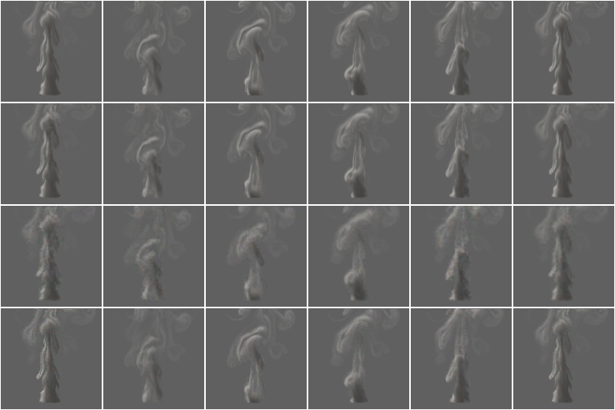
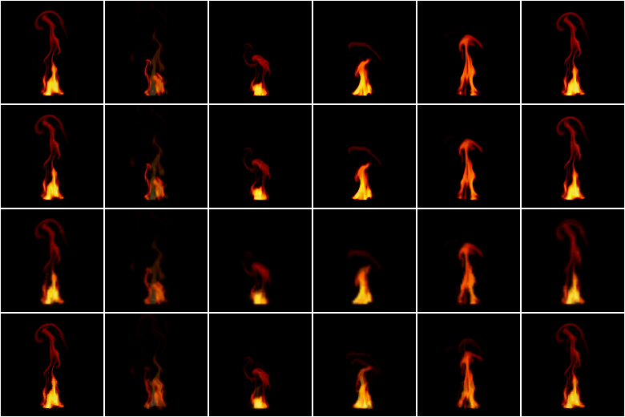
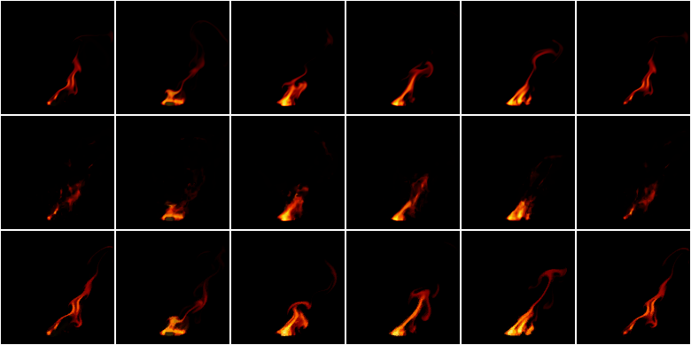
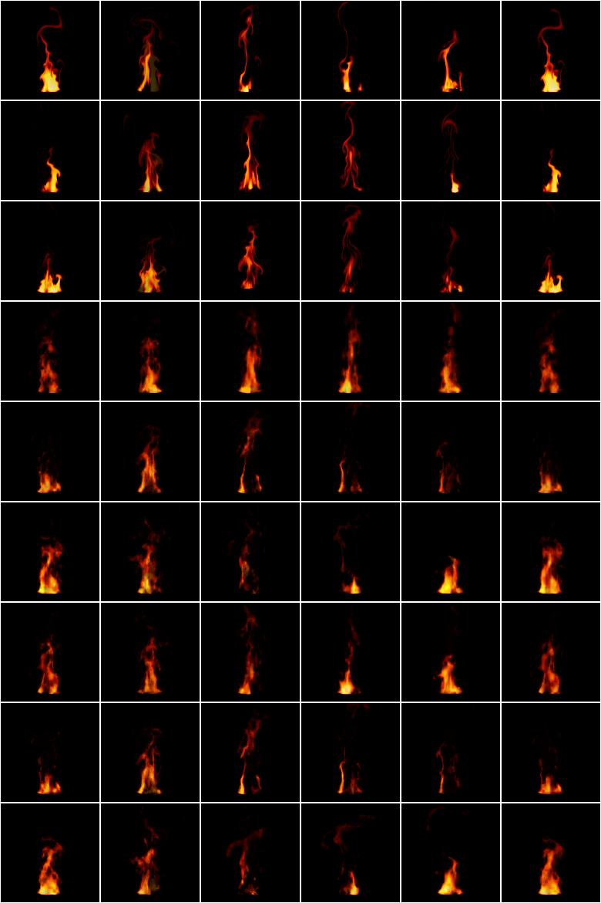
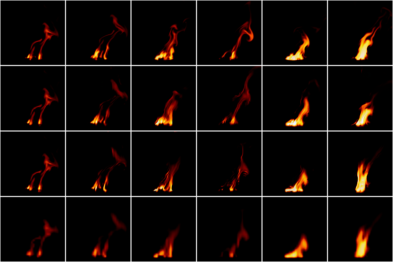
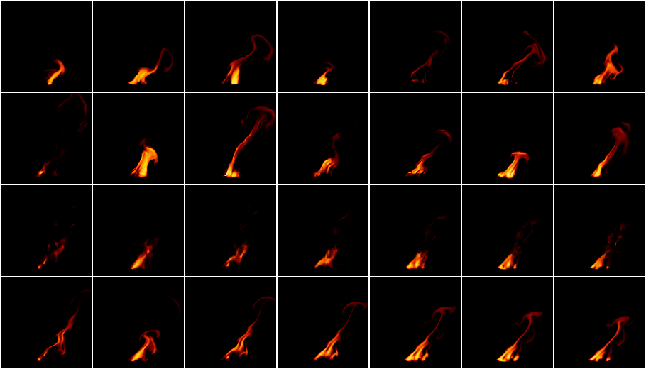
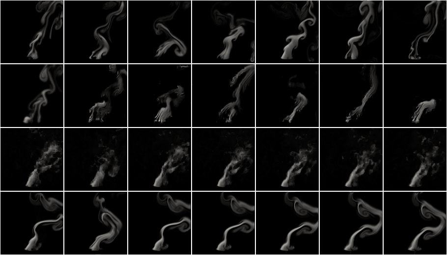
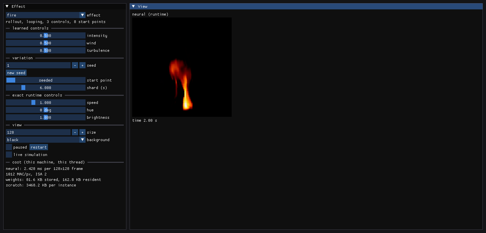

# Neural visual effects on one CPU core: report

Status: **canonical** for results (9 October 2026; flipbooks in production formats, BC7 and ASTC, added 11 October
2026, and every memory ratio given against them). Audience: new, research, dev. Generated tables with every number
and interval: [results/experiments/SUMMARY.md](../results/experiments/SUMMARY.md) (rerun `nvfx_experiment report`).
Plan and decisions: [PLAN.md](PLAN.md).

## 1. Bottom line

- **Study D (§6) is the main result: store start points, learn the dynamics, let noise drive them.** The effects are
  chaotic. A new noise seed makes a run unrecognisable within a second, while a tiny error in the start point stays
  invisible for seconds. So a *rollout effect* stores 8 to 16 simulation states and a small network that steps a
  32 x 32 state forward one frame at a time, driven by the simulation's own forcing noise. A detail layer carries
  full-resolution heat and soot along the learned flow. Trained on 55 minutes of simulation, nearly six times what
  studies A to C used together.
- **Endless, controllable, never repeating, in 82 to 274 KB per effect.** At held-out settings with new seeds:
  - Its detail statistically ties a 45 MB library of flipbooks and study B's 1 MB control model on fire and
    explosions, and beats the control model on smoke (spectrum distance −0.27 [−0.33, −0.19]).
  - Its average picture is the closest of the generated methods on fire.
  - Played in 6 s shards from the start points, it holds steady for a minute. One continuous rollout drifts within
    40 s.
- **The learned dynamics follow a held-out run better than the simulation at the same resolution**: +2.1 to +4.7 dB
  of active PSNR after 1 s (intervals above zero), until the chaos makes every method equal.
- **The price is CPU: 0.8 to 0.9 ms per 128 x 128 frame (0.4 to 0.5 ms at 64 px) and 2.4 MB of working memory per
  playing instance**, after the runtime's rollout code was optimised (2.0 to 2.4 ms before, measured in the same
  session; §7). The memory was 4.0 MB until the instance's two shards shared their step buffers (§7). That suits a
  handful of hero effects, not crowds of sprites. It is not at the real floor yet: two real seeds are 0.07 to 0.12
  closer in detail, and the first frames of an explosion are poorly drawn (§6.4).
- **Compression works, but far less once the flipbooks use production block compression.** On 12 effect clips, with
  flipbooks in BC7 and ASTC from open-source encoders (fetched at build time, §3), the memory ratios fall:
  - **Against BC7** (what desktop GPUs sample, and what NVIDIA's claim is measured against) the 8-bit networks need
    **2.4 to 4.3 times less memory** at equal mean active PSNR: the 132 KB grid model equals a 568 KB BC7 flipbook
    (4.3x [3.9, 4.8]). At equal memory they beat BC7 flipbooks by +2.4 to +6.3 dB at every budget from 128 to 512 KB
    (every 95% interval above zero).
  - **Against every format, with ASTC** (mobile GPUs), only **1.0 to 1.9 times less**: the grid model equals a 251 KB
    ASTC flipbook (1.9x [1.8, 2.8]). ASTC 8x8 to 12x12 keeps every frame at full size in 121 to 256 KB. At equal
    memory the networks win at 160 and 320 KB (+2.9 and +2.7 dB) and tie at 128, 256 and 512 KB.
  - First published, against our own BC3-layout encoder: 3.6 to 5.9 times, +2.8 to +7.0 dB. The BC3 format, not our
    encoder, was the weak baseline: at 8 bits per pixel BC7 and ASTC 4x4 score 7 to 9 dB higher.
  - NVIDIA claims "up to 8x" for Neural Texture Compression against block compression. Here the 8-bit networks reach
    about half that against BC7, and less than 2x against ASTC; sparse low-bit networks reach it against BC7 only
    (next bullets).
- **It depends on the effect.** At 132 KB the network beats an ASTC flipbook of the same memory by about 4.5 dB on fire
  and explosions and ties it on smoke (§3).
- **Fewer bits and sparse features: 13.8x against BC7, 4.7x against every format, about 2x once flipbooks drop their
  empty space.** Features trained for 4 bits (three times the steps) need 7.5x [4.2, 8.3] less memory than an
  equal-quality BC7 flipbook and 2.5x [1.9, 3.7] less than the best flipbook of any format (§3, study F2). Storing only
  the grid points a clip needs (study F3: 36 KB instead of 67.5 KB, same quality) lifts this to **13.8x [7.9, 16.6]
  against BC7 and 4.7x [3.3, 7.7] against every format**. Flipbooks can drop their empty space too: trimmed to their
  content, 8.8x [5.1, 11.3] and 3.1x [2.4, 4.4]; keeping only their non-empty blocks, 5.6x [3.4, 7.3] and **2.2x
  [1.6, 2.8]**. Against our BC3 layout, as first reported: 9.1x (F2), and 16.8x, 10.7x and 6.7x (F3).
- **On disk, video codecs win, and packed ASTC flipbooks beat the 8-bit networks.** With both sides packed by a
  lossless coder, 8-bit networks need more disk than the best packed flipbook of any format (0.75x [0.65, 0.89]); 4-bit
  features with a rate term and 6,000 training steps need 2.2x [1.8, 2.9] less (5.1x against BC7, 4.4x against our
  BC3 layout). AV1 needs 2.6 times less disk than that network. In memory the networks win against video: about
  115 KB against 2.6 to 23 MB for a running decoder (§3, studies F, F2 and F3).
- **Controls work, at a fidelity cost.** One 1 MB model per effect plays control settings it never saw better than a
  45 MB library of flipbooks: **+2.49 [+2.22, +2.77] dB** against the nearest setting, **+0.99 [+0.65, +1.36] dB**
  against blending the two nearest, with higher SSIM and matching motion. By eye its held-out flames are softer and
  dimmer than the simulation; every method scores low there because turbulence is chaotic (§4).
- **Endless variation works, as morphs of what it saw.** Looping effects drift between learned variation codes and
  never repeat. Generated variations are about as diverse as real seeds but softer, and they are blends of the
  training seeds rather than new turbulence (§5).
- **Studies A to C cost 0.25 to 0.87 ms per 128 x 128 sprite on one AVX2 core** (0.07 to 0.33 ms at 64 x 64 for the
  grid models). A scene of 24 effects (8 near, 16 far, each at 30 Hz) costs 1.7 to 6.3 ms of one core per 60 fps
  frame. The networks are 8 to 37 times cheaper than running the simulation and 35 to 125 times more expensive than playing a flipbook. The small
  grid model (73 KB, 0.25 ms) and the small conv model (69 KB, 0.43 ms) meet the 0.5 ms target set in the plan (§7).
  These are from a later session of the same cloud VM type, in which unchanged code ran 1.2 to 1.4 times faster than
  in the first; the first session's figures were 0.38 to 1.1 ms, with only the small grid model under 0.5 ms.
- **int8 (since 11 October 2026; timings re-run on a quiet machine).** The grid models now run their hidden
  layers in 8-bit integers, with the first layer evaluated per grid point and interpolated, by default. grid_m,
  grid_mt and the B and C models take 0.42 to 0.47 ms per 128 x 128 frame (grid_l 0.50 to 0.51 ms), with AVX-512 VNNI
  or with AVX2 alone, against 0.74 to 0.79 ms for the float network measured alongside. Study A's 12 clips lose
  **−0.008 [−0.015, −0.001] dB** of active PSNR with VNNI and −0.018 [−0.031, −0.008] dB with AVX2, both within the
  −0.05 dB set for a default (§7).
- **The plan's continuation rule is met** (PLAN.md §7: beat the flipbook of equal memory on held-out data, interval above
  zero, within 1 ms per 128² frame): on held-out settings (study B, against a 45 times larger flipbook library) and on
  held-out frames against a BC3 flipbook with four times the memory (study A; motion-vector flipbooks still win
  there). Against BC7 or ASTC flipbooks of the same 512 KB the held-out frames are a tie, at 3.9 times the network's
  memory, just short of the rule's four times; study B carries the rule. Every study A model is within 1 ms in the
  later session (grid_m 0.78 ms); in the first, grid_m was 6% over.
- **Later studies (§12):** the owner's diffusion-context mixer survives in one use, a prior against drift that lets
  fire play one continuous run; its fine-detail mixer fails twice. Computing on compressed data is slower than dense
  code here, but LZ tokens and lighter models make the coder decode 4 to 38 times faster. Training with couplings
  improves the explosion inside scenes. The composed fireball runs at 80 frames per second at 720p on 4 threads.
- **Not done:** owner footage (none supplied), rate-optimised block encoding for disk, engine plugins other than
  Godot's (§9, §10; the Godot 4 plugin and a C API for scenes: [ENGINES.md](ENGINES.md) §7, §8).

## 2. How it was measured

**Data.** Every clip comes from the project's fluid simulation (`src/sim`): 128 x 128 pixels, 64 frames at 30 fps,
premultiplied RGBA. Fire and smoke loop (warmed up to a steady state, then crossfaded into a seamless loop);
explosions play once. Three learned controls in [0, 1]: intensity, wind, turbulence; a seed sets the source noise
and the turbulence field. 273 clips in all, regenerated deterministically by `nvfx_experiment data`. Study D
records its own longer runs (§6.3).

**Four questions, four studies.**

| study | question | training | test (never seen in training) |
|---|---|---|---|
| A. compression | does a network store an effect in less memory than a flipbook at the same quality? | one model per clip (12 clips: 4 per effect, different controls and seeds) | the clip itself, as for any compression; plus a held-out variant: only even frames available, odd frames scored |
| B. controls | can one model play settings it never saw? | one model per effect on a 3 x 5 x 3 grid of settings (45 clips, seed 1) | 10 settings per effect, off the grid in every control |
| C. variation | can it produce new, realistic variations? | one model per effect on 24 seeds (fixed controls), each with a learned code | 8 held-out seeds, compared as distributions |
| D. dynamics | can stored start points plus learned dynamics play an effect endlessly, at new settings and seeds? | one model per effect on 160 runs of 8 s (explosions: 240 of 3 s), random settings and seeds | B's 10 held-out settings per effect with new seeds, judged by frame statistics; 8 held-out runs per effect tracked from their true start points |

**Models.** Grid family (feature volumes over x, y and t; bilinear sampling; an MLP with FiLM) and conv family (a
latent volume and three upsampling convolutions), described in [PLAN.md](PLAN.md) §5.1 and `include/neuralfx/model.hpp`.
Study A trains a ladder of sizes; B and C use grid models with 8 to 24 blended feature volumes. Training: Adam with
cosine decay, 2,000 steps (A) or 12,000 steps (B, C) of 8 frames, 4 threads, from random initialisation. Every model
is scored **through the shipping runtime** at its stored precision (8-bit or fp16 features).

**Baselines.**
- A: flipbooks of the same clip at matched memory. The original ladder, 31 configurations: 4 to 64 kept frames, 32 to
  128 px, raw RGBA8 (32 bits per pixel) or BC3-layout compression (8 bits per pixel; our own BC1 + BC4 encoder), with
  or without motion vectors (block-matched flow at a quarter resolution, 8 bits per component). Since 11 October 2026
  the same frame counts and resolutions also in production block formats, from open-source encoders fetched at build
  time ([DATA.md](DATA.md) §5): **BC7** (bc7e, 8 bits per pixel) and **ASTC** at 4x4, 5x5, 6x6, 8x8, 10x10 and 12x12
  blocks (Arm's astc-encoder, 8 to 0.89 bits per pixel), 147 more configurations. Playback blends neighbouring kept
  frames with bilinear filtering, as a game does. Ratios are given against three baselines: our BC3 layout and raw
  (as first published), with BC7 (desktop GPUs), and with BC7 and ASTC (every format; mobile GPUs sample ASTC).
- B: a library of 45 BC3 flipbooks (one per training setting, 45 MB per effect) played at the nearest setting, or
  blended from the two nearest; and the oracle "closest training clip".
- C: the natural spread between real seeds (a generator should match it, not beat it) and the training clips
  themselves (a flipbook library replays them).
- The simulation itself, at its cost per frame.
- D: the simulation on the same 32-cell grid, with and without the same detail layer (the traditional cheap
  alternative); B's control model and nearest flipbook; a second real run with another seed (the floor).

**Metrics.** PSNR over all pixels and over *active* pixels (visible in either clip: empty background cannot
flatter a method); SSIM (Gaussian 11, sigma 1.5, four channels); temporal PSNR of frame-to-frame differences; a
flicker ratio (second temporal difference energy against the reference); a sharpness statistic (mean absolute
difference of the radially averaged log luminance spectrum: blur raises it); a motion ratio (frame-to-frame change
against the reference). Study D adds coverage and emission distances (mean alpha and added light per frame) and
the PSNR of the time-averaged frame (mean-frame PSNR: is the effect in the right place, at the right size and colour). Differences between methods are paired over clips with 95% bootstrap intervals (10,000
resamples) in square brackets; an interval covering zero is a tie.

**Machine.** One cloud VM: Intel Xeon at 2.8 GHz, 4 vCPUs, AVX2, FMA and AVX-512 (VNNI); 32 KB L1 and 1 MB L2 per
core; GCC 14.2 at `-O3`. Timings are medians over 200 frames on one pinned core with nothing else running
(`nvfx_experiment timing`); the VM adds noise, so 90th percentiles are reported too.

## 3. A. Compression: one effect clip, less memory than a flipbook

Means over 12 clips (4 fire, 4 smoke, 4 explosions). Neural models at 8-bit feature storage (fp16 storage scores the
same within 0.05 dB at twice the memory); ms per 128 x 128 frame on one AVX2 core (quiet machine).

**Three flipbook baselines.** This section first compared the networks with flipbooks in our own BC3-layout encoder
(BC1 + BC4) and raw RGBA8. Production block formats were added on 11 October 2026, at the same frame counts and
resolutions (§2): BC7 (bc7e, 8 bits per pixel) and ASTC 4x4 to 12x12 (Arm's astc-encoder, 8 to 0.89 bits per pixel),
from open-source encoders fetched at build time. Every ratio below is given against three envelopes: **our BC3 layout
and raw** (as first published), **with BC7** (the formats desktop GPUs sample, and what NVIDIA's claim is measured
against), and **with BC7 and ASTC** (every format; mobile GPUs sample ASTC). **The ratios fall, a lot against ASTC.**
Our BC3 encoder was not the problem: a production BC3 encoder (rgbcx, tried on frames of three clips outside the
committed study) is only 0.2 to 0.7 dB better per frame. The format is: with every frame at 128 px, BC7 scores 41.23 dB
and ASTC 4x4 43.22 dB of active PSNR at the same 1 MB where BC3 scores 34.48 dB, and ASTC's larger blocks keep every
frame at full size in 256 KB (8x8, 33.54 dB) or 121 KB (12x12, 29.37 dB).

| method | KB | PSNR | active PSNR | SSIM | temporal PSNR | spectrum | motion | ms |
|---|---:|---:|---:|---:|---:|---:|---:|---:|
| neural conv_s (latent 16², 16-8-8) | 69 | 36.02 | 29.43 | 0.9668 | 36.33 | 0.266 | 0.93 | 0.57 |
| neural grid_s (G24 C8, H16 L1) | 73 | 34.32 | 28.07 | 0.9627 | 34.97 | 0.171 | 0.95 | 0.38 |
| neural grid_m (G32 C8, H32 L2) | 132 | 39.10 | 32.62 | 0.9873 | 39.83 | 0.096 | 0.98 | 1.06 |
| neural conv_m (latent 16², 32-16-8) | 142 | 37.96 | 31.31 | 0.9737 | 37.73 | 0.193 | 0.95 | 0.76 |
| neural grid_mt (G32, 32 time slices) | 260 | 40.26 | 33.76 | 0.9897 | 41.22 | 0.089 | 1.01 | 1.09 |
| neural grid_l (G48 C8, H32 L2) | 292 | 42.73 | 36.23 | 0.9930 | 41.42 | 0.039 | 0.98 | 1.09 |
| flipbook BC3 16 frames 64 px + motion vectors | 72 | 32.71 | 26.69 | 0.9618 | 34.50 | 0.574 | 0.83 | 0.007 |
| flipbook BC3 32 frames 64 px | 128 | 32.38 | 26.39 | 0.9593 | 33.46 | 0.647 | 0.81 | 0.007 |
| flipbook BC3 64 frames 64 px | 256 | 33.63 | 27.59 | 0.9671 | 35.60 | 0.602 | 0.89 | 0.007 |
| flipbook BC3 16 frames 128 px + motion vectors | 288 | 35.61 | 29.25 | 0.9811 | 35.20 | 0.123 | 0.93 | 0.007 |
| flipbook BC3 32 frames 128 px | 512 | 36.36 | 29.92 | 0.9838 | 34.50 | 0.103 | 0.94 | 0.007 |
| flipbook BC3 64 frames 128 px (every frame) | 1024 | 41.02 | 34.48 | 0.9924 | 39.39 | 0.102 | 1.03 | 0.007 |
| flipbook BC7 16 frames 64 px + motion vectors | 72 | 33.15 | 27.08 | 0.9655 | 34.84 | 0.602 | 0.82 | 0.007 |
| flipbook ASTC 12x12 64 frames 128 px | 121 | 35.77 | 29.37 | 0.9768 | 34.86 | 0.103 | 1.11 | 0.007 |
| flipbook ASTC 8x8 32 frames 128 px | 128 | 36.10 | 29.69 | 0.9820 | 34.40 | 0.085 | 0.94 | 0.007 |
| flipbook ASTC 10x10 64 frames 128 px | 169 | 37.47 | 31.01 | 0.9838 | 36.32 | 0.086 | 1.09 | 0.007 |
| flipbook ASTC 8x8 64 frames 128 px | 256 | 40.04 | 33.54 | 0.9903 | 38.61 | 0.064 | 1.06 | 0.007 |
| flipbook ASTC 6x6 64 frames 128 px | 484 | 43.50 | 36.95 | 0.9953 | 41.82 | 0.041 | 1.03 | 0.007 |
| flipbook BC7 32 frames 128 px | 512 | 37.59 | 31.11 | 0.9880 | 34.89 | 0.053 | 0.93 | 0.007 |
| flipbook BC7 64 frames 128 px (every frame) | 1024 | 47.81 | 41.23 | 0.9981 | 45.85 | 0.024 | 1.02 | 0.007 |

The production rows are a selection; the 147 production configurations are in `SUMMARY.md` and `a_scores.csv`.

**Matched memory.** The best neural configuration against the best flipbook configuration within each budget,
paired over the 12 clips (active PSNR, then SSIM). Against our BC3 layout and raw, as first published:

| budget | neural | flipbook | active PSNR difference | SSIM difference |
|---|---|---|---:|---:|
| 128 KB | conv_s, 69 KB | BC3 16f 64 px + MV, 72 KB | +2.75 [+2.28, +3.29] | +0.0040 [-0.0010, +0.0090] (tie) |
| 160 KB | grid_m, 132 KB | BC3 16f 64 px + MV, 72 KB | +5.93 [+4.99, +7.01] | +0.0255 [+0.0202, +0.0307] |
| 256 KB | grid_mt, 260 KB | BC3 64f 64 px, 256 KB | +6.16 [+4.82, +7.50] | +0.0226 [+0.0182, +0.0271] |
| 320 KB | grid_l, 292 KB | BC3 16f 128 px + MV, 288 KB | +6.98 [+5.70, +8.22] | +0.0119 [+0.0083, +0.0158] |
| 512 KB | grid_l, 292 KB | BC3 32f 128 px, 512 KB | +6.30 [+4.87, +7.70] | +0.0092 [+0.0065, +0.0123] |

With BC7 and with ASTC (the same networks; the best flipbook of each envelope within the budget):

| budget | flipbook with BC7 | active PSNR difference | SSIM difference | flipbook with BC7 and ASTC | active PSNR difference | SSIM difference |
|---|---|---:|---:|---|---:|---:|
| 128 KB | BC7 16f 64 px + MV, 72 KB | +2.37 [+1.90, +2.91] | +0.0003 [-0.0052, +0.0058] (tie) | ASTC 8x8 32f 128 px, 128 KB | -0.24 [-1.38, +1.01] (tie) | -0.0163 [-0.0211, -0.0115] |
| 160 KB | BC7 16f 64 px + MV, 72 KB | +5.54 [+4.72, +6.52] | +0.0218 [+0.0167, +0.0269] | ASTC 8x8 32f 128 px, 128 KB | +2.93 [+1.51, +4.42] | +0.0053 [+0.0015, +0.0090] |
| 256 KB | BC7 64f 64 px, 256 KB | +5.55 [+4.35, +6.75] | +0.0177 [+0.0134, +0.0223] | ASTC 8x8 64f 128 px, 256 KB | +0.22 [-1.62, +2.17] (tie) | -0.0006 [-0.0033, +0.0018] (tie) |
| 320 KB | BC7 16f 128 px + MV, 288 KB | +6.32 [+5.03, +7.61] | +0.0087 [+0.0054, +0.0123] | ASTC 8x8 64f 128 px, 256 KB | +2.69 [+1.38, +4.15] | +0.0026 [+0.0013, +0.0040] |
| 512 KB | BC7 32f 128 px, 512 KB | +5.12 [+3.65, +6.64] | +0.0049 [+0.0026, +0.0075] | ASTC 6x6 64f 128 px, 484 KB | -0.73 [-2.28, +0.93] (tie) | -0.0023 [-0.0039, -0.0007] |

Against BC7 the networks still win at every budget, by 2.4 to 6.3 dB. Against ASTC they win at 160 and 320 KB
(where grid_m and grid_l sit just above an ASTC 8x8 flipbook's size) and tie at 128, 256 and 512 KB, with SSIM
slightly worse at 128 and 512 KB: there an ASTC flipbook of every frame (or of every other frame) at full size is as
good as the network.

**Memory at equal quality** (flipbook memory for the same mean active PSNR along the best-flipbook envelope, one
point per size, log-linear between sizes; 95% bootstrap intervals over clips, 10,000 resamples, network and flipbooks
resampled together):

| network (8-bit) | KB | active PSNR | our BC3 layout and raw | with BC7 | with BC7 and ASTC |
|---|---:|---:|---|---|---|
| conv_s | 69 | 29.45 | 341 KB, 4.9x [4.0, 8.3] | 279 KB, 4.0x [3.9, 6.7] | 123 KB, 1.8x [1.2, 2.3] |
| grid_s | 73 | 28.07 | 265 KB, 3.6x [3.4, 3.9] | 239 KB, 3.3x [2.7, 3.6] | 74 KB, 1.0x [0.8, 1.4] |
| grid_m | 132 | 32.62 | 772 KB, 5.9x [4.6, 7.8] | 568 KB, 4.3x [3.9, 4.8] | 251 KB, 1.9x [1.8, 2.8] |
| conv_m | 142 | 31.33 | 634 KB, 4.5x [3.8, 5.2] | 520 KB, 3.7x [2.2, 4.0] | 244 KB, 1.7x [1.1, 1.8] |
| grid_mt | 260 | 33.76 | 917 KB, 3.5x [2.7, 3.9] | 614 KB, 2.4x [2.1, 2.6] | 346 KB, 1.3x [0.9, 1.6] |
| grid_l | 292 | 36.23 | > 1024 KB, > 3.5x | 727 KB, 2.5x [2.3, 2.8] | 448 KB, 1.5x [1.3, 2.0] |

- **Against BC7 the 8-bit networks need 2.4 to 4.3 times less memory** (first published: 3.6 to 5.9 times against
  our BC3 layout). The BC7 envelope is the old one lifted by 0.1 to 1.2 dB up to 512 KB and by 6.8 dB at 1 MB.
- **Against every format, 1.0 to 1.9 times.** ASTC at 8x8 to 12x12 keeps every frame at full size in 121 to 256 KB,
  and a network near 30 to 33 dB is compared with such a flipbook rather than with a 512 KB to 1 MB one. grid_s
  (73 KB) ties an ASTC flipbook of its own size; fp16 networks tie or lose (0.5 to 1.0x).
- An earlier version of this report gave conv_s 7.4x: the envelope kept two flipbooks of the same size (512 KB, 26.94
  and 29.92 dB) as two points, so any quality between them interpolated to 512 KB. The envelope has one point per size
  (`nvfx_experiment report`).
- On disk, with both sides packed by the lossless coder, the ratios are smaller still (below and
  `results/compression/README.md`).

**By effect** (grid_m, 132 KB, active PSNR): against the 1 MB BC3 flipbook of every frame, fire 31.47 against 30.44,
smoke 31.86 against 36.48, explosion 34.53 against 36.51: the network beats the full BC3 flipbook on fire at an eighth
of the memory, not on smoke or explosions. Against the best production flipbook within its memory (ASTC 8x8, 32 frames
at 128 px, 128 KB): fire 31.47 against 27.21, smoke 31.86 against 31.90, explosion 34.53 against 29.95. The network
wins by about 4.5 dB on fire and explosions and ties on smoke. The 1 MB BC7 flipbook of every frame scores 38.5 to
43.1 dB, far above every network here.

**Held-out frames.** Given only the even frames, scored on the odd ones (active PSNR): grid_m (132 KB) 29.53; BC3 even
frames (512 KB) 27.99, 1.54 [0.29, 2.93] dB below the network; BC7 even frames (512 KB) 28.51 and ASTC 4x4 (512 KB)
28.58, ties (-1.02 [-2.39, +0.22] and -0.95 [-2.33, +0.29] dB); raw RGBA8 even frames (2 MB) 28.66, a tie. With motion
vectors (576 KB) the flipbooks are **3.92 [2.40, 5.22] dB (BC3), 5.37 [4.09, 6.48] dB (BC7) and 5.54 [4.28, 6.66] dB
(ASTC 4x4) above the network**. A trained network interpolates time better than blending BC3 frames and as well as
blending BC7, ASTC or raw frames; motion-vector flipbooks interpolate better.

**Flicker and motion.** The networks are temporally smooth: flicker ratios 0.6-1.0 (1 = as much frame-to-frame jitter
as the reference) and motion ratios 0.93-1.01. Low-frame-count flipbooks lose motion (ratios 0.6-0.9) because frame
blending averages it away. Flipbooks of every frame flicker a little more than the reference (BC3 1.23, ASTC 8x8 to
12x12 1.15 to 1.36: block errors change from frame to frame), which active PSNR does not count against them.

**On disk, with both sides packed (study F).** A lossless context-mixing coder (`nvfx_pack`, PAQ/lpaq style, with
numeric predictors that know the tensors' shapes) was written and applied to the networks and to the flipbooks alike;
the details are in `results/compression/README.md`.
- The networks shrink by 1.2 to 1.7 times (frame models; zlib -9 1.07 to 1.23) and the rollout effects of study D by
  1.8 to 4.9 times (to 45 to 56 KB each).
- Flipbooks shrink far more: 2.9 to 6.9 times in BC3 layout, 6.9 to 12.9 times as raw RGBA, and 1.6 to 4.9 times in
  BC7 and ASTC (3.5 to 4.9 times with every frame at 128 px). A flipbook is mostly empty, smooth and repeated in time;
  a trained network's 8-bit features are close to noise.
- So at equal quality, packed against packed, the 8-bit networks need **1.4 times less disk at best** against our BC3
  layout (grid_m, conv_s), tie at grid_s (1.0x), and need more for conv_m (0.9x) and grid_mt (0.8x); fp16 networks
  lose (0.4 to 0.8x). With BC7 the best is 1.5x (grid_m; a real BC7 point replaces part of the line the old envelope
  interpolated). **With ASTC every 8-bit network needs more disk than an equal-quality packed flipbook** (0.4 to 0.9x).
  Coding erodes the networks' advantage rather than extending it.
- Memory at run time does not change: the runtime unpacks at load. Decoding runs at 0.32 to 0.44 MB/s on one core
  (0.4 s for a 132 KB model).
- To gain from coding, the networks would have to be trained for it (a rate term in the loss).

**Pushed further (study F2).** The features were trained for fewer bits (quantisation-aware training; the runtime keeps
them bit-packed) and, for disk, with a rate term in the loss. Same 12 clips, same scoring; every choice was made on 6
separate validation clips. Details in `results/compression/README.md`, study F2.
- **Memory:** grid_m at 4 bits holds 30.65 dB in 67.5 KB (8 bits: 32.63 dB in 131.5 KB). Against our BC3 layout, as
  first published, it needs **8.5x [4.4, 10.4]** less memory than the best flipbook of equal quality, and with three
  times the training steps (+0.44 dB [0.36, 0.54]) **9.1x [6.3, 11.3]**; 6 bits give 7.4x, 5 bits 8.0x. **Against
  BC7: 6.1x [4.2, 8.1] and 7.5x [4.2, 8.3]** (5 bits 6.4x, 6 bits 5.6x, 8 bits 4.3x). **Against every format, with
  ASTC: 2.4x [1.8, 3.7] and 3.6x [2.3, 3.7]** (5 bits 2.9x, 6 bits 2.5x, 8 bits 1.9x; with study F3's Pareto envelope,
  below, 2.3x and 2.5x, and 1.7x at 8 bits). 10x is far away. Each bit below
  8 costs more than the one before (2.0 dB from 8 to 4 bits), while ASTC flipbooks of every frame at 0.9 to 2 bits per
  pixel reach 29.4 to 33.5 dB in 121 to 256 KB, about twice the low-bit networks' size. On validation the best memory
  ratio against every format is 5 bits (2.9x), not 4 (2.2x). Smaller grids, fewer time slices, trimmed quantiser
  ranges and learned codebooks (vector quantisation) did not beat 4-bit features.
- **Disk:** the rate term removes 18% of the packed bytes for 0.12 dB. Packed against packed flipbooks, the networks
  need **4.1x [2.6, 4.5]** less disk against our BC3 layout (1.4x at 8 bits), 4.5x [2.5, 5.8] with BC7, and **2.2x
  [1.7, 3.2] with ASTC** (8 bits: 0.86x [0.75, 1.27], a tie).
- **Video codecs win on disk by far.** AV1 (libaom, 4:4:4) reaches the same 30.5 dB in 8.0 KB, 2.8 times less than the
  best network (22.3 KB); HEVC, VP9 and H.264 also need less, VP9 with alpha ties. 4:2:0 video caps fire at 29 dB.
- **Networks win in memory against video:** 71 KB resident plus 44 KB working memory (180 KB with the int8 path's
  projected grid, the default since §7's int8 round), against 2.6 to 23 MB for a
  running decoder (inside ffmpeg) or 4 MB of decoded frames, and any frame can be drawn without decoding from a
  keyframe.
- **Rollout effects (G3c):** 6-bit start states keep study D's test statistics on fire (one better, four tied) and
  explosions (all tied) and halve them on disk (packed 44.5 to 20.6 KB and 55.7 to 25.4 KB). Smoke is worse by a hair
  on coverage (+0.0001 [+0.0000, +0.0002]), so it keeps fp16. Dithering with the seed's noise and halving the number
  of start points failed on validation.

**Sparse features, and flipbooks without their empty space (study F3).** Effects are mostly empty space: on the 12
test clips only 47% of a time slice's grid points are sampled by any visible pixel. Study F3 stores only those (a
2 KB mask, one fill value per plane): the 4-bit network keeps its quality (-0.03 dB [-0.12, +0.10]) in 36.3 KB instead
of 67.5 KB, at no cost per frame. Flipbooks can drop their empty space too, so F3 added two flipbook baselines: every
kept frame trimmed to the bounding box of its content (as sprite atlases are packed in production), and only the
non-empty blocks kept, with a one-bit mask per block (ASTC at its own block size). Each is measured with every set of
formats. F3's envelopes keep only the flipbooks that beat every smaller one ("Pareto"; with the old ladder this changes
no point estimate). Memory at equal quality, the 12 test clips, 95% bootstrap intervals:

| test | as stored: BC3 layout | with BC7 | with BC7 and ASTC | trimmed: BC3 layout | with BC7 | with BC7 and ASTC | block-sparse: BC3 layout | with BC7 | with BC7 and ASTC |
|---|---|---|---|---|---|---|---|---|---|
| G32 8-bit (study A's grid_m), 131.5 KB | 5.9x [4.6, 7.8] | 4.3x [3.9, 4.8] | 1.7x [1.3, 2.3] | 3.7x [3.0, 4.8] | 3.4x [2.3, 4.5] | 1.1x [0.9, 1.4] | 2.3x [1.9, 2.8] | 2.1x [1.6, 2.8] | 0.76x [0.65, 0.91] |
| G32 4-bit, 6,000 steps, 67.5 KB | 9.1x [6.2, 11.2] | 7.5x [4.2, 8.3] | 2.5x [1.9, 3.7] | 5.8x [3.9, 7.2] | 4.8x [2.7, 6.3] | 1.7x [1.3, 2.3] | 3.6x [2.5, 4.4] | 3.0x [1.8, 4.0] | 1.2x [0.9, 1.4] |
| **G32 4-bit sparse, 6,000 steps, 36.3 KB** | 16.8x [11.2, 22.7] | 13.8x [7.9, 16.6] | **4.7x [3.3, 7.7]** | 10.7x [7.3, 14.3] | 8.8x [5.1, 11.3] | **3.1x [2.4, 4.4]** | 6.7x [4.7, 8.1] | 5.6x [3.4, 7.3] | **2.2x [1.6, 2.8]** |
| G32 4-bit sparse, 12,000 steps, 36.3 KB | 17.1x [12.3, 23.4] | 14.2x [8.1, 16.7] | 4.8x [3.4, 7.7] | 10.9x [8.1, 14.7] | 9.1x [5.3, 11.7] | 3.2x [2.4, 4.5] | 6.8x [5.1, 8.3] | 5.7x [3.4, 7.5] | 2.2x [1.7, 2.9] |

- **Against BC7 the sparse network passes 10x as stored (13.8x) and nearly when the flipbooks are trimmed (8.8x,
  interval 5.1 to 11.3), not when they keep only their non-empty blocks (5.6x).** F3 first reported 16.8x, 10.7x and
  6.7x against our BC3 layout.
- **Against every format the best ratios are 4.7x, 3.1x and 2.2x.** The dense networks fall to 1.1 to 1.7x against
  trimmed flipbooks, and against block-sparse ones they tie (4 bits, 1.2x [0.9, 1.4]) or lose (8 bits, 0.76x
  [0.65, 0.91]).
- **The steadier number**, the quality difference at the network's own size against every format: sparse, 6,000
  steps, +4.52 dB [+3.77, +5.58] against flipbooks as stored, +3.78 [+2.98, +4.75] trimmed, +2.65 [+1.50, +4.04]
  block-sparse (+8.26 as stored against our BC3 layout).
- **Disk:** sparse features save memory, not disk. The best on disk is 4-bit with the rate term and 6,000 steps, 22.6 KB
  at 31.14 dB: 2.2x [1.8, 2.9] less disk than packed flipbooks of every format (5.1x against BC7, 4.4x against our BC3
  layout); AV1 needs 2.6 times less (0.39x [0.35, 0.43]). Packed, the 8-bit networks lose (0.75x [0.65, 0.89]).
- Pareto envelopes lower some ratios against every format, because ASTC's steps leave dominated flipbooks behind:
  dense 4-bit with 6,000 steps 2.5x instead of 3.6x with F2's envelope, the 8-bit network 1.7x instead of 1.9x (memory)
  and 0.75x instead of 0.86x (disk). The tables of F2 and study A above keep F2's envelope; both are in
  `results/compression`.





## 4. B. Controls: settings the model never saw

One 1 MB model per effect (grid, 8 feature volumes blended by the controls) against a library of 45 BC3 flipbooks
(45 MB per effect), on 10 held-out settings per effect (30 in all):

| method | MB per effect | active PSNR | PSNR | SSIM | spectrum | motion | ms |
|---|---:|---:|---:|---:|---:|---:|---:|
| neural grid, 8 volumes (k8) | 1.0 | 17.12 | 23.37 | 0.7750 | 0.218 | 0.99 | 1.07 |
| neural grid, 16 volumes, H48 (k16) | 2.0 | 17.28 | 23.42 | 0.7759 | 0.239 | 0.99 | 1.75 |
| library: nearest training setting | 45 | 14.64 | 20.73 | 0.7687 | 0.184 | 1.14 | 0.007 |
| library: blend of the two nearest | 45 | 16.13 | 21.81 | 0.7531 | 0.220 | 1.05 | ~0.014 (two lookups) |
| oracle: the closest training clip | (180) | 15.09 | - | - | - | - | - |

Paired over the 30 held-out settings (active PSNR): k8 minus nearest **+2.49 [+2.22, +2.77]**, k8 minus blend
**+0.99 [+0.65, +1.36]**, k8 minus oracle +2.03 [+1.72, +2.37]; k16 adds 0.15 dB at twice the memory and 1.6 times the
cost. By effect (k8 against the blend): fire 19.16 against 18.23, smoke 17.06 against 16.96 (close to a tie),
explosion 15.15 against 13.21.

Read these numbers with care:
- **Every method scores low** (active PSNR 15-17 dB): at a new setting the turbulence is chaotic, so no method can
  place the fine detail pixel by pixel.
- **Pixel scores reward averaging.** The network's lead comes partly from predicting a safer, softer flame. Its
  sharpness statistic equals the blend's and its motion is right (0.99), but by eye its held-out flames are dimmer and
  more broken up than the simulation's, while the nearest flipbook is crisp but the wrong shape (figure below).
- **Capacity limits the fit.** On its own training settings the 1 MB model reaches 23.7-26.5 dB active PSNR, well
  below the 31-33 dB of a 132 KB model trained on one clip (study A): one small model for 45 settings trades detail
  for control.



## 5. C. Variation: new seeds

Models with 8-dimensional variation codes on 24 training seeds per effect; 8 generated seeds against 8 held-out
simulated seeds (k8: 1 MB; k24: 3 MB; a library of the 24 training flipbooks would be 24 MB):

| effect | real seeds: spectrum spread | generated vs held-out: spectrum | motion | diversity: active PSNR between two generated (real pairs) | generated vs nearest training (held-out real vs nearest training) | training seed replayed |
|---|---:|---:|---:|---:|---:|---:|
| fire | 0.13 | 0.33 | 0.86 | 13.7 (12.9) | 20.5 (14.1) | 24.9 |
| smoke | 0.13 | 0.42 | 0.85 | 15.3 (13.7) | 21.1 (14.9) | 26.1 |
| explosion | 0.07 | 0.21 | 0.94 | 15.8 (13.9) | 24.1 (15.3) | 29.8 |

(k8 shown. k24 is within 0.05 of k8 on the spectrum and motion statistics and within 0.4 dB on the PSNR-based ones, and up to 0.6 dB better at replaying training seeds, at three times the memory.)

- **Diversity is close to real**: two generated variations differ from each other almost as much as two real seeds.
- **They are softer than real**: 2.5 to 3.2 times the real spectrum spread, and 6-15% less motion.
- **They are morphs of the training seeds, not new ones**: each generated variation is far closer to some training
  seed (20-24 dB) than a fresh real seed is (14-15 dB). That is what blending two training codes produces. For a game
  this means a looping effect that never repeats exactly (the runtime drifts between codes), drawn from what it was
  trained on.



## 6. D. Start points and learned dynamics

Studies A to C trained a network to reproduce every frame of a chaotic run. Where turbulence can't be predicted,
squared error settles on the average, so held-out settings and new variations came out soft. The owner's direction
(PLAN.md §11) was to stop fighting that. Store only start points and learn the dynamics. Let noise drive them, and
judge the frames in between by whether they look right, not by whether they match a given run. Code:
`include/neuralfx/rollout.hpp` (the model), `src/train/rollout_train.cpp` (training) and `src/runtime/rt_rollout.hpp`
(the runtime). Every number below is in [SUMMARY.md](../results/experiments/SUMMARY.md) with its interval.

### 6.1 How chaotic the effects are

`nvfx_experiment d-chaos` runs the simulation itself from one stored state, four runs per effect. The table gives
active PSNR against the undisturbed run, by time after the start point (means over runs; nudges are relative to the
velocity RMS):

| effect | case | 1 frame | 0.5 s | 1 s | 2 s | 8 s |
|---|---|---:|---:|---:|---:|---:|
| fire | start nudged by 1e-3, same seed | 73.9 | 66.7 | 61.9 | 56.7 | 34.8 |
| fire | start nudged by 1e-1, same seed | 50.2 | 40.2 | 33.4 | 27.2 | 26.1 |
| fire | same start, other seed | 22.8 | 13.6 | 12.8 | 12.4 | 12.9 |
| fire | other start, same seed | 15.2 | 17.1 | 19.1 | 19.8 | 22.1 |
| smoke | start nudged by 1e-3, same seed | 71.4 | 64.9 | 61.6 | 52.9 | 31.7 |
| smoke | same start, other seed | 25.1 | 18.5 | 15.0 | 13.3 | 12.9 |
| smoke | other start, same seed | 12.5 | 13.2 | 13.6 | 14.7 | 17.2 |
| explosion | start nudged by 1e-3, same seed | 72.2 | 67.9 | 64.7 | 60.4 | - |
| explosion | same start, other seed | 54.2 | 20.9 | 16.1 | 13.8 | - |

Three facts follow:
- **A tiny error in the start point stays invisible for seconds**: fire is still at 62 dB after 1 s and 35 dB after
  8 s from a 1e-3 nudge.
- **The noise seed takes over within a second**: the same start point with another seed is down to 13 dB, the level
  of two unrelated runs.
- **The noise pulls runs together**: a different start point with the same seed gets closer to the run over 8 s
  (fire: 15 to 22 dB).

So the start point decides the first second, and after that the forcing noise decides what is seen. A model should
take that noise as an input instead of memorising its effect, and a stored effect needs start points, not frames.

### 6.2 The model

A **rollout effect** is a few stored states plus a small network that moves the effect forward one frame at a time:

- **The coarse state**: a 32 x 32 grid with velocity, heat and soot, plus 4 memory channels the network may use
  (bounded by tanh).
- **The stepper**, each frame:
  1. Advect the state (semi-Lagrangian).
  2. Two 3 x 3 convolutions (24 channels) see the state, two noise channels, the position, the controls through FiLM
     and the age for one-shots. The noise channels are the curl potential and the source flicker: the same functions
     that force the simulation, with the same seed. The convolutions supply the change to every channel and a source
     of divergence: forces, sources, decay and the sub-grid closure.
  3. Project onto a divergence-free field with 60 Jacobi iterations, warm-started from the last frame.
  4. Clamp the physical channels to the training range.
- **The detail layer**, at the output resolution, carries fine heat and soot with the learned flow (MacCormack
  advection, plus a small sub-grid swirl). Stretching by the flow makes filaments that no network had to draw. The
  block averages are locked to the coarse state: existing structure is scaled up (by at most `grow`) where it can be,
  so peaks stay peaks, and the rest is added as new material, broken up by the flicker noise.
- **The renderer** is a per-pixel MLP (12 inputs: fine and coarse heat and soot, and soot summed along 8 directions
  for self-shadowing; 16 and 16 hidden units). It is gated so that empty pixels are exactly transparent.
- **Start points**: 8 coarse states (16 for explosions), spread over the control space by farthest-point sampling.
  Smoke and explosions also keep 64 x 64 fine fields at 8 bits; fire grows its own in a 1 s warm-up.

Stored size: **fire 82 KB, smoke 146 KB, explosion 274 KB** (weights plus start points).

### 6.3 Training

Training is CPU-only, from random initialisation, with hand-written gradients checked against finite differences
(`tests/test_rollout.cpp`). There are four parts:

1. **Backpropagation through time**: windows of up to 16 frames from true states, with noise on the inputs so that
   the stepper learns to recover from its own errors.
2. **Fine-tuning from its own rollout**: windows start after up to 48 frames of the stepper's own rollout. A second
   loss compares where the heat and soot are (row and column profiles), which still means something after the chaos
   horizon.
3. **Activity**: also matches how much the state changes from frame to frame. Without this stage the heat changed
   about 60% as much as in the simulation, because squared error settles on a smooth average in time as well as in
   space. With it, coarse heat activity is 0.80 to 0.82 of real.
4. **Renderer, detail constants and start points.** The detail constants are calibrated as the effect is used:
   endless runs from the start points with new seeds, scored by frame statistics against real runs.

| effect | training data (runs x frames) | simulated | parts 1-2 | part 3 | renderer (training samples) | contrast, swirl, grow |
|---|---|---:|---:|---:|---:|---|
| fire | 160 x 240 (8 s each) | 21.3 min | 42 min | 18 min | 55.0 dB | 1, 0.5, 1.5 |
| smoke | 160 x 240 (8 s each) | 21.3 min | 53 min | 18 min | 34.7 dB | 1, 0.5, 4 |
| explosion | 240 x 90 (3 s each) | 12.0 min | 55 min | 20 min | 34.7 dB | 0.5, 0.5, 1 |

Each training run has random controls in [0, 1]³ and its own seed. Training times are on 4 cores. **55 minutes of
simulation in all**, against 9.7 minutes of clips across studies A to C (273 clips of 2.1 s; study B trained each
effect on 45 clips, 96 s).

### 6.4 Tracking a run from its true start point

These are held-out runs (other seeds and settings), each started from its true state with its own noise seed. The
comparison is the traditional cheap alternative at the same resolution: **the simulation on the same 32-cell grid,
with the same detail layer**, drawn by the simulation's own renderer (`coarse_sim_detail`). Active PSNR, mean over 8
runs per effect:

| effect | method | 1 frame | 8 frames | 1 s | 2 s | 8 s |
|---|---|---:|---:|---:|---:|---:|
| fire | neural | 25.5 | 20.2 | 17.5 | 16.4 | 14.8 |
| fire | coarse simulation + detail | 23.0 | 17.3 | 15.4 | 14.7 | 14.8 |
| fire | holding the first frame | 21.1 | 13.8 | 12.5 | 12.5 | 11.5 |
| smoke | neural | 26.8 | 20.8 | 17.1 | 15.2 | 12.6 |
| smoke | coarse simulation + detail | 26.8 | 18.2 | 15.0 | 14.5 | 14.0 |
| explosion | neural | 20.4 | 20.2 | 18.8 | 18.0 | - |
| explosion | neural dynamics, simulation's renderer | 26.1 | 22.1 | 18.8 | 18.2 | - |
| explosion | coarse simulation + detail | 26.6 | 16.4 | 14.1 | 15.5 | - |

The neural minus coarse-simulation differences, paired over runs:

| effect | 1 frame | 8 frames | 1 s | 2 s | 8 s |
|---|---|---|---|---|---|
| fire | +2.48 [+0.92, +4.04] | +2.83 [+2.23, +3.37] | +2.14 [+1.68, +2.64] | +1.70 [+1.18, +2.19] | +0.08 (tie) |
| smoke | +0.03 (tie) | +2.56 [+2.05, +3.08] | +2.09 [+1.65, +2.52] | +0.68 [+0.28, +1.10] | **−1.41 [−1.69, −1.08]** |
| explosion | **−6.21 [−7.35, −5.08]** | +3.78 [+2.49, +5.09] | +4.72 [+3.78, +5.67] | +2.54 [+1.81, +3.33] | - |

What this shows:
- **The learned dynamics follow a run better than the simulation at the same resolution**: 2 to 5 dB ahead at 8
  frames and at 1 s, and still 0.7 to 2.5 dB ahead at 2 s. They have learned what the 32-cell grid loses from the full-resolution solver.
- **After that, chaos wins, as it must.** By 8 s fire is a tie. On smoke the coarse simulation keeps the plume closer
  to where it was (−1.4 dB): the learned stepper wanders.
- **The explosion's first frames are a renderer problem, not a dynamics problem.** Drawn by the simulation's renderer,
  the same neural dynamics tie at frame 1 and lead by 5.7 dB at frame 8. The learned renderer reaches only 21 dB on
  the true fields of a fresh explosion (34 dB a second later): the first frames of the fireball are rare in its
  training samples.
- No method gets near the simulation's own nudged-start curve (fire: 33 dB after 1 s from a 10% nudge). The 32-cell
  state cannot hold the fine turbulence, so the pixels can't follow the run for long. Beyond about a second, only the
  statistics in §6.5 are meaningful.



### 6.5 Endless runs at settings never seen

This uses the ten held-out settings of study B, with a seed never used in training, for 10 s per run (explosions:
their 3 s). Each method's frame statistics are compared with a real run at that setting. `real other seed` is a second
real run with another seed: the floor, since two real runs differ by that much. Detail spectrum distance / motion
ratio (1 is right) / mean-frame PSNR (how close the average picture is):

| method | memory per effect | fire | smoke | explosion |
|---|---:|---|---|---|
| real, other seed (floor) | - | 0.080 / 1.06 / 36.4 | 0.076 / 1.04 / 29.8 | 0.116 / 1.07 / 26.8 |
| **neural rollout** | **82-274 KB** | 0.195 / 0.89 / **33.8** | **0.143** / 0.87 / **28.2** | 0.200 / 1.03 / 24.7 |
| B: control model k8 | 1 MB | 0.250 / 0.83 / 31.7 | 0.409 / 1.02 / 27.5 | 0.203 / 1.03 / 25.8 |
| B: nearest training flipbook | 45 MB library | 0.158 / 1.13 / 30.3 | 0.136 / 1.09 / 24.9 | 0.141 / 0.97 / 23.2 |
| coarse simulation + detail | - | 0.229 / 0.94 / 31.7 | 0.268 / 0.84 / 28.1 | 0.261 / 0.82 / 26.0 |
| coarse simulation | - | 0.907 / 0.59 / 31.8 | 1.078 / 0.45 / 27.6 | 0.782 / 0.74 / 26.3 |

Spectrum distance, neural minus each other method, paired over the 10 settings:

| effect | k8 | nearest flipbook | coarse simulation + detail | real, other seed |
|---|---|---|---|---|
| fire | −0.055 (tie) | +0.038 (tie) | −0.034 (tie) | +0.115 [+0.050, +0.179] |
| smoke | **−0.266 [−0.326, −0.192]** | +0.008 (tie) | **−0.125 [−0.171, −0.080]** | +0.067 [+0.036, +0.099] |
| explosion | −0.004 (tie) | +0.059 (tie) | −0.061 (tie) | +0.083 [+0.014, +0.168] |

- **No generated method is significantly better than the neural rollout on detail**, and it beats two of them on
  smoke. The nearest flipbook ties it on detail but is 1.5 to 3.5 dB further away in the average picture (it shows the
  wrong setting), and it needs a 45 MB library against 82-274 KB.
- **Its average picture is the closest of the generated methods on fire** (33.8 dB against at most 31.8) and level
  with the best on smoke (28.2 against 28.1). On explosions it is 1.1 to 1.6 dB behind all but the flipbook: its
  fireballs spread too far (coverage distance 0.052 against 0.020 between real seeds).
- **It is not yet at the floor.** Two real seeds are still 0.07 to 0.12 closer in detail, and the neural motion is
  10-13% low on fire and smoke.
- **Without the detail layer, a coarse simulation is far too smooth** (spectrum distance 0.8 to 1.1, motion 0.45 to
  0.74). The detail layer is what makes cheap dynamics look like fire. Under the same detail layer, the learned
  stepper ties the coarse simulation on fire and explosions and beats it on smoke.





### 6.6 One minute without a restart

One continuous rollout drifts. In the first evaluation, without shards, fire froze after 40 s (detail spectrum
distance 2.9, motion 0.04) and smoke filled the frame after 50 s (coverage distance 0.40, mean-frame PSNR 10.8).

The runtime therefore plays **shards**, the owner's proposal. Every 6 s a new rollout starts from a start point chosen
by the seed, the shard number and the nearest controls, with a seed of its own. It is rolled ahead of its turn and
crossfades in over half a second. Drift never builds up past one shard, every frame is a function of the time and the
controls, and a new seed gives a run that never repeats.

The test is a 60 s neural run, cut into 10 s windows, each scored against a real 10 s run at the same held-out setting
(two settings per effect). If the effect drifted, the later windows would score worse:

| effect | playback | spectrum distance | motion ratio | mean-frame PSNR |
|---|---|---|---|---|
| fire | shards of 6 s | 0.10-0.27 | 0.66-1.15 | 34.6-39.1 |
| fire | one rollout | 0.20-2.96 | 0.03-1.08 | 27.2-39.2 |
| smoke | shards of 6 s | 0.08-0.17 | 0.75-1.16 | 27.2-31.9 |
| smoke | one rollout | 0.10-1.31 | 0.16-2.55 | 10.8-31.3 |

With shards, the last window is as good as the first.



### 6.7 Memory and cost

Median ms per frame through `nvfx_render` on one pinned AVX2 core (90th percentiles in SUMMARY.md), after the
runtime's rollout code was optimised; in brackets the code before that, built and measured in the same session:

| effect | stored | resident | per instance at 128 px | 64 px | 128 px | 256 px | restart (seek) |
|---|---:|---:|---:|---:|---:|---:|---:|
| fire | 82 KB | 163 KB | 2.4 MB (4.0; 3.4) | 0.47 (0.98) | 0.91 (2.40) | 2.37 (7.08) | 14 ms (42), 1 s warm-up |
| smoke | 146 KB | 419 KB | 2.4 MB (4.0; 3.4) | 0.48 (0.91) | 0.85 (2.13) | 2.35 (6.71) | 0.4 ms (0.7) |
| explosion | 274 KB | 804 KB | 2.4 MB (4.0; 3.4) | 0.44 (0.87) | 0.78 (1.96) | 1.76 (5.50) | 0.4 ms (0.7) |

Per instance: 2.4 MB since the instance's two runners share one set of step buffers (11 October 2026); 4.0 MB when
each had its own, 3.4 MB before the optimisation. The frames are the same to the bit.

The optimisation (separable interpolation, cheaper flicker noise, vectorised advection, a row pipeline with small
rings, a vectorised coarse step and renderer) changes no output: the runtime's parity tests still give a worst
difference of 0. Six repeated runs at 128 px ranged over 0.89 to 1.07 ms (fire), 0.83 to 0.85 (smoke) and 0.78 to
1.18 (explosion). The first session's figures for the code before the optimisation were 1.2 to 1.3, 2.6 to 4.1 and
7.5 to 9.8 ms: that session's machine was slower (the unchanged scalar simulation took 1.6 to 4.2 ms there, 1.3 to 3.4 ms here).

For scale: the 32-cell simulation with its own renderer, without the detail layer, costs 1.3 to 3.4 ms per frame in
our scalar code. Study A's grid_m costs 0.78 ms and the full simulation 6.9 to 9.4 ms (same session).

- **It is small**: 4 to 12 times smaller than one 1 MB flipbook of 64 frames or study B's 1 MB control model, and
  170 to 560 times smaller than study B's 45 MB flipbook library. And it is endless, controllable and never
  repeats.
- **It is no longer expensive per frame**: 0.8 to 0.9 ms at 128 px is about study A's grid_m (0.78 ms) and 110 to 130
  times a flipbook. Part goes to the coarse step, which costs the same at every size; the rest is the detail layer and
  the renderer, which scale with pixels, so 64 px costs about half of 128 px rather than a quarter.
- **Each instance needs 2.4 MB of working memory** at 128 px (1.5 MB at 64 px): two shards' fine fields and states, and
  one set of step buffers that they share. With a set each it was 4.0 and 2.3 MB; before the optimisation, 3.4 and
  2.0 MB.
- **Seeks are cheap**: a restart costs about 0.4 ms where start points keep fine fields. Fire, which grows its fine
  fields from a coarse start, takes 14 ms.
- **No allocation per frame**, including restarts and shard changes (`tests/alloc_test.cpp`).

### 6.8 What it means

Using the chaos instead of fighting it works where studies A to C did not:

- **Endless, never-repeating play at settings never seen**, with detail that statistically ties a 45 MB flipbook
  library and the 1 MB control model, or beats the model (smoke). The average picture is closer than any other
  generated method's on fire and smoke. All of this in **82 to 274 KB per effect**, the size of a single small
  flipbook.
- **The learned dynamics beat the simulation at the same resolution** at following a real run for 1 to 2 s, by
  2 to 5 dB.
- **The price is per-frame CPU** (0.8 to 0.9 ms at 128 px after the runtime's optimisation) **and 2.4 MB per playing
  instance.** This suits a handful of hero effects at 64 to 128 px, updated at 30 Hz, not dozens of sprites.

What did not work, or is not done:
- The explosion's first frames, drawn by the learned renderer (§6.4).
- Smoke after a few seconds of tracking, where the stepper wanders more than a coarse simulation.
- A gap of 0.07 to 0.12 in detail to the real floor, with motion 10-13% low on fire and smoke.
- A crossfade every 6 s. It is smooth, but it is a blend of two runs.

### 6.9 Study D2: statistics without the trade

Status: **design and rule fixed** (11 October 2026), committed before any validation or test number. Results follow
in this section when they exist.

**The question.** v2's rollout effects (§12) are 0.07 to 0.12 further from a real run in detail than a second real run,
and fire and smoke move 10-13% too little (§6.5). Every earlier attempt to improve one statistic cost motion: DCM-fine
halved the detail spectrum distance but smoke's motion fell to 0.72 (DCM §6), the renderer mixer and the solver blends
calmed the effects (DCM §10), and study I's coupled fine-tuning lowered fire's motion from 0.88 to 0.83 (COMPOSE §10).
The detail constants themselves were set by a grid search over three of them, on four training settings with one
run each. Can the detail layer, tuned against the statistics themselves, improve detail *and* motion, with nothing
else worse?

**What changes.** Only the detail layer (§6.2). The stepper, the renderer and the start points stay v2's, so the coarse
dynamics are the same to the bit and only the fine fields, and the picture drawn from them, differ. Nine constants are
searched:
- the seven the file already has: `contrast`, the edges of the contrast curve (`edge0`, `edge1`; `kappa` follows them
  as in `calibrate_detail`), the swirl's speed, length and rate (`swirl`, `swirl_scale`, `swirl_rate`) and `grow`;
- two new ones (`DetailSpec`; file version 4, written only when either differs from its default, so older files keep
  their layout): `advect`, the fine fields move with this multiple of the coarse flow (a constant folded into another,
  free per pixel); `soften`, each frame before the advection the fine fields move this fraction of the way to the mean
  of their four neighbours (the simulation's fine-scale diffusion, which the detail layer lacks; one pass over the two
  fine fields). In the reference (`src/core/rollout.cpp`) and the runtime (`src/runtime/rt_rollout.hpp`), with parity
  tests on every ISA (`RolloutRuntime.MatchesTheReferenceWithStudyD2sConstants`).
- Two more were built and dropped before the search, on training settings only: the speed and the size of the
  breakup noise of new material, as multiples of the source flicker's. Changing either by 5% put fire's mean frame
  0.4 to 1.9 dB further from the real one and raised its spectrum distance by 0.03 to 0.12: the breakup is the very
  flicker field that drives the stepper's sources, and new material only lands where the stepper made it while the two
  stay one field.

Why these: on training settings (below), v2 fire's detail spectrum has too much power at the finest scales (radial
bins 33 to 64 of 64: +0.13 to +0.18 in log10 power) and too little at 8 to 14 pixels (bins 9 to 16: -0.10; smoke -0.20,
explosions -0.22). Every constant that raised motion on its own (more swirl, `grow`, `advect`) did it
with more fine-scale power, so its spectrum distance rose; `soften` and lower `contrast` cut the fine-scale power and
the motion with it. Longer, faster swirls (`swirl_scale`, `swirl_rate`) improved both a little on fire and smoke. The
trade is in the constants one at a time; the question is whether some combination escapes it. (These probes, one
constant at a time on the training settings, are in the data root's `d2/logs`.)

**Pooled statistics.** Study D's protocol (§6.5) scores one 10 s real run against one 10 s play per setting. Between
two real seeds a run's motion varies by about ±25% (`d_stats.csv`), which buries a bias of 10%. Here each setting has R
real runs and R plays, and its statistics are those of the R runs pooled: coverage and emission curves, log spectrum,
mean frame and motion averaged over the runs, then distances as `metrics::distance`. With R = 1 it is study D's
protocol, which is reported beside (as `one` in the CSVs).

**The training objective.** 12 settings: the controls of the effect's salt-1 training runs 0 to 11; per setting 3 real
runs (seeds 4,100,000 + 100 s + k; 5 s of warm-up, then 10 s; explosions from their first frame, 89 frames) and 3
plays of the runtime from the start points, as shipped (seeds 4,200,000 + 100 s + k; explosions 89 frames). With r_s
and r_m the means over settings of the detail spectrum distance and of |ln motion ratio| as fractions of v2's,
J = (r_s + r_m) / 2 + max(r_s, r_m), so neither can be bought with the other (J = 2 at v2); plus 20 times the relative
excess of the coverage and emission distances over v2's and 4 times the mean-frame PSNR lost in dB, so the picture
cannot be traded for either.

**The search.** CMA-ES (Hansen's (mu / mu_w, lambda) form; lambda = 10 for nine constants, 9 for seven) on the
constants mapped to [0, 1] (logarithmic for the speeds, lengths and `grow`), from v2's values, step 0.1, a fixed seed;
the same seeds at every evaluation, so the objective is deterministic. Two searches per effect: **all nine**
(130 evaluations) and **the seven old ones** only (80 evaluations), so that a candidate needing no new file version
exists. Code: `tools/nvfx_d2.cpp` (`nvfx_d2 probe | tune | candidates | val | test | write | cost`); every evaluation is
logged in the data root's `d2/cand`. (Two first fire searches, with the breakup's speed and size among the constants
and steps 0.2 and 0.1, were stopped after one generation each: no sample beat v2, and every one lost 0.6 to 4 dB of
mean-frame PSNR, which led to dropping those two constants (above). Their 31 evaluations are kept in the data root and
not used.)

**Candidates.** Per search: the evaluation with the lowest J; and the lowest J among those no worse than v2 on any of
the five statistics on the training settings, when that is another. Up to four per effect.

**Validation (the choice).** Study G's 10 validation settings (DCM §4), R = 8: real runs 4,300,000 + 100 s + k, the
floor (other real runs) 4,300,050 + 100 s + k, plays 4,400,000 + 100 s + k (s the setting, k the run). Each candidate
is judged against v2 by the rule below (without the cost part); among those that meet it, the lowest mean of
spectrum distance + |ln motion ratio| is chosen. If none meets it, the effect stops at validation and is not tested.

**The rule (fixed now; the test runs once).** Study B's 10 held-out settings (study D's test settings), R = 8, fresh
seeds: real runs **4,700,000 + 100 s + k**, the floor 4,700,050 + 100 s + k, plays **4,800,000 + 100 s + k** (s = 0 to
9, k = 0 to 7). The chosen constants replace v2's for an effect if, chosen minus v2, paired over the 10 settings, 95%
bootstrap (10,000 resamples):
1. the detail spectrum distance is lower, interval entirely below zero;
2. |ln motion ratio| is lower, interval entirely below zero;
3. coverage distance, emission distance and mean-frame PSNR are not worse: no interval entirely on the worse side;
4. the frame costs at most 0.2 ms more at 128 x 128: thread CPU time through `nvfx_render`, the median over 200 frames
   (explosions 88) at controls (0.6, 0.5, 0.6), the median of the paired difference over 7 interleaved repetitions.

Effects are decided one by one; ties are ties; a null is reported with its numbers. What passes is written as v3
candidate files under the data root's `d2/models` (v2's files with the new constants; v2's own files are not touched)
and the fireball is rendered with them beside v2's.

## 7. Runtime cost and budget

Median ms per frame through `nvfx_render`, one pinned AVX2 core (90th percentiles and every configuration in
[SUMMARY.md](../results/experiments/SUMMARY.md)). Every row was measured in one session (10 October 2026), the rollout
effects (D) after the runtime's rollout code was optimised; the first session's figures are in brackets.

| model | KB | 64 px | 128 px | 256 px | MAC/px |
|---|---:|---:|---:|---:|---:|
| grid_s | 73 | 0.07 | **0.25** (0.38) | 1.00 | 209 |
| grid_m | 132 | 0.33 | 0.78 (1.06) | 3.15 | 1,425 |
| grid_l | 292 | 0.28 | 0.87 (1.09) | 3.04 | 1,426 |
| conv_s | 69 | 0.42 | **0.43** (0.57) | - | 504 |
| control model k8 (B) | 1,031 | 0.21 | 0.79 (1.07) | 3.08 | 1,432 |
| variation model k8 (C) | 1,033 | 0.24 | 0.80 (1.15) | 3.08 | 1,432 |
| rollout fire (D) | 82 | 0.47 | 0.91 (3.25) | 2.37 | 1,012 |
| rollout smoke (D) | 146 | 0.48 | 0.85 (4.10) | 2.35 | 1,012 |
| rollout explosion (D) | 274 | 0.44 | 0.78 (2.63) | 1.76 | 1,012 |
| simulation on the 32-cell grid (solver + render, scalar) | - | - | 1.3-3.4 (1.6-4.2) | - | - |
| fluid simulation (solver + render) | - | - | 6.9-9.4 (8.8-11.7) | - | - |
| flipbook playback | 128-1,024 | - | 0.007 | - | - |

- **Checked again later** on a quiet machine, after the runtime gained empty-span skipping and cache-aligned buffers
  (§12): the rollout effects took 0.8 to 1.2 ms (smoke varied from 0.86 to 1.17 ms between three runs), the frame
  models and the simulation within a few percent; the table stands (`results/quiet/`).
- **Between sessions of the same cloud VM type, unchanged code ran 1.2 to 1.4 times faster** (median 1.28 over the 95
  frame-model cells; the scalar simulation 1.17 to 1.27). Absolute times here are good to that factor; comparisons
  within one session are not affected. The rollout effects' change is mostly the optimisation: built from the code
  before it and measured in the same session, they took 2.0 to 2.4 ms at 128 px (§6.7), 2.5 to 2.6 times longer.
- Cost depends on the network, not on the memory: grid_l stores twice grid_m's features at the same cost; the 1 MB
  control and variation models cost the same as grid_m.
- **The 0.5 ms budget is met by grid_s (0.25 ms) and conv_s (0.43 ms).** In the first session only grid_s met it
  (conv_s 0.57 ms). grid_m takes 0.78 ms (0.33 ms at 64 px). conv_s costs about the same at every size: its level of
  detail renders the native frame and filters it down, so distant copies save nothing. With int8 (below, now the
  default) grid_m, grid_mt and the B and C models meet it too (0.42 to 0.47 ms, quiet machine), grid_l nearly (0.50 to
  0.51 ms).
- AVX-512 is slower than AVX2 on this machine for the float network (grid_m 1.41 against 0.78 ms; 0.92 ms since a
  broadcast in the shared kernels compiles to one instruction, 0.98 ms on the quiet machine, below); the baseline SSE2 build is 1.8 to
  2.7 times slower. The default is AVX2, and the AVX-512 build for int8 where the CPU has VNNI.
- The networks are 8 to 37 times cheaper per frame than running the simulation, and 35 to 125 times more expensive
  than playing a flipbook.
- **Rollout effects (D) cost 0.8 to 0.9 ms at 128 px**, about the same as the frame-model networks of the same width,
  and each playing instance holds 2.4 MB of state and buffers (1.5 MB at 64 px; 4.0 and 2.3 MB before its two shards
  shared their step buffers, 11 October 2026: the same frames, and no measurable change in time). MAC per pixel counts
  the convolutions of the coarse step spread over the pixels and the renderer, not the projection, advection or noise.
  A seek costs about 0.4 ms (fire: 14 ms, its start points grow their fine fields). The detail layer still runs at full
  resolution every frame.

**int8 hidden layers and a projected first layer** (11 October 2026). Timings: thread CPU time on one pinned core of a
quiet machine (re-run after the study, which measured on a shared machine; the two agree within a few percent), the
least of five runs' medians over 180 frames
(`results/experiments/int8_timing.csv`); the main tables above are float. Quality: `int8_quality.csv` and
`int8_summary.csv`. The code is `src/runtime/rt_int8.hpp`.
- **The hidden layers** (32 to 32 units in grid_m) multiply 8-bit activations by 8-bit weights and add in 32-bit
  integers. Weights have one scale per unit, activations one per pixel (its largest unit maps to 255; they follow a
  ReLU). With AVX-512 VNNI one instruction does 64 multiply-adds. With AVX2 alone, `pmaddubsw` adds pairs of products
  in 16 bits, so the activations get 7 bits (0 to 127) to keep a pair from saturating; this was 10% faster than exact
  pairs of 16-bit products (`pmaddwd`, which the SSE2 build and AVX-512 without VNNI use) for 0.01 dB. The first and
  output layers stay in float; the last hidden layer feeds the output layer directly.
- **The first layer is projected.** It is linear in the features, which reach a pixel by bilinear interpolation, so it
  is evaluated at the grid points once per frame (FiLM folded in) and its 32 outputs are interpolated instead of the 8
  features: 256 multiply-adds per pixel fewer, for 24 more interpolations done with a vector permute. Used where the
  frame has at least as many pixels across as the grid has points, on AVX2 and AVX-512.
- **It is the default for the grid family** (`nvfx_instance_set_precision`; `NVFX_PRECISION_FLOAT` gives the float
  network, unchanged). The conv family and rollout effects stay float. With no ISA forced, int8 instances of models with
  a hidden layer take the AVX-512 build where the CPU has VNNI. The studies' tables stay those of the float network
  (`nvfx_experiment` scores at float; its `int8` step measures the difference).

ms per frame, and the change in active PSNR, int8 minus float (paired over the clips, 95% intervals):

| model, 128 px | float, AVX2 | int8, AVX2 | int8, AVX-512 VNNI | change, VNNI | change, AVX2 |
|---|---:|---:|---:|---|---|
| grid_s (no hidden layer: the projection alone) | 0.252 | **0.089** | 0.127 | 0.000 (3 clips) | 0.000 |
| grid_m | 0.757 | **0.465** | **0.450** | **−0.008 [−0.015, −0.001]** (A, 12 clips) | −0.018 [−0.031, −0.008] |
| grid_l | 0.773 | 0.511 | 0.504 | −0.017 [−0.034, −0.004] (3 clips) | −0.036 [−0.069, −0.013] |
| grid_mt | 0.787 | **0.460** | **0.417** | −0.005 [−0.007, −0.002] (3 clips) | −0.015 [−0.019, −0.010] |
| control model k8 (B) | 0.743 | **0.469** | **0.455** | −0.004 [−0.013, +0.005] (30 held-out settings) | −0.004 [−0.013, +0.005] |
| variation model k8 (C) | 0.746 | **0.468** | **0.453** | −0.027 [−0.033, −0.022] (72 training seeds) | −0.031 [−0.037, −0.025] |

- **Quality.** The rule, set before measuring: int8 becomes the default if study A's mean change in active PSNR is
  within −0.05 dB with an interval not entirely below that. grid_m on the 12 clips: 32.619 to 32.611 dB with VNNI,
  **−0.008 [−0.015, −0.001]**, and 32.602 dB with AVX2, −0.018 [−0.031, −0.008]: met either way. B's control models
  tie (k16: +0.005 [−0.007, +0.014]); C's variation models lose 0.03 dB with intervals below zero (k24: −0.028
  [−0.034, −0.022] with VNNI). No channel of study A's frames moves by more than 6 levels of 255 with VNNI and 10 with
  AVX2 (0.05 and 0.06 on average); on B and C up to 16 and 20 (0.11 to 0.16 on average). The int8 frames of the ISAs
  differ by up to 9 levels on A and 22 on B and C, mostly AVX2's 7-bit activations against VNNI's 8 bits.
- **One scale per pixel is what makes 8 bits enough.** In a scalar simulation on the same 12 clips (outside the
  repository), one activation scale for the whole clip lost 0.46 dB (at 7 bits); per pixel, 7-bit activations lost
  0.018 dB and 8-bit 0.008 dB, and 7-bit weights 0.03 dB; quantising the output layer too cost 0.02 dB more.
- **Cost.** The better models meet 0.5 ms except grid_l (0.51 ms: with its 48 x 48 grid the rows blended per frame
  row are half as long again and the projection costs twice as much). The integer layer is still the largest part,
  about half of the time.
  At 64 px the gain is smaller (grid_m 0.20 to 0.13 ms; grid_l 0.19 to 0.18: the projection's work per frame weighs
  more), at 256 px larger (grid_m 3.01 to 1.63 ms). The baseline SSE2 build takes 1.44 ms against 2.06 ms in float. An
  int8 instance holds the projected grid: 0.18 MB for grid_m and 0.38 MB for grid_l, against 0.04 and 0.08 MB in
  float.
- **AVX-512 float, found on the way:** the shared kernels' broadcast of a weight (`splat`) filled a 512-bit vector
  through the stack (four 128-bit stores, then a load: a store-forwarding stall per tile of outputs). It now compiles to
  one broadcast: the AVX-512 build's float grid_m went from 1.41 to 0.92 ms, with the same values. AVX2 is still faster.
- To re-time on a quiet machine: `build/nvfx_experiment int8-timing --runs 5 --core 3` (two minutes; float and int8
  per ISA at 64, 128 and 256 px), and `build/nvfx_experiment int8` for the quality (eight minutes on one core).

**A scene** (`nvfx_scene`): 8 instances at 128 px and 16 at 64 px, each updated at 30 Hz, staggered over a 60 fps
game, on one core, in the later session: grid_s 1.7 ms per game frame on average (10% of 16.7 ms; 99th percentile
6.1 ms), grid_m 5.3 ms (32%; p99 17.7 ms, from VM preemption spikes), conv_s 6.3 ms (38%). The first session measured
2.6, 7.2 and 9.0 ms. The rollout effects, with every copy playing its own run, cost 4.7 to 10.1 ms (28 to 60%); their
99th percentiles are 24 to 39 ms because all copies change shards in the same frame, which a game would stagger.
Sharing instances between copies with the same controls and seed lowers this further; the game's other CPU work has
to fit around it. These are the float network's figures (`nvfx_scene --float` since int8 became the default); at int8
grid_m's scene took 4.0 to 4.2 ms per game frame against 5.0 to 6.6 ms in float, in two interleaved runs on the busy
machine (wall-clock time; not re-run on the quiet machine).

## 8. Against NVIDIA's published claims and traditional methods

| | NVIDIA (published) | NeuralVFX (measured here) |
|---|---|---|
| what | small networks in shaders (RTX Neural Shaders; Neural Texture Compression; Neural Materials) on GPU tensor cores; DLSS 5, a full-frame model | a small network per effect on one CPU core: frame models (A to C) or learned dynamics from start points (D) |
| memory | NTC: "up to 8x" less texture memory than block compression (BC formats) "at similar visual fidelity" | against BC7 flipbooks at equal mean active PSNR: 2.4x to 4.3x less memory for 8-bit networks, 7.5x [4.2, 8.3] at 4 bits, 13.8x [7.9, 16.6] with sparse 4-bit features (8.8x against trimmed BC7 flipbooks, 5.6x against block-sparse ones); against every format with ASTC: 1.0x to 1.9x, 2.5x and 4.7x [3.3, 7.7] (3.1x trimmed, 2.2x block-sparse) (studies A, F2, F3; first published against our own BC3-layout encoder: 3.6x to 5.9x, 9.1x and 16.8x); on disk with both sides losslessly packed, 1.5x at best at 8 bits against BC7, less than 1x against ASTC, 2.2x for the best network; an endless, controllable effect in 82-274 KB, 4 to 12 times less than one 64-frame BC7 flipbook at 128 px and about the size of one in ASTC 8x8 (256 KB) (study D) |
| speed | no per-pixel costs published; DLSS 5's demo reportedly used a second RTX 5090 | 0.25-0.87 ms per 128 x 128 sprite on one CPU core (A to C); 0.8-0.9 ms for rollout effects (D) |
| controls and variation | not claimed for effects | continuous learned controls and endless drift (B, C, softer than real); endless, never-repeating runs driven by noise whose detail ties a flipbook library at new settings (D) |

NVIDIA measures Neural Texture Compression against block compression. Against the same kind of baseline, BC7
flipbooks from a production encoder (bc7e) with the same frame counts, resolutions and motion vectors as before, the
8-bit networks need 2.4 to 4.3 times less memory, about half of NVIDIA's "up to 8x", the best dense 4-bit network 7.5
times less, and the sparse 4-bit network of study F3 13.8 times less. The first version of this report gave 3.6 to 5.9
times (and 9.1 times at 4 bits) against our own BC3-layout encoder; the BC3 format, not the encoder, made that
baseline weak. Two things narrow the gap further. On GPUs that sample ASTC, flipbooks of every frame at 2 bits per
pixel and below come close: 1.0 to 1.9 times at 8 bits, 2.5 times at 4 bits, 4.7 times sparse. And flipbooks can skip
their empty space as the sparse network does: kept as non-empty blocks, the sparse network needs 5.6 times less than
BC7 flipbooks and 2.2 times less than ASTC ones. So for animated effects on a CPU the claim's 8x is reached against
desktop formats (BC7) as stored, and by the point estimate when they are trimmed (8.8x, interval 5.1 to 11.3), but
not against ASTC or block-sparse flipbooks. DLSS 5 is a different problem (whole frames on a GPU) and is not
comparable.

Neural Texture Compression stores one image per material and compresses it. Study D stores no frames at all: it
stores where a run starts and learns how it moves, which is only possible because the frames of a chaotic effect
need not be reproduced, only made to look right. No NVIDIA claim covers that, so there is no number to compare it
with.

Against traditional methods:
- **Flipbooks** remain far cheaper to play (0.007 ms) and, with motion vectors, interpolate time better than the
  network. The network's advantages are memory (study A), controls (study B) and variation (study C).
- **Simulation** is exact at any setting but costs 8.8-11.7 ms per frame plus warm-up; the frame models are 8 to 30
  times cheaper and need no warm-up.
- **A cheap simulation** (the same solver on a 32-cell grid) costs about as much as a rollout effect, but it is far
  too smooth on its own. Given the same detail layer, the learned dynamics follow a real run 2 to 5 dB better for
  the first second or two. In endless play they tie it on fire and explosions and give better detail on smoke
  (§6.4, §6.5). The detail layer, a traditional technique, does much of the work; the learned stepper is what lets
  it run from a few stored states at any setting.

## 9. Limits

1. **Simulated data only.** No owner footage was supplied; real fire, smoke and explosions have more detail than the
   2D solver, and results may differ. The ingest path and its licence checks are built and tested.
2. **Flipbooks are only as good as their encoders, and the platform decides the format.** The first baseline was our
   own BC3-layout encoder; production BC7 and ASTC flipbooks (§3) cut the memory ratios to 2.4 to 4.3 times (BC7) and
   1.0 to 1.9 times (ASTC) at 8 bits. What is still not covered:
   - The encoders run at high but not their highest settings (bc7e "veryslow", astc-encoder "thorough"; "exhaustive"
     adds 0.15 to 0.3 dB per frame on three clips' frames). Both minimise plain RGBA error, as the studies score.
   - On disk no rate-optimised block encoding was used (bc7enc_rdo's RDO BC7, or supercompressed KTX2), and the
     lossless coder's block contexts were written for BC3. Packed BC7 and ASTC sizes are upper bounds, so the disk
     ratios against them flatter the networks.
   - The envelope picks the best of 178 configurations on the same clips it scores (31 before), which favours the
     flipbooks slightly. Study F3's trimmed and block-sparse ladders have BC7 and ASTC on the test clips only; its
     validation tables (used for its choices) are BC3 layout and raw.
   - Study B's flipbook library and the flipbook comparisons of studies D and G3 are still BC3; in B and D the error
     comes from the setting, not the codec (G3's flipbooks are packed BC3 and raw).
   - ASTC is sampled by mobile and some integrated GPUs, not by most desktop GPUs, so which envelope applies depends
     on the platform.
3. **Pixel metrics reward blur where detail is unpredictable** (studies B and C). The networks' held-out outputs are
   visibly softer or dimmer than the truth; an artist would see this. Study D is judged by frame statistics instead,
   which say whether it looks like the effect, not whether it matches a given run; they can miss artefacts that a
   person would see.
4. **Variations are morphs of the training seeds**, softer than real ones, not new turbulence.
5. **The better models meet the 0.5 ms target only at int8**, the default since 11 October 2026 (grid_m 0.46 to
   0.47 ms with AVX-512 VNNI or AVX2, grid_l 0.50 to 0.51 ms, on a quiet machine), for 0.01 to 0.04 dB of
   active PSNR. The float network takes 0.78 ms (1.06 ms in the first session). AVX-VNNI, on newer CPUs without
   AVX-512, is not used (none was at hand to test). The conv family has no int8 path, and its level of detail saves no
   time.
6. **One cloud VM.** Timings carry VM jitter (90th percentiles usually 4-10% above the medians, up to 70% in a few cells; scene p99 three times the mean), and the same code ran 1.2 to 1.4 times faster in a later session than in the first (§7).
7. **Small samples.** 12 clips (A) and 30 settings (B) from one simulator; intervals are over those, not over the
   variety of effects a game has.
8. **One engine plugin, tested headless only.** A Godot 4 GDExtension plays effects and composed scenes and passes its
   test in Godot 4.4.1 without a display ([ENGINES.md](ENGINES.md) §8); no plugin for Unreal or Unity was built.
9. **Rollout effects (D) cost about a frame model's time per frame** (0.8 to 0.9 ms at 128 px) **but 2.4 MB per
   instance**, and they are not yet at the real floor (detail 0.07 to 0.12 further than a second real seed, motion 10-13% low on fire and smoke), and:
   - The explosion's first frames are poorly drawn by the learned renderer.
   - Smoke wanders from a tracked run after a few seconds.
   - At the lowest turbulence setting the coarse flow overshoots: 1.7 times the simulation's kinetic energy, in a
     diagnostic run during development that is not part of the committed evaluation.
   - The 6 s shards crossfade between two runs.
   - Their start points come from the simulation; footage would need its states estimated first.
   - Each effect took 1 to 1.3 hours to train on 4 cores, and the detail constants were set by a grid search.

## 10. Recommendations

- For **endless, controllable hero effects** (a campfire, a burning building, smoke that must not loop), use a
  **rollout effect** (D): 82 to 274 KB per effect, about 0.5 ms at 64 px or 0.8 to 0.9 ms at 128 px per playing copy,
  updated at 30 Hz, and 2.4 MB of working memory each. Keep the number of copies small, and use the frame models or
  flipbooks for the rest.
- For a game today, to store one clip: on desktop GPUs (BC7) use **grid_s** (73 KB, 0.25 ms; 0.09 ms with the int8
  path's projected first layer) where memory matters most and some softness is acceptable, or **grid_m** (132 KB,
  0.78 ms at 128 px in float, about 0.47 ms at int8) when quality matters, evaluated at 20-30 Hz and
  shared between instances. Where the GPU samples ASTC, an ASTC 8x8 to 12x12 flipbook of every frame is within 2
  times of the networks' memory at equal quality and costs nothing to play: use it unless memory is very tight
  (grid_s ties it). Keep motion-vector flipbooks where per-frame cost must be near zero.
- Train one model per effect *and* setting for hero effects (study A quality); use one controllable model per effect
  (study B) where artists need sliders, accepting softer detail.
- Next work, in order:
  1. A cheaper rollout runner still (the first round, separable interpolation, vectorised noise and advection and a
     row pipeline, made it 2.5 times faster): the detail layer at half resolution with an upsampling renderer, and
     the coarse step at 15 Hz with interpolation; and less working memory per instance (in part done: 2.4 MB, its
     shards sharing their step buffers; the row records still hold a lag of up to the whole tile).
  2. Close the gap to the real floor: a statistics loss (spectrum and motion) through the detail layer, and the
     renderer trained on more first frames of explosions.
  3. Owner footage, with start points estimated from it.
  4. Disk baselines with rate-optimised block encoding (RDO BC7 and ASTC, supercompressed), and the low-bit networks
     chosen again against the new envelope (on validation 5 bits now beat 4).
  5. Faster frame-model kernels: AVX-VNNI for CPUs with AVX2 but not AVX-512, and a cheaper conv level of detail
     (int8 hidden layers and a projected first layer are done, §7).
  6. An engine plugin (Godot is the cheapest to test): done for Godot 4, over a C API for scenes as well as effects
     ([ENGINES.md](ENGINES.md) §7, §8).

## 11. Reproduce

```sh
cmake -S . -B build -G Ninja -DCMAKE_BUILD_TYPE=Release -DCMAKE_CXX_COMPILER=g++-14 && cmake --build build
build/nvfx_experiment all --threads 4      # data, A, B, C, media, report: about 2 hours on 4 cores
build/nvfx_experiment timing               # on an idle machine (the float network)
build/nvfx_experiment int8                 # the int8 path against float on studies A to C (8 min on one core)
build/nvfx_experiment int8-timing          # its cost per ISA and size, on an idle machine
build/nvfx_experiment d --threads 4        # D: chaos, training (all stages), evaluation; about 5 hours on 4 cores
build/nvfx_experiment d-timing             # D timing, on an idle machine
build/nvfx_experiment a-flipbooks --threads 2   # only the flipbook rows missing (BC7, ASTC): 32 min on 2 busy threads
build/nvfx_experiment report               # results/experiments/SUMMARY.md
build/nvfx_scene $NEURALVFX_DATA/experiments/models/a/fire_0_grid_m8.nvfx --near 8 --far 16
build/nvfx_train --rollout fire --out fire.nvfx   # one rollout effect on its own
```

The BC7 and ASTC flipbooks need the encoders fetched at configure time (`NEURALFX_FETCH_ENCODERS`, on by default;
[DATA.md](DATA.md) §5); without them those rows are left out. The study F and F2 flipbook rows:
`nvfx_pack --study --flipbooks-only --threads 2` and `nvfx_f2 flipbooks --set test|val --threads 2`; study F3's
trimmed and block-sparse ones: `nvfx_f2 trim --set test --threads 2`, then its reports
(`results/compression/README.md`).

The D results above were trained in steps (`d-train` with stages 1 and 2, then `d-tune` for stage 3 and `d-finish`
for the renderer, detail constants and start points); `d-train` now runs every stage. `--effects fire,smoke` limits
the D steps to some effects.

Clips are deterministic, so the data regenerates identically; training uses fixed seeds, but thread scheduling makes
the last digits of trained weights, and so of the scores, vary slightly between runs.

## 12. Later studies: G, H, I, and v2

These came after the report's main studies, each with its own rules fixed before its test. The full write-ups are
in [DCM.md](DCM.md) (study G and its stages, study H, v2) and [COMPOSE.md](COMPOSE.md) (composed effects, scripts,
study I).

**Study G: the owner's diffusion-context mixer (DCM), adapted to generating effects.** The PAQ8-style mixer, its
frozen copy and its nested structure search were ported from CameraDetector bit-identically; a small denoiser was
written by hand.
- *DCM-fine* (the mixer makes the fine detail): it halves the detail spectrum distance on every effect, but smoke moves
  too little and its average picture is 0.05 dB further, so it fails its rule. A retry without the expert that caused
  it fails again, by 0.2% of motion and 0.01 dB on smoke; fire and explosions found no admissible generator.
- *Diffusion contexts* for the mixer help its bits (-0.046 bits per pixel against hand-made contexts) but not beyond
  the search's own seed noise (0.069), so they stop. Unlike CameraDetector's, they do help.
- *A prior against drift*: a one-step denoise every 16 frames lets fire play one continuous run without drifting
  (test: detail score -5.28 [-9.01, -2.05] against no prior). It ties the 6 s shards on every statistic, so it buys
  continuity, not better pictures. Smoke ties; it is not kept there.
- *Denoiser start points*: a tie with the stored ones, stopped.
- *Extras*: one renderer mixing the learned renderer, the simulator's renderer and the field shader draws the
  explosion's first second +1.02 dB [+0.80, +1.25] better but makes its endless detail worse; a critic that picks the
  most real-looking of four rolled-ahead shards separates real from model runs (AUC 0.84 to 1.00) yet picks no better
  shards; mixing a cheap solver into the smoke stepper tracks +0.40 dB better at 30 frames but calms the smoke. None
  is kept. The simulator's own renderer drawing the explosion's first second better is a finding worth a follow-up.
- *A codec from the learned dynamics* (an authored run stored as coarse corrections over the stepper): 50 bytes to
  about 2.5 KB per run, fewer bytes than every video codec and flipbook below about 18 dB active PSNR (22 dB for
  explosions); above about 20 to 26 dB, AV1, H.265 and H.264 in 4:4:4 need 1.5 to 7 times fewer bytes. A frame model
  plus a coded residual loses to video at every quality.

**Study H: computing on compressed data** (the owner's addition).
- Products computed on LZ78- or RePair-compressed feature volumes and weights are 3 to 23 times slower than the dense
  AVX2 code: these numbers barely repeat, and where zeros make compressed products win, plain sparse rows win by more.
- LZ tokens and lighter literal models inside the lossless coder decode **4 to 8.5 times faster for 2 to 4% more
  disk**, or 17 to 41 times faster for 10 to 23% more (quiet machine), and a single tensor or start point decodes alone.
- Skipping the empty spans of the fine fields keeps every frame bit-exact and saves 4.6% [2.7, 6.8] of the model
  step in the fireball on a quiet machine, but the whole frame is a tie (+0.4% [-1.2, +2.2]), so the frame-time part
  of its rule is not met. The skipping stays on (exact, and cheaper per step).

**Study I: training with couplings.** The simulator gained pushes and material transfers, so coupled runs have a
ground truth. Fine-tuning the steppers on forced and hand-over runs made the explosion follow forced runs better
(+0.39 dB [+0.18, +0.62] at 8 frames, +0.55 dB [+0.34, +0.77] at 30) without making its plain play worse; fire tied,
and smoke lost 0.09 dB on its first plain frame. A control fine-tuned on plain runs only was worse, so the gain comes
from the couplings.

**v2 rollout effects** hold every part that passed its rule: fire with 6-bit start states (half the disk), the
explosion with the coupled stepper, smoke unchanged, and fire's prior against drift as a runtime option. Putting the
6-bit start states on the coupled explosion as well failed the start-state rule by a hair, so the explosion keeps
16-bit ones. In the fireball, v2 and v1 give the same scene: frames differ by 31 to 35 dB after the detonation, as two
runs of a chaotic effect must, and neither looks better.

**Composed effects.** The fireball (16 coupled modules, particles, light, distortion, bloom) runs at **12.5 ms per frame
at 1280 x 720 (80 frames per second) and 27.2 ms at 1920 x 1080 on 4 threads** after two optimisation rounds, 10.6 and
10.3 times faster than first written (measured in one session on a quiet machine), with every frame the same to the
bit. The second round draws each picture while the next frame's state is computed. Scenes are written as text
scripts; the scripted fireball reproduces the hand-written one to the bit.
