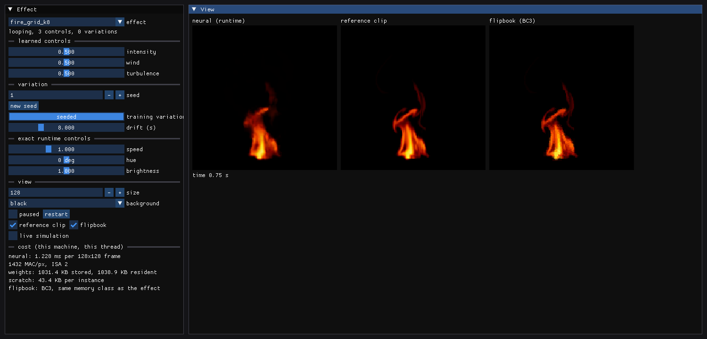
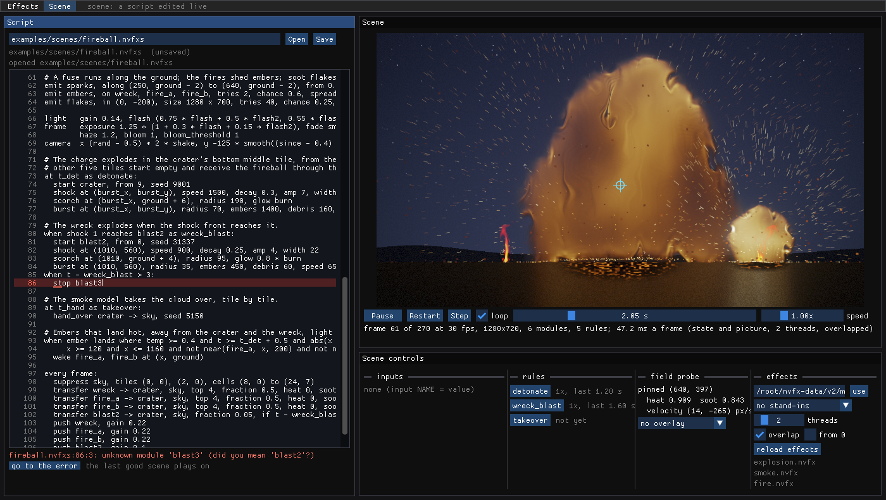

# The viewer

Status: **current**. Audience: dev, artists.

`nvfx_viewer` has two modes, switched in its menu bar:
- **Effects** plays trained effects live with a slider for every control, and shows them next to the reference clip,
  a flipbook of that clip at the effect's memory, and the fluid simulation running at the same controls, each with its
  cost per frame.
- **Scene** edits a scene script ([COMPOSE.md](COMPOSE.md) §4) next to the scene it plays. The scene is rebuilt as you
  type; a broken edit leaves the last good scene playing and shows the error at its line and column.

Both render through the same runtime a game uses: the effects C API (`nvfx.h`) and the scene C API (`nvfx_scene.h`,
[ENGINES.md](ENGINES.md) §7).



## Build and run

The viewer is optional (it needs GLFW and OpenGL and fetches Dear ImGui with git at a pinned tag):

```sh
sudo apt install libglfw3-dev libgl-dev        # plus xvfb to run it headless
cmake -S . -B build -G Ninja -DCMAKE_BUILD_TYPE=Release -DCMAKE_CXX_COMPILER=g++-14 -DNEURALFX_BUILD_VIEWER=ON
cmake --build build --target nvfx_viewer
build/viewer/nvfx_viewer fire.nvfx smoke.nvfx --clip fire_reference.nfxclip
build/viewer/nvfx_viewer --demo                 # an untrained demo effect, no files needed
build/viewer/nvfx_viewer --scene examples/scenes/fireball.nvfxs              # the effects from the default folder
build/viewer/nvfx_viewer --scene examples/scenes/campfire.nvfxs --effects DIR
build/viewer/nvfx_viewer --scene examples/scenes/fireball.nvfxs --stand-ins  # untrained stand-ins, no files needed
```

The scene mode reads the effects a script names from a folder chosen in the UI (`--effects`). By default it is
`$NEURALVFX_DATA/v2/models`, else `$NEURALVFX_DATA/experiments/models/d` (`NEURALVFX_DATA` defaults to
`~/nvfx-data`, as in the build).

## Effects mode

Rollout effects ([REPORT.md](REPORT.md) §6) play in the same viewer: the variation slider picks a start point, sizes
step by 32, and the drift slider becomes "shard (s)", the length of each fresh rollout (6 s by default; 0 plays one
continuous rollout, which drifts after 20 s or so). The info line shows the start points, stored size and cost.


| panel | what |
|---|---|
| learned controls | one slider per control the effect was trained with (names stored in the `.nvfx` file) |
| variation | seed, "new seed", a training variation to replay, and the drift time between variations |
| exact runtime controls | playback speed, hue rotation, brightness |
| view | size (any multiple of 16 for grid effects), background, pause and restart, the comparison panels |
| cost | ms per evaluation (rolling mean), MAC per pixel, ISA, stored and resident weight size, scratch per instance, and the simulation's ms per frame when it runs |

The flipbook panel keeps as many BC3 frames of the reference clip as fit in the effect's stored size, so the two
cost the same memory.

## Scene mode: scripts edited live



What an edit does:
1. **Typing restarts a short wait** (300 ms). Nothing is checked while you type.
2. **When the edits pause, the script is checked** on the UI thread with `nvfx_scene_check`: it is parsed and its
   names, contexts and constants checked, without loading any effect (0.7 ms for the fireball's 106 lines on a busy
   machine). An error is shown under the editor with its line and column; the line is highlighted, its number turns
   red, a mark sits under the column, and "go to the error" moves the cursor there. Nothing is rebuilt: the scene
   plays on.
3. **A script that passes is rebuilt on a worker thread** while the last good scene plays. The worker reads the
   effects the script names (kept in memory while their files do not change), builds the scene with
   `nvfx_scene_create`, and plays it, states only and without pictures, to the time of the edit (or from 0, with
   "from 0" ticked). The fireball built and played to 2.9 s in 1.2 s on 2 threads of a busy machine. A newer edit
   abandons a build in progress.
4. **An error only the build finds** (a module size that is not a multiple of its effect's grid, an effect file that
   is missing or not a rollout effect, a start point the effect lacks) is shown the same way, at its line, and also
   leaves the last good scene playing.
5. **The new scene replaces the old one** at the start of a frame; the old one is freed on the worker.

Values set with the input sliders carry over a rebuild while the script's starting value for that input is unchanged;
change `input NAME = value` in the script and the script's value wins. A script changed on disk by another editor is
reloaded as an edit (so any editor can drive the viewer), unless the viewer has unsaved edits of its own, when it says
so and offers to load the file.


| panel | what |
|---|---|
| script | the file's path, Open, Save (ctrl+S), the editor with line numbers, and under it the error (with "go to the error"), or the build's time, and the cursor's line and column |
| scene | the picture (the script's size, scaled to fit), Play and Pause (space), Restart, Step (one frame), loop (back to 0 at the script's `length`), the time slider (drag to scrub: forwards a frame or two at a time on the frame, else on the worker), speed (0 to 4x), and the frame, size, modules, rules and ms per frame |
| inputs | a slider per `input` statement (its range from the starting value; ctrl+click types any value), and reset |
| rules | a button per named rule (`when 0 as NAME:`, and every other `as NAME`), with how often it fired and when it last did; a landing rule cannot be fired |
| field probe | heat, soot and velocity under the pointer, at its world position (the frame's camera, `nvfx_scene_camera`); a click pins a point, a right click unpins it; an overlay of the bus's heat or soot over the picture |
| effects | the folder, stand-ins (none, for missing files, for every effect), threads, overlap, "from 0", reload effects, and the files the script names with where each came from |

**What a frame costs.** The mode plays the scene in real time (at most two scene frames per UI frame, so a scene
slower than real time plays slower rather than falling behind), reads the fields under the probe, draws the picture
when the frame changed and uploads it as a texture. Through the scene API none of this allocates
(`nvfx_alloc_test`); the picture's buffer is made when a new scene arrives. The UI's own drawing allocates as Dear
ImGui does. Rebuilds, seeks back (a rebuild and replay), restarts and the loop run on the worker.

**The probe and overlap.** The fields are read before the picture is drawn: with overlap, drawing frame f computes
frame f + 1 ([ENGINES.md](ENGINES.md) §7), so reads after it would be a frame ahead. While paused, the state has already
moved on to the next frame, and the probe shows that frame's fields.

**Stand-ins.** Without the models, `--stand-ins` (or the effects panel) plays untrained stand-ins: rollout effects
with the study D effects' 32-cell grid, 12 start points of a plume and the controls intensity, wind and turbulence.
They are for trying a script's layout, timing and rules, and for the tests; modules with a field-shader look show
their heat and soot, modules with the learned look show an untrained renderer's colours.

**Limits.** The editor is Dear ImGui's multiline text box with line numbers: undo and redo (ctrl+Z, ctrl+Y), but no
syntax colouring, no search, and long lines scroll sideways. The parser stops at the first error, so the viewer shows
one at a time. A scene rebuilt while playing starts at the time of the edit, so the clock jumps back by the build's
time. A rebuild competes for the CPU with the scene that plays (each runs `threads` threads).

## Headless runs and tests

```sh
xvfb-run -a build/viewer/nvfx_viewer fire.nvfx --screenshot out.png --frames 30
xvfb-run -a -s "-screen 0 1920x1080x24" build/viewer/nvfx_viewer --scene examples/scenes/fireball.nvfxs --at 2.9 \
    --paused --pin 640,330 --screenshot out.png --frames 5 --check-picture
```

In the scene mode `--frames` counts frames once the scene is built (at `--at` seconds), played at 60 Hz.
`--check-picture` fails (exit 3) if the scene's picture on the screenshot is flat or an error is shown.
`--edit-replace FROM --with TO` makes an edit once the scene is built (the first FROM in the script becomes TO, the
cursor at the edit, as if typed), and `--expect-error-line N` fails unless it leaves an error at line N with the first
scene still playing. `--input NAME=V,...` and `--trigger RULE,...` move sliders and press rule buttons once the scene
is built, `--pin X,Y` pins the probe (picture pixels), `--overlay heat|soot` shows the overlay, `--window WxH` sizes the
window. The figures above were made this way:

```sh
xvfb-run -a -s "-screen 0 1920x1080x24" build/viewer/nvfx_viewer --scene examples/scenes/fireball.nvfxs --at 1.95 \
    --pin 640,400 --edit-replace "stop blast2" --with "stop blast3" --expect-error-line 86 --window 1400x790 \
    --screenshot docs/figures/viewer_scene.png --frames 6 --check-picture
xvfb-run -a -s "-screen 0 1920x1080x24" build/viewer/nvfx_viewer --scene examples/scenes/campfire.nvfxs --at 3 \
    --input fuel=0.85 --trigger light_log,blow --pin 440,380 --overlay heat --window 1280x720 \
    --screenshot docs/figures/viewer_scene_campfire.png --frames 90 --check-picture
```

`ctest -R Viewer` runs:
- `neuralfx.ViewerScene.*` (`viewer/scene_session_test.cpp`, no display): the wait before a check fires once when
  edits pause; a typo (found by the check) and a size that is not a multiple of the grid and a missing effect file
  (found by the build) each keep the last good scene playing, with the line and column; a fixed script gives a new
  scene at the time of the edit; inputs carry over a rebuild unless the script changes them; rule triggers, the probe,
  seeks forward and back, a seek that supersedes another, and restarts; stand-ins for missing effects, and the fireball
  played on stand-ins; a newer edit superseding a build in progress.
- `neuralfx.ViewerScreenshot`: the effects mode with the demo effect.
- `neuralfx.ViewerSceneScreenshot`: the scene mode playing `examples/scenes/fireball.nvfxs` on stand-ins from 1.5 s,
  with `--check-picture`.
- `neuralfx.ViewerSceneBrokenEdit`: the same, then the edit that breaks line 86: the error at line 86 and the first
  scene still playing.
- `neuralfx.ViewerSceneScreenshotModels` (label `data`, registered only when the study D effects are on the machine):
  the fireball with the real effects at 2.9 s.

CI's viewer job builds the viewer and its tests and runs all but the last (it has no data) under Xvfb.
