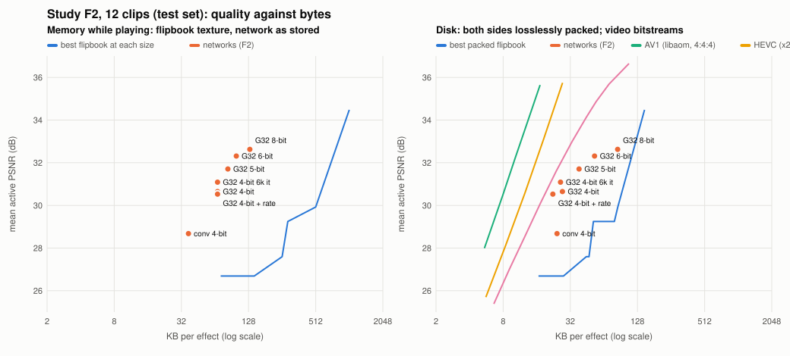
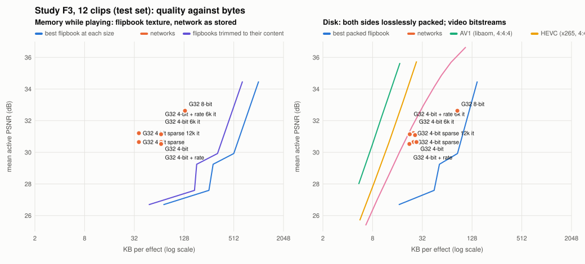

# Lossless packing of effect files: context mixing, and flipbooks coded the same way

Status: **results** (9 October 2026; study F2, training for fewer bits and for the coder, against video codecs too,
added 10 October 2026 [below](#study-f2-compression-pushed-further-10-october-2026); study F3, sparse features and
flipbooks without their empty space, added 11 October 2026
[at the end](#study-f3-sparse-features-and-flipbooks-without-their-empty-space-11-october-2026)). Audience: owner, research,
dev. Data: [cm.csv](cm.csv) (every file, flipbook and part) and [cm_equal_quality.csv](cm_equal_quality.csv). Code:
`include/neuralfx/cm.hpp`, `src/core/cm.cpp`, `tools/nvfx_pack.cpp`.

## Bottom line

- **The network files shrink by 1.2 to 1.7 times (frame models) and 1.8 to 4.9 times (rollout effects), losslessly.**
  zlib -9 manages 1.07 to 1.23 times on the frame models and 1.3 to 2.6 times on the rollout effects.
- **Flipbooks shrink far more: 2.9 to 6.9 times in BC3 layout and 6.9 to 12.9 times as raw RGBA** (zlib -9: 2.5 to
  4.9 times). A sprite flipbook is mostly empty, smooth and repeated in time; a trained network's 8-bit features are
  close to noise (7.1 to 7.3 bits per byte at order 0).
- **So entropy coding does not push the network's advantage past 10 times; it erodes it.** At equal quality (mean active
  PSNR, the comparison of [docs/REPORT.md](../../docs/REPORT.md) §3), with both sides coded by this coder, the 8-bit
  networks need **1.4 times less disk than a flipbook at best** (grid_m 132 KB and conv_s 69 KB), tie at grid_s
  (1.0x), and need *more* disk for conv_m (0.9x) and grid_mt (0.8x). In memory the same networks need 3.5 to 5.9
  times less. fp16 networks lose on disk (0.4 to 0.8x).
- **Resident memory does not change.** The runtime unpacks at load to the same `.nvfx` bytes, so RAM and the
  per-frame cost are exactly as in the report. Only disk and download sizes change.
- **Decoding is slow: 0.32 to 0.44 MB/s on one core** (about 1,700 instructions per coded bit, typical of this class of
  coder). A 132 KB study A model takes 0.4 s to unpack, a 1 MB study B model 3.2 s.
- **To gain from entropy coding, the networks would have to be trained for it**: a rate term in the training loss (as
  learned image and texture codecs use) would make the features predictable instead of noise-like. That is a change to
  training, not to the coder; this coder would then measure it. **Study F2 below did it**: with 4-bit features trained
  for their bits and a rate term, the networks need 4.1 times less disk than packed flipbooks of equal quality (and
  8.3 to 8.5 times less memory), but video codecs (AV1) still need 2.8 times less disk than the networks.
- **A correction to the report**: the equal-quality ratio of conv_s is **4.9x, not 7.4x**. The report's envelope
  interpolated between two flipbooks of the same size (512 KB); see "Equal quality" below. The other ratios reproduce.

## Format 2: faster decoding (study H)

Study H (H3, [docs/DCM.md](../../docs/DCM.md) §9) added a second format beside this one, which is unchanged to the
byte: LZ tokens for the kinds that repeat exactly (fine fields, headers, flipbooks), a light or a fast literal model
instead of the full one, and optional seekable segments (one tensor or start point decodes alone). The light model
decodes 4 to 9 times faster for 1.6 to 3.9% more disk (seekable: 1.7 to 4.4%); the fast one 18 to 38 times faster for
10 to 23% more (provisional timings, a busy machine).
Measurements: [h3_decode.csv](h3_decode.csv) (every file and configuration, with zlib -9), parts in
[h3_decode_parts.csv](h3_decode_parts.csv), segment sizes in `h3_segment_*.csv`; `nvfx_pack --h3` and
`tools/study_h/h3.sh` reproduce them.

## The coder

A PAQ/lpaq-style context-mixing coder that knows the tensors' shapes. Every value is coded bit by bit, most significant
first, with a 32-bit carry-less binary arithmetic coder (16-bit probabilities). Each bit's probability comes from:

- **Numeric prediction per value.** 13 fixed predictors (left, above, gradient, median edge detector, the previous plane
  at the same place, one row down and with the local gradient, the plane two axes back, and for pixels and blocks the
  previous channel's change) plus an adaptive linear predictor (normalised LMS on 12 neighbours), blended by the
  inverse square of each predictor's recent error at the four causal neighbours and in the previous plane. fp16 values
  are predicted in exact fixed point (value x 2^24); an 8-bit neighbour in another plane is first mapped into this
  plane's scale through both planes' stored (lo, hi) ranges.
- **3 direct context models per bit:** where the prediction lies relative to the middle of the interval still open
  (in eighths of its half-width) with the local error level; the same offset in units of the local error; and the
  offset of the locally best single predictor.
- **14 hashed context models per byte** (slots of one cache line per nibble, two-way, checked): order 0; the value to
  the left, above, in the previous plane; left and above together; the quantised prediction, with and without the
  error level; left, above and above-right coarsely; per tensor and plane, per row, per column (weights of one neuron
  or one input share a scale); the bytes of this pixel or block decoded so far; the previous plane with its row below.
  BC3 blocks swap five of these for block-aware ones: the same byte in the blocks to the left, above and in the
  previous frame; whether the alpha or colour endpoints are equal or zero; the block's bytes so far with its left and
  previous-frame neighbours.
- **Two mixers** (logistic, 18 inputs, 16-bit weights with rounded updates), one selected by kind, bit position and
  error level, one by kind, byte and the bits decoded so far, averaged in the logistic domain.
- **Two APMs** (adaptive probability maps): by the bits decoded so far, and by the prediction's offset.
- **fp16** is reordered by a bijection that is monotone in the value, then coded as the high byte (sign, exponent and
  two mantissa bits) and the low byte, with the high byte in every context of the low byte.
- **The container** parses a `.nvfx` (either kind) into its tensors and codes each with its shape: features in the order
  [channel][basis][time][y][x] (so "the previous plane" is the previous time slice and two axes back the previous
  basis), layers as [out][in], start states as [start][y][x][channel], fine fields with their scales. Headers are coded
  as plain bytes. A 64-bit checksum of the original guards the round trip; anything that does not parse as a model is
  coded as plain bytes.

Everything the decoder computes is integer arithmetic in a fixed order, so every compiler and instruction set decodes
the same bits. Checked: the coder built by GCC 14 at -O3 for this machine's AVX-512, by Clang 18 at -O2 for baseline
x86-64, and by GCC with the address and undefined-behaviour sanitisers at -O1 writes byte-identical streams for the
same files. The tests (`tests/test_cm.cpp`) check exact round trips on random and smooth tensors of many shapes,
frame models and rollout effects saved in memory, empty, tiny, truncated and malformed inputs, and that damaged data
is refused rather than decoded into a different file (a damaged stream is detected by the checksum, or earlier when
the decoder runs past the end of its input). A sanitiser run over 180 damaged model streams, 200 random tensor sets
and 4,000 junk streams found no fault.

## Models

Every model under the data root (A: one model per clip, every configuration for clip 0 of each effect and grid_m 8-bit
for all 12 clips; B: control models; C: variation models; D: rollout effects). Means over the files of each
configuration; bits per value counts every stored value (features, weights, states), headers excluded.

| study | config | files | KB | packed KB | ratio | bits per value (stored / packed) | zlib -9 ratio |
|---|---|---:|---:|---:|---:|---:|---:|
| A | grid_s 8-bit | 3 | 73.1 | 48.0 | 1.52x | 8.07 / 5.30 | 1.11x |
| A | grid_m 8-bit | 12 | 131.7 | 85.0 | 1.55x | 8.12 / 5.24 | 1.17x |
| A | grid_mt 8-bit | 3 | 260.2 | 180.1 | 1.44x | 8.07 / 5.59 | 1.13x |
| A | grid_l 8-bit | 3 | 291.7 | 175.0 | 1.67x | 8.05 / 4.83 | 1.23x |
| A | conv_s 8-bit | 3 | 69.2 | 57.2 | 1.21x | 8.32 / 6.88 | 1.07x |
| A | conv_m 8-bit | 3 | 142.1 | 117.6 | 1.21x | 8.42 / 6.97 | 1.08x |
| A | grid_s fp16 | 3 | 144.6 | 110.9 | 1.30x | 16.02 / 12.28 | 1.08x |
| A | grid_m fp16 | 3 | 259.2 | 195.7 | 1.32x | 16.01 / 12.09 | 1.09x |
| A | grid_mt fp16 | 3 | 515.2 | 385.1 | 1.34x | 16.01 / 11.96 | 1.11x |
| A | grid_l fp16 | 3 | 579.2 | 430.5 | 1.35x | 16.00 / 11.90 | 1.10x |
| A | conv_s fp16 | 3 | 132.2 | 108.0 | 1.22x | 16.02 / 13.09 | 1.08x |
| A | conv_m fp16 | 3 | 268.1 | 220.6 | 1.22x | 16.01 / 13.17 | 1.08x |
| B | grid k8 (1 MB) | 3 | 1031.7 | 794.6 | 1.30x | 8.03 / 6.19 | 1.09x |
| B | grid k16 | 3 | 2062.9 | 1562.8 | 1.32x | 8.03 / 6.08 | 1.09x |
| C | variation k8 | 3 | 1032.7 | 725.9 | 1.42x | 8.03 / 5.65 | 1.12x |
| C | variation k24 | 3 | 3089.0 | 2165.3 | 1.43x | 8.02 / 5.62 | 1.13x |
| D | rollout fire | 1 | 81.8 | 44.5 | 1.84x | 16.08 / 8.76 | 1.29x |
| D | rollout smoke | 1 | 145.8 | 50.3 | 2.90x | 11.14 / 3.84 | 2.01x |
| D | rollout explosion | 1 | 274.3 | 55.7 | 4.92x | 10.92 / 2.22 | 2.64x |

By part (means per file; packed sizes are the model's code lengths, the arithmetic coder adds a few bytes):

| model | part | KB | packed KB | ratio | zlib -9 ratio |
|---|---|---:|---:|---:|---:|
| A grid_m 8-bit | features | 128.0 | 82.1 | 1.56x | 1.20x |
| A grid_m 8-bit | feature ranges | 0.5 | 0.4 | 1.42x | 1.02x |
| A grid_m 8-bit | MLP weights | 2.8 | 2.3 | 1.18x | 1.05x |
| A grid_m fp16 | features | 256.0 | 193.2 | 1.33x | 1.12x |
| A conv_s 8-bit | features | 64.0 | 53.0 | 1.21x | 1.08x |
| A conv_s 8-bit | convolution weights | 3.9 | 3.3 | 1.18x | 1.06x |
| B grid k8 | features | 1024.0 | 789.3 | 1.30x | 1.10x |
| C variation k24 | features | 3072.0 | 2154.4 | 1.43x | 1.15x |
| D rollout (3) | stepper and renderer weights | 17.3 | 14.8 | 1.17x | 1.07x |
| D rollout (3) | coarse start states (fp16) | 85.3 | 31.4 | 2.72x | 1.49x |
| D rollout (2 with them) | fine start fields (8-bit) | 96.0 | 5.4 | 17.90x | 12.72x |

What compresses and what does not:
- **8-bit grid features: 4.8 to 5.5 bits per value in study A, 5.6 in C, 6.1 to 6.2 in B.** They are near noise at
  order 0 (7.1 to 7.3 bits); the gain comes from spatial prediction and from the previous time slice and basis once
  mapped into the same scale. Conv latents barely compress (6.6 bits): they have almost no spatial correlation.
- **fp16 weights: 13.7 bits per value.** The high byte (sign and exponent) carries the gain; the low mantissa byte is
  noise. The same holds for fp16 features (11.9 to 13.2 bits): the extra 8 bits over the 8-bit version are noise.
- **Rollout start points compress well**: coarse states are smooth fields (4.5 to 7.4 bits per fp16 value) and the
  8-bit fine fields are mostly empty (0.3 to 0.8 bits per value). So the more of an effect is start points, the more it
  shrinks: explosion 4.9x, smoke 2.9x, fire (no fine fields) 1.8x.

## Flipbooks, coded the same way

The study A flipbook ladder for the 12 study A clips, encoded by `src/core/flipbook.cpp` exactly as the study stored
them: BC3-layout blocks as a tensor [frame][block row][block column][16 bytes], raw RGBA as [frame][y][x][4], motion
vectors as [frame][y][x][2] (quarter pixels, 8 bits). Means over the 12 clips; the full ladder (31 configurations) is in
cm.csv.

| flipbook | KB in memory | packed KB | ratio | zlib -9 KB | zlib ratio |
|---|---:|---:|---:|---:|---:|
| BC3 64 frames 128 px (every frame) | 1024 | 148.2 | 6.91x | 265.8 | 3.85x |
| BC3 32 frames 128 px | 512 | 85.3 | 6.00x | 136.3 | 3.76x |
| BC3 16 frames 128 px + motion vectors | 288 | 51.6 | 5.58x | 79.3 | 3.63x |
| BC3 16 frames 128 px | 256 | 46.8 | 5.47x | 68.9 | 3.71x |
| BC3 64 frames 64 px | 256 | 44.5 | 5.75x | 74.8 | 3.42x |
| BC3 32 frames 64 px | 128 | 26.8 | 4.78x | 39.5 | 3.24x |
| BC3 16 frames 64 px + motion vectors | 72 | 16.6 | 4.34x | 24.1 | 2.99x |
| BC3 64 frames 32 px | 64 | 12.9 | 4.97x | 21.4 | 2.99x |
| raw RGBA 64 frames 64 px | 1024 | 79.4 | 12.89x | 213.7 | 4.79x |
| raw RGBA 32 frames 64 px | 512 | 47.0 | 10.88x | 108.3 | 4.73x |
| raw RGBA 64 frames 32 px | 256 | 25.3 | 10.10x | 60.5 | 4.23x |

By effect, the 1 MB BC3 flipbook packs 8.67x (fire), 5.45x (smoke) and 7.39x (explosion); at 64 px 6.89x, 4.77x and
6.00x; 32 frames at 128 px 7.71x, 4.63x and 6.50x. The BC3 model is generic (bytes with block-aware contexts); a coder
that decoded the blocks to predict endpoints from neighbouring pixels, or an encoder tuned for rate (as production
texture pipelines use), would shrink flipbooks further, so these flipbook sizes are an upper bound.

## Equal quality: memory against disk

For each study A network, the flipbook size that reaches the same mean active PSNR over the 12 clips, along the
best-flipbook envelope (the best quality at or below each size, log-linear between sizes), as in the report; then the
same with every flipbook and every network packed by this coder, and with zlib -9. Network sizes are the means of the
saved files (grid_m 8-bit: 12 clips; the others: clip 0 of each effect). Ratio = flipbook size / network size.

| network | active PSNR | in memory: network / flipbook KB, ratio | packed: network / flipbook KB, ratio | zlib -9: network / flipbook KB, ratio |
|---|---:|---|---|---|
| conv_s 8-bit | 29.45 | 69 / 341, **4.9x** | 57 / 81, **1.4x** | 64 / 116, 1.8x |
| grid_s 8-bit | 28.07 | 73 / 265, **3.6x** | 48 / 48, **1.0x** | 66 / 76, 1.2x |
| grid_m 8-bit | 32.62 | 132 / 772, **5.9x** | 85 / 118, **1.4x** | 113 / 243, 2.2x |
| conv_m 8-bit | 31.33 | 142 / 634, **4.5x** | 118 / 101, **0.9x** | 132 / 229, 1.7x |
| grid_mt 8-bit | 33.76 | 260 / 917, **3.5x** | 180 / 136, **0.8x** | 231 / 257, 1.1x |
| grid_l 8-bit | 36.23 | 292 / > 1024, **> 3.5x** | 175 / > 148, **> 0.8x** | 236 / > 266, > 1.1x |
| conv_s fp16 | 29.45 | 132 / 343, 2.6x | 108 / 81, 0.8x | 122 / 116, 1.0x |
| grid_s fp16 | 28.07 | 145 / 265, 1.8x | 111 / 48, 0.4x | 133 / 76, 0.6x |
| grid_m fp16 | 32.64 | 259 / 774, 3.0x | 196 / 119, 0.6x | 238 / 243, 1.0x |
| conv_m fp16 | 31.33 | 268 / 634, 2.4x | 221 / 101, 0.5x | 248 / 229, 0.9x |
| grid_mt fp16 | 33.77 | 515 / 920, 1.8x | 385 / 136, 0.4x | 465 / 257, 0.6x |
| grid_l fp16 | 36.28 | 579 / > 1024, > 1.8x | 431 / > 148, > 0.3x | 524 / > 266, > 0.5x |

(">": no flipbook in the ladder is as good, so the flipbook size and the ratio are at least that. grid_l is above the
1 MB BC3 flipbook in quality, so its ratios are lower bounds.)

- **On disk, the networks' advantage is 1.4x at best, and gone for the larger ones.** Packing gives the flipbook
  ladder 2.9 to 12.9 times and the networks 1.2 to 1.7 times, so the memory ratios shrink by a factor of 3.5 to 5.
- **By effect** (grid_m 8-bit against the 1 MB BC3 flipbook): on fire the network is better (31.47 against 30.44 dB) and
  smaller on disk too (81 KB against 118 KB packed); on smoke (31.86 against 36.48 dB, 86 against 188 KB) and
  explosions (34.53 against 36.51 dB, 88 against 139 KB) the flipbook is better and is only 1.6 to 2.2 times larger.
- **The rollout effects of study D** pack to 45 to 56 KB each, a third of one packed 1 MB flipbook of one clip, and they
  play endlessly at any setting; but they are not compared at equal quality here (they do not reproduce a clip).
- **The correction.** The report's 7.4x for conv_s came from two flipbooks of the same size: raw 32 frames at 64 px
  (26.94 dB) and BC3 32 frames at 128 px (29.92 dB), both 512 KB. The report's envelope kept both points and
  interpolated between them, which lands on 512 KB for any quality in between. With one point per size (the best), the
  envelope goes from 288 KB (29.25 dB) to 512 KB (29.92 dB) and conv_s's 29.45 dB needs 341 KB: 4.9x. The tool here
  merges equal sizes, and so does `nvfx_experiment report` now; the report is corrected.

## Speed

Single thread on one pinned core of the study machine (Intel Xeon, 2.8 GHz), quiet, best of three; the coder is plain
C++ built for baseline x86-64 (no instruction-set-specific code):

| file | KB | encode MB/s | decode MB/s |
|---|---:|---:|---:|
| A conv_s 8-bit | 69 | 0.38 | 0.32 |
| A grid_m 8-bit | 132 | 0.31 | 0.35 |
| A grid_m fp16 | 259 | 0.34 | 0.34 |
| D fire | 82 | 0.39 | 0.40 |
| D explosion | 274 | 0.44 | 0.44 |
| B fire grid k8 | 1032 | 0.32 | 0.33 |

Decoding is as costly as encoding (the same model runs). It needs up to about 70 MB of working memory while it runs
(a 64 MB statistics table for inputs of 512 KB and more, less for smaller ones), released when done. The figures in
cm.csv were measured while other jobs shared the machine and spread wider (0.17 to 0.58 MB/s).

## What did not help (measured on a set of five model files and on flipbooks)

- **More of the same contexts.** Each hashed context alone is worth at most 0.3%; all 14 together 2% over order 0 plus
  the direct contexts. Most of the gain is in the direct contexts relative to the numeric prediction.
- **A lean model** (8 hashed contexts, one mixer): about 20% faster on a flipbook, 0.6% (models) to 0.8% (flipbooks)
  larger.
- **The adaptive linear predictor (NLMS):** 0.06%. Using it instead of the best single predictor for the third direct
  context: better on features, worse on fp16, net loss.
- **Fractional fp16 predictions** (where the prediction falls between two fp16 values): no gain; the low mantissa bits
  are noise either way.
- **Per-tensor statistics and shared mixers for small tensors:** 0.01% each (kept, they cost nothing).
- **Bigger statistics tables:** none for model files; 0.9% on a 1 MB flipbook going from 64 MB to 256 MB (not used).
- **Mixer settings:** higher learning rates (10, 16) were worse, a four times larger initial weight 1% worse. 16-bit
  weights with truncated updates cost 0.1% on models and 1.1% on BC3 flipbooks, with 13 fractional bits 0.4% and
  3.4%; rounding the updates removed the loss (and beat 32-bit weights slightly).

## Reproduce

```sh
build/nvfx_pack --study --data $NEURALVFX_DATA/experiments   # about 25 minutes, one core: cm.csv, cm_equal_quality.csv, tables
build/nvfx_pack --tables                                     # the tables again from cm.csv
build/nvfx_pack --report $NEURALVFX_DATA/experiments/models  # any folder of .nvfx files
build/nvfx_pack in.nvfx out.nvfz && build/nvfx_pack --unpack out.nvfz back.nvfx
```

## Study F2: compression pushed further (10 October 2026)

Status: **results** (stage S3 of [docs/DCM.md](../../docs/DCM.md)). Audience: owner, research, dev. Data:
[f2_nets_test.csv](f2_nets_test.csv) and [f2_nets_val.csv](f2_nets_val.csv) (every network: sizes, packed sizes,
quality), [f2_flipbooks_test.csv](f2_flipbooks_test.csv), [f2_video_test.csv](f2_video_test.csv) (and their `_val`
twins), [f2_equal_quality_test.csv](f2_equal_quality_test.csv) (every ratio with its interval),
[f2_g3c.csv](f2_g3c.csv) with [f2_g3c_val_decisions.csv](f2_g3c_val_decisions.csv) and
[f2_g3c_test_decisions.csv](f2_g3c_test_decisions.csv), the figure
[f2_rate_quality.svg](f2_rate_quality.svg). Code: `tools/nvfx_f2.cpp`, `src/codec/video_codec.cpp`, the trainer, the
`.nvfx` format, the coder and the runtime (below).

### Bottom line

- **Memory: at best 9.1x [6.3, 11.3] at equal quality; "far better than 10x" is not reached.** Trained for 4-bit
  features (kept bit-packed by the runtime), study A's grid_m holds 67.5 KB instead of 131.5 KB; with the usual 2,000
  steps it loses 2.0 dB [1.6, 2.4] of active PSNR and needs **8.5x [4.4, 10.4]** less memory than the best flipbook of
  equal quality, with three times the steps it loses 1.5 dB and needs **9.1x [6.3, 11.3]** less (study A's 8-bit
  grid_m: 5.9x [4.7, 7.8]). 5-bit: 8.0x [6.5, 10.3]; 6-bit: 7.4x [5.9, 9.9]; conv_s at 4 bits: 7.5x [7.2, 13.9]. At
  equal memory the networks beat the flipbooks by 5.0 to 6.0 dB. The intervals reach past 10x, the point estimates
  do not. What limits it is below.
- **Disk against packed flipbooks: 1.4x became 4.1x [2.6, 4.5].** Fewer bits pack better (4-bit: 3.4x [2.9, 3.7]) and a
  rate term in the loss, the features' estimated bits under the lossless coder's own predictors, removes another 18%
  of the packed bytes for 0.12 dB [0.03, 0.22].
- **Disk against video codecs: the networks lose.** AV1 (libaom, 4:4:4) reaches the same 30.5 dB in 7.9 KB, 2.8 times
  less than the best network (22.3 KB); the other AV1 encoders, HEVC, VP9 and H.264 need 1.5 to 2.2 times less. Only
  VP9 with native alpha, held back by 4:2:0 chroma, ties (0.85x [0.70, 1.15]). 4:2:0 alone caps a fire clip at 29.1 dB.
- **Memory against video codecs: the networks win by 20x and more.** 71 KB resident plus 44 KB working memory against a
  running decoder's 2.6 to 23 MB (measured; at least 0.4 to 1.6 MB of reference frames for these streams) or 4 MB of
  decoded frames, and any frame is one render away, without keyframes.
- **Null results, with their numbers below**: trimmed quantiser ranges (+0.07 dB), quantisation-aware training from
  halfway (0.00 dB), learned codebooks (vector quantisation: 4.6 dB below 4-bit features at a third of the size; 2 bits
  per value on the 3-bit line), smaller grids and fewer time slices (worse ratios than 4-bit G32), stronger rate terms
  (the estimate stops tracking the coder). Longer training helps: three times the steps add 0.44 dB [0.36, 0.54] on the
  test clips.
- **G3c (rollout start points at 6 bits) passes on fire and explosions** (test statistics better or tied) and halves
  them on disk (44.5 to 20.6 KB, 55.7 to 25.4 KB packed); smoke fails by one tiny coverage difference and keeps fp16
  starts. Dithering with the seed's noise and fewer start points failed on validation.



### What was built

- **Features at 2 to 8 bits.** A `.nvfx` frame model can store its feature planes at any width from 2 to 8 bits:
  each plane keeps an fp16 (lo, hi) and its codes are bit-packed (8 bits: one byte per code, as before). The
  runtime keeps them packed and decodes them while it blends the frame's time slice, so resident memory follows the
  bits; no allocation per frame. Files at 8 and 16 bits are byte-identical to before.
- **Quantisation-aware training** (`train::Options::qat_bits`): the forward pass sees the features exactly as they
  will be stored (per-plane min/max, uniform codes), the gradient passes straight through the rounding to the float
  features. Optional: start it later in training (`qat_start`), and trimmed ranges (`Model::feature_trim`: per plane
  the range among min/max and six clipped ones that quantises best).
- **Rate-aware training** (`rate_lambda`): the loss gets lambda times an estimate of the bits per feature value. The
  estimate is log2(1 + |r| / step) with r the smallest residual of three causal predictors the coder also uses (the
  median edge predictor in the plane, the previous time slice, and the previous slice plus the change to the left)
  and step the plane's quantisation step. Its gradient is checked against finite differences.
- **Vector-quantised features** (`Model::vq_bits`, `vq_dim`; file version 2): the channels of every grid point are
  split into groups, each stored as one index into a learned codebook of 2^bits vectors (fp16). Trained by k-means
  halfway through training, then nearest-codeword forward passes with straight-through gradients and codewords
  moved towards their members. The codebook is stored in a canonical order (its first principal axis) so the
  lossless coder's predictors help.
- **The coder** (`src/core/cm.cpp`) parses all of these (packed planes code only their bits; codebooks as fp16
  tensors; quantised rollout start states) and stays byte-identical on every existing file.
- **Video codecs** (`src/codec`, `neuralfx_codec`): x264, x265, VP9 with native alpha (yuva420p, WebM) and VP9,
  libaom AV1, SVT-AV1 and rav1e with alpha stacked under the colour, through an ffmpeg pipe. Payload bytes are
  parsed from the container (IVF frames, WebM blocks and block additions, Annex B streams without encoder
  information). The decoders' CPU time and peak memory are recorded.
- **Rollout start points** (G3c): rollout format version 3 stores coarse start states at 2 to 8 bits per channel
  plane, optionally dithered subtractively by the start's own seed (the integer hash behind the effect's noise).
- **`nvfx_f2`**: the study tool (validation clips, flipbook ladder, training, video ladders, equal-quality ratios with
  bootstrap intervals, the figure, G3c, timing).

### Protocol

- **Test** = study A's 12 clips, scored exactly as study A scores them: one network per clip, trained on that clip,
  rendered through the runtime at its stored precision, mean active PSNR over the 64 frames. Study A's own 8-bit
  grid_m files, scored again by this tool, reproduce its numbers to the last digit; retrained here with 2 threads
  instead of 4 they agree within 0.07 dB per clip (32.63 against 32.62 dB on average). The flipbook ladder
  reproduces study A's qualities and study F's packed sizes exactly.
- **Validation** = 6 other clips (2 per effect, controls and seeds not in study A). Every choice (bits, quantiser,
  rate weight, grid size, time slices, training length, vector quantisation, the G3c variant) was made on them. The
  test clips were used once, for the bit-depth ladder and the configurations chosen on validation.
- **Equal quality**, as in the report: the flipbook size that reaches the network's mean active PSNR along the
  best-flipbook envelope (best quality at or below each size, one point per size, log-linear between sizes); for a
  video codec, along its own quality ladder. Each ratio has a 95% bootstrap interval over clips (10,000 resamples;
  network and baselines resampled together, so it is paired). The envelope has steps (288 to 512 KB is almost flat,
  then the 1 MB flipbook is 4.6 dB better), so a few tenths of a dB can move a ratio a lot and the interval can sit
  off-centre. The quality difference at the network's own size (dB, paired interval) is the steadier number and is
  given next to the ratios.
- **Bytes.** *Memory*: what playback holds: the flipbook texture; the network as stored (features at their bits,
  other weights fp16). *Resident*: what the runtime really keeps (the small MLP widened to floats; +3.5 KB).
  *Working memory* per playing instance is separate and the same for every grid model (44 KB at 128 px). *Disk*:
  flipbooks and networks both packed by the study F coder; video codecs' bitstream payload (container excluded).
- **CPU.** Training: one thread per job, at most two jobs, `nice 10`, on a machine shared with four other agents
  (load average 7 to 14). About 9 CPU-hours in all.

### Fewer bits

Quantisation-aware training of study A's grid_m (G32 C8 H32 L2, 16 time slices, 2,000 steps), features at fewer
bits. **Test clips** (study A's 12), the configurations fixed on validation:

| test (12 clips) | active PSNR | memory KB (resident) | packed KB | memory vs flipbooks | dB over flipbooks at equal memory | disk vs packed flipbooks | disk vs AV1 (libaom) | disk vs best codec |
|---|---:|---:|---:|---|---|---|---|---|
| G32 8-bit (study A's grid_m, retrained) | 32.63 | 131.5 (135.0) | 85.0 | 5.9x [4.7, 7.8] | +5.94 [+5.00, +7.01] | 1.4x [1.3, 1.5] | 0.13x [0.11, 0.14] | 0.13x [0.11, 0.14] |
| G32 6-bit QAT | 32.31 | 99.5 (103.0) | 52.8 | 7.4x [5.9, 9.9] | +5.62 [+4.73, +6.64] | 2.2x [2.0, 2.4] | 0.20x [0.17, 0.22] | 0.20x [0.17, 0.22] |
| G32 5-bit QAT | 31.70 | 83.5 (87.0) | 38.3 | 8.0x [6.5, 10.3] | +5.01 [+4.23, +5.89] | 2.8x [2.5, 3.0] | 0.25x [0.22, 0.28] | 0.25x [0.22, 0.28] |
| **G32 4-bit QAT** | 30.65 | 67.5 (71.0) | 27.2 | 8.5x [4.4, 10.4] | +5.56 [+4.79, +6.38] | 3.4x [2.9, 3.7] | 0.30x [0.27, 0.33] | 0.30x [0.27, 0.33] |
| G32 4-bit QAT, 3x the steps | 31.09 | 67.5 (71.0) | 26.1 | 9.1x [6.3, 11.3] | +6.00 [+5.18, +6.90] | 3.8x [3.4, 4.1] | 0.33x [0.30, 0.37] | 0.33x [0.30, 0.37] |
| G32 4-bit QAT + rate 3e-4 | 30.53 | 67.5 (71.0) | 22.3 | 8.3x [4.3, 10.1] | +5.44 [+4.75, +6.20] | 4.1x [2.6, 4.5] | 0.36x [0.32, 0.39] | 0.36x [0.32, 0.39] |
| conv_s 4-bit QAT | 28.68 | 37.0 (42.1) | 24.3 | 7.5x [7.2, 13.9] | +5.84 [+4.98, +6.41] | 2.1x [1.8, 3.5] | 0.25x [0.23, 0.27] | 0.25x [0.23, 0.27] |

Paired over the 12 clips, against 8 bits: 6-bit -0.31 dB [-0.37, -0.26], 5-bit -0.92 [-1.14, -0.74], 4-bit -1.98
[-2.39, -1.60]. The ratio intervals are wide and sometimes off-centre because of the envelope's steps (see Protocol);
the dB column is steadier. conv_s at 4 bits (37 KB) reaches 28.68 dB against study A's 29.45 dB at 8 bits (69 KB),
7.5x [7.2, 13.9] against study A's 4.9x.

On validation (6 clips; every option tried):

| validation, G32 | active PSNR | change | stored KB | packed KB | memory ratio | disk ratio |
|---|---:|---:|---:|---:|---|---|
| 8-bit (study A's procedure) | 32.09 | | 131.5 | 83.8 | 5.4x [2.2, 7.8] | 1.2x [0.7, 1.5] |
| 6-bit QAT | 31.75 | -0.34 | 99.5 | 51.5 | 6.8x [2.9, 10.3] | 1.9x [1.0, 2.3] |
| 5-bit QAT | 31.21 | -0.88 | 83.5 | 37.3 | 7.4x [3.4, 10.7] | 2.4x [1.3, 2.9] |
| **4-bit QAT** | 30.22 | -1.87 | 67.5 | 26.5 | **7.7x [4.1, 10.4]** | 3.0x [1.7, 3.4] |
| 4-bit, rounded after training (no QAT) | 28.81 | -3.28 | 67.5 | 26.5 | 4.1x [3.9, 7.8] | 1.7x [1.6, 2.8] |
| 4-bit QAT, trimmed ranges | 30.29 | -1.80 | 67.5 | 27.0 | 7.8x [4.1, 10.3] | 3.0x [1.7, 3.4] |
| 4-bit QAT from halfway | 30.22 | -1.87 | 67.5 | 28.0 | 7.7x [4.1, 10.5] | 2.8x [1.7, 3.3] |
| 3-bit QAT | 28.68 | -3.41 | 51.5 | 18.5 | 5.3x [5.1, 10.0] | 2.5x [2.2, 4.0] |
| conv_s 8-bit (16 x 16 latent) | 29.17 | | 69.0 | 56.7 | 4.0x [3.9, 8.4] | 0.8x [0.7, 1.6] |
| conv_s 4-bit QAT | 28.53 | -0.64 | 37.0 | 24.0 | 7.3x [7.1, 14.2] | 1.9x [1.6, 3.5] |

- **QAT is what makes low bits work**: rounding a trained model to 4 bits costs 3.3 dB, training for 4 bits 1.9 dB.
- **Each bit costs more than the one before**: 0.3 dB from 8 to 6 bits, then 0.5, 1.0 and 1.5 dB for each further
  bit down to 3, so the memory ratio peaks at 4 bits and falls again at 3.
- **Null results**: trimmed (MSE-optimal, tails clipped) plane ranges instead of min and max: +0.07 dB at 4 bits,
  0.00 at 5 bits. Starting QAT halfway instead of at once: 0.00 dB. QAT already shapes the features to the
  quantiser, so the quantiser's details matter little.
- The conv family loses less at 4 bits (0.6 dB) but starts lower; 4-bit conv_s (37 KB) gets a similar ratio.
- The runtime decodes 4, 5 and 6-bit planes while it blends the time slice: provisional cost +0.01 ms per 128 x 128
  frame at 4 bits, +0.04 to +0.05 ms at 5 and 6 bits (1 to 6%; see Timing).

### Rate-aware training

The rate term (estimated bits per feature value under the coder's own causal predictors) was calibrated on two
validation clips at 4 bits, then compared on all six:

| validation, G32 4-bit QAT | active PSNR | stored KB | packed KB | memory ratio | disk ratio (packed vs packed flipbooks) |
|---|---:|---:|---:|---|---|
| no rate term | 30.22 | 67.5 | 26.5 | 7.7x [4.1, 10.4] | 3.0x [1.7, 3.4] |
| lambda 3e-4 | 30.12 | 67.5 | 21.6 | 6.5x [4.1, 10.0] | **3.6x [2.1, 4.2]** |
| lambda 1e-3 | 29.71 | 67.5 | 21.4 | 4.2x [4.0, 9.2] | 2.2x [2.0, 4.0] |
| 5-bit, no rate term | 31.21 | 83.5 | 37.3 | 7.4x [3.4, 10.7] | 2.4x [1.3, 2.9] |
| 5-bit, lambda 1e-3 | 30.13 | 83.5 | 29.2 | 5.6x [3.3, 8.1] | 2.7x [1.5, 3.1] |

- **lambda 3e-4 removes 18% of the packed bytes for 0.10 dB**, the best disk ratio on validation; it was taken to the
  test clips. (Its memory ratio falls only because 30.12 dB lands just under a step of the validation envelope,
  30.14 dB at 512 KB: an example of how steppy that ratio is.)
- Stronger terms stop working: on the two calibration clips the estimate keeps falling (0.33 to 0.09 bits per value)
  while the real packed features grow again (fire: 20.8 KB without the term, 13.5 KB at 1e-3, 14.1 at 3e-3, 18.5 at
  1e-2, 23.4 at 3e-2) and quality drops 1 to 5 dB. The estimate is a proxy for the coder, and past about 1e-3 the
  training finds features that please the proxy but not the coder.

**On the test clips** (lambda 3e-4 against the same 4-bit training without it, paired over the 12 clips): packed
size **-4.9 KB [-5.3, -4.5] (27.2 to 22.3 KB, -18%)** for **-0.12 dB [-0.22, -0.03]** of active PSNR. Against packed
flipbooks the disk ratio goes from 3.4x [2.9, 3.7] to **4.1x [2.6, 4.5]** (8-bit features: 1.4x); the memory ratio
stays 8.3x [4.3, 10.1].

### Smaller grids, fewer time slices, longer training

On validation, at about the same memory as 3-bit G32 features:

| validation | active PSNR | stored KB | packed KB | memory ratio | dB over the flipbooks at equal memory |
|---|---:|---:|---:|---|---|
| G32 C8 T16, 4-bit | 30.22 | 67.5 | 26.5 | 7.7x [4.1, 10.4] | +5.22 [+4.49, +5.90] |
| G32 C8 T16, 3-bit | 28.68 | 51.5 | 18.5 | 5.3x [5.1, 10.0] | +5.27 [+4.23, +6.15] |
| G24 C8 T16, 5-bit | 29.53 | 48.5 | 24.9 | 5.8x [5.5, 12.5] | +6.22 [+5.18, +7.05] |
| G32 C8 T8, 5-bit | 28.98 | 43.3 | 20.9 | 6.4x [6.2, 12.1] | +5.85 [+4.80, +6.85] |
| G32 C8 T16, 4-bit, 3x the steps (6,000) | 30.61 | 67.5 | 25.4 | 8.2x [4.1, 11.4] | +5.60 [+4.78, +6.40] |

- **Longer training helps a little and is the only option here that improved the 4-bit network on validation**:
  6,000 steps instead of 2,000 add 0.39 dB [0.28, 0.50] (paired over the 6 clips) and pack 1.1 KB smaller; it costs 3
  times the training time (about 3.5 minutes per clip on one busy core). It was taken to the test clips: **+0.44 dB
  [+0.36, +0.54] and 1.1 KB [0.6, 1.8] smaller packed**, paired over the 12 clips, which lifts the 4-bit memory ratio
  from 8.5x to **9.1x [6.3, 11.3]** and the disk ratio from 3.4x to 3.8x [3.4, 4.1]. (Longer training and the rate term
  were not combined: that combination was not chosen on validation.)

- A smaller grid at 5 bits beats a larger grid at 3 bits (G24 5-bit: +0.85 dB in 6% less memory than G32 3-bit),
  and has the largest gain over the flipbooks at equal memory (+6.2 dB), but its equal-quality ratio stays below
  G32 4-bit's: it lands in the 256-to-288 KB part of the envelope. Against G32 5-bit, halving the time slices costs
  3.5 dB on both fire clips and 0.6 to 2.5 dB on smoke and explosions; the G24 grid costs 1.2 to 2.2 dB everywhere.
- Selection was by the memory ratio, so G32 4-bit stayed the memory choice; the smaller grids were not run on the
  test clips.

### Vector quantisation (a learned codebook)

On validation (G32 C8 T16, codebooks from halfway through training): **8-bit indices for 8 channels (1 bit per
feature value) reach 25.63 dB in 23.0 KB, 6.5 dB below 8-bit features and 4.6 dB below 4-bit scalar features**, a
memory ratio of 3.0x [2.9, 3.1] (1.1x on disk). Indices for 4 channels (2 bits per value) reach 27.97 dB in 39.0 KB
(6.8x [6.6, 7.1]): on the same line as 3-bit scalar features (28.68 dB in 51.5 KB, 5.3x), not above it. A learned
codebook does not beat per-plane uniform codes here, and the large-grid variant was not run. Null result; kept in
the format and the runtime (parity and allocation tests) because it costs nothing when unused.

### Against video codecs

Each of the 12 test clips through six codecs at ten quality settings (840 encodes; one keyframe, the slowest
practical presets, one thread): x264 and x265 (`veryslow`), libvpx VP9 (`-cpu-used 1`), libaom AV1 (`-cpu-used 3`),
SVT-AV1 (preset 4), rav1e (speed 4), decoded by ffmpeg and scored like everything else.

- **Alpha.** VP9 stores it natively (yuva420p in WebM, "vp9a"). For the others the clip is stacked: colour above,
  alpha below as grey, one frame of twice the height.
- **Chroma.** 4:2:0 subsampling alone (no codec, just the colour conversion) caps a fire clip at **29.1 dB of active
  PSNR** (smoke 47 dB): flames change colour faster than every other pixel. So x264, x265, VP9 and the two AV1
  encoders that can were run in 4:4:4; SVT-AV1 (4:2:0 only) and VP9 with native alpha (4:2:0) top out at 36.7 and
  36.6 dB on average (fire 29.1 to 29.3 dB).
- **Disk.** Mean payload for a given mean active PSNR on the test clips (KB:dB, from each codec's ladder):
  libaom AV1 7.9:30.5, 10.3:32.2, 13.1:33.9, 17.2:35.6; x265 8.4:28.1, 12.5:30.6, 18.5:33.1; VP9 with alpha
  12.6:28.6, 17.2:30.1, 23.9:31.6; x264 10.4:28.4, 14.6:30.5, 20.6:32.8. Against the packed flipbooks the codecs win
  by far: AV1 reaches the 1 MB BC3 flipbook's 34.5 dB in about 14 KB, against 148 KB for that flipbook packed.

| test, disk at equal quality (network packed / codec payload) | packed KB | AV1 libaom | AV1 SVT (4:2:0) | AV1 rav1e | HEVC x265 | VP9 | VP9 alpha (4:2:0) | H.264 x264 |
|---|---:|---|---|---|---|---|---|---|
| G32 8-bit (study A's grid_m, retrained) | 85.0 | 0.13x [0.11, 0.14] (10.9 KB) | 0.20x [0.14, 0.53] (16.8 KB) | 0.17x [0.14, 0.19] (14.3 KB) | 0.20x [0.17, 0.23] (17.1 KB) | 0.22x [0.19, 0.25] (18.6 KB) | 0.36x [0.27, 0.86] (30.4 KB) | 0.24x [0.20, 0.27] (20.1 KB) |
| G32 6-bit QAT | 52.8 | 0.20x [0.17, 0.22] (10.4 KB) | 0.29x [0.22, 0.65] (15.5 KB) | 0.26x [0.22, 0.30] (13.6 KB) | 0.31x [0.27, 0.35] (16.3 KB) | 0.33x [0.29, 0.38] (17.6 KB) | 0.54x [0.41, 1.09] (28.2 KB) | 0.36x [0.31, 0.42] (19.2 KB) |
| G32 5-bit QAT | 38.3 | 0.25x [0.22, 0.28] (9.5 KB) | 0.35x [0.27, 0.61] (13.5 KB) | 0.32x [0.28, 0.36] (12.3 KB) | 0.39x [0.34, 0.43] (14.9 KB) | 0.42x [0.36, 0.47] (15.9 KB) | 0.64x [0.51, 1.07] (24.5 KB) | 0.46x [0.40, 0.51] (17.4 KB) |
| **G32 4-bit QAT** | 27.2 | 0.30x [0.27, 0.33] (8.1 KB) | 0.39x [0.33, 0.55] (10.7 KB) | 0.38x [0.34, 0.42] (10.4 KB) | 0.47x [0.42, 0.51] (12.7 KB) | 0.49x [0.43, 0.54] (13.3 KB) | 0.71x [0.60, 0.98] (19.4 KB) | 0.54x [0.49, 0.60] (14.8 KB) |
| G32 4-bit QAT, 3x the steps | 26.1 | 0.33x [0.30, 0.37] (8.7 KB) | 0.45x [0.36, 0.68] (11.7 KB) | 0.43x [0.38, 0.49] (11.2 KB) | 0.52x [0.46, 0.58] (13.5 KB) | 0.55x [0.48, 0.63] (14.3 KB) | 0.82x [0.67, 1.21] (21.4 KB) | 0.61x [0.54, 0.69] (15.8 KB) |
| G32 4-bit QAT + rate 3e-4 | 22.3 | 0.36x [0.32, 0.39] (8.0 KB) | 0.47x [0.39, 0.65] (10.4 KB) | 0.46x [0.41, 0.51] (10.2 KB) | 0.56x [0.50, 0.62] (12.4 KB) | 0.58x [0.51, 0.65] (13.0 KB) | 0.85x [0.70, 1.15] (18.9 KB) | 0.65x [0.58, 0.72] (14.5 KB) |
| conv_s 4-bit QAT | 24.3 | 0.25x [0.23, 0.27] (6.0 KB) | 0.30x [0.28, 0.32] (7.2 KB) | 0.31x [0.29, 0.33] (7.6 KB) | 0.38x [0.35, 0.40] (9.2 KB) | 0.38x [0.35, 0.41] (9.3 KB) | 0.53x [0.50, 0.56] (12.9 KB) | 0.45x [0.41, 0.48] (11.0 KB) |

- **Memory while playing.** A video needs either its decoded frames (64 x 128 x 128 RGBA8 = 4 MB per clip; 1 MB if
  re-encoded to BC3 at load, which then cannot beat the BC3 flipbook) or a running decoder. Measured as the decoding
  ffmpeg process's peak memory above the same process passing raw frames through (51.2 MB): VP9 with alpha 2.6 MB,
  VP9 4.1 MB, SVT-AV1 and rav1e streams 4.3 to 4.9 MB, libaom streams 5.0 MB (all AV1 decoded by dav1d), x264
  streams 7.4 MB, x265 streams 23.3 MB (medians over 120 decodes each). The streams' own reference structure alone
  needs 0.4 to 1.6 MB (8 reference frames plus the current one for VP9 and AV1, 16 + 1 for x264 at `veryslow`, 5 + 1
  for x265; 48 to 96 KB per stacked frame). Decoding costs 0.3 to 1.1 ms per frame on one core (provisional, the
  busy machine; colour conversion to RGBA included), and a video seeks only to its keyframe. A network holds 67.5 KB
  as stored at 4 bits (71.0 KB resident) plus 44 KB of working memory per playing instance: 20 to 200 times less
  than a running decoder, 36 times less than the decoded clip.

### G3c: rollout start points quantised, dithered, fewer

Study D's three rollout effects (v1, frozen; not modified, new files under `$NEURALVFX_DATA/f2/g3c`) with their
coarse start states stored at fewer bits per channel plane (rollout file version 3), optionally dithered
subtractively by each start's own seed, and with half the start points (farthest-point sampling in control space).
Judged as study D judges endless play: at each of 10 settings, 300 frames of the runtime (89 for explosions) with a
new seed against a real run, by the detail spectrum, motion, coverage, emission and mean-frame distances; each
variant minus v1, paired over the 10 settings. The rule: a variant is kept only if no statistic is worse (interval
excluding zero) on any effect. Choices on study G's 10 validation settings (seeds of their own); the test is study
B's 10 held-out settings with study D's seeds.

| validation | fire: file / packed KB | smoke | explosion | verdict (fire, smoke, explosion) |
|---|---|---|---|---|
| v1 (fp16 start states) | 81.8 / 44.5 | 145.8 / 50.3 | 274.3 / 55.7 | (reference) |
| 8-bit | 49.9 / 24.1 | 113.9 / 30.2 | 210.6 / 28.9 | tie, tie, tie |
| **6-bit** | 41.9 / 20.6 | 105.9 / 26.9 | 194.6 / 25.4 | **tie, tie, tie** |
| 6-bit dithered | 41.9 / 21.4 | 105.9 / 27.8 | 194.6 / 27.5 | tie, worse (mean frame), worse (coverage) |
| 4-bit | 33.9 / 17.9 | 97.9 / 24.2 | 178.6 / 22.9 | tie, worse (coverage), tie |
| 4-bit dithered | 33.9 / 19.1 | 97.9 / 25.4 | 178.6 / 25.5 | tie, worse (motion), tie |
| half the start points | 49.7 / 29.7 | 81.7 / 32.8 | 146.2 / 36.2 | worse, worse, worse |
| 6-bit dithered, half | 29.8 / 18.2 | 61.8 / 21.5 | 106.3 / 21.7 | worse, worse, worse |

- **6-bit start states, plain rounding, pass on validation** and halve every effect on disk (44.5 to 20.6 KB, 50.3 to
  26.9 KB, 55.7 to 25.4 KB packed; the coarse states themselves pack from about 30 KB to 5.6 KB). They went to the
  test settings: on fire they **beat** v1 (motion |log ratio| -0.0075 [-0.0148, -0.0015], every other statistic a tie), on
  explosions they **tie** on all five, and on smoke they are **worse** on one: coverage distance +0.0001 [+0.0000,
  +0.0002] (0.0248 against 0.0247, 0.4%), ties on the other four. By the rule, **6-bit start states are kept for fire
  and explosions and not for smoke**. (The v1 rows of this run reproduce study D's `d_stats.csv` exactly.) Smoke at
  8 bits tied on validation; it was not run on the test settings.
- **Dithering with the seed's noise does not help**: it adds a little to the packed size (the dither is noise the
  coder cannot predict) and fails the rule on two effects at 6 bits. The "worse" verdicts are statistically clear but
  tiny (coverage +0.0001, mean-frame PSNR 0.03 dB), which is what the strict rule asks for.
- **Fewer start points fail on every effect**: with half of them the endless runs' motion and spectrum move clearly
  (explosion motion |log ratio| +0.26 [+0.08, +0.45]): the runtime picks among the three nearest start points, and a
  sparser set lands further from the asked-for controls.
- Memory at run time does not change: the runtime widens start points to floats at load (fire 163 KB, smoke 419 KB,
  explosion 804 KB resident). Keeping them quantised in memory would be a runtime change for stage S6.

### Timing (provisional)

Thread CPU time per 128 x 128 frame through the runtime (AVX2), median of 200 frames, least of 7 runs, pinned to one
core of the shared machine (load average 7.45): **provisional**, to be measured again on a quiet machine.

| model | stored KB | resident KB | ms per frame |
|---|---:|---:|---:|
| G32 8-bit (fire_0) | 131.5 | 135.0 | 0.868 |
| G32 6-bit | 99.5 | 103.0 | 0.918 |
| G32 5-bit | 83.5 | 87.0 | 0.907 |
| G32 4-bit (fire_0) | 67.5 | 71.0 | 0.876 |
| G32 VQ, 8-bit indices per 4 channels | 39.0 | 46.0 | 0.887 |
| G32 VQ, 8-bit indices per 8 channels | 23.0 | 30.0 | 0.947 |
| conv_s 8-bit | 69.0 | 74.1 | 0.408 |
| conv_s 4-bit | 37.0 | 42.1 | 0.427 |

`cd $NEURALVFX_DATA/f2/models && nvfx_f2 timing --models test/fire_0__g32c8h32l2t16_b8.nvfx,test/fire_0__g32c8h32l2t16_b4_q.nvfx,val/fire_v0__g32c8h32l2t16_b5_q.nvfx,val/fire_v0__g32c8h32l2t16_b6_q.nvfx,val/fire_v0__g32c8h32l2t16_vq8x8.nvfx,val/fire_v0__g32c8h32l2t16_vq8x4.nvfx,val/fire_v0__v16.8.8t16_b8.nvfx,val/fire_v0__v16.8.8t16_b4_q.nvfx --core 2 --reps 7`

### What limits it

- **Memory: the quality cost of each bit, and the shape of the flipbook envelope.** With quantisation-aware training a
  bit costs 0.3 to 1.5 dB and the cost grows as bits fall, so halving the memory (8 to 4 bits) costs 2.0 dB on the test
  clips. Smaller grids, fewer time slices, codebooks and stronger rate terms all cost more quality per byte saved.
  Meanwhile the best-flipbook envelope is nearly flat from 288 to 512 KB (29.3 to 29.9 dB on the test clips) and then
  needs the full 1 MB flipbook for 34.5 dB: a network near 30 dB is compared with about 512 KB, one near 33 dB with
  about 800 KB. To pass 10x a network would need about 31.5 dB in 65 KB, or 34.5 dB in 100 KB. The best one here
  holds 31.09 dB in 67.5 KB.
- **Disk: the video codecs.** AV1 needs 7.9 KB for 30.5 dB. The best network on disk (4-bit with the rate term)
  needs 22.3 KB for 30.5 dB: its 131,072 feature values cost about 1.2 bits each after the lossless coder (0.17 bits
  per pixel of the clip), while AV1 spends 0.06 bits per pixel through motion-compensated prediction and transforms
  tuned for decades. To match AV1 the features would have to cost about 0.3 bit each (with the weights as they
  are), and the rate term's estimate stopped tracking the coder well before that.
- **What the networks keep**: memory while playing (a few tens of KB, against megabytes for a decoder or decoded
  frames), random access to any frame, no decoder, controls and variation (studies B and C), and on disk they now
  beat packed flipbooks by 4x.

### Reproduce

```sh
export NEURALVFX_DATA=/root/nvfx-data          # study A's clips under experiments/clips/a, study D's effects under experiments/models/d
build/nvfx_f2 data                              # the 6 validation clips
build/nvfx_f2 flipbooks --set val; build/nvfx_f2 flipbooks --set test        # 25 min per set, one core
build/nvfx_f2 video --set val;     build/nvfx_f2 video --set test            # 1 and 2.5 hours, one core
build/nvfx_f2 train --set val --threads 1 --configs g32c8h32l2t16_b8,g32c8h32l2t16_b4_q,...   # about 1 to 1.5 min per clip
build/nvfx_f2 train --set test --threads 1 --configs g32c8h32l2t16_b8,g32c8h32l2t16_b6_q,g32c8h32l2t16_b5_q,g32c8h32l2t16_b4_q,g32c8h32l2t16_b4_q_r3e-4,g32c8h32l2t16_b4_q_i6000,v16.8.8t16_b4_q
build/nvfx_f2 rescore --set test --name studyA_grid_m8 --pattern "$NEURALVFX_DATA/experiments/models/a/{clip}_grid_m8.nvfx"
build/nvfx_f2 report --set test --figure results/compression/f2_rate_quality.svg
build/nvfx_f2 g3c --split val; build/nvfx_f2 g3c-report --split val
build/nvfx_f2 g3c --split test --variants v1,b6; build/nvfx_f2 g3c-report --split test
build/nvfx_f2 timing --models a.nvfx,b.nvfx --core 3 --reps 5   # on a quiet machine
```

## Study F3: sparse features, and flipbooks without their empty space (11 October 2026)

Status: **results**. Audience: owner, research, dev. Data: [f3_nets_test.csv](f3_nets_test.csv) and
[f3_nets_val.csv](f3_nets_val.csv) (every network: sizes, packed sizes, quality, widths, mask share),
[f3_flipbooks_trim_test.csv](f3_flipbooks_trim_test.csv) and
[f3_flipbooks_sparse_test.csv](f3_flipbooks_sparse_test.csv) (the study A ladder without its empty space; `_val`
twins), [f3_equal_quality_test.csv](f3_equal_quality_test.csv),
[f3_equal_quality_test_trim.csv](f3_equal_quality_test_trim.csv) and
[f3_equal_quality_test_sparse.csv](f3_equal_quality_test_sparse.csv) (every ratio with its interval against each
flipbook baseline and each video codec; `val` twins), the figure [f3_rate_quality.svg](f3_rate_quality.svg). Code: the
`.nvfx` format (version 3, `src/core/model.cpp`), the runtime's slice decoding (`src/runtime/rt_impl.hpp`), the trainer
(`train::Options::sparse`, `mixed_bits`), the coder (`src/core/cm.cpp`), `tools/nvfx_f2.cpp` (`--study f3`, `trim`,
`pairs`, `--pareto`).

### Bottom line

- **Against the flipbook ladder as study A stores it, 10x is passed: 16.8x [11.2, 22.7].** Effects are mostly empty
  space: on the 12 test clips only 47% of a time slice's grid points (23 to 71% by clip) are sampled by any pixel
  that is not empty. Storing only those (a 2 KB mask, one fill value per plane) keeps the 4-bit network's quality
  (-0.03 dB [-0.12, +0.10]) in 36.3 KB instead of 67.5 KB, at no cost per frame. With 6,000 steps it holds 31.06 dB;
  F2's dense network of about the same quality (31.09 dB) was 9.1x [6.2, 11.2]. With 12,000 steps: 31.21 dB,
  **17.1x [12.3, 23.4]**.
- **But most of that is empty space, and flipbooks can drop it too.** Trimmed per frame to the bounding box of their
  content, as sprite atlases are packed in production, the 1 MB flipbook needs 36% less memory at the same quality;
  against them the sparse network needs **10.7x [7.3, 14.3]** less (F2's dense network: 5.8x). Keeping only their
  non-empty 4 x 4 blocks with a mask, as the network keeps grid points, it needs 60% less, and the ratio is
  **6.7x [4.7, 8.1]** (dense: 3.6x). A flipbook's 4 x 4 blocks are finer than the network's grid (each grid point
  feeds an 8 x 8 pixel area), so empty space helps flipbooks more than networks.
- **So: far better than 10x against flipbooks that store their empty space; about 10x against trimmed flipbooks; not
  against flipbooks that skip empty blocks.** BC7 and ASTC flipbooks (another study) will lower each of these.
- **Disk: the rate term with 6,000 steps** (the combination F2 did not run) gains 0.62 dB [+0.50, +0.74] over F2's
  rate run at the same packed size, 22.6 KB at 31.14 dB: **4.4x [3.4, 4.8]** less disk than packed flipbooks (F2's best:
  4.1x). AV1 still needs 2.6 times less (0.39x [0.35, 0.43]). Sparse features save memory, not disk (-1.1 KB packed).
- **Null results** (validation): mixed precision per plane (bits allocated by measured distortion): -0.17 dB
  [-0.23, -0.10] at the same bytes; distillation from the 8-bit network: -0.04 dB [-0.10, +0.01] at alpha 0.5,
  -0.30 dB [-0.41, -0.20] at alpha 1; more capacity at 3 bits, at about the bytes of G32 at 4 bits: G36 -1.06 dB
  [-1.25, -0.84], ten channels -0.97 dB [-1.22, -0.69]; 5 bits on the sparse grid: +0.99 dB for 7.3 KB, a lower ratio
  than 4 bits; a larger sparse grid (G40 at 4 bits): +0.92 dB for 15.5 KB, also a lower ratio.



### What was built

- **Per-plane storage (`.nvfx` version 3).** Every feature plane has its own width, 0 to 8 bits (0: the plane is one
  value), and the grid family can add a **mask per time slice**: only the grid points that slice needs are stored, in
  raster order, and every other point of a plane takes one fill value (fp16; the mean of the plane's values there). The
  mask is one bit per grid point and slice (2 KB for G32 with 16 slices), shared by the channels and bases. The runtime
  decodes the stored points while it blends the frame's two slices, as before, without allocating; the mask stays
  bit-packed in memory. Files of versions 1 and 2 are unchanged to the byte (written, read, and packed by the coder).
- **Sparse training** (`train::Options::sparse`, configuration option `sp`). The mask is the clip's own support:
  grid point (x, y) of slice t is kept when a pixel that samples it with a weight above zero (bilinear, as the trainer
  and the runtime sample at the clip's size) has a channel above 0 in a frame that blends slice t. From the first step
  the forward pass sees the features as stored (the other points at their plane's fill, gradients passed straight
  through), with quantisation-aware training of the stored points.
- **Mixed precision** (`mixed_bits`, option `m<bits>`). When quantisation starts (halfway), every plane's distortion
  at every width is measured alone (the squared change of the frames that blend it when only that plane is
  quantised), then bits go to the plane whose distortion falls most per bit, along each plane's lower convex hull,
  until the average is spent; then quantisation-aware training at those widths.
- **Distillation** (option `d<alpha>`): the training target is (1 - alpha) x the clip + alpha x a teacher's frames
  (F2's 8-bit network of the same clip). For a squared error this equals weighting the two losses.
- **Flipbooks without their empty space** (`nvfx_f2 trim`): every flipbook of the ladder again, (a) **trimmed**: each
  kept frame cropped to the bounding box of its non-zero texels (whole 4 x 4 blocks for BC3), plus 8 bytes per frame
  for its rectangle, packing into an atlas assumed perfect; (b) **block-sparse**: only its non-zero 4 x 4 blocks, plus
  one bit per block. Motion vectors are cropped to the frame's rectangle in both. The dropped blocks decode to zero, so
  playback, scores and packed sizes are F2's; only memory changes. On the test clips trimming keeps 64% of a flipbook
  at 128 px and the block mask 39%.
- The coder parses version 3: widths and mask as plain bytes, ranges and fills as tensors, the codes of each width as
  one tensor (masked planes: their stored points one after another, so without the plane-above context).

### Protocol

As F2: study A's 12 test clips and F2's 6 validation clips, scored through the runtime, every choice on validation
(memory ratio against the flipbooks as stored, as in F2), the test clips once, 95% paired bootstrap intervals over
clips (10,000 resamples). Two changes:

- **Pareto envelopes** (`--pareto`). F2's envelope keeps every flipbook as a vertex at the best quality at or below
  its size. With the trimmed tables a dominated flipbook (raw 64 frames at 64 px, 28.0 dB, trimmed to 654 KB) became a
  vertex at 30.1 dB just below the trimmed 1 MB flipbook (670 KB, 34.2 dB), so the log-linear step across them put
  every quality between 30.1 and 34.2 dB at about 660 KB: 18.7x instead of 9.7x for sparse 4 bits on validation. F3's
  tables keep only flipbooks that beat every smaller one. Against the flipbooks as stored this gives F2's point
  estimates for every network here, memory and disk; intervals move by up to 0.1 for memory and widen on disk (the
  packed ladder has many dominated flipbooks: F2's 4.1x [2.6, 4.5] becomes 4.1x [2.5, 4.5], 4-bit's 3.4x [2.9, 3.7]
  becomes [2.1, 3.7]); the 8-bit network's dB over flipbooks at equal memory becomes +5.51 instead of +5.94.
- **Three flipbook baselines** for memory: as study A stores them (F2's ladder), trimmed, and block-sparse.
- CPU: one thread per job, two jobs, `nice 10`, on the shared machine (load average 6 to 16); about 7 CPU-hours, 4.4
  of them training.

### Test clips

| test | active PSNR | memory KB (resident) | packed KB | memory vs flipbooks as stored | vs trimmed flipbooks | vs block-sparse flipbooks | dB over stored flipbooks at equal memory | disk vs packed flipbooks |
|---|---:|---:|---:|---|---|---|---|---|
| G32 8-bit (F2) | 32.63 | 131.5 (135.0) | 85.0 | 5.9x [4.6, 7.8] (4% censored) | 3.7x [3.0, 4.8] (4% censored) | 2.3x [1.9, 2.8] (4% censored) | +5.51 [+4.54, +6.65] | 1.4x [1.3, 1.5] (4% censored) |
| G32 4-bit QAT (F2) | 30.65 | 67.5 (71.0) | 27.2 | 8.5x [4.4, 10.3] | 5.4x [2.9, 6.8] | 3.4x [1.9, 4.1] | +5.56 [+4.79, +6.38] | 3.4x [2.1, 3.7] |
| G32 4-bit, 6,000 steps (F2) | 31.09 | 67.5 (71.0) | 26.1 | 9.1x [6.2, 11.2] | 5.8x [3.9, 7.2] | 3.6x [2.5, 4.4] | +6.00 [+5.18, +6.90] | 3.8x [2.9, 4.1] |
| G32 4-bit + rate 3e-4 (F2) | 30.53 | 67.5 (71.0) | 22.3 | 8.3x [4.3, 10.0] | 5.3x [2.9, 6.6] | 3.3x [1.9, 4.1] | +5.44 [+4.75, +6.20] | 4.1x [2.5, 4.5] |
| G32 4-bit + rate 3e-4, 6,000 steps | 31.14 | 67.5 (71.0) | 22.6 | 9.1x [6.3, 11.3] | 5.8x [4.0, 7.4] | 3.6x [2.6, 4.4] | +6.05 [+5.26, +6.91] | 4.4x [3.4, 4.8] |
| conv_s 4-bit (F2) | 28.68 | 37.0 (42.1) | 24.3 | 7.5x [7.2, 13.9] | 4.8x [4.1, 9.1] | 3.2x [2.7, 5.8] | +5.84 [+4.94, +6.36] | 2.0x [1.7, 3.5] |
| **G32 4-bit sparse** | 30.65 | 36.3 (40.6) | 25.0 | 15.7x [8.4, 20.8] | 10.0x [5.5, 13.0] | 6.3x [3.5, 7.5] | +7.84 [+6.81, +8.89] | 3.7x [2.3, 4.1] |
| **G32 4-bit sparse, 6,000 steps** | 31.06 | 36.3 (40.6) | 25.1 | 16.8x [11.2, 22.7] | 10.7x [7.3, 14.3] | 6.7x [4.7, 8.1] | +8.26 [+7.17, +9.44] | 3.9x [3.0, 4.4] |
| **G32 4-bit sparse, 12,000 steps** | 31.21 | 36.3 (40.6) | 25.0 | 17.1x [12.3, 23.4] | 10.9x [8.1, 14.7] | 6.8x [5.1, 8.3] | +8.40 [+7.28, +9.58] | 4.0x [3.3, 4.4] |

Paired over the 12 test clips:

| a - b | active PSNR dB | stored KB | packed KB |
|---|---|---|---|
| sparse 4-bit - 4-bit (2,000 steps) | +0.00 [-0.07, +0.08] | -31.19 [-35.35, -27.03] | -2.18 [-3.37, -1.25] |
| sparse 4-bit - 4-bit (6,000 steps) | -0.03 [-0.12, +0.10] | -31.19 [-35.35, -27.03] | -1.06 [-1.70, -0.50] |
| sparse 4-bit, 6,000 - 2,000 steps | +0.41 [+0.29, +0.58] | 0 | +0.05 [-0.08, +0.18] |
| sparse 4-bit, 12,000 - 6,000 steps | +0.15 [+0.07, +0.21] | 0 | -0.06 [-0.19, +0.09] |
| sparse 4-bit, 12,000 steps - 4-bit, 6,000 steps (F2) | +0.12 [+0.05, +0.22] | -31.19 [-35.35, -27.03] | -1.12 [-1.78, -0.50] |
| 4-bit + rate 3e-4, 6,000 - 2,000 steps | +0.62 [+0.50, +0.74] | 0 | +0.27 [+0.06, +0.49] |
| 4-bit + rate 3e-4 - 4-bit, both 6,000 steps | +0.05 [-0.06, +0.17] | 0 | -3.57 [-4.35, -2.72] |

On disk against the video codecs (network packed by the lossless coder, codec payload, equal mean active PSNR):

| test, disk (network packed / codec payload) | packed KB | AV1 libaom | HEVC x265 | VP9 alpha (4:2:0) | best codec |
|---|---:|---|---|---|---|
| G32 4-bit, 6,000 steps (F2) | 26.1 | 0.33x [0.30, 0.37] (8.7 KB) | 0.52x [0.46, 0.58] (13.5 KB) | 0.82x [0.67, 1.21] (21.4 KB) | 0.33x [0.30, 0.37] (8.7 KB) |
| G32 4-bit + rate 3e-4 (F2) | 22.3 | 0.36x [0.32, 0.39] (8.0 KB) | 0.56x [0.50, 0.62] (12.4 KB) | 0.85x [0.70, 1.15] (18.9 KB) | 0.36x [0.32, 0.39] (8.0 KB) |
| G32 4-bit + rate 3e-4, 6,000 steps | 22.6 | 0.39x [0.35, 0.43] (8.8 KB) | 0.60x [0.53, 0.68] (13.7 KB) | 0.96x [0.77, 1.45] (21.6 KB) | 0.39x [0.35, 0.43] (8.8 KB) |
| **G32 4-bit sparse, 6,000 steps** | 25.1 | 0.34x [0.30, 0.40] (8.7 KB) | 0.54x [0.47, 0.63] (13.5 KB) | 0.85x [0.68, 1.30] (21.3 KB) | 0.34x [0.30, 0.40] (8.7 KB) |
| **G32 4-bit sparse, 12,000 steps** | 25.0 | 0.35x [0.31, 0.41] (8.8 KB) | 0.55x [0.48, 0.64] (13.8 KB) | 0.88x [0.69, 1.38] (21.9 KB) | 0.35x [0.31, 0.41] (8.8 KB) |

- **Sparse features keep the quality; the memory is the stored share of the grid.** Every pixel that shows anything
  samples only stored points, so it renders as the dense network would; the fill only has to render as empty. The
  explosion that fills its sprite (explosion_1: 71% of the points kept) gains least, the small one (explosion_2: 23%)
  most.
- **The steadier number** (the quality difference at the network's own size, against flipbooks as stored) grows from
  +6.00 dB [+5.18, +6.90] (F2's best) to +8.26 [+7.17, +9.44] (sparse, 6,000 steps).
- **No cost per frame** (provisional, the shared machine at load average 9; thread CPU per 128 x 128 frame, one
  core): 0.815 ms for the sparse 4-bit fire_v0 against 0.831 ms for its dense twin, 0.828 ms sparse at 5 bits, 0.807 ms
  dense at 8 bits. Resident memory: 40.6 KB against 71.0 KB on the test clips (+44 KB working memory per playing
  instance, unchanged).
- **Disk barely moves with sparsity** (-1 to -2 KB packed): the lossless coder already coded the empty points almost
  for free, and masked planes lose its plane-above context. The rate term is the disk lever: with 6,000 steps it costs
  no quality (+0.05 dB [-0.06, +0.17] against 6,000 steps without it) and removes 3.6 KB. Sparse features and the rate
  term were not combined (the rate estimate's predictors do not match how the coder codes masked planes).

### Validation clips

| val | active PSNR | memory KB (resident) | packed KB | memory vs flipbooks as stored | vs trimmed flipbooks | vs block-sparse flipbooks | dB over stored flipbooks at equal memory | disk vs packed flipbooks |
|---|---:|---:|---:|---|---|---|---|---|
| G32 8-bit (F2) | 32.09 | 131.5 (135.0) | 83.8 | 5.4x [2.2, 7.8] (6% censored) | 3.6x [1.4, 5.1] (6% censored) | 2.1x [0.9, 2.8] (6% censored) | +5.25 [+3.84, +6.46] | 1.2x [0.6, 1.5] (6% censored) |
| G32 4-bit QAT (F2) | 30.22 | 67.5 (71.0) | 26.5 | 7.7x [4.1, 10.3] | 5.0x [2.3, 6.8] | 2.9x [1.5, 4.0] | +5.22 [+4.47, +5.90] | 3.0x [1.7, 3.4] |
| G32 4-bit, 6,000 steps (F2) | 30.61 | 67.5 (71.0) | 25.4 | 8.2x [4.1, 11.3] | 5.4x [2.4, 7.4] | 3.1x [1.5, 4.3] | +5.60 [+4.77, +6.40] | 3.3x [1.8, 3.8] |
| G32 4-bit + rate 3e-4 (F2) | 30.12 | 67.5 (71.0) | 21.6 | 6.5x [4.1, 10.0] | 4.2x [2.3, 6.7] | 2.5x [1.5, 3.9] | +5.11 [+4.46, +5.72] | 3.2x [2.1, 4.2] |
| G32 4-bit + rate 3e-4, 6,000 steps | 30.72 | 67.5 (71.0) | 21.7 | 8.4x [4.1, 11.5] | 5.5x [2.4, 7.6] | 3.2x [1.5, 4.4] | +5.72 [+4.92, +6.46] | 3.9x [2.1, 4.7] |
| **G32 4-bit sparse** | 30.23 | 35.0 (39.2) | 24.0 | 14.9x [7.2, 20.8] | 9.7x [4.8, 12.9] | 5.6x [3.2, 7.5] | +7.44 [+6.29, +8.53] | 3.3x [1.9, 3.7] |
| **G32 4-bit sparse, 6,000 steps** | 30.65 | 35.0 (39.2) | 24.1 | 16.0x [7.4, 23.4] | 10.4x [4.9, 14.5] | 6.1x [3.3, 8.4] | +7.87 [+6.61, +8.98] | 3.5x [2.0, 4.0] |
| **G32 4-bit sparse, 12,000 steps** | 30.79 | 35.0 (39.2) | 24.1 | 16.4x [7.4, 24.3] | 10.7x [4.9, 15.1] | 6.2x [3.3, 8.6] | +8.01 [+6.73, +9.18] | 3.6x [2.0, 4.2] |
| G32 5-bit sparse | 31.22 | 42.3 (46.5) | 31.0 | 14.6x [6.4, 23.0] | 9.5x [4.2, 14.0] | 5.5x [2.7, 8.0] | +8.12 [+6.84, +9.22] | 2.9x [1.6, 3.6] |
| G40 4-bit sparse | 31.15 | 50.4 (54.7) | 32.8 | 12.1x [5.3, 18.5] | 7.9x [3.5, 11.5] | 4.6x [2.3, 6.4] | +7.78 [+6.80, +8.70] | 2.8x [1.5, 3.3] |
| G32 mixed, 4 bits on average | 30.06 | 67.6 (71.6) | 27.4 | 4.3x [4.0, 9.9] | 2.8x [2.3, 6.6] | 1.7x [1.5, 3.9] | +5.01 [+4.31, +5.65] | 1.7x [1.6, 3.3] |
| G32 4-bit, distillation 0.5 | 30.18 | 67.5 (71.0) | 26.6 | 7.6x [4.1, 10.2] | 5.0x [2.3, 6.7] | 2.9x [1.5, 4.0] | +5.17 [+4.43, +5.89] | 3.0x [1.7, 3.4] |
| G32 4-bit, distillation 1 | 29.92 | 67.5 (71.0) | 26.4 | 4.2x [4.0, 9.6] | 2.8x [2.3, 6.4] | 1.7x [1.5, 3.8] | +4.92 [+4.25, +5.54] | 1.8x [1.7, 3.3] |
| G36 3-bit | 29.16 | 64.3 (67.8) | 21.7 | 4.3x [4.2, 8.6] | 2.9x [2.3, 5.7] | 1.8x [1.5, 3.4] | +5.33 [+4.60, +6.03] | 2.1x [1.9, 3.6] |
| G32 C10 3-bit | 29.26 | 63.8 (67.5) | 22.5 | 4.4x [4.2, 8.9] | 2.9x [2.4, 5.9] | 1.8x [1.5, 3.5] | +5.52 [+4.66, +6.38] | 2.0x [1.9, 3.5] |

Paired over the 6 validation clips (`nvfx_f2 pairs`):

| a - b | active PSNR dB | stored KB | packed KB |
|---|---|---|---|
| sparse 4-bit - 4-bit (2,000 steps) | +0.00 [-0.06, +0.07] | -32.53 [-36.79, -26.80] | -2.45 [-3.51, -1.05] |
| sparse 4-bit - 4-bit (6,000 steps) | +0.04 [-0.02, +0.11] | -32.53 [-36.79, -26.80] | -1.33 [-2.17, -0.27] |
| sparse 5-bit - 5-bit | +0.01 [-0.07, +0.11] | -41.25 [-46.57, -34.10] | -6.31 [-8.44, -4.28] |
| sparse 5-bit - sparse 4-bit | +0.99 [+0.77, +1.21] | +7.28 [+6.22, +8.71] | +7.01 [+6.07, +8.27] |
| sparse 4-bit, 6,000 - 2,000 steps | +0.42 [+0.29, +0.56] | 0 | +0.06 [-0.25, +0.35] |
| sparse 4-bit, 12,000 - 6,000 steps | +0.14 [+0.10, +0.19] | 0 | -0.04 [-0.14, +0.10] |
| 4-bit + rate 3e-4, 6,000 - 2,000 steps | +0.60 [+0.46, +0.77] | 0 | +0.10 [-0.31, +0.44] |
| 4-bit + rate 3e-4 - 4-bit, both 6,000 steps | +0.11 [-0.02, +0.26] | 0 | -3.73 [-5.01, -2.48] |
| mixed precision, 4 bits on average - 4-bit | -0.17 [-0.23, -0.10] | +0.13 | +0.91 [+0.60, +1.28] |
| mixed precision - 4-bit from halfway, trimmed ranges | -0.16 [-0.26, -0.05] | +0.13 | -0.58 [-1.30, +0.23] |
| distillation, alpha 0.5 - 4-bit | -0.04 [-0.10, +0.01] | 0 | +0.13 [-0.16, +0.39] |
| distillation, alpha 1 - 4-bit | -0.30 [-0.41, -0.20] | 0 | -0.03 [-0.45, +0.57] |
| G36 at 3 bits - G32 at 4 bits | -1.06 [-1.25, -0.84] | -3.25 | -4.78 [-5.16, -4.34] |
| G36 at 3 bits - G32 at 3 bits | +0.49 [+0.26, +0.70] | +12.75 | +3.16 [+2.52, +3.86] |
| ten channels at 3 bits - G32 at 4 bits | -0.97 [-1.22, -0.69] | -3.75 | -3.99 [-4.17, -3.82] |
| ten channels at 3 bits - G36 at 3 bits | +0.09 [-0.04, +0.24] | -0.50 | +0.79 [+0.37, +1.15] |
| sparse G40 4-bit - sparse G32 4-bit | +0.92 [+0.66, +1.16] | +15.45 [+13.25, +18.52] | +8.76 [+7.48, +10.10] |
| sparse G40 4-bit - sparse G32 5-bit | -0.07 [-0.25, +0.11] | +8.17 [+7.03, +9.82] | +1.74 [+1.12, +2.37] |

- **Sparse 4-bit features with 6,000 and 12,000 steps went to the test clips** (the best memory ratios on
  validation), with 2,000 steps for comparison with F2, and the rate term with 6,000 steps (the best disk ratio).
  5 bits on the sparse grid: 14.6x, below 4 bits, as in F2.
- **Mixed precision per plane does not help.** The planes' measured distortion curves are alike (each plane's range
  already scales its steps), so the allocation stays close to uniform: 104 to 120 of 128 planes at 4 bits on the fire
  and smoke clips, 78 and 64 on the explosions, 3 to 5 bits for the rest (and one plane at 0 bits, one at 2 on
  explosion_v1). The planes moved off 4 bits then cost quality: the distortions are
  measured on the float model halfway through training, and quantisation-aware training changes them. A 2-to-6 range
  and a 3.5-bit average were not run (the 4-bit average was worse on all 6 clips).
- **Distillation does not help.** A network per clip sees the whole clip; the teacher's frames are the same clip with
  less detail and pull the target away from what is scored. With the teacher's frames alone (alpha 1) the network
  loses 0.30 dB [-0.41, -0.20].
- **More capacity at 3 bits loses to 4 bits at the same bytes**, as F2 found for smaller grids at more bits.
  G36 at 3 bits (64.3 KB) is 1.06 dB below G32 at 4 bits (67.5 KB), ten channels at 3 bits (63.8 KB) 0.97 dB below
  (a tie with G36). On the sparse grid, spending the saved bytes on resolution (G40 at 4 bits, 50.4 KB) buys 0.92 dB,
  the same as a fifth bit on G32 (-0.07 dB [-0.25, +0.11]) for 8.2 KB more: 12.1x against 14.9x.

### Where 10x stands, and what limits it

- **Against flipbooks as stored: passed**, 16.8x [11.2, 22.7] (sparse, 6,000 steps) and 17.1x [12.3, 23.4] with
  12,000 steps, by not storing the empty half of the grid. The quality per byte of the stored points is F2's; the gain
  is the empty share.
- **Against trimmed flipbooks: about 10x** (10.7x [7.3, 14.3]), the interval spanning 10. The trimmed envelope has
  the same shape as the stored one (almost flat from 182 to 326 KB, then 4.6 dB more at 653 KB), so the 4.6 dB per
  doubling above 30 dB that limited F2 still applies.
- **Against block-sparse flipbooks: 6.7x [4.7, 8.1].** With empty space removed on both sides, the networks are back
  below F2's dense-against-stored 9.1x: flipbook blocks are 4 x 4 pixels, while a network grid point (4 pixels apart)
  feeds an 8 x 8 pixel area, so the flipbook drops more.
- **Further steps not taken:** the MLP at 8 bits (about 1.5 KB of the 36 KB), a smaller mask (run lengths), sparse
  features with the rate term and a coder context for masked planes (disk only).

### Reproduce

```sh
export NEURALVFX_DATA=/root/nvfx-data   # F2's clips, flipbook and video tables as in study F2
build/nvfx_f2 trim --set val; build/nvfx_f2 trim --set test                  # seconds
build/nvfx_f2 train --study f3 --set val --threads 1 --configs g32c8h32l2t16_b4_q_sp,g32c8h32l2t16_b4_q_sp_i6000,...   # val configurations in f3_nets_val.csv
build/nvfx_f2 train --study f3 --set test --threads 1 --configs g32c8h32l2t16_b4_q_sp,g32c8h32l2t16_b4_q_sp_i6000,g32c8h32l2t16_b4_q_sp_i12000,g32c8h32l2t16_b4_q_r3e-4_i6000
build/nvfx_f2 report --pareto --study f3 --set test       # f3_equal_quality_test.csv; then the trimmed and block-sparse baselines:
build/nvfx_f2 report --pareto --study f3 --set test --flipbooks results/compression/f3_flipbooks_trim_test.csv --suffix _trim
build/nvfx_f2 report --pareto --study f3 --set test --flipbooks results/compression/f3_flipbooks_sparse_test.csv --suffix _sparse
build/nvfx_f2 report --pareto --study f3 --set test --suffix _fig --flipbooks results/compression/f3_flipbooks_trim_test.csv \
  --configs g32c8h32l2t16_b8,g32c8h32l2t16_b4_q,g32c8h32l2t16_b4_q_i6000,g32c8h32l2t16_b4_q_r3e-4,g32c8h32l2t16_b4_q_sp,g32c8h32l2t16_b4_q_sp_i12000,g32c8h32l2t16_b4_q_r3e-4_i6000 \
  --figure results/compression/f3_rate_quality.svg                                # the figure (its table is not kept)
build/nvfx_f2 pairs --study f3 --set test --pairs g32c8h32l2t16_b4_q_sp:g32c8h32l2t16_b4_q,...
build/nvfx_f2 timing --models a.nvfx,b.nvfx --core 3 --reps 5
```
